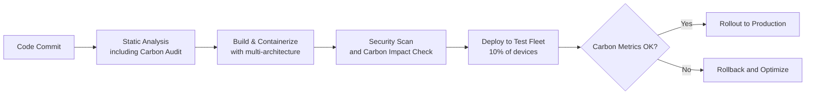

# 🚀 **แนวทางการพัฒนาอาชีพสำหรับ Software Architect Team Lead (เน้น IoT, AI, Cloud และ DevOps) สำหรับระบบ Carbon Footprint**

---

## **บทนำ: ผู้นำสถาปัตยกรรมในโลก IoT และ Sustainability**

ในยุคที่การเปลี่ยนแปลงสภาพภูมิอากาศเป็นประเด็นสำคัญ ระบบ IoT สำหรับติดตามคาร์บอนฟุตปรินท์ (Carbon Footprint) กลายเป็นโซลูชันที่สำคัญ บทบาทของ **Software Architect Team Lead** ในโดเมนนี้ต้องออกแบบระบบที่สามารถรวบรวมข้อมูลจากอุปกรณ์ IoT จำนวนมาก ประมวลผลด้วย AI/ML บนคลาวด์ และแสดงผลเพื่อการตัดสินใจอย่างยั่งยืน

---

## **ส่วนที่ 1: กรอบสถาปัตยกรรม IoT สำหรับ Carbon Footprint**

### **1.1 สถาปัตยกรรมระดับสูง**

```mermaid
graph TB
    subgraph "Edge Layer"
        D1[Sensor 1: CO₂] --> G[IoT Gateway]
        D2[Sensor 2: Energy] --> G
        D3[Sensor 3: GPS] --> G
    end
    
    subgraph "Cloud Platform"
        G --> I[IoT Hub]
        I --> P[Stream Processor]
        P --> S[Storage Layer]
        S --> A[AI/ML Engine]
        A --> V[Visualization]
    end
    
    subgraph "Applications"
        V --> M[Monitoring Dashboard]
        V --> R[Reporting System]
        V --> C[Compliance Checker]
    end
```



### **1.2 องค์ประกอบหลักของระบบ**

| Layer | Technologies | Carbon Footprint Specific |
|-------|--------------|---------------------------|
| **Sensors & Devices** | LoRaWAN, NB-IoT, BLE | CO₂ sensors, energy meters, GPS trackers |
| **Edge Computing** | Azure IoT Edge, AWS Greengrass | Real-time carbon calculation |
| **Communication** | MQTT, AMQP, HTTP/3 | Low-power data transmission |
| **Cloud Platform** | Azure IoT Hub, AWS IoT Core | Carbon-aware server selection |
| **Data Processing** | Kafka, Spark Streaming, Flink | Real-time emission calculations |
| **AI/ML** | TensorFlow Lite, ONNX, PyTorch | Emission prediction models |
| **Storage** | Time-series DB (InfluxDB), Data Lake | Historical carbon data |
| **Visualization** | Grafana, Power BI, Custom Dashboards | Carbon reporting |

---

## **ส่วนที่ 2: กรณีศึกษา: ระบบ Carbon Footprint สำหรับขนส่งโลจิสติกส์**

### **2.1 บริบทและความท้าทาย**

**บริษัท**: ผู้ให้บริการโลจิสติกส์ระดับประเทศ
**เป้าหมาย**: ลดคาร์บอนฟุตปรินท์ 30% ภายใน 3 ปี
**ความท้าทาย**:
- ข้อมูลการปล่อยก๊าซเรือนกระจกจากรถขนส่ง 2,000 คัน
- การคำนวณที่แม่นยำและตามมาตรฐาน GHG Protocol
- การรายงานแบบ real-time สำหรับลูกค้า

### **2.2 สถาปัตยกรรมที่นำไปปฏิบัติ**

```yaml
Architecture Components:
  
  Edge Devices:
    - OBD-II adapters with GPS
    - Fuel consumption sensors
    - IoT Gateway with edge computing
    
  Cloud Services:
    - Azure IoT Hub for device management
    - Event Hubs for data ingestion
    - Azure Stream Analytics for real-time processing
    - Cosmos DB for operational data
    - Data Lake Storage for historical data
    
  AI/ML Services:
    - Azure Machine Learning for:
      * Route optimization (reduce distance by 15%)
      * Predictive maintenance (reduce fuel waste)
      * Carbon intensity forecasting
      
  Visualization:
    - Power BI Embedded for customer portals
    - Custom React dashboard for operations
    - Mobile app for drivers
```

### **2.3 ผลลัพธ์ที่ได้**

| Metric | Before | After | Improvement |
|--------|--------|-------|-------------|
| **Data Collection Frequency** | Daily | Real-time (5-second intervals) | 17,280x |
| **Calculation Accuracy** | Estimated | Actual (sensor-based) | 95% accuracy |
| **Reporting Time** | End of month | Real-time | Immediate |
| **Carbon Reduction** | Baseline | 25% reduction in first year | On track for 30% |

---

## **ส่วนที่ 3: ทักษะเฉพาะสำหรับ IoT Carbon Footprint Architect**

### **3.1 Technical Skills Matrix**

| Skill Category | Specific Skills | Importance for Carbon Footprint |
|----------------|----------------|--------------------------------|
| **IoT Protocols** | MQTT, CoAP, LoRaWAN | Efficient data transmission |
| **Edge Computing** | Azure IoT Edge, AWS Greengrass | Real-time carbon calculation |
| **Time-Series Data** | InfluxDB, TimescaleDB | Historical emission tracking |
| **Geospatial Analysis** | PostGIS, Azure Maps | Route optimization |
| **Carbon Accounting** | GHG Protocol, ISO 14064 | Standard compliance |
| **Energy Efficiency** | Power management, Green computing | Reduce system footprint |

### **3.2 การคำนวณคาร์บอนฟุตปรินท์ในโค้ด**

```python
# Carbon Footprint Calculation Module
class CarbonCalculator:
    def __init__(self):
        self.emission_factors = {
            'electricity': 0.85,  # kg CO₂/kWh (Thailand grid)
            'diesel': 2.68,       # kg CO₂/liter
            'gasoline': 2.31,     # kg CO₂/liter
            'natural_gas': 2.02   # kg CO₂/m³
        }
    
    def calculate_transport_emissions(self, distance_km, vehicle_type, fuel_type):
        """Calculate emissions from transportation"""
        # Vehicle specific consumption (km/liter)
        consumption_rates = {
            'truck': 3.5,
            'van': 8.0,
            'car': 12.0
        }
        
        fuel_used = distance_km / consumption_rates[vehicle_type]
        emissions = fuel_used * self.emission_factors[fuel_type]
        
        return emissions
    
    def calculate_cloud_emissions(self, compute_hours, region):
        """Calculate emissions from cloud computing"""
        # Carbon intensity by region (gCO₂/kWh)
        region_intensity = {
            'southeastasia': 450,
            'eastus': 320,
            'westeurope': 280
        }
        
        # Average power consumption per vCPU
        power_per_vcpu = 7  # watts
        
        emissions = (compute_hours * power_per_vcpu * region_intensity[region]) / 1000
        
        return emissions
```

---

## **ส่วนที่ 4: แหล่งข้อมูลและเครื่องมือเฉพาะทาง**

### **4.1 Carbon Calculation Databases และ APIs**

| Resource | Description | Use Case |
|----------|-------------|----------|
| **Climate Trace** | Satellite-based emission data | Validation and benchmarking |
| **Emission Factors DB** | Official emission factors | Accurate calculations |
| **Electricity Maps API** | Real-time carbon intensity | Carbon-aware scheduling |
| **Google Cloud Carbon Footprint** | Cloud emission reporting | Infrastructure optimization |

### **4.2 IoT Platforms ที่รองรับ Sustainability**

1. **Azure IoT Sustainability Accelerator**
   - Pre-built templates for carbon tracking
   - Integration with Sustainability Manager

2. **AWS IoT Greengrass with Sustainability Features**
   - Edge computing for remote locations
   - Local carbon calculations

3. **Google Cloud IoT Core with BigQuery**
   - Large-scale data analysis
   - Carbon forecasting with BigQuery ML

### **4.3 Open Source Tools**

```bash
# Green Software Foundation Tools
npm install -g @green-software-foundation/carbon-aware-sdk

# Carbon Calculator CLI
pip install carbon-calculator

# IoT Device Simulator for Testing
docker run -it iot-carbon-simulator
```

---

## **ส่วนที่ 5: กรอบการทำงาน DevOps สำหรับ IoT Carbon Systems**

### **5.1 CI/CD Pipeline สำหรับ IoT Deployment**



### **5.2 Infrastructure as Code with Carbon Awareness**

```terraform
# Terraform module for carbon-aware deployment
module "iot_carbon_infrastructure" {
  source = "./modules/carbon-aware-azure"
  
  # Select region based on carbon intensity
  location = var.carbon_intensity_low ? "swedencentral" : "southeastasia"
  
  # Scale based on predicted load (carbon efficiency)
  iot_hub_sku = var.peak_hours ? "S2" : "S1"
  
  # Enable auto-shutdown for dev environments
  auto_shutdown = {
    enabled    = true
    time       = "19:00"
    timezone   = "Asia/Bangkok"
  }
  
  # Carbon monitoring
  carbon_monitoring_enabled = true
  carbon_reporting_frequency = "daily"
}
```

### **5.3 Monitoring Stack สำหรับ Carbon Metrics**

```yaml
# Prometheus metrics for carbon tracking
carbon_metrics:
  - iot_device_energy_consumption_watts
  - data_transmission_carbon_g
  - cloud_compute_carbon_kg
  - total_system_carbon_footprint
  
# Grafana dashboards:
dashboards:
  - real_time_carbon_intensity
  - carbon_per_transaction
  - comparative_analysis
  - sustainability_kpis
```

---

## **ส่วนที่ 6: การประยุกต์ใช้ AI/ML ในระบบ Carbon Footprint**

### **6.1 Use Cases ของ AI สำหรับ Carbon Reduction**

| AI Application | Technology Stack | Expected Impact |
|----------------|------------------|-----------------|
| **Predictive Maintenance** | TensorFlow, IoT sensor data | ลด downtime 20%, ประหยัดเชื้อเพลิง 15% |
| **Route Optimization** | Reinforcement Learning, Maps API | ลดระยะทาง 12%, ลด emission 18% |
| **Energy Forecasting** | LSTM Networks, Weather data | Optimize energy usage 25% |
| **Anomaly Detection** | Autoencoders, Real-time monitoring | Detect emission leaks early |

### **6.2 MLOps Pipeline สำหรับ Carbon Models**

```python
# Azure ML pipeline for carbon prediction
from azureml.core import Workspace, Experiment
from azureml.pipeline.core import Pipeline
from azureml.pipeline.steps import PythonScriptStep

# Define pipeline steps
data_collection_step = PythonScriptStep(
    name="collect_carbon_data",
    script_name="data_pipeline.py",
    arguments=["--sources", "iot,api,database"],
    compute_target=compute_cluster
)

model_training_step = PythonScriptStep(
    name="train_carbon_model",
    script_name="train_model.py",
    arguments=["--algorithm", "xgboost", "--target", "co2_emissions"],
    inputs=[data_collection_step.outputs[0]]
)

carbon_calculation_step = PythonScriptStep(
    name="calculate_footprint",
    script_name="carbon_calculator.py",
    arguments=["--standard", "ghg_protocol"],
    inputs=[model_training_step.outputs[0]]
)

# Create and run pipeline
pipeline = Pipeline(workspace=ws, steps=[
    data_collection_step,
    model_training_step,
    carbon_calculation_step
])
```

---

## **ส่วนที่ 7: การวัดผลและรายงาน**

### **7.1 Carbon KPIs สำหรับ IoT Systems**

| KPI Category | Specific Metrics | Target |
|--------------|-----------------|--------|
| **System Efficiency** | Carbon per data point (gCO₂/point)<br>Energy per transaction (kWh) | < 0.1 g<br>< 0.01 kWh |
| **Business Impact** | Carbon reduced (tons CO₂e)<br>Cost savings from optimization | > 100 tons/year<br>> 1M THB/year |
| **Data Quality** | Sensor uptime (%)<br>Data accuracy (%) | > 99.5%<br>> 95% |
| **Compliance** | Reporting completeness (%)<br>Audit readiness score | 100%<br>> 90/100 |

### **7.2 Sustainability Dashboard Template**

```json
{
  "dashboard": "Carbon Footprint Monitoring",
  "widgets": [
    {
      "type": "realtime_emissions",
      "title": "Real-time CO₂ Emissions",
      "data_source": "iot_stream",
      "refresh_rate": "5s"
    },
    {
      "type": "carbon_intensity_map",
      "title": "Geographic Emission Heatmap",
      "data_source": "gps_sensors"
    },
    {
      "type": "reduction_target",
      "title": "Progress vs Targets",
      "targets": {
        "2024": "-15%",
        "2025": "-25%",
        "2026": "-30%"
      }
    },
    {
      "type": "carbon_breakdown",
      "title": "Emission Sources",
      "categories": ["transport", "energy", "infrastructure"]
    }
  ]
}
```

---

## **ส่วนที่ 8: แผนพัฒนาอาชีพเฉพาะทาง**

### **8.1 Certification Path สำหรับ IoT Carbon Architect**

```
ปีที่ 1: Foundation
├── AWS Certified IoT Specialty
├── Microsoft Azure IoT Developer
└── GHG Protocol Certification

ปีที่ 2: Advanced
├── Google Professional Cloud IoT Engineer
├── Linux Foundation Edge Computing
└── Sustainable IT Certification

ปีที่ 3: Expert
├── IoT Security Certification
├── Data Science for Sustainability
└── Carbon Accounting Professional
```

### **8.2 โครงการพัฒนาทักษะรายไตรมาส**

| Quarter | Focus Area | Hands-on Project |
|---------|------------|------------------|
| Q1 | IoT Fundamentals | Build sensor network for office carbon monitoring |
| Q2 | Cloud Integration | Deploy IoT solution to cloud with carbon tracking |
| Q3 | AI/ML Applications | Develop prediction model for energy consumption |
| Q4 | Business Integration | Create carbon reporting system for stakeholders |

### **8.3 Community Engagement**

**ชุมชนในไทย:**
- Thailand IoT Association
- Green Tech Community Thailand
- Energy Conservation Club

**กิจกรรมแนะนำ:**
- Hackathons ด้าน Sustainability
- Workshop เรื่อง Carbon Accounting
- Seminar เรื่อง Green Software

---

## **ส่วนที่ 9: ความท้าทายและแนวทางการแก้ไข**

### **9.1 ความท้าทายทั่วไป**

| Challenge | Solution | Tools/Techniques |
|-----------|----------|------------------|
| **Data Quality** | Sensor calibration, data validation | Statistical process control |
| **Scale Management** | Edge computing, data aggregation | Kafka, IoT Edge |
| **Carbon Calculation Accuracy** | Multiple data sources, ML validation | Ensemble methods |
| **Real-time Processing** | Stream processing, in-memory computing | Spark Streaming, Hazelcast |
| **Energy Efficiency** | Power-aware scheduling, sleep modes | Dynamic voltage scaling |

### **9.2 Security Considerations**

```yaml
Security Framework for IoT Carbon Systems:
  
  Device Security:
    - Secure boot and firmware validation
    - Hardware-based encryption
    - Regular security updates
  
  Data Security:
    - End-to-end encryption (TLS 1.3)
    - Anonymization of sensitive data
    - Access control and audit logging
  
  Cloud Security:
    - Zero-trust network architecture
    - Carbon data classification and protection
    - Compliance with local regulations
```

---

## **สรุป: สถาปนิกผู้นำในยุค Sustainability**

บทบาทของ Software Architect Team Lead สำหรับระบบ IoT Carbon Footprint ต้องการ:
1. **ความรู้ด้านเทคนิคที่ลึก** ใน IoT, Cloud, AI/ML
2. **ความเข้าใจในโดเมน** เรื่อง carbon accounting และ sustainability
3. **ความสามารถในการออกแบบ** ระบบที่ทั้ง efficient และ accurate
4. **วิสัยทัศน์ทางธุรกิจ** เพื่อสร้างคุณค่าจากข้อมูลคาร์บอน

**คำแนะนำสำหรับการเริ่มต้น:**
1. เริ่มจาก pilot project ขนาดเล็ก
2. วัด carbon footprint ของระบบเองก่อน
3. สร้าง proof of concept ที่แสดง business value
4. ขยาย scale อย่างค่อยเป็นค่อยไป
5. สร้าง ecosystem ของ partners และ stakeholders

**สุดท้าย:** "การออกแบบระบบที่ยั่งยืน ไม่ได้เป็นเพียง technical challenge แต่เป็นโอกาสในการสร้าง impact ที่แท้จริงต่อโลกและการธุรกิจ"

---

## **ภาคผนวก: Resources เพิ่มเติม**

### **A. มาตรฐานและ Framework**
1. GHG Protocol Corporate Standard
2. ISO 14064 สำหรับ greenhouse gas accounting
3. PCAF (Partnership for Carbon Accounting Financials)
4. TCFD (Task Force on Climate-related Financial Disclosures)

### **B. Tools และ Libraries**
```bash
# Carbon calculation libraries
pip install carbonai ecobalysis

# IoT simulation tools
npm install -g iot-carbon-simulator

# Monitoring and visualization
docker-compose up carbon-monitoring-stack
```

### **C. ข้อมูลเฉพาะประเทศไทย**
- ข้อมูล emission factors จาก กรมพัฒนาพลังงานทดแทนและอนุรักษ์พลังงาน
- มาตรฐานการรายงานคาร์บอนของตลาดหลักทรัพย์
- โครงการลดก๊าซเรือนกระจกภาคสมัครใจ (T-VER)

### **D. Template Repository**
```
iot-carbon-footprint-template/
├── architecture/
│   ├── adr-templates/
│   ├── design-patterns/
│   └── reference-architectures/
├── code/
│   ├── carbon-calculators/
│   ├── iot-device-firmware/
│   └── cloud-functions/
├── infrastructure/
│   ├── terraform-modules/
│   ├── kubernetes-manifests/
│   └── ci-cd-pipelines/
└── documentation/
    ├── compliance-docs/
    ├── api-specifications/
    └── reporting-templates/
```

**หมายเหตุ:** ระบบ Carbon Footprint เป็นโดเมนที่กำลังเติบโตอย่างรวดเร็ว ขอแนะนำให้ติดตามเทคโนโลยีใหม่ๆ และมาตรฐานที่เปลี่ยนแปลงอย่างสม่ำเสมอ