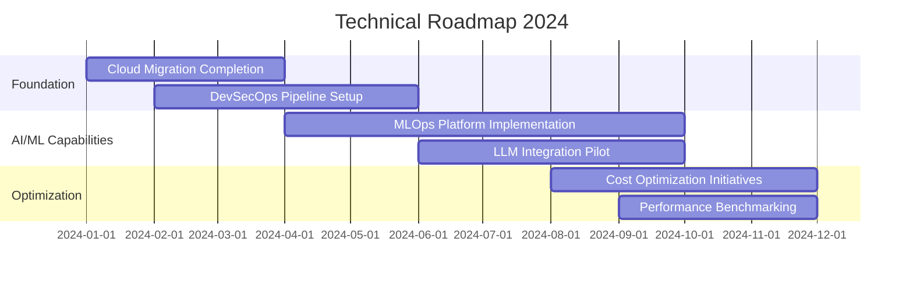

# 🚀 **แนวทางการพัฒนาอาชีพสำหรับ Software Architect Team Lead (เน้น AI, Cloud และ DevOps): คู่มือฉบับปฏิบัติการ**

---

## **บทนำ: จากคู่มือสู่การปฏิบัติ**

คู่มือฉบับก่อนหน้าได้สรุปบทบาทและกรอบการทำงานของ Software Architect Team Lead อย่างชัดเจน เอกสารฉบับนี้จะแปลงแนวคิดเหล่านั้นเป็นแผนปฏิบัติการจริง พร้อมแหล่งข้อมูลและเครื่องมือสำหรับการนำไปใช้

---

## **ส่วนที่ 1: การออกแบบเส้นทางการพัฒนาส่วนตัว**

### **1.1 แผนพัฒนาทักษะรายไตรมาส**

| ไตรมาส | Focus Area | ทักษะที่ต้องพัฒนา | หลักสูตร/การรับรองแนะนำ |
|--------|------------|-------------------|--------------------------|
| **Q1** | Cloud Architecture Deep Dive | - Advanced Kubernetes patterns<br>- Serverless architecture<br>- FinOps principles | - AWS/Azure/GCP Solutions Architect Professional<br>- CKAD/CKA Certification |
| **Q2** | AI/ML Engineering & MLOps | - ML pipeline design<br>- Model deployment strategies<br>- LLM integration patterns | - Google Professional ML Engineer<br>- Azure AI Engineer Associate |
| **Q3** | DevOps & Platform Engineering | - Internal Developer Platform<br>- GitOps implementation<br>- Security as Code | - DevOps Institute DevOps Leader<br>- HashiCorp Terraform Associate |
| **Q4** | Technical Leadership | - Architecture decision frameworks<br>- Team topologies<br>- Business-IT alignment | - SEI Software Architecture Professional<br>- Leadership workshops |

### **1.2 แหล่งการเรียนรู้สำคัญ**

#### **Online Platforms:**
- **Pluralsight**: Architecture learning paths
- **A Cloud Guru**: Cloud certifications
- **Coursera**: AI/ML specializations
- **LinkedIn Learning**: Soft skills & leadership

#### **Community Resources:**
- **Conference recordings** (AWS re:Invent, Microsoft Build, KubeCon)
- **Architecture podcasts**: Software Engineering Daily, The InfoQ Podcast
- **Local meetups**: Cloud Native Computing Groups, DevOps communities

#### **หนังสือแนะนำ:**
1. "Building Microservices" (Sam Newman)
2. "Designing Data-Intensive Applications" (Martin Kleppmann)
3. "The Staff Engineer's Path" (Tanya Reilly)
4. "Team Topologies" (Matthew Skelton)

---

## **ส่วนที่ 2: กรอบการทำงานสำหรับการนำไปปฏิบัติ**

### **2.1 Architecture Decision Framework Template**

```markdown
## ADR Template (ปฏิบัติการ)

### 1. Problem Statement
- **Business Context**: [อธิบายปัญหาในแง่ธุรกิจ]
- **Technical Context**: [ข้อจำกัดทางเทคนิคปัจจุบัน]
- **Stakeholders**: [รายชื่อผู้มีส่วนได้ส่วนเสีย]

### 2. Decision Drivers
- **Primary Drivers**: [ปัจจัยหลัก เช่น Time-to-market, Cost, Risk]
- **Secondary Drivers**: [ปัจจัยรอง เช่น Developer experience, Maintainability]

### 3. Options Considered
| Option | Pros | Cons | Risk Level |
|--------|------|------|------------|
| Option A | | | |
| Option B | | | |

### 4. Recommended Solution
- **Selected Option**: [ชื่อตัวเลือก]
- **Rationale**: [เหตุผลโดยละเอียด]
- **Implementation Timeline**: [ระยะเวลา]

### 5. Impact Assessment
- **Technical Impact**: [การเปลี่ยนแปลงทางเทคนิค]
- **Team Impact**: [ผลต่อทีม]
- **Cost Impact**: [ประมาณการค่าใช้จ่าย]

### 6. Success Metrics
- [เมตริกที่วัดได้ 1]
- [เมตริกที่วัดได้ 2]
```

### **2.2 Technical Roadmap Template**



---

## **ส่วนที่ 3: เครื่องมือและเทคโนโลยียุคใหม่**

### **3.1 AI-Powered Development Tools Stack**

| Category | Tools | Use Case |
|----------|-------|----------|
| **Code Generation** | GitHub Copilot, Amazon CodeWhisperer, Tabnine | Accelerate development, reduce boilerplate |
| **Architecture Design** | Mermaid AI, Draw.io AI, Excalidraw | Rapid prototyping, documentation |
| **Infrastructure as Code** | Terraform Cloud, Pulumi AI, Winglang | Intelligent infrastructure provisioning |
| **MLOps** | MLflow, Kubeflow, SageMaker Pipelines | End-to-end ML lifecycle management |
| **Monitoring & Observability** | Dynatrace, DataDog AI, New Relic | AI-powered anomaly detection |

### **3.2 Cloud-Native Architecture Patterns Checklist**

```yaml
Architecture Review Checklist:
  
  Microservices:
    - [ ] Proper service boundaries defined
    - [ ] API contracts versioned
    - [ ] Event-driven communication where appropriate
    - [ ] Database per service pattern
  
  Cloud Infrastructure:
    - [ ] Infrastructure as Code implemented
    - [ ] Multi-region deployment capability
    - [ ] Auto-scaling configured
    - [ ] Cost monitoring enabled
  
  Security:
    - [ ] Zero-trust principles applied
    - [ ] Secrets management implemented
    - [ ] Regular security scanning
    - [ ] Compliance requirements addressed
  
  DevOps:
    - [ ] CI/CD pipeline automated
    - [ ] Blue-green deployment capability
    - [ ] Feature flags implementation
    - [ ] Rollback procedures tested
```

---

## **ส่วนที่ 4: การวัดผลและเมตริก**

### **4.1 Architecture Health Metrics**

| Metric Category | Specific Metrics | Target | Tools for Measurement |
|----------------|-----------------|--------|----------------------|
| **System Quality** | - Uptime (SLA)<br>- P95 latency<br>- Error rate | >99.9%<br><200ms<br><0.1% | Prometheus, Azure Monitor |
| **Team Velocity** | - Deployment frequency<br>- Lead time for changes<br>- Change failure rate | Daily<br><1 day<br><5% | DORA metrics, Value Stream Mapping |
| **Cost Efficiency** | - Cloud cost per feature<br>- Resource utilization<br>- Waste percentage | Trend downward<br>>70%<br><15% | CloudHealth, Kubecost |
| **Innovation** | - Tech debt ratio<br>- Experimentation rate<br>- Learning hours per week | <10%<br>20% of sprints<br>4 hours | SonarQube, Team surveys |

### **4.2 360-Degree Feedback Template**

```markdown
## Quarterly Architecture Leadership Review

### Technical Competence (Rate 1-5)
- [ ] Stays current with emerging technologies
- [ ] Makes sound technical decisions
- [ ] Balances innovation with stability

### Team Leadership
- [ ] Mentors junior architects effectively
- [ ] Fosters collaborative environment
- [ ] Communicates vision clearly

### Business Impact
- [ ] Aligns technical decisions with business goals
- [ ] Delivers measurable business value
- [ ] Manages technical risks appropriately

### Areas for Improvement:
1. [Specific action item 1]
2. [Specific action item 2]

### Development Plan for Next Quarter:
- [Goal 1 with timeline]
- [Goal 2 with timeline]
```

---

## **ส่วนที่ 5: กรณีศึกษาปฏิบัติการ**

### **5.1 Modernization Project: Legacy to Cloud-Native**

**สถานการณ์**: การย้ายระบบ Monolithic legacy ไปสู่ Microservices บน Kubernetes

**ขั้นตอนปฏิบัติ:**

1. **Assessment Phase (2 สัปดาห์)**
   - ใช้ Strangler Fig Pattern กำหนดขอบเขตการย้าย
   - ใช้工具เช่น AWS Migration Hub หรือ Azure Migrate
   - กำหนด priority based on business value

2. **Foundation Setup (4 สัปดาห์)**
   ```bash
   # Infrastructure as Code template
   terraform init
   terraform plan -out=cloud-foundation
   terraform apply cloud-foundation
   ```

3. **Incremental Migration (Ongoing)**
   - เริ่มด้วยบริการที่ไม่ใช่ mission-critical
   - Implement feature flags for gradual rollout
   - ตั้งค่า comprehensive monitoring

4. **ผลลัพธ์ที่คาดหวัง:**
   - ลดเวลา deployment จากสัปดาห์เหลือชั่วโมง
   - ปรับปรุง scalability และ resilience
   - ลด operational cost 20-30%

### **5.2 AI Integration Project: Adding Intelligent Features**

**สถานการณ์**: การเพิ่ม Recommendation Engine ให้กับแอปพลิเคชัน E-commerce

**Architecture Pattern:**
```
User Request → API Gateway → [Feature Store] → ML Model Serving → Results
       ↓
[Real-time Data Pipeline] → [Model Training Pipeline]
       ↓
[Data Lake] ← [Batch Processing]
```

**Implementation Checklist:**
- [ ] Select ML serving platform (Seldon Core, TorchServe)
- [ ] Implement feature store (Feast, Hopsworks)
- [ ] Set up A/B testing framework
- [ ] Define model monitoring and retraining triggers

---

## **ส่วนที่ 6: แหล่งข้อมูลและชุมชน**

### **6.1 Online Communities & Forums**

| Community | Focus Area | Best For |
|-----------|------------|----------|
| **Stack Overflow** | General technical questions | Troubleshooting specific issues |
| **AWS/Azure/GCP Communities** | Cloud-specific discussions | Platform-specific architecture |
| **Dev.to** | Development best practices | Learning from practitioner experiences |
| **LinkedIn Groups** | Professional networking | Career opportunities and trends |
| **Reddit (r/softwarearchitecture)** | Architecture discussions | Broad perspectives and debates |

### **6.2 Conference Calendar 2024**

| Conference | Location | Focus Areas | Recommended For |
|------------|----------|-------------|-----------------|
| **Q1: Nvidia GTC** | Virtual/San Jose | AI, GPU Computing | AI/ML integration |
| **Q2: KubeCon EU** | Paris | Kubernetes, Cloud Native | Container orchestration |
| **Q3: AWS re:Invent** | Las Vegas | AWS Services | Cloud architecture |
| **Q4: DevOps World** | Lisbon | DevOps Practices | CI/CD improvements |

### **6.3 Local Resources (Thailand Focus)**

1. **บริษัทที่เชี่ยวชาญด้าน Cloud/AI ในไทย:**
   - AWS Thailand, Microsoft Thailand, Google Cloud Thailand
   - บริษัทระบบ Integrator ระดับพรีเมียม

2. **Training Providers:**
   - Skooldio, Acourse, BorntoDev
   - มหาวิทยาลัยที่เปิดหลักสูตรเฉพาะทาง

3. **ชุมชนท้องถิ่น:**
   - Bangkok DevOps, Thailand Cloud Native
   - AI/ML Thailand meetup groups

---

## **ส่วนที่ 7: แผนพัฒนาต่อเนื่อง**

### **7.1 Personal Development Plan Template**

```yaml
Personal Development Plan:
  
  Current Quarter Goals:
    - Technical: [Learn specific technology]
    - Leadership: [Develop specific skill]
    - Business: [Understand specific domain]
  
  Learning Activities:
    - Courses: [List with completion dates]
    - Certifications: [Target certifications]
    - Projects: [Hands-on projects]
  
  Mentorship:
    - Seeking mentorship in: [Areas]
    - Providing mentorship to: [Team members]
  
  Knowledge Sharing:
    - Internal presentations planned: [Topics]
    - Blog posts/articles: [Topics]
    - Conference submissions: [Target conferences]
```

### **7.2 30-60-90 Day Plan สำหรับตำแหน่งใหม่**

**30 วันแรก:** 
- ทำความเข้าใจระบบและทีมปัจจุบัน
- ระดับความสัมพันธ์กับ stakeholders
- กำหนด quick wins ที่ทำได้ทันที

**60 วัน:** 
- เริ่มปรับปรุงกระบวนการ
- เสนอ architecture initiatives ใหม่
- จัดตั้ง working groups

**90 วัน:** 
- แสดงผลลัพธ์ที่ชัดเจน
- เสนอ technical roadmap
- สร้าง culture of continuous improvement

---

## **สรุป: จากแผนสู่การปฏิบัติ**

บทบาทของ Software Architect Team Lead ในยุค AI และ Cloud ต้องการการผสมผสานระหว่าง:
1. **ความลึกทางเทคนิค** ที่ต่อเนื่อง
2. **ความสามารถในการเป็นผู้นำ** ที่พัฒนาตลอดเวลา
3. **ความเข้าใจธุรกิจ** ที่ลึกซึ้ง
4. **ความสามารถในการปรับตัว** ต่อการเปลี่ยนแปลง

**ขั้นตอนการเริ่มต้น:**
1. **ประเมินทักษะปัจจุบัน** ตามกรอบในส่วนที่ 1
2. **เลือกลำดับความสำคัญ** ตามความต้องการขององค์กร
3. **สร้างแผนพัฒนาส่วนตัว** ที่เป็นรูปธรรม
4. **เริ่มต้นด้วยโครงการเล็ก** ที่แสดงผลได้เร็ว
5. **วัดผลและปรับปรุง** อย่างต่อเนื่อง

**คำแนะนำสุดท้าย:** 
"ในฐานะผู้นำทางเทคนิค ความสำเร็จไม่ได้วัดที่ความซับซ้อนของโซลูชัน แต่วัดที่คุณค่าที่ส่งมอบให้ธุรกิจและความสามารถของทีมในการสร้างสรรค์สิ่งต่อไป"

---

## **ภาคผนวก: เครื่องมือและเทมเพลต**

### **Template Repository:**
- Architecture Decision Records (ADRs)
- Technical Design Documents
- Team Charter Templates
- Code Review Checklists

### **Recommended Tool Stack:**
1. **Architecture Design**: PlantUML, Structurizr
2. **Documentation**: Confluence, Notion, GitBook
3. **Collaboration**: Miro, Lucidchart
4. **Code Analysis**: SonarQube, CodeClimate

### **Automation Scripts Library:**
- Infrastructure provisioning scripts
- Security scanning automation
- Performance testing scripts
- Cost optimization automation

---

**หมายเหตุ:** คู่มือนี้ควรได้รับการอัปเดตทุกไตรมาสตามการเปลี่ยนแปลงของเทคโนโลยีและความต้องการขององค์กร การเรียนรู้อย่างต่อเนื่องและการปรับตัวคือกุญแจสู่ความสำเร็จในบทบาทนี้