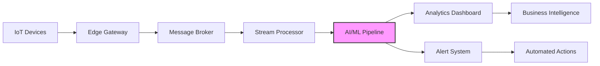

# Vibe coding and Prompt Engineering: โครงสร้างและการเขียน

1.สร้างบทนำ
2.สร้างบทนิยาม
3.สร้างบทหัวข้อ
4.ออกแบบ workflow
5.case study 
6.โคงสร้าง
6.1 Prompt Engineering 
6.2 Vibe coding 
6.3 AI Tool
6.2 แบบจำลองภาษาขนาดใหญ่ (LLM) เป็นโปรแกรม ปัญญาประดิษฐ์ (AI)


# Vibe Coding และ Prompt Engineering: โครงสร้างและการเขียน

## 1. บทนำ
ในยุคของการพัฒนาโปรแกรมที่ขับเคลื่อนด้วยปัญญาประดิษฐ์ แนวคิดใหม่ ๆ อย่าง **Vibe Coding** และ **Prompt Engineering** กำลังเปลี่ยนวิธีการเขียนโค้ดและการโต้ตอบกับระบบ AI โดยพื้นฐาน Vibe Coding หมายถึงการเขียนโค้ดด้วยความรู้สึกและความเข้าใจในบริบทกว้าง ๆ ในขณะที่ Prompt Engineering เป็นศิลปะในการออกแบบคำสั่งหรือคำถามเพื่อให้ได้ผลลัพธ์ที่ต้องการจาก AI อย่างแม่นยำ คู่มือนี้จะนำทางคุณผ่านโครงสร้าง วิธีการ และเครื่องมือที่จำเป็นเพื่อให้เชี่ยวชาญแนวทางเหล่านี้

## 2. บทนิยาม
- **Vibe Coding**: แนวทางการเขียนโค้ดที่เน้นความเข้าใจในภาพรวม บริบท และ "ความรู้สึก" ของระบบ แทนการมุ่งเน้นรายละเอียดเฉพาะจุดตั้งแต่เริ่มต้น
- **Prompt Engineering**: ศาสตร์และศิลป์ในการออกแบบ ปรับแต่ง และปรับปรุงคำสั่ง (prompts) เพื่อให้ได้ผลลัพธ์ที่เหมาะสมจากโมเดลภาษา (LLMs)
- **AI Tools**: เครื่องมือและแพลตฟอร์มที่ใช้ AI ช่วยในการพัฒนาโค้ด เช่น GitHub Copilot, ChatGPT, Claude, etc.
- **LLM (Large Language Models)**: โมเดลปัญญาประดิษฐ์ที่ถูกฝึกฝนบนข้อมูลจำนวนมหาศาลเพื่อเข้าใจและสร้างภาษามนุษย์

## 3. บทหัวข้อ
- พื้นฐานของ Prompt Engineering สำหรับ Developer
- หลักการของ Vibe Coding ในทางปฏิบัติ
- การผสมผสานระหว่าง Human Intelligence และ AI Assistance
- เทคนิคการเขียน Prompt ที่มีประสิทธิภาพ
- ตัวอย่างการประยุกต์ใช้ในโครงการจริง
- ข้อจำกัดและแนวโน้มในอนาคต

## 4. Workflow ออกแบบ
```
1. กำหนดปัญหาและเป้าหมาย
2. ออกแบบ Prompt เริ่มต้น (Initial Prompt Design)
3. ทดสอบและประเมินผลลัพธ์จาก AI
4. ปรับปรุง Prompt (Iterative Refinement)
5. นำผลลัพธ์มาพัฒนาต่อด้วย Vibe Coding
6. ทดสอบระบบ (Testing and Validation)
7. จัดทำเอกสารและบันทึกบทเรียน (Documentation)
```

## 5. Case Study: การพัฒนา Web Application ด้วย AI Assistance
**สถานการณ์**: พัฒนาแอปพลิเคชันจัดการงานส่วนตัว (Todo App) ด้วย React และ Node.js

**ขั้นตอนการทำงาน**:
1. ใช้ Prompt Engineering สร้างโครงพื้นฐาน:
   ```
   "สร้างโครงสร้างโปรเจค Todo App แบบ Full-stack 
   ใช้ React สำหรับ frontend, Node.js/Express สำหรับ backend
   และ SQLite สำหรับฐานข้อมูล พร้อมตัวอย่างโค้ดพื้นฐาน"
   ```

2. นำโค้ดที่ได้มาปรับแต่งด้วย Vibe Coding:
   - โฟกัสที่ภาพรวมการทำงานของระบบ
   - ปรับปรุงโครงสร้างให้ตรงกับความต้องการ
   - เพิ่มฟีเจอร์ตามความเข้าใจใน UX/UI

3. ใช้ AI Tools ช่วยแก้ปัญหาเฉพาะจุด:
   ```
   "ช่วยเขียนฟังก์ชันการกรองงานตามสถานะ 
   ใน React component โดยใช้ hooks"
   ```

## 6. โครงสร้าง

### 6.1 Prompt Engineering
**หลักการสำคัญ**:
- **ชัดเจนและเฉพาะเจาะจง**: ระบุรายละเอียดที่ต้องการอย่างชัดเจน
- **ให้บริบท**: เพิ่มข้อมูล背景ที่เกี่ยวข้อง
- **ใช้ตัวอย่าง**: ให้ตัวอย่าง input/output ที่คาดหวัง
- **Iterative Process**: ปรับปรุง prompt อย่างต่อเนื่อง

**เทคนิคการเขียน Prompt**:
- Zero-shot Prompting: คำสั่งโดยไม่มีตัวอย่าง
- Few-shot Prompting: คำสั่งพร้อมตัวอย่าง
- Chain-of-Thought: ขอให้ AI แสดงขั้นตอนการคิด
- Role Prompting: กำหนดบทบาทให้กับ AI

### 6.2 Vibe Coding
**ลักษณะสำคัญ**:
- มุ่งเน้นที่ความเข้าใจในภาพรวม
- ใช้ intuition ควบคู่กับ technical knowledge
- ยืดหยุ่นและปรับตัวได้เร็ว
- เรียนรู้และปรับปรุงอย่างต่อเนื่อง

**ขั้นตอนการทำงาน**:
1. เข้าใจปัญหาและบริบทอย่างลึกซึ้ง
2. วางโครงสร้างกว้างๆ ของระบบ
3. ใช้เครื่องมือช่วยสร้างโค้ด (AI-assisted)
4. ปรับแต่งและเชื่อมโยงส่วนต่างๆ
5. ทดสอบและปรับปรุงจาก feedback

### 6.3 AI Tools
**ประเภทเครื่องมือ**:
- **Code Completion**: GitHub Copilot, Tabnine
- **Code Generation**: ChatGPT, Claude, Bard
- **Code Reviewและ Analysis**: Codeium, Amazon CodeWhisperer
- **Integrated Development Environments**: VS Code with AI extensions

**แนวทางการเลือกใช้**:
- เลือกเครื่องมือให้เหมาะสมกับภาษาการพัฒนา
- พิจารณาความสามารถในการ integrate กับ workflow
- ทดลองใช้หลายเครื่องมือเพื่อหาสิ่งที่เหมาะสมที่สุด

### 6.4 แบบจำลองภาษาขนาดใหญ่ (LLM) เป็นโปรแกรมปัญญาประดิษฐ์ (AI)
**การทำงานของ LLM**:
- **สถาปัตยกรรม Transformer**: พื้นฐานของโมเดลสมัยใหม่
- **การฝึกฝน (Training)**: บนข้อมูลหลากหลายประเภท
- **Fine-tuning**: ปรับปรุงโมเดลสำหรับงานเฉพาะทาง
- **Inference**: การใช้งานโมเดลเพื่อตอบคำถาม

**การประยุกต์ใช้ในการพัฒนา**:
- การสร้างและอธิบายโค้ด
- การ debug และแก้ไขข้อผิดพลาด
- การเขียนเอกสารประกอบ
- การออกแบบสถาปัตยกรรมระบบ

**ข้อควรระวัง**:
- ตรวจสอบความถูกต้องของโค้ดที่ได้
- เข้าใจข้อจำกัดและ bias ของโมเดล
- ใช้เป็นผู้ช่วย ไม่ใช่ผู้ทดแทน
- พัฒนาความรู้พื้นฐานด้าน programming ควบคู่ไปด้วย

## 7. บทสรุป
Vibe Coding และ Prompt Engineering ไม่ได้มาแทนที่ทักษะการเขียนโปรแกรมดั้งเดิม แต่เสริมสร้างให้開発者ทำงานได้อย่างมีประสิทธิภาพมากขึ้น การผสมผสานระหว่างความเข้าใจของมนุษย์และความสามารถของ AI จะเป็นทักษะที่สำคัญในอนาคตของการพัฒนา software


# โครงสร้างของ Vibe Coding

## 1. **พื้นฐานทางปรัชญา (Philosophical Foundation)**
**แนวคิดหลัก**: การเขียนโค้ดด้วย "ความรู้สึก" หรือ "สัญชาตญาณ" แทนการวางแผนละเอียดทุกขั้นตอนตั้งแต่เริ่มต้น

**องค์ประกอบสำคัญ**:
- **Intuitive Development**: พัฒนาตาม intuition และ flow ของงาน
- **Contextual Awareness**: เข้าใจบริบทกว้างๆ ของระบบ
- **Exploratory Mindset**: เปิดรับการทดลองและค้นพบระหว่างทาง

## 2. **โครงสร้างกระบวนการ (Process Structure)**
```
┌─────────────────────────────────────┐
│         Vibe Coding Framework       │
├─────────────────────────────────────┤
│ 1. รับรู้และเข้าใจปัญหา (Perception)│
│ 2. กำหนดทิศทางกว้าง (Direction)    │
│ 3. ลงมือสร้าง (Creation)           │
│ 4. ปรับแต่งและปรับปรุง (Refinement) │
│ 5. เชื่อมโยงและบูรณาการ (Integration)│
└─────────────────────────────────────┘
```

## 3. **องค์ประกอบหลัก 5 ด้าน**

### 3.1 **การรับรู้ (Perception Layer)**
**หน้าที่**: ทำความเข้าใจปัญหาและบริบท
- **Broad Understanding**: มองภาพรวมก่อนรายละเอียด
- **Pattern Recognition**: ระบุรูปแบบที่คุ้นเคย
- **Context Mapping**: เชื่อมโยงกับระบบอื่นๆ

**เครื่องมือช่วย**:
- การพูดคุยกับผู้ใช้/ลูกค้า
- การศึกษาระบบที่เกี่ยวข้อง
- การสำรวจแนวทางแก้ไขที่มีอยู่

### 3.2 **การกำหนดทิศทาง (Direction Layer)**
**หน้าที่**: กำหนดแนวทางกว้างๆ
- **Vision Setting**: กำหนดภาพรวมที่ต้องการ
- **Milestone Creation**: สร้างจุดหมายหลักๆ
- **Flexible Planning**: วางแผนที่ปรับเปลี่ยนได้

**เทคนิค**:
- การเขียน user stories อย่างย่อ
- การสร้าง wireframe คร่าวๆ
- การกำหนด scope ที่มีความยืดหยุ่น

### 3.3 **การสร้าง (Creation Layer)**
**หน้าที่**: ลงมือเขียนโค้ด
- **Flow State Coding**: เขียนโค้ดอย่างต่อเนื่อง
- **Experimental Implementation**: ทดลองหลายแนวทาง
- **Quick Prototyping**: สร้าง prototype อย่างรวดเร็ว

**ลักษณะการเขียนโค้ด**:
```
# แบบ Vibe Coding
def process_data(data):
    # เริ่มจากแนวคิดกว้างๆ
    cleaned = clean_data_somehow(data)
    result = do_something_with(cleaned)
    return make_it_useful(result)

# แบบ Traditional
def process_data(data):
    # ต้องวางแผนละเอียดก่อน
    cleaned = remove_duplicates(data)
    cleaned = validate_format(cleaned)
    result = apply_business_logic(cleaned)
    return format_output(result)
```

### 3.4 **การปรับแต่ง (Refinement Layer)**
**หน้าที่**: ปรับปรุงและแก้ไข
- **Iterative Improvement**: ปรับปรุงซ้ำๆ
- **Feedback Integration**: นำ feedback มาปรับใช้
- **Quality Enhancement**: เพิ่มคุณภาพตามความจำเป็น

**ขั้นตอน**:
1. ตรวจสอบสิ่งที่สร้างขึ้น
2. ระบุจุดที่ต้องปรับปรุง
3. ทำการปรับปรุงอย่างรวดเร็ว
4. ทดสอบผลการปรับปรุง

### 3.5 **การบูรณาการ (Integration Layer)**
**หน้าที่**: เชื่อมโยงกับระบบอื่น
- **System Connection**: เชื่อมต่อกับระบบที่มีอยู่
- **Consistency Check**: ตรวจสอบความสอดคล้อง
- **Documentation**: จัดทำเอกสารตามความจำเป็น

## 4. **เทคนิคการใช้งาน Vibe Coding**

### 4.1 **เทคนิคการเริ่มต้น**
- **"Just Start" Approach**: เริ่มเขียนโค้ดเลยโดยไม่วางแผนเกินจำเป็น
- **"Follow the Feeling"**: ทำตามความรู้สึกว่าส่วนไหนควรทำก่อน
- **"Build the Skeleton First"**: สร้างโครงร่างก่อน แล้วค่อยเติมเนื้อ

### 4.2 **เทคนิคการพัฒนา**
```javascript
// ตัวอย่าง: Vibe Coding ใน JavaScript
// ขั้นตอน 1: เริ่มจากแนวคิดกว้างๆ
async function getUserDashboard(userId) {
    // รู้แค่ว่าต้องดึงข้อมูล user
    const user = await getUser(userId);
    
    // รู้ว่าต้องมี dashboard data
    const dashboard = await buildDashboard(user);
    
    // รู้ว่าต้อง return อะไรบางอย่าง
    return formatDashboard(dashboard);
}

// ขั้นตอน 2: ค่อยเติม implementation details
async function getUser(id) {
    // รู้แค่ว่าต้อง query database
    return db.query('SELECT * FROM users WHERE id = ?', [id]);
}
```

### 4.3 **เทคนิคการทำงานกับ AI**
- **ใช้ AI เป็น "Thought Partner"**: คุยกับ AI เกี่ยวกับแนวคิด
- **Prompting for Ideas**: ขอแนวคิดกว้างๆ จาก AI
- **Code Generation with Context**: สร้างโค้ดจากบริบทที่ให้

## 5. **โครงสร้างของไฟล์และโปรเจค**

### 5.1 **ไฟล์โครงสร้างแบบ Vibe Coding**
```
project/
├── vibe/           # โค้ดเริ่มต้น แนวคิด
│   ├── ideas.md    # ไอเดียต่างๆ
│   ├── sketches/   # โค้ดทดลอง
│   └── prototypes/ # prototype ต้นแบบ
├── src/            # โค้ดจริง
│   ├── core/       # ส่วนหลัก
│   ├── features/   # features ต่างๆ
│   └── utils/      # utility functions
└── refinement/     # ส่วนปรับปรุง
    ├── refactors/  # code refactoring
    └── optimizations/ # การ optimize
```

### 5.2 **ลำดับการพัฒนา**
1. **Vibe Directory**: เริ่มจากไอเดียและ prototype
2. **Core Implementation**: พัฒนาส่วนหลัก
3. **Feature Addition**: เพิ่ม features ตาม vibe
4. **Refinement Phase**: ปรับปรุงโครงสร้าง

## 6. **กฎเกณฑ์และหลักการ (Guidelines)**

### 6.1 **Do's (สิ่งที่ควรทำ)**
- ✅ เริ่มจากภาพรวมก่อนรายละเอียด
- ✅ รับ feedback ระหว่างทาง
- ✅ ปล่อยให้ intuition นำทางบ้าง
- ✅ ปรับเปลี่ยนแผนตามสถานการณ์
- ✅ ใช้เครื่องมือช่วยอย่างเหมาะสม

### 6.2 **Don'ts (สิ่งที่ไม่ควรทำ)**
- ❌ จมอยู่กับการวางแผนมากเกินไป
- ❌ ยึดติดกับแผนเริ่มต้นจนไม่ปรับเปลี่ยน
- ❌ ละเลย testing และ quality อย่างสิ้นเชิง
- ❌ ทำงานโดยไม่มีเป้าหมายเลย
- ❌ ใช้เป็นข้ออ้างสำหรับการทำงานไม่เป็นระบบ

## 7. **การประยุกต์ใช้กับทีมและองค์กร**

### 7.1 **ทีมขนาดเล็ก**
- ใช้ Vibe Coding สำหรับ rapid prototyping
- สร้าง MVP อย่างรวดเร็ว
- ปรับปรุงตาม feedback ผู้ใช้

### 7.2 **ทีมขนาดใหญ่**
- ใช้เป็น complementary approach
- สำหรับการ explore ideas ใหม่ๆ
- รักษา balance กับ structured processes

### 7.3 **องค์กร**
- สร้างวัฒนธรรมที่เปิดรับ experimentation
- ให้พื้นที่สำหรับ creative coding
- วัดผลด้วย outcomes ไม่ใช่เพียงกระบวนการ

## 8. **เครื่องมือสนับสนุน**
1. **AI Pair Programmers**: GitHub Copilot, Amazon CodeWhisperer
2. **Quick Prototyping Tools**: CodePen, JSFiddle, Replit
3. **Visualization Tools**: Miro, Figma สำหรับวางแผนภาพรวม
4. **Note-taking Apps**: สำหรับจับ ideas และ insights

## 9. **ตัวชี้วัดความสำเร็จ**
- **Velocity**: ความเร็วในการสร้างผลงาน
- **Innovation**: ความใหม่ของแนวทางแก้ปัญหา
- **Adaptability**: ความสามารถในการปรับตัว
- **User Satisfaction**: ความพึงพอใจของผู้ใช้
- **Code Quality Over Time**: คุณภาพโค้ดเมื่อเวลาผ่านไป

## 10. **ข้อควรระวังและข้อจำกัด**
- อาจไม่เหมาะสำหรับระบบที่มี critical requirements สูง
- ต้องการ developer ที่มีประสบการณ์พอสมควร
- ต้องมี discipline ในการ refine code ในภายหลัง
- อาจไม่เหมาะกับ regulatory-heavy industries

---

**สรุป**: Vibe Coding เป็นโครงสร้างที่ยืดหยุ่น เน้น intuition และ flow มากกว่า rigid planning เหมาะสำหรับการ explore ideas ใหม่ๆ และการทำงานในสภาพแวดล้อมที่ต้องการ innovation และ speed อย่างสมดุลกับ quality

# Prompt Engineering: โครงสร้างและการเขียนสำหรับ IoT Monitoring Framework

## 1. **Template และโครงสร้าง Prompt**

### 1.1 **Template พื้นฐาน (Basic Prompt Template)**
```markdown
[บทบาท/Role] 
คุณเป็น [ตำแหน่ง/ความเชี่ยวชาญ] ผู้เชี่ยวชาญด้าน [สาขาที่เกี่ยวข้อง]

[บริบท/Context]
สถานการณ์: [อธิบายสถานการณ์โดยย่อ]
เป้าหมาย: [สิ่งที่ต้องการให้ทำ]
ข้อจำกัด: [ข้อจำกัดหรือเงื่อนไขต่าง ๆ]

[งานเฉพาะ/Task]
จง [คำสั่งที่ชัดเจน]
โดยมี [รายละเอียดหรือความต้องการเพิ่มเติม]

[รูปแบบผลลัพธ์/Output Format]
รูปแบบ: [รูปแบบที่ต้องการเช่น JSON, XML, ตาราง, รหัส]
โครงสร้าง: [โครงสร้างข้อมูลหรือการจัดเรียง]

[ตัวอย่าง/Example] (ถ้ามี)
Input: [ตัวอย่าง input]
Output: [ตัวอย่าง output ที่ต้องการ]
```

### 1.2 **Template สำหรับระบบ IoT**
```markdown
## IoT System Prompt Template

**Role**: IoT Solution Architect
**Domain**: [ระบุโดเมน เช่น Smart City, Industrial IoT, Agriculture]

**System Specifications**:
- Devices: [จำนวนและประเภท devices]
- Sensors: [รายการเซ็นเซอร์]
- Communication Protocol: [MQTT, CoAP, HTTP, LoRaWAN]
- Data Frequency: [ความถี่ในการส่งข้อมูล]
- Edge/Cloud: [สถาปัตยกรรม]

**Current Challenge**:
[อธิบายปัญหาหรือความต้องการ]

**Expected Outcome**:
[ผลลัพธ์ที่คาดหวัง]

**Technical Constraints**:
- Platform: [AWS IoT, Azure IoT, Google Cloud IoT]
- Language: [Python, Node.js, Java, etc.]
- Database: [InfluxDB, TimescaleDB, MongoDB]
- Budget/Limitations: [ข้อจำกัดด้านทรัพยากร]

**Response Format**:
[ระบุรูปแบบที่ต้องการ]
```

## 2. **Case Study: IoT Monitoring Framework**

### 2.1 **สถานการณ์**
**โครงการ**: Smart Factory Monitoring System
**บริษัท**: โรงงานผลิตชิ้นส่วนอิเล็กทรอนิกส์
**ความต้องการ**: 
- ตรวจสอบเครื่องจักร 50 เครื่อง แบบ real-time
- วัดอุณหภูมิ ความชื้น การสั่นสะเทือน
- แจ้งเตือนเมื่อพบความผิดปกติ
- Dashboard สำหรับแสดงข้อมูล
- Predictive maintenance

### 2.2 **Prompt Engineering Workflow**

#### **ขั้นตอน 1: Requirements Gathering Prompt**
```markdown
Role: IoT Business Analyst
Task: แปลงความต้องการธุรกิจเป็น technical requirements

Input: 
"โรงงานต้องการระบบตรวจสอบเครื่องจักร 50 เครื่อง 
วัดอุณหภูมิ (-10 ถึง 100°C), ความชื้น (0-100%RH), 
การสั่นสะเทือน (0-20g) ทุก 5 วินาที
ต้องการแจ้งเตือนเมื่อค่าผิดปกติและพยากรณ์การซ่อมบำรุง"

Requirements:
1. จงระบุ technical specifications ที่ละเอียด
2. ออกแบบ architecture เบื้องต้น
3. ระบุ components ที่จำเป็น
4. ประมาณการปริมาณข้อมูล
```

#### **ขั้นตอน 2: Architecture Design Prompt**
```markdown
Role: IoT System Architect
Context: Smart Factory with 50 machines

Design Requirements:
1. Real-time monitoring every 5 seconds
2. Support temperature, humidity, vibration sensors
3. MQTT protocol preferred
4. Cloud-based solution with edge processing
5. Alerts for anomalies
6. Predictive maintenance capability

Task:
Design a comprehensive IoT architecture including:
1. Device layer configuration
2. Communication protocol stack
3. Edge computing components
4. Cloud infrastructure
5. Data pipeline
6. Security measures

Output Format:
- Architecture diagram description
- Component list with specifications
- Data flow explanation
- Security implementation plan
```

#### **ขั้นตอน 3: Code Generation Prompt**
```python
"""
Role: Senior IoT Developer
Task: Generate Python code for IoT device simulator

Requirements:
1. Simulate 50 machines with sensors
2. Each machine has:
   - Temperature sensor (random between -10 to 100°C)
   - Humidity sensor (random between 0-100%RH)
   - Vibration sensor (random between 0-20g)
3. Send data via MQTT every 5 seconds
4. Format: JSON with timestamp, machine_id, sensor_readings
5. Include error simulation (5% chance of abnormal reading)

Additional:
- Use paho-mqtt library
- Implement reconnection logic
- Add logging functionality
- Support configuration via config file

Expected Output:
Complete Python code with:
1. Configuration management
2. MQTT client implementation
3. Sensor simulation
4. Data formatting
5. Error handling
"""
```

#### **ขั้นตอน 4: Database Schema Prompt**
```sql
/*
Role: Database Architect for IoT
Task: Design TimescaleDB schema for monitoring data

Requirements:
1. Store sensor data from 50 machines
2. Data points every 5 seconds
3. Sensors: temperature, humidity, vibration
4. Support time-series queries
5. Efficient storage and retrieval
6. Partitioning for performance

Constraints:
- Use TimescaleDB (PostgreSQL extension)
- Optimize for time-range queries
- Support aggregation operations
- Consider retention policies

Output:
Provide:
1. Complete SQL schema
2. Indexing strategy
3. Partitioning configuration
4. Sample queries for common operations
5. Retention policy implementation
*/
```

#### **ขั้นตอน 5: Alert System Prompt**
```javascript
/**
 * Role: IoT Alert System Developer
 * Task: Design anomaly detection and alert system
 * 
 * System Requirements:
 * - Real-time anomaly detection
 * - Configurable thresholds per machine
 * - Multi-level alerts (Warning, Critical, Emergency)
 * - Notification channels: Email, SMS, Dashboard
 * - Alert aggregation to prevent notification flood
 * 
 * Detection Rules:
 * 1. Temperature: >80°C or <-5°C → Critical
 * 2. Humidity: >85%RH or <15%RH → Warning
 * 3. Vibration: >15g for >10 seconds → Emergency
 * 4. Data gap: No data for >30 seconds → Warning
 * 
 * Implementation Requirements:
 * - Use Node.js with Express
 * - Redis for real-time processing
 * - WebSocket for real-time dashboard updates
 * - Support machine learning for predictive alerts
 * 
 * Expected Output:
 * 1. System architecture design
 * 2. Core algorithm implementation
 * 3. Configuration management
 * 4. Integration points with other components
 */
```

#### **ขั้นตอน 6: Dashboard Development Prompt**
```vue
<!--
Role: Frontend Developer for IoT Dashboard
Task: Create Vue.js dashboard for monitoring

Requirements:
1. Real-time visualization of all 50 machines
2. Individual machine detail views
3. Historical data charts
4. Alert display and management
5. Responsive design for desktop and mobile
6. Dark/light theme support

Components Needed:
1. Overview dashboard with summary statistics
2. Machine grid with status indicators
3. Real-time charts for selected machines
4. Alert panel with filtering
5. Configuration panel for thresholds

Technical Stack:
- Vue.js 3 with Composition API
- Vuetify for UI components
- Chart.js for visualizations
- Vuex for state management
- WebSocket for real-time updates

Output:
1. Component structure design
2. Key Vue component implementations
3. State management strategy
4. Real-time data handling
5. Responsive design implementation
-->
```

#### **ขั้นตอน 7: Predictive Maintenance Prompt**
```python
"""
Role: Data Scientist / ML Engineer
Task: Implement predictive maintenance model

Dataset Characteristics:
- Time-series sensor data
- 50 machines, 3 sensors each
- 5-second intervals
- Historical maintenance records available
- Failure events labeled

Requirements:
1. Predict machine failures 24-48 hours in advance
2. Identify degradation patterns
3. Feature engineering from raw sensor data
4. Model training and evaluation
5. Real-time inference integration

Approach Considerations:
- Use LSTM or GRU for time-series
- Feature extraction: rolling statistics, FFT, etc.
- Handle imbalanced data (failures are rare)
- Model interpretability important

Output Specification:
1. Complete ML pipeline design
2. Feature engineering implementation
3. Model architecture and training code
4. Evaluation metrics and validation strategy
5. Integration with existing IoT system
"""
```

### 2.3 **Advanced Prompt Templates**

#### **Template 1: Multi-step Reasoning Prompt**
```markdown
## IoT System Design - Chain of Thought

Problem: Design an energy-efficient IoT monitoring system

Let's think step by step:

Step 1: Identify energy constraints and requirements
- Battery life expectations?
- Power source availability?
- Transmission frequency trade-offs?

Step 2: Select appropriate technologies
- Low-power communication (LoRaWAN vs NB-IoT)
- Sleep/wake cycles optimization
- Data compression techniques

Step 3: Architecture optimization
- Edge processing to reduce transmissions
- Adaptive sampling rates
- Power management strategies

Step 4: Implementation considerations
- Hardware selection
- Firmware optimization
- Network configuration

Now, provide a comprehensive solution based on this reasoning.
```

#### **Template 2: Comparative Analysis Prompt**
```markdown
## IoT Protocol Comparison

Role: IoT Network Specialist
Task: Compare MQTT, CoAP, and HTTP for factory monitoring

Comparison Dimensions:
1. Power consumption
2. Network bandwidth usage
3. Latency characteristics
4. Reliability mechanisms
5. Security features
6. Implementation complexity
7. Scalability
8. Industry adoption

Context:
- Factory environment with metal interference
- 50 devices, 5-second intervals
- Mixed critical/non-critical data
- Existing IT infrastructure

Format: Table comparison with recommendations
```

### 2.4 **Prompt Optimization Techniques**

#### **เทคนิคการเขียน Prompt ที่มีประสิทธิภาพ**
1. **Specificity**: ยิ่งเฉพาะเจาะจงยิ่งได้ผลลัพธ์ดี
2. **Context Provision**: ให้บริบทที่เพียงพอ
3. **Iterative Refinement**: ปรับปรุง prompt ตามผลลัพธ์
4. **Few-shot Learning**: ให้ตัวอย่างผลลัพธ์ที่ต้องการ
5. **Role Assignment**: กำหนดบทบาทให้ชัดเจน

#### **ตัวอย่าง Prompt ที่ดี vs ไม่ดี**
```markdown
# ไม่ดี: "เขียนโค้ด IoT"
# ดี: "สร้าง Python script สำหรับ Raspberry Pi ที่อ่านค่า DHT22 sensor และส่งข้อมูลผ่าน MQTT ไปยัง AWS IoT Core ทุก 30 วินาที โดยจัดรูปแบบเป็น JSON และเก็บ timestamp ด้วย ISO format"

# ไม่ดี: "ออกแบบระบบ monitoring"
# ดี: "ออกแบบระบบ monitoring สำหรับโรงงานที่มีเครื่องจักร 20 เครื่อง โดยวัดอุณหภูมิ ความดัน และการใช้งานไฟฟ้า ด้วย sampling rate 1 ครั้ง/นาที และแสดงผลบน web dashboard แบบ real-time"
```

### 2.5 **Evaluation Metrics for Prompts**
1. **Accuracy**: ผลลัพธ์ตรงกับความต้องการ
2. **Completeness**: ครอบคลุมทุก aspect
3. **Clarity**: ผลลัพธ์ชัดเจน เข้าใจง่าย
4. **Usefulness**: สามารถนำไปใช้งานได้จริง
5. **Efficiency**: ใช้ token อย่างคุ้มค่า

### 2.6 **Best Practices**
1. **Start Broad, Then Narrow**: เริ่มจากภาพกว้างแล้วค่อยเจาะจง
2. **Use Examples Liberally**: ให้ตัวอย่างเมื่อเป็นไปได้
3. **Specify Format Early**: ระบุรูปแบบผลลัพธ์ตั้งแต่เริ่ม
4. **Include Constraints**: ระบุข้อจำกัดให้ชัดเจน
5. **Iterate and Refine**: ปรับปรุง prompt ตามผลลัพธ์

---

**สรุป**: Prompt Engineering สำหรับ IoT Monitoring Framework ต้องการการออกแบบ prompt ที่เฉพาะเจาะจง มีโครงสร้างชัดเจน และคำนึงถึงบริบททางเทคนิค การใช้ template ที่เหมาะสมและ case study จะช่วยให้ได้ผลลัพธ์ที่มีคุณภาพและนำไปใช้งานได้จริง

# AI Workflow Tools สำหรับออกแบบและพัฒนา IoT Systems

## 1. **ภาพรวม AI Workflow สำหรับ IoT**

### 1.1 **Architecture ของ AI-Enhanced IoT Workflow**
```
┌─────────────────────────────────────────────────────────┐
│              AI-Powered IoT Development Workflow        │
├─────────────────────────────────────────────────────────┤
│  Phase 1: Requirements & Design  │  AI Tools Used:      │
│  • Requirement Analysis          │  • ChatGPT           │
│  • System Architecture          │  • Claude            │
│  • Protocol Selection           │  • GitHub Copilot    │
│  • Security Planning            │  • Miro AI           │
├─────────────────────────────────────────────────────────┤
│  Phase 2: Development & Testing  │  AI Tools Used:      │
│  • Code Generation              │  • Codeium           │
│  • Device Simulation            │  • Tabnine           │
│  • Unit Testing                │  • AWS CodeWhisperer │
│  • Integration Testing          │  • Cursor IDE        │
├─────────────────────────────────────────────────────────┤
│  Phase 3: Deployment & Monitoring│  AI Tools Used:      │
│  • Deployment Automation        │  • Azure Machine     │
│  • Performance Monitoring       │    Learning          │
│  • Anomaly Detection           │  • Google Cloud AI   │
│  • Predictive Maintenance       │  • IBM Watson IoT    │
├─────────────────────────────────────────────────────────┤
│  Phase 4: Optimization & Scaling │  AI Tools Used:      │
│  • Performance Optimization     │  • Databricks        │
│  • Resource Optimization        │  • Splunk AI         │
│  • Scaling Strategies           │  • DataRobot         │
│  • Cost Optimization            │  • H2O.ai           │
└─────────────────────────────────────────────────────────┘
```

## 2. **เครื่องมือ AI ตามขั้นตอนการทำงาน**

### 2.1 **Phase 1: Requirements & Design**

#### **เครื่องมือ: ChatGPT/Claude สำหรับ Requirement Analysis**
```markdown
# Prompt Template for IoT Requirements Gathering

Role: Senior IoT Solution Architect
Domain: [ระบุโดเมน เช่น Industrial, Agriculture, Healthcare]

**Current Situation Analysis**:
1. จงวิเคราะห์ปัญหาและความต้องการของลูกค้า
2. ระบุ stakeholders และ use cases
3. ประเมิน technical constraints

**System Requirements Generation**:
- Functional Requirements: [สร้างจาก user stories]
- Non-functional Requirements: [performance, security, scalability]
- Technical Specifications: [hardware, protocols, infrastructure]

**Architecture Recommendation**:
- Device selection criteria
- Communication protocol stack
- Cloud/Edge architecture
- Data management strategy
- Security framework

Output: Comprehensive requirements document in markdown format
```

#### **เครื่องมือ: Miro AI สำหรับ System Design**
- **การใช้**: วาด IoT architecture diagrams
- **ฟีเจอร์**: 
  - AI-assisted diagram creation
  - Template suggestions
  - Component recommendation
- **Workflow**:
  1. Describe system requirements
  2. AI suggests architecture patterns
  3. Auto-generate connection diagrams
  4. Export to documentation

#### **เครื่องมือ: Microsoft Azure IoT Central Designer**
- **AI Features**:
  - Device template auto-generation
  - Rule and action suggestions
  - Dashboard layout optimization
- **Workflow**:
```yaml
Input: Device specifications
Process: AI analyzes and creates
  - Device templates
  - Telemetry configurations
  - Command definitions
Output: Ready-to-deploy IoT application
```

### 2.2 **Phase 2: Development & Testing**

#### **เครื่องมือ: GitHub Copilot สำหรับ IoT Code Generation**
```python
# Example: Generating IoT Device Code
"""
Create a Python class for a temperature sensor device that:
1. Reads from DS18B20 sensor
2. Implements exponential backoff for errors
3. Publishes to MQTT with QoS 1
4. Includes health monitoring
5. Supports OTA updates
"""

# Copilot จะ generate:
class TemperatureSensor:
    def __init__(self, sensor_pin, mqtt_client):
        self.sensor = DS18B20(sensor_pin)
        self.mqtt = mqtt_client
        self.retry_count = 0
        
    def read_temperature(self):
        try:
            temp = self.sensor.read_temp()
            self.retry_count = 0
            return temp
        except SensorError as e:
            self.retry_count += 1
            delay = min(2 ** self.retry_count, 60)
            time.sleep(delay)
            return None
    
    def publish_reading(self):
        temp = self.read_temperature()
        if temp is not None:
            payload = {
                "device_id": self.device_id,
                "temperature": temp,
                "timestamp": datetime.utcnow().isoformat()
            }
            self.mqtt.publish("sensors/temperature", 
                             json.dumps(payload), qos=1)
```

#### **เครื่องมือ: AWS IoT Device Simulator**
- **AI Features**:
  - Smart device behavior simulation
  - Anomaly injection for testing
  - Load pattern prediction
- **Configuration**:
```json
{
  "simulation": {
    "devices": 50,
    "sensors_per_device": 3,
    "message_interval": "5s",
    "ai_behavior": "industrial_machinery",
    "failure_rate": 0.01,
    "seasonal_patterns": true
  }
}
```

#### **เครื่องมือ: Testim.io สำหรับ IoT Testing**
- **AI Capabilities**:
  - Self-healing test scripts
  - Test case generation from requirements
  - Performance bottleneck detection
- **Workflow**:
  1. Record test scenarios
  2. AI generates test variations
  3. Auto-maintain test scripts
  4. Generate test reports

### 2.3 **Phase 3: Deployment & Monitoring**

#### **เครื่องมือ: Azure Machine Learning สำหรับ Anomaly Detection**
```python
# AI-powered anomaly detection pipeline
from azureml.core import Workspace
from azureml.opendatasets import NumentaAnomalyBenchmark
from azureml.train.automl import AutoMLConfig

# AutoML configuration for IoT anomaly detection
automl_config = AutoMLConfig(
    task='forecasting',
    primary_metric='normalized_root_mean_squared_error',
    training_data=train_data,
    label_column_name="value",
    n_cross_validations=5,
    enable_early_stopping=True,
    featurization='auto',
    iterations=100,
    max_concurrent_iterations=4
)

# Deploy as IoT Edge module
from azureml.core.webservice import AksWebservice
deployment_config = AksWebservice.deploy_configuration(
    autoscale_enabled=True,
    autoscale_min_replicas=1,
    autoscale_max_replicas=10,
    autoscale_target_utilization=70
)
```

#### **เครื่องมือ: Splunk AIOps สำหรับ IoT Monitoring**
- **AI Features**:
  - Predictive alerting
  - Root cause analysis
  - Automated remediation suggestions
- **Configuration**:
```yaml
monitoring:
  metrics:
    - device_health
    - network_latency
    - data_throughput
  ai_models:
    - anomaly_detection: LSTM
    - failure_prediction: RandomForest
    - capacity_planning: TimeSeries
  alert_rules:
    auto_generate: true
    learning_period: 7d
```

#### **เครื่องมือ: Google Cloud IoT Core + AI Platform**
```python
# Real-time stream processing with AI
from google.cloud import aiplatform
from google.cloud import pubsub_v1

# AI model for predictive maintenance
model = aiplatform.Model("projects/{project}/models/iot_predictive_maintenance")

# Stream processing pipeline
def process_iot_message(message):
    # Parse IoT data
    sensor_data = parse_message(message.data)
    
    # Make prediction
    prediction = model.predict(sensor_data)
    
    # Trigger action if needed
    if prediction['failure_probability'] > 0.8:
        send_maintenance_alert(prediction)
    
    # Store in BigQuery
    store_in_bigquery(sensor_data, prediction)
```

### 2.4 **Phase 4: Optimization & Scaling**

#### **เครื่องมือ: Databricks Lakehouse for IoT Analytics**
```python
# AI-driven IoT data optimization
from databricks import automl

# AutoML for optimizing IoT operations
automl_result = automl.regress(
    dataset=iot_data_df,
    target_col="energy_consumption",
    timeout_minutes=120,
    exclude_frameworks=["sklearn"]
)

# Best model for optimization
best_model = automl_result.best_model

# Generate optimization recommendations
recommendations = best_model.explain()
optimization_plan = generate_optimization_plan(recommendations)
```

#### **เครื่องมือ: DataRobot สำหรับ Predictive Optimization**
- **Features**:
  - Automated feature engineering
  - Model selection and deployment
  - Performance monitoring
- **IoT Use Cases**:
  1. Energy consumption optimization
  2. Predictive maintenance scheduling
  3. Resource allocation optimization
  4. Supply chain optimization

## 3. **End-to-End AI Workflow Tools**

### 3.1 **IBM Watson IoT Platform**
```
┌─────────────────────────────────────────────┐
│        IBM Watson IoT AI Workflow          │
├─────────────────────────────────────────────┤
│ 1. Device Management                        │
│    • AI-assisted device registration       │
│    • Automated provisioning                │
│    • Security policy generation            │
├─────────────────────────────────────────────┤
│ 2. Data Ingestion & Processing              │
│    • Real-time stream analytics           │
│    • AI-powered data cleansing            │
│    • Context enrichment                    │
├─────────────────────────────────────────────┤
│ 3. Analytics & Insights                     │
│    • Predictive analytics                  │
│    • Anomaly detection                    │
│    • Pattern recognition                  │
├─────────────────────────────────────────────┤
│ 4. Action & Automation                      │
│    • Automated response systems           │
│    • Workflow orchestration               │
│    • Integration with enterprise systems  │
└─────────────────────────────────────────────┘
```

### 3.2 **AWS IoT Analytics Pipeline**
```python
# Complete AI workflow on AWS
import boto3
import sagemaker

class IoTAAIWorkflow:
    def __init__(self):
        self.iot_client = boto3.client('iotanalytics')
        self.sagemaker = sagemaker.Session()
        
    def build_pipeline(self):
        # 1. Data collection
        pipeline = {
            'channel': self.create_channel(),
            'pipeline': self.create_pipeline(),
            'datastore': self.create_datastore(),
            'dataset': self.create_dataset()
        }
        
        # 2. AI processing
        ai_components = {
            'containerized_analysis': self.deploy_container_analysis(),
            'sagemaker_endpoint': self.create_sagemaker_endpoint(),
            'lambda_processors': self.create_lambda_processors()
        }
        
        # 3. Visualization
        dashboard = self.create_quicksight_dashboard()
        
        return {
            'pipeline': pipeline,
            'ai_components': ai_components,
            'visualization': dashboard
        }
```

### 3.3 **Microsoft Azure IoT + AI Stack**
```yaml
# Azure IoT AI Stack Configuration
azure_iot_ai_stack:
  device_management:
    - iot_hub: For device connectivity
    - device_provisioning_service: Auto-provisioning
    - iot_edge: AI at the edge
    
  data_processing:
    - stream_analytics: Real-time processing
    - event_hubs: Data ingestion
    - data_lake: Storage
    
  ai_services:
    - machine_learning: Model training/deployment
    - cognitive_services: Pre-built AI
    - bot_service: Automated interactions
    
  visualization:
    - power_bi: Dashboards and reports
    - time_series_insights: Time-series analysis
```

## 4. **Specialized AI Tools สำหรับ IoT**

### 4.1 **Edge AI Tools**
#### **NVIDIA Jetson + TAO Toolkit**
```python
# Edge AI model optimization
from tao.tensorflow1 import quantize

# Optimize model for edge deployment
optimized_model = quantize(
    input_model="iot_detection_model.h5",
    output_model="optimized_model.tlt",
    precision="int8",
    calibration_data=calibration_dataset,
    target_device="jetson_nano"
)

# Deploy to edge device
deployment_config = {
    "runtime": "tensorrt",
    "max_batch_size": 1,
    "optimization_level": 3,
    "dynamic_batching": True
}
```

#### **Google Coral Edge TPU**
- **AI Workflow**:
  1. Train model with TensorFlow
  2. Convert to TensorFlow Lite
  3. Compile for Edge TPU
  4. Deploy to Coral device
- **Use Cases**:
  - Real-time object detection
  - Audio processing at edge
  - Predictive maintenance inference

### 4.2 **Security AI Tools**
#### **Darktrace Industrial Immune System**
- **AI Capabilities**:
  - Autonomous threat detection
  - Behavioral analysis
  - Self-learning response
- **IoT Integration**:
  - Monitor IoT network traffic
  - Detect anomalous device behavior
  - Automated incident response

#### **Microsoft Defender for IoT**
```yaml
defender_iot_config:
  passive_monitoring:
    enabled: true
    network_sensors: auto_deploy
    
  threat_detection:
    behavioral_analysis: true
    protocol_anomalies: true
    malware_detection: true
    
  response:
    automated_alerts: true
    integration_with_siem: true
    recommended_actions: true
```

## 5. **Low-Code/No-Code AI Tools**

### 5.1 **Node-RED with AI Nodes**
```json
{
  "workflow": [
    {
      "id": "mqtt-in",
      "type": "mqtt in",
      "topic": "sensors/#"
    },
    {
      "id": "ai-process",
      "type": "tensorflow-node",
      "model": "anomaly_detection_model"
    },
    {
      "id": "alert",
      "type": "switch",
      "conditions": [
        {"property": "anomaly_score", "gt": 0.8}
      ]
    },
    {
      "id": "notification",
      "type": "telegram",
      "message": "⚠️ Anomaly detected: {{payload}}"
    }
  ]
}
```

### 5.2 **Google Cloud AutoML Tables**
- **Workflow**:
  1. Upload IoT dataset
  2. AI自动选择最佳模型
  3. Train and evaluate
  4. Deploy as REST API
  5. Integrate with IoT platform

## 6. **Best Practices for AI Tool Integration**

### 6.1 **การเลือกเครื่องมือ**
```python
def select_ai_tool(requirements):
    tools = {
        'rapid_prototyping': ['ChatGPT', 'GitHub Copilot'],
        'production_ml': ['Azure ML', 'SageMaker', 'Vertex AI'],
        'edge_deployment': ['NVIDIA TAO', 'TensorFlow Lite'],
        'monitoring': ['Splunk AIOps', 'Dynatrace'],
        'security': ['Darktrace', 'Defender for IoT']
    }
    
    selected = []
    for req in requirements:
        if req in tools:
            selected.extend(tools[req])
    
    return list(set(selected))
```

### 6.2 **Integration Architecture**


### 6.3 **Cost Optimization Strategies**
1. **Use Serverless AI Services**: AWS Lambda + SageMaker, Azure Functions + ML
2. **Implement Model Compression**: Quantization, pruning, distillation
3. **Edge Computing**: Process data at source to reduce cloud costs
4. **Predictive Scaling**: Scale resources based on predicted load

## 7. **Future Trends & Recommendations**

### 7.1 **Emerging Tools**
1. **Federated Learning Platforms**: For privacy-preserving IoT AI
2. **Quantum Machine Learning**: For complex optimization problems
3. **Neuromorphic Computing**: For ultra-low-power edge AI
4. **AutoML 2.0**: Fully automated AI pipeline creation

### 7.2 **Recommendations**
1. **Start Small**: Begin with one AI tool and expand
2. **Focus on Data Quality**: Garbage in, garbage out
3. **Consider Total Cost of Ownership**: Including training, deployment, maintenance
4. **Plan for Evolution**: AI tools evolve rapidly
5. **Security First**: Especially critical for IoT systems

---

**สรุป**: AI Workflow Tools สำหรับ IoT ช่วยเร่งการพัฒนา เพิ่มความฉลาดของระบบ และลดค่าใช้จ่าย ควรเลือกเครื่องมือให้เหมาะสมกับแต่ละขั้นตอนของ workflow และพิจารณาการ integrate ระหว่าง tools ต่างๆ ให้ seamless