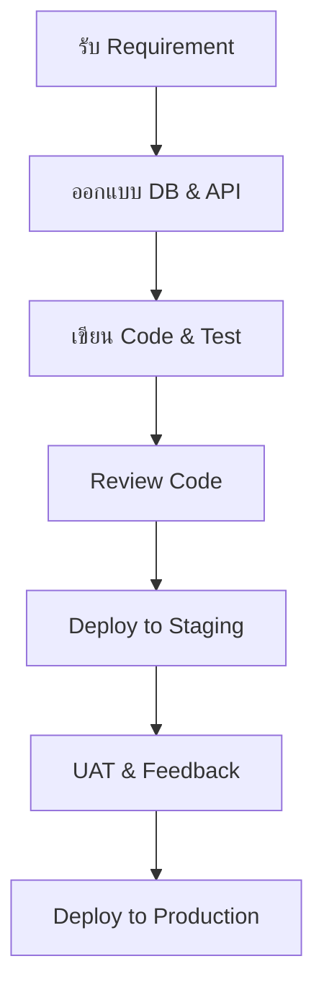
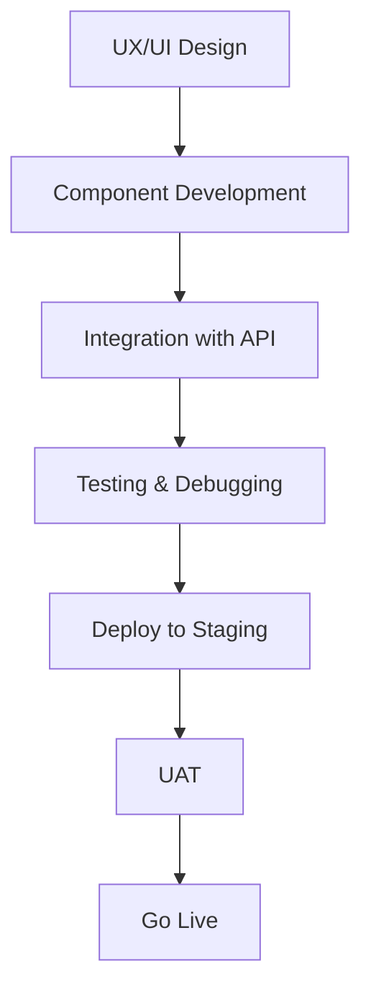

# **ระบบบริหารจัดการคดีและกฎหมายนิติกรสภาเภสัชกรรม**  
**เอกสารกำกับการพัฒนา (Technical Lead Perspective)**

---

| Backend Lead | 1 คน  ทุน 95,000 ต่อเดือน / 1 คน
| Backend Developer | 2  คน| 120 | พัฒนา Module ต่าง ๆ |  ทุน 80,000 ต่อเดือน /1 คน
| Database Engineer | 1 คน | 60 | ออกแบบและ Optimize |  ทุน 50,000 ต่อเดือน /1 คน
| DevOps Engineer | 1  คน | 80 | จัดการ Infrastructure |  ทุน 60,000 ต่อเดือน /1 คน

95,000+160,000+50,000+60,000=  4 เดือน   = 1,460,000 บาท


## **ส่วนที่ 1: ระบบ Backend (NestJS)**

### **1. บทนำ (Introduction)**
ระบบ Backend สำหรับโครงการนี้พัฒนาขึ้นด้วย **NestJS** ซึ่งเป็นเฟรมเวิร์ก Node.js ที่รองรับ TypeScript แบบเต็มรูปแบบ มีโครงสร้างแบบโมดูล ช่วยให้การพัฒนามีความเป็นระเบียบ สะดวกในการทดสอบ และรองรับการขยายระบบในอนาคต ระบบ Backend จะทำหน้าที่เป็นศูนย์กลางในการจัดการข้อมูล การตรวจสอบสิทธิ์ การเชื่อมต่อฐานข้อมูล การให้บริการ API และการทำงานร่วมกับระบบอื่น ๆ ตามที่ระบุใน TOR

### **2. นิยามและคำศัพท์ (Definitions & Glossary)**
- **NestJS**: เฟรมเวิร์กสำหรับพัฒนาแอปพลิเคชัน Node.js แบบมีโครงสร้างชัดเจน
- **JWT (JSON Web Token)**: โพรโทคอลสำหรับการยืนยันตัวตน
- **ORM (Object-Relational Mapping)**: ใช้ **Prisma** หรือ **TypeORM** เพื่อเชื่อมต่อฐานข้อมูล
- **PostgreSQL**: ระบบจัดการฐานข้อมูลเชิงสัมพันธ์
- **Redis**: ระบบจัดเก็บข้อมูลในหน่วยความจำสำหรับ Cache
- **Grafana**: เครื่องมือสำหรับการติดตามและแสดงผลข้อมูลระบบ
- **n8n**: โต็ลสำหรับการจัดการ workflow อัตโนมัติ
- **Gitflow**: รูปแบบการจัดการเวอร์ชันใน Git
- **CI/CD**: กระบวนการ Continuous Integration / Continuous Deployment
- **Docker Compose**: โต็ลสำหรับจัดการ container หลายตัว
- **Jenkins**: ระบบ Automation สำหรับการ deploy และทดสอบ

### **3. หัวข้อการออกแบบ (Design Topics)**
- **Authentication & Authorization**: ใช้ JWT และ Role-Based Access Control (RBAC)
- **Database Design**: ออกแบบ Schema ตามการทำงานของระบบคดีและสมาชิก
- **API Design**: RESTful API หรือ GraphQL (ตามความเหมาะสม)
- **Security**: ป้องกัน Injection, XSS, CSRF, Rate Limiting
- **Logging & Monitoring**: ใช้ Grafana + Prometheus หรือ Elastic Stack
- **Caching Strategy**: ใช้ Redis สำหรับข้อมูลที่เข้าถึงบ่อย
- **Error Handling**: แบบ centralized และ structured
- **Testing Strategy**: Unit Test, Integration Test, E2E Test

### **4. คู่มือการพัฒนา (Development Guide)**
- **การตั้งค่าโครงการ**: `nest new project-name`
- **โครงสร้างโฟลเดอร์**:
  ```
  src/
    ├── modules/
    │   ├── auth/
    │   ├── case/
    │   ├── user/
    │   └── document/
    ├── common/
    │   ├── filters/
    │   ├── guards/
    │   └── interceptors/
    └── main.ts
  ```
- **การเขียน Service & Controller**: ใช้ Decorator Pattern
- **การเชื่อมต่อฐานข้อมูล**: ใช้ Prisma CLI เพื่อ generate client
- **การทดสอบ**: ใช้ Jest และ Supertest

### **5. Workflow การพัฒนา**


### **6. TASK LIST Template**
| ลำดับ | งาน | ผู้รับผิดชอบ | ระยะเวลา (วัน) | สถานะ |
|-------|------|-------------|----------------|--------|
| 1     | Setup NestJS Project | Backend Lead | 3 | ✅ |
| 2     | Design Database Schema | DB Engineer | 5 | ⏳ |
| 3     | Implement Auth Module | Backend Dev | 7 | ❌ |
| ...   | ... | ... | ... | ... |

### **7. CHECKLIST Template**
- [ ] โครงสร้างโปรเจคถูกต้องตามมาตรฐาน
- [ ] การเชื่อมต่อ PostgreSQL สำเร็จ
- [ ] JWT Authentication ทำงานได้
- [ ] Unit Test ผ่าน 80% ขึ้นไป
- [ ] API Document (Swagger) เตรียมพร้อม
- [ ] CI/CD Pipeline ทำงานได้

### **8. จำนวนคนและเวลาการทำงาน (120 วัน)**
| ตำแหน่ง | จำนวน | ระยะเวลา (วัน) | หมายเหตุ |
|----------|--------|----------------|----------|
| Backend Lead | 1 | 120 | ดูแลภาพรวม |
| Backend Developer | 2 | 120 | พัฒนา Module ต่าง ๆ |
| Database Engineer | 1 | 60 | ออกแบบและ Optimize |
| DevOps Engineer | 1 | 80 | จัดการ Infrastructure |

### **9. งานประมาณการ (Backend)**
| งาน | ระยะเวลา (วัน) |
|------|----------------|
| Setup & Configuration | 10 |
| Authentication & Authorization | 15 |
| Case Management Module | 30 |
| Document Management Module | 20 |
| API Integration & Testing | 25 |
| Deployment & Monitoring | 20 |
| **รวม** | **120** |

---

## **ส่วนที่ 2: ระบบ Frontend (Next.js + React)**

### **1. บทนำ (Introduction)**
ระบบ Frontend พัฒนาด้วย **Next.js** และ **React** รองรับการแสดงผลแบบ Responsive และทำงานร่วมกับ Backend ผ่าน API ระบบนี้ประกอบด้วยส่วนต่อประสานสำหรับประชาชน (ร้องเรียน) และส่วน Back-office สำหรับเจ้าหน้าที่

### **2. นิยามและคำศัพท์**
- **Next.js**: React Framework สำหรับ Server-Side Rendering (SSR)
- **Tailwind CSS**: Utility-first CSS Framework
- **JWT**: ใช้สำหรับการจัดการ Session
- **React Query / SWR**: สำหรับจัดการ State และ Cache ฝั่ง Client
- **Formik / React Hook Form**: สำหรับจัดการฟอร์ม
- **Docker Compose**: สำหรับรัน Frontend ใน Container

### **3. หัวข้อการออกแบบ**
- **Component Design**: แบ่งเป็น Public & Admin Components
- **State Management**: ใช้ Context API หรือ Zustand
- **Routing**: ใช้ Next.js Routing (File-based)
- **Form Handling**: รองรับ Validation และ File Upload
- **Responsive Design**: ปรับเลย์เอาต์ตามอุปกรณ์
- **Security**: ป้องกัน XSS, CSRF, Secure HTTP Headers

### **4. คู่มือการพัฒนา**
- **โครงสร้าง**:
  ```
  src/
    ├── components/
    ├── pages/
    │   ├── public/
    │   └── admin/
    ├── styles/
    ├── utils/
    └── services/
  ```
- **การเรียกใช้ API**: ใช้ `axios` หรือ `fetch` โดยมี Interceptor
- **การจัดการ State**: ใช้ React Query สำหรับ data fetching

### **5. Workflow**


### **6. TASK LIST Template**
| ลำดับ | งาน | ผู้รับผิดชอบ | ระยะเวลา (วัน) | สถานะ |
|-------|------|-------------|----------------|--------|
| 1     | Setup Next.js + Tailwind | Frontend Lead | 5 | ✅ |
| 2     | Develop Public Complaint Form | Frontend Dev | 15 | ⏳ |
| 3     | Develop Admin Dashboard | Frontend Dev | 20 | ❌ |
| ...   | ... | ... | ... | ... |

### **7. CHECKLIST Template**
- [ ] UI/UX Design ผ่านการ approve
- [ ] Responsive Design ทำงานได้ทุกหน้าจอ
- [ ] Form Validation ถูกต้อง
- [ ] API Integration สำเร็จ
- [ ] Performance Optimized (Lazy Load, Image Optimization)
- [ ] Accessibility (WCAG) พอใช้ได้

### **8. จำนวนคนและเวลาการทำงาน**
| ตำแหน่ง | จำนวน | ระยะเวลา (วัน) |
|----------|--------|----------------|
| Frontend Lead | 1 | 120 |
| Frontend Developer | 2 | 120 |
| UX/UI Designer | 1 | 60 |

### **9. งานประมาณการ (Frontend)**
| งาน | ระยะเวลา (วัน) |
|------|----------------|
| Project Setup & Configuration | 10 |
| Public Complaint System | 35 |
| Admin Case Management System | 40 |
| Integration & API Testing | 25 |
| Performance & Security Tuning | 10 |
| **รวม** | **120** |

---

## **สรุปทีมพัฒนา (รวม Backend + Frontend)**
| ตำแหน่ง | จำนวน | ระยะเวลา (วัน) |
|----------|--------|----------------|
| Project Manager | 1 | 120 |
| Backend Lead | 1 | 120 |
| Backend Developer | 2 | 120 |
| Frontend Lead | 1 | 120 |
| Frontend Developer | 2 | 120 |
| Database Engineer | 1 | 60 |
| DevOps Engineer | 1 | 80 |
| UX/UI Designer | 1 | 60 |
| QA Engineer | 1 | 100 |
| **รวม** | **11** | **ประมาณ 120 วัน** |

---

## **หมายเหตุ**
- **ทั้งหมดต้องรองรับ 2 ภาษา (ไทย/อังกฤษ)** โดยใช้ i18n library เช่น `next-i18next` (Frontend) และจัดการ multilingual ใน DB (Backend)
- **ต้องทำ Code Review, Testing, และ Deployment ตาม CI/CD Pipeline**
- **ติดตามความคืบหน้าด้วย Task Management Tool เช่น Jira, Trello, หรือ GitHub Projects**

--- 

หากต้องการเอกสารเพิ่มเติมในส่วนใด หรือต้องการให้ปรับรูปแบบการนำเสนอ สามารถแจ้งได้ตลอดเวลา