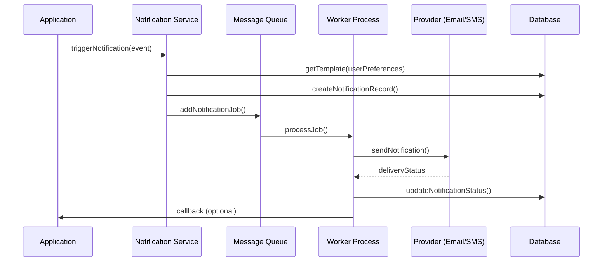

อ้างอิ่ง : จากขอมูลที่ให้มา จากเอการ file แนบ

ผมเจอปัญหา 
   ในการออกแบบระบบงานสำหรับโครงการพัฒนาระบบบริหารคดีและกฎหมายนิติกร สภาเภสัชกรรม 

บทบาทของคุณ
  คุณเป็น Technical Lead (Tech Lead)เชี่ยวชาญงานด้าน IT 

ต้องการให้คุณช่วย 
    ออกแบบระบบและวางแผนงานสำหรับ SDLC (Software Development Life Cycle) และ Agile (แนวคิดการพัฒนาแบบคล่องตัว)

ข้อมูลระบบ ขอบเขตความต้องการ  คือ 

  Project Overview  (SRS + System Design + Project Plan)  
    1) ภาพรวมโครงการ  
    - วัตถุประสงค์ เป้าหมาย ตัวชี้วัดความสำเร็จ (เช่น ระบบใช้งานได้ครบ Scope Public + Back-office + Reporting ภายใน 120 วัน  
    - ผู้มีส่วนได้ส่วนเสียหลัก: สภาเภสัชกรรม, นิติกร, เจ้าหน้าที่, ผู้ร้องเรียน, ทีมพัฒนา, ทีม IT โครงสร้างพื้นฐาน  

    2) ขอบเขตงาน (Scope of Work)  
    - ฟังก์ชัน Public Web: ยื่นเรื่อง, แนบเอกสาร, ยืนยันตัวตน (OTP/Email/SMS), ติดตามสถานะเลขคดี, แสดงเอกสารแจ้งผลในรูปแบบ  
      - ระบบบริการประชาชนทางอิเล็กทรอนิกส์ (e-Service) ของหน่วยงานราชการไทย เช่น กรมบังคับคดี ที่ให้ผู้ใช้ยื่นคำร้องออนไลน์, แนบไฟล์เอกสาร, ยืนยันตัวตนผ่าน OTP/Email/SMS เพื่อความปลอดภัย, ติดตามสถานะคดี และสามารถดาวน์โหลดเอกสารแจ้งผลในรูปแบบดิจิทัลได้ ซึ่งช่วยอำนวยความสะดวก รวดเร็ว และลดการเดินทาง ลดขั้นตอนการทำงานของเจ้าหน้าที่. 
      รายละเอียดฟังก์ชัน:
        -  ยื่นเรื่อง (e-Filing): การยื่นคำร้อง คำขอ หรือเอกสารต่างๆ ผ่านเว็บไซต์ โดยไม่ต้องเดินทางไปที่สำนักงาน.
         - แนบเอกสาร: อัปโหลดไฟล์เอกสารที่เกี่ยวข้อง เช่น บัตรประชาชน, หลักฐานประกอบคำร้อง, หนังสือมอบอำนาจ.
         - ยืนยันตัวตน (OTP/Email/SMS): ใช้รหัสผ่านใช้ครั้งเดียว (OTP) ส่งผ่าน SMS หรือ Email เพื่อยืนยันตัวตนผู้ใช้งานก่อนเข้าสู่ระบบและทำธุรกรรม.
         - ติดตามสถานะเลขคดี: ผู้ใช้สามารถตรวจสอบความคืบหน้าของคำร้องหรือคดีผ่านระบบได้.
         - แสดงเอกสารแจ้งผลในรูปแบบ: แสดงผลการพิจารณา คำสั่ง หรือเอกสารที่เกี่ยวข้องในรูปแบบดิจิทัล (เช่น PDF) ให้ดาวน์โหลดได้ทันที. 
        ตัวอย่างหน่วยงานที่ใช้:
         - กรมบังคับคดี : มีระบบ e-Filing สำหรับยื่นคำร้องบังคับคดี.
         - ศูนย์วิทยบริการศาลยุติธรรม : มีการบริหารจัดการคดีทางระบบ e-Filing. 
    - ฟังก์ชัน Back-office: Case Management, User & Role Management, Dashboard งานประจำวัน, Case Timeline, Document/Evidence Management, Search, Reports PDF/Excel  
     - ฟังก์ชัน Back-office  เช่น ระบบจัดการเคส, CRM, ERP) ที่ช่วยให้การทำงานภายในองค์กรราบรื่น โดยประกอบด้วย Case Management (จัดการเคส), User & Role Management (จัดการผู้ใช้และสิทธิ์), Dashboard (แดชบอร์ด), Case Timeline (ไทม์ไลน์เคส), Document/Evidence Management (จัดการเอกสาร/หลักฐาน), Search (ค้นหา), และ Reports PDF/Excel (รายงาน) ซึ่งทั้งหมดนี้ทำงานร่วมกันเพื่อติดตาม, จัดการ, และวิเคราะห์ข้อมูลสำคัญทางธุรกิจได้อย่างมีประสิทธิภาพ. 
        คำอธิบายแต่ละส่วน:
        - Case Management: ระบบหลักสำหรับสร้าง, ติดตาม, และจัดการ 'เคส' (งาน, คำร้อง, ปัญหา) ตั้งแต่ต้นจนจบ โดยกำหนดสถานะ, ผู้รับผิดชอบ, และขั้นตอนต่างๆ.
        - User & Role Management: จัดการบัญชีผู้ใช้ และกำหนดสิทธิ์การเข้าถึงฟังก์ชันหรือข้อมูลต่างๆ (เช่น แอดมิน, เจ้าหน้าที่, ผู้จัดการ) เพื่อความปลอดภัยและความถูกต้อง.
        - Dashboard งานประจำวัน: หน้าจอสรุปภาพรวมของงานที่ต้องทำ (To-Do List), สถานะเคสเร่งด่วน, ตัวชี้วัดสำคัญ (KPIs) เพื่อให้เห็นภาพรวมและตัดสินใจได้รวดเร็ว.
        - Case Timeline: บันทึกประวัติการดำเนินงานของแต่ละเคสเป็นลำดับเวลา (ใครทำอะไร เมื่อไหร่) เพื่อตรวจสอบย้อนหลังได้.
        - Document/Evidence Management: ระบบจัดเก็บ, ค้นหา, และแชร์เอกสาร, รูปภาพ, หรือหลักฐานที่เกี่ยวข้องกับแต่ละเคส.
        - Search (ค้นหา): ฟังก์ชันค้นหาข้อมูลขั้นสูง ทั้งในส่วนเคส, เอกสาร, หรือข้อมูลผู้ใช้.
        - Reports PDF/Excel: สร้างรายงานสรุปผลการดำเนินงานในรูปแบบไฟล์ PDF หรือ Excel เพื่อนำไปวิเคราะห์ต่อหรือนำเสนอ. 
        - 
        เพื่อ ประโยชน์โดยรวม: ระบบเหล่านี้ช่วยเพิ่มประสิทธิภาพ, ลดข้อผิดพลาด, ทำให้การทำงานเป็นระบบและตรวจสอบได้ง่ายขึ้น, และช่วยในการตัดสินใจทางธุรกิจได้ดีขึ้น (เช่น จากข้อมูลใน Dashboard และ Reports). 

    - ฟังก์ชัน ระบบจัดเก็บ File เอกสาร เช่น pdf word excel upload file permision Role access file inser update delete loging histoty
      ฟังก์ชันสำคัญของระบบจัดเก็บไฟล์:
         - การจัดการไฟล์ (File Management)
         - อัปโหลด/ดาวน์โหลด: รองรับไฟล์หลากหลายรูปแบบ (PDF, DOCX, XLSX, etc.).
        -  การจัดระเบียบ: สร้างโครงสร้างโฟลเดอร์, แท็ก, หมวดหมู่ เพื่อจัดเก็บอย่างเป็นระบบ.
         - ค้นหา: ค้นหาด้วยชื่อไฟล์, เนื้อหา, วันที่, ผู้สร้าง, หรือ Keyword.
         - การจัดการสิทธิ์ (Permission/Access Control)
         - Role-Based Access: กำหนดสิทธิ์ตามบทบาทผู้ใช้ (เช่น Admin, Editor, Viewer).
         - กำหนดสิทธิ์ไฟล์/โฟลเดอร์: ควบคุมการดู, แก้ไข, ลบ, ดาวน์โหลด สำหรับแต่ละบุคคล/กลุ่ม.
         - การควบคุมการเปลี่ยนแปลง (Version Control & Audit Trail)
         - Insert/Update/Delete: บันทึกการกระทำทุกอย่าง (ใครทำอะไร เมื่อไหร่) เพื่อการตรวจสอบ.
         - History/Logging: แสดงประวัติการเข้าถึงและการเปลี่ยนแปลงไฟล์ (Version History).
         - ความปลอดภัยและการสำรองข้อมูล (Security & Backup)
         - Encryption: เข้ารหัสข้อมูลเพื่อป้องกันการเข้าถึงโดยไม่ได้รับอนุญาต.
        -  Backup & Recovery: สำรองข้อมูลเป็นประจำและกู้คืนได้เมื่อเกิดปัญหา.
         - การทำงานร่วมกัน (Collaboration)
         - Check-in/Check-out: ป้องกันการแก้ไขพร้อมกัน.
         - การแจ้งเตือน (Notifications): แจ้งเตือนเมื่อมีการเปลี่ยนแปลงเอกสารสำคัญ.
         - ระบบเวิร์กโฟลว์ (Workflow)
         - สร้างกระบวนการอนุมัติเอกสารอัตโนมัติ (เช่น เสนอ-อนุมัติ). 
         เพื่อ ประโยชน์: ช่วยลดความผิดพลาด เพิ่มประสิทธิภาพการทำงาน และรักษาความปลอดภัยของข้อมูลองค์กร. 
 
    3) สถาปัตยกรรมระบบ (System Architecture)  
    - Backend: NestJS + TypeScript, ORM (TypeORM/Prisma) + PostgreSQL, Redis สำหรับ Caching, n8n สำหรับ Automation/Integration, Robot Framework สำหรับ API Test, Docker Compose + Jenkins สำหรับ CI/CD และ Gitflow สำหรับการพัฒนาเวอร์ชัน  
    - Frontend: Next.js + React + TypeScript, JWT Authentication, React Hook Form + Zod สำหรับ Form Validation, Robot Framework สำหรับ E2E Test, Docker Compose สำหรับ Dev/Stage  
  
    
    4) การออกแบบข้อมูล (Data Model & Database)  
    - โครงสร้างฐานข้อมูลหลัก เช่น ตาราง Case, Person, Timeline, Document, User, Role, Permission, AuditLog ออกแบบบน PostgreSQL ตามแนวทาง TOR ที่ระบุ Database Schema เป็นหนึ่งใน Deliverables[1]
    - หลักการออกแบบเพื่อรองรับการค้นหาและรายงาน เช่น Index, Partition (ถ้าจำเป็น), การเก็บประวัติ (History/Audit)  

    5) ความมั่นคงปลอดภัยและ PDPA  
    - การเข้ารหัสข้อมูลที่สำคัญ การใช้ HTTPS/SSL, Audit Log, Input Validation และมาตรการป้องกัน Threat ทั่วไป ตามข้อกำหนด Security/PDPA ใน TOR[1]

    6) แผนการพัฒนา ทดสอบ และส่งมอบ  
    - ระบุ Milestone: วิเคราะห์/ออกแบบ, พัฒนา, ทดสอบระบบ+UAT, Go-live, Maintenance พร้อม Deliverables ตาม TOR เช่น System Requirements Spec, High-level Architecture, Test Plan, Test Report และ UAT Report[1]
        
เพื่อให้ คุณ ทำตามขั้นตอนดังนี้

    1.สร้างบทนำ
    2.สร้างบทนิยาม
    3.สร้างบทหัวข้อ
    5.ออกแบบคู่มือ
    6.ออกแบบ workflow
    7.TASK LIST Template
    8.CHECKLIST Template
    9.ระบบจำนวนคนที่ใช้ในการทำงาน  ภายใน  120 วัน
    10.งบประมาณที่ใช้  และ จำนวนคนที่ใช้ในการทำงาน 
    10.1 Technical Lead + Project Manager + DevOps Engineer  จัดการ Infrastructure อออกแบบ CI/CD Gitflow Test code แบบต่าง ๆ  
      10.1.1 สร้างเอกสาร SRS  + User Document
      10.1.2.สร้าง Template code
      10.1.3.ออกแบบ Data flow
      10.1.4.ออกแบบ Work flow
      10.1.5.ออกแบบ Template รายงาน
      10.1.6.ออกแบบระบบ DevOps Engineer  จัดการ Infrastructure 
        - Docker
        - Jenkins 
        - Ubuntu OS
        - Configuring CI/CD in GitHub 
        - Deploy  ระบบ API Backend (NestJS) TypeScript
        - Deploy  ระบบ  Frontend (Next.js + React + TypeScript)

    10.2 Backend Developer  พัฒนา Module ต่าง ๆ  + Database Engineer   ออกแบบและ Optimize Database    ระบบ API Backend (NestJS) TypeScript
     10.2.1 สร้าง Database + สร้างเอกสาร Database  
     10.2.2 สร้าง ออกแบบและ Optimize Database +  สร้างเอกสาร Database  
     10.2.1 สร้าง Backend API Function business logic  functions 

    10.3 Fontend Developer  พัฒนา Module ต่าง ๆ  + ออกแบบ  UX UI  HTML CSS   ระบบ  Frontend (Next.js + React + TypeScript)
     10.2.1 สร้าง ระบบ Fontend 

  
  ออกแบบระบบ  Backend (NestJS) TypeScript
    - JWT Authentication
    - File management
    - Loging management
    - Class Validator + Class Transformer
    - TypeORM / Prisma (ORM)
    - PostgreSQL (Database)
    - Redis (Caching)
    - Jest Test code
    - n8n (Automation)
    - Gitflow (Version Control)
    - Robot Framework (API Testing)
    - Docker Compose (Containerization)
    - Jenkins (CI/CD)
    จัดทำ 
    1.Diagram แผนภาพโครงสร้างระบบ
    2.Template โครงสร้างระบบ Backend
    3.ตัวอย่างโค้ดเต็มรูปแบบ - Backend
    4.Dataflow & Workflow
    5.Infrastructure
    6.Testing
    7.Gitflow
    8.CI/CD


  ออกแบบระบบ  Frontend (Next.js + React + TypeScript)
    -JWT Authentication
    -Form Validation (React Hook Form + Zod)
    -Tailwind CSS with Next.js
    -HTML To Tailwind CSS with Next.js  
    -UX Diagram
    -UI Diagram
    จัดทำ 
    1.Diagram แผนภาพโครงสร้างระบบ
    2.Template โครงสร้างระบบ Backend
    3.ตัวอย่างโค้ดเต็มรูปแบบ - Backend
    4.Dataflow & Workflow
    5.Infrastructure
    6.Testing
    7.Gitflow
    8.CI/CD


# ** Resalte **


# **เอกสารออกแบบและวางแผนงานพัฒนาระบบบริหารคดีและกฎหมายนิติกร**
## **สภาเภสัชกรรม**

---

## **บทนำ (Introduction)**

ระบบบริหารคดีและกฎหมายนิติกร เป็นระบบสารสนเทศที่ออกแบบมาเพื่อรองรับการรับเรื่องร้องเรียน การบริหารจัดการคดี และการประมวลผลข้อมูลทางกฎหมายของสภาเภสัชกรรม โดยมีเป้าหมายหลักเพื่อเพิ่มประสิทธิภาพการทำงาน โปร่งใส และรองรับมาตรฐานความปลอดภัยตามกฎหมาย PDPA  
ระบบนี้ประกอบด้วย 2 ส่วนหลัก คือ **ระบบรับเรื่องร้องเรียนสำหรับประชาชน (Public Web)** และ **ระบบบริหารจัดการคดีสำหรับเจ้าหน้าที่ (Back-office)** โดยใช้เทคโนโลยีสมัยใหม่ เช่น **NestJS (Backend)**, **Next.js (Frontend)**, และ **PostgreSQL (Database)** พร้อมกระบวนการพัฒนาแบบ Agile และ SDLC เพื่อให้ระบบพร้อมใช้งานภายใน **120 วัน**

---

## **บทนิยาม (Glossary)**

| คำศัพท์ | ความหมาย |
|---------|----------|
| **TOR** | ข้อกำหนดขอบเขตงาน (Terms of Reference) |
| **PDPA** | พ.ร.บ. คุ้มครองข้อมูลส่วนบุคคล |
| **UAT** | การทดสอบการยอมรับของผู้ใช้ (User Acceptance Test) |
| **CI/CD** | Continuous Integration / Continuous Deployment |
| **ORM** | Object-Relational Mapping (เช่น TypeORM, Prisma) |
| **JWT** | JSON Web Token สำหรับ Authentication |
| **OTP** | One-Time Password สำหรับยืนยันตัวตน |
| **RBAC** | Role-Based Access Control |
| **API** | Application Programming Interface |
| **DevOps** | การพัฒนาร่วมกับการดำเนินการระบบ |

---

## **บทหัวข้อ (Outline)**

### **1. ภาพรวมโครงการ (Project Overview)**
### **2. ขอบเขตงาน (Scope of Work)**
### **3. สถาปัตยกรรมระบบ (System Architecture)**
### **4. การออกแบบข้อมูล (Data Model & Database)**
### **5. ความมั่นคงปลอดภัยและ PDPA**
### **6. แผนการพัฒนา ทดสอบ และส่งมอบ**
### **7. คู่มือการใช้งาน (User Manual)**
### **8. Workflow Diagram**
### **9. TASK LIST Template**
### **10. CHECKLIST Template**
### **11. ทีมพัฒนาและโครงสร้างทีม**
### **12. งบประมาณและทรัพยากร**
### **13. แผนภาพโครงสร้างระบบ (Backend & Frontend)**
### **14. Template โครงสร้างระบบ**
### **15. ตัวอย่างโค้ดเต็มรูปแบบ**
### **16. Dataflow & Workflow**
### **17. Infrastructure & DevOps**
### **18. Testing Strategy**
### **19. Gitflow & CI/CD Pipeline**

---

## **1. ภาพรวมโครงการ**

- **วัตถุประสงค์**: พัฒนาระบบบริหารคดีและกฎหมายนิติกรให้ครบถ้วนตาม TOR ภายใน 120 วัน
- **ตัวชี้วัดความสำเร็จ**:
  - ระบบ Public Web และ Back-office ทำงานได้ครบ Scope
  - ผ่านการทดสอบ UAT
  - ส่งมอบซอร์สโค้ดและเอกสารครบถ้วน
- **ผู้มีส่วนได้ส่วนเสีย**:
  - สภาเภสัชกรรม (ผู้ว่าจ้าง)
  - นิติกรและเจ้าหน้าที่ (ผู้ใช้ระบบ)
  - ผู้ร้องเรียน (ประชาชน)
  - ทีมพัฒนา (Tech Lead, Developer, DevOps)
  - ทีม IT โครงสร้างพื้นฐาน

---

## **2. ขอบเขตงาน (Scope of Work)**

### **2.1 Public Web Application**
- ยื่นเรื่องร้องเรียนออนไลน์ (e-Filing)
- แนบเอกสาร (PDF, Image, Video)
- ยืนยันตัวตนด้วย OTP (Email/SMS)
- ติดตามสถานะคดีด้วยเลขอ้างอิง
- แสดงผลเอกสารแจ้งผล (PDF)

### **2.2 Back-office Case Management**
- จัดการผู้ใช้และสิทธิ์ (RBAC)
- Dashboard งานประจำวัน
- Timeline คดี
- จัดการเอกสารและหลักฐาน
- ค้นหาและรายงาน (PDF/Excel)

### **2.3 ระบบจัดเก็บไฟล์**
- อัปโหลด/ดาวน์โหลดไฟล์
- กำหนดสิทธิ์ตามบทบาท
- Audit Log (ประวัติการเข้าถึง)
- Version Control

---

## **3. สถาปัตยกรรมระบบ**

### **Backend Stack**
- **Framework**: NestJS + TypeScript
- **ORM**: TypeORM / Prisma
- **Database**: PostgreSQL
- **Cache**: Redis
- **Authentication**: JWT
- **Automation**: n8n
- **Testing**: Jest, Robot Framework
- **Container**: Docker Compose
- **CI/CD**: Jenkins, Gitflow

### **Frontend Stack**
- **Framework**: Next.js + React + TypeScript
- **Styling**: Tailwind CSS
- **Form Validation**: React Hook Form + Zod
- **Testing**: Robot Framework (E2E)

---

## **4. การออกแบบข้อมูล (Data Model)**

### **ตารางหลัก**
- `User` (ผู้ใช้)
- `Role` (บทบาท)
- `Case` (คดี)
- `Person` (บุคคล)
- `Document` (เอกสาร)
- `Timeline` (ประวัติคดี)
- `AuditLog` (บันทึกการใช้งาน)

### **ออกแบบเพื่อรองรับ**
- Indexing สำหรับการค้นหา
- Partitioning สำหรับข้อมูลขนาดใหญ่
- Audit Trail สำหรับการติดตาม

---

## **5. ความมั่นคงปลอดภัยและ PDPA**

- **HTTPS/SSL** (Let’s Encrypt)
- **Input Validation & Sanitization**
- **Audit Logging**
- **RBAC** (Role-Based Access Control)
- **Data Encryption** (at rest & in transit)
- **PDPA Compliance** (Consent, Data Minimization, Right to Access)

---

## **6. แผนการพัฒนา ทดสอบ และส่งมอบ**

| Phase | ระยะเวลา | Deliverables |
|-------|----------|--------------|
| **Analysis & Design** | 30 วัน | SRS, High-level Architecture, UI/UX Design |
| **Development** | 60 วัน | Backend API, Frontend, Database |
| **Testing** | 20 วัน | Unit Test, Integration Test, UAT |
| **Go-live & Handover** | 10 วัน | Deployment, Training, Documentation |

---

## **7. คู่มือการใช้งาน (User Manual)**

### **สำหรับประชาชน**
- การยื่นเรื่องร้องเรียน
- การติดตามสถานะ
- การดาวน์โหลดเอกสาร

### **สำหรับเจ้าหน้าที่**
- การจัดการคดี
- การค้นหาและรายงาน
- การจัดการเอกสาร

---

## **8. Workflow Diagram**

```
ผู้ร้องเรียน → ยื่นเรื่อง → OTP ยืนยัน → บันทึกข้อมูล → แนบเอกสาร → ส่งเรื่อง
↓
เจ้าหน้าทีรับเรื่อง → ตรวจสอบ → กำหนดเลขคดี → ดำเนินการ → อัปเดตสถานะ → ปิดคดี
```

---

## **9. TASK LIST Template**

| Task ID | ชื่องาน | ผู้รับผิดชอบ | วันที่เริ่ม | วันที่สิ้นสุด | สถานะ |
|---------|--------|-------------|-----------|-------------|--------|
| T001 | วิเคราะห์ความต้องการ | Tech Lead | Day 1 | Day 10 | Done |
| T002 | ออกแบบ Database | Backend Dev | Day 11 | Day 20 | In Progress |
| T003 | พัฒนา API Case Management | Backend Dev | Day 21 | Day 50 | Pending |

---

## **10. CHECKLIST Template**

### **ก่อนส่งมอบ**
- [ ] ทดสอบ Unit Test ผ่าน 100%
- [ ] ทดสอบ Integration Test ผ่าน
- [ ] UAT ผ่านโดยผู้ใช้จริง
- [ ] ตรวจสอบ Security Scan
- [ ] เอกสารครบถ้วน

---

## **11. ทีมพัฒนาและโครงสร้างทีม (ภายใน 120 วัน)**

| ตำแหน่ง | จำนวน | ระยะเวลา | บทบาท |
|---------|--------|----------|--------|
| **Tech Lead + Project Manager** | 1 | 120 วัน | ออกแบบระบบ จัดการโครงการ |
| **DevOps Engineer** | 1 | 90 วัน | Infrastructure, CI/CD, Deployment |
| **Backend Developer** | 2 | 100 วัน | พัฒนา API, Database |
| **Frontend Developer** | 2 | 100 วัน | พัฒนา UI/UX, Frontend Logic |
| **QA / Tester** | 1 | 60 วัน | ทดสอบระบบ, UAT Support |

**รวม: 7 คน**

---

## **12. งบประมาณและทรัพยากร**

| รายการ | จำนวน | ระยะเวลา | ค่าจ้าง/เดือน (บาท) | รวม (บาท) |
|--------|--------|----------|---------------------|-----------|
| Tech Lead + PM | 1 | 120 วัน | 120,000 | 480,000 |
| DevOps Engineer | 1 | 90 วัน | 100,000 | 300,000 |
| Backend Developer | 2 | 100 วัน | 80,000 | 1,600,000 |
| Frontend Developer | 2 | 100 วัน | 80,000 | 1,600,000 |
| QA/Tester | 1 | 60 วัน | 60,000 | 120,000 |
| **รวมค่าจ้างทีม** | | | | **4,100,000** |
| Infrastructure (Cloud, Tools) | | 120 วัน | | 500,000 |
| **รวมงบประมาณทั้งหมด** | | | | **4,600,000** |

---

## **13. แผนภาพโครงสร้างระบบ (Backend)**

```
Client → API Gateway → NestJS App → TypeORM → PostgreSQL
                              ↓
                            Redis (Cache)
                              ↓
                            n8n (Automation)
                              ↓
                            Jenkins (CI/CD)
```

---

## **14. Template โครงสร้างระบบ Backend**

```
src/
├── modules/
│   ├── auth/
│   ├── case/
│   ├── document/
│   └── user/
├── config/
├── middleware/
├── utils/
├── test/
└── main.ts
```

---

## **15. ตัวอย่างโค้ดเต็มรูปแบบ - Backend (NestJS)**

```typescript
// case.controller.ts
import { Controller, Get, Post, Body, UseGuards } from '@nestjs/common';
import { CaseService } from './case.service';
import { JwtAuthGuard } from '../auth/jwt-auth.guard';

@Controller('cases')
@UseGuards(JwtAuthGuard)
export class CaseController {
  constructor(private readonly caseService: CaseService) {}

  @Post()
  create(@Body() createCaseDto: CreateCaseDto) {
    return this.caseService.create(createCaseDto);
  }

  @Get()
  findAll() {
    return this.caseService.findAll();
  }
}
```

---

## **16. Dataflow & Workflow**

### **Dataflow**
```
Frontend → API Call → Backend → Database → Response → Frontend
```

### **Workflow (Case Management)**
```
Create Case → Assign Officer → Update Status → Upload Document → Close Case
```

---

## **17. Infrastructure & DevOps**

### **เครื่องมือ**
- Docker Compose
- Jenkins
- Ubuntu Server
- GitHub Actions
- Nginx
- Let’s Encrypt

### **CI/CD Pipeline**
```
Git Push → GitHub → Jenkins Build → Docker Build → Deploy to Staging → UAT → Production
```

---

## **18. Testing Strategy**

- **Unit Test**: Jest (Backend), React Testing Library (Frontend)
- **Integration Test**: Robot Framework (API Testing)
- **E2E Test**: Robot Framework (Frontend + Backend)
- **Security Test**: OWASP ZAP, Dependency Scanning

---

## **19. Gitflow & CI/CD Pipeline**

### **Gitflow Branching**
```
main (production)
↓
develop
↓
feature/xxx
hotfix/xxx
release/xxx
```

### **CI/CD Steps**
1. Code Commit → Lint & Format
2. Unit Test → Build Docker Image
3. Deploy to Staging → Run Integration Test
4. Approve → Deploy to Production

---

## **สรุป**

ระบบบริหารคดีและกฎหมายนิติกรนี้ถูกออกแบบมาเพื่อตอบโจทย์ความต้องการของสภาเภสัชกรรมอย่างครบถ้วน โดยใช้เทคโนโลยีที่ทันสมัย กระบวนการพัฒนาที่เป็นระบบ และทีมงานที่มีความเชี่ยวชาญ เพื่อให้ระบบพร้อมใช้งานภายใน **120 วัน** ตามข้อกำหนดใน TOR พร้อมรับประกันคุณภาพและการบำรุงรักษาต่อเนื่อง 1 ปี


# ส่วนเสริม 

# **การออกแบบระบบ Ticket/Task CRM สำหรับระบบบริหารคดี**
## **เพื่อการจัดการงานภายในสำหรับนิติกรและเจ้าหน้าที่**

---

## **1. บทนำระบบ Ticket/Task CRM**

ระบบ Ticket/Task CRM เป็นระบบย่อยภายในระบบบริหารคดี ที่ออกแบบมาเพื่อจัดการการติดตามงาน แจกจ่ายงาน แจ้งเตือน และรายงานสถานะการทำงานของเจ้าหน้าที่และนิติกร โดยเฉพาะในบริบทของการจัดการคดีทางกฎหมายของสภาเภสัชกรรม

---

## **2. วัตถุประสงค์ของระบบ**

1. **จัดการการแจกจ่ายงาน** (Work Assignment) อย่างเป็นระบบและโปร่งใส
2. **ติดตามสถานะงาน** (Task Tracking) แบบเรียลไทม์
3. **จัดการลำดับความสำคัญ** (Priority Management) ของงาน
4. **รายงานประสิทธิภาพ** (Performance Reporting) ของเจ้าหน้าที่
5. **แจ้งเตือนอัตโนมัติ** (Automated Notifications) เมื่อมีงานใหม่หรือครบกำหนด
6. **บันทึกประวัติการทำงาน** (Work History) สำหรับการตรวจสอบ

---

## **3. ขอบเขตระบบ (Scope)**

### **3.1 ฟังก์ชันหลัก**
- **Ticket Creation**: สร้าง Ticket จากคดีใหม่หรือคำร้องใหม่
- **Task Assignment**: มอบหมายงานให้กับเจ้าหน้าที่หรือนิติกร
- **Priority Setting**: กำหนดระดับความเร่งด่วน (Critical, High, Medium, Low)
- **Status Tracking**: ติดตามสถานะ (New, In Progress, Pending, Resolved, Closed)
- **Deadline Management**: จัดการกำหนดเวลาสิ้นสุด (Due Date)
- **Comment & Communication**: แชทภายในสำหรับแต่ละ Ticket
- **Attachment Management**: แนบเอกสารที่เกี่ยวข้องกับ Ticket
- **Reporting & Analytics**: รายงานสถิติการทำงาน
- **Notification System**: แจ้งเตือนผ่าน Email, In-app, SMS

### **3.2 ผู้ใช้งานระบบ**
| Role | สิทธิ์การใช้งาน |
|------|----------------|
| **Admin** | จัดการทั้งหมด สร้าง/ลบ/แก้ไข Ticket มอบหมายงาน ดูรายงาน |
| **Manager/Supervisor** | สร้าง Ticket มอบหมายงาน ดูสถานะทีม รายงาน |
| **Officer/Nitigorn** | ดู Ticket ที่ได้รับมอบหมาย อัปเดตสถานะ แนบไฟล์ แชท |
| **Viewer** | ดูสถานะเท่านั้น ไม่สามารถแก้ไข |

---

## **4. สถาปัตยกรรมระบบ (System Architecture)**

### **4.1 Tech Stack**
```
Backend: NestJS + TypeScript
Database: PostgreSQL (ตาราง Ticket, Task, Comment, etc.)
Cache: Redis (สำหรับแจ้งเตือนและ Session)
Queue: BullMQ (สำหรับจัดการ Job แจ้งเตือน)
Real-time: Socket.io (สำหรับแชทเรียลไทม์)
Frontend: Next.js + React + TypeScript
```

### **4.2 โครงสร้าง Database Schema**

```sql
-- ตาราง Ticket
CREATE TABLE tickets (
    id UUID PRIMARY KEY DEFAULT gen_random_uuid(),
    case_id UUID REFERENCES cases(id), -- เชื่อมโยงกับคดีหลัก
    ticket_number VARCHAR(50) UNIQUE NOT NULL, -- รูปแบบ: TKT-2024-001
    title VARCHAR(255) NOT NULL,
    description TEXT,
    priority VARCHAR(20) CHECK (priority IN ('CRITICAL', 'HIGH', 'MEDIUM', 'LOW')),
    status VARCHAR(20) CHECK (status IN ('NEW', 'IN_PROGRESS', 'PENDING', 'RESOLVED', 'CLOSED')),
    assigned_to UUID REFERENCES users(id), -- ผู้รับผิดชอบ
    created_by UUID REFERENCES users(id),
    created_at TIMESTAMP DEFAULT CURRENT_TIMESTAMP,
    updated_at TIMESTAMP DEFAULT CURRENT_TIMESTAMP,
    due_date TIMESTAMP,
    closed_at TIMESTAMP,
    resolution_notes TEXT
);

-- ตาราง Task (งานย่อยใน Ticket)
CREATE TABLE tasks (
    id UUID PRIMARY KEY DEFAULT gen_random_uuid(),
    ticket_id UUID REFERENCES tickets(id),
    title VARCHAR(255) NOT NULL,
    description TEXT,
    is_completed BOOLEAN DEFAULT FALSE,
    completed_by UUID REFERENCES users(id),
    completed_at TIMESTAMP,
    created_at TIMESTAMP DEFAULT CURRENT_TIMESTAMP
);

-- ตาราง Comment/Communication
CREATE TABLE ticket_comments (
    id UUID PRIMARY KEY DEFAULT gen_random_uuid(),
    ticket_id UUID REFERENCES tickets(id),
    user_id UUID REFERENCES users(id),
    comment TEXT NOT NULL,
    is_internal_note BOOLEAN DEFAULT FALSE, -- หมายเหตุภายในที่ผู้ร้องไม่เห็น
    created_at TIMESTAMP DEFAULT CURRENT_TIMESTAMP
);

-- ตาราง Attachment
CREATE TABLE ticket_attachments (
    id UUID PRIMARY KEY DEFAULT gen_random_uuid(),
    ticket_id UUID REFERENCES tickets(id),
    file_name VARCHAR(255),
    file_path VARCHAR(500),
    file_type VARCHAR(50),
    uploaded_by UUID REFERENCES users(id),
    uploaded_at TIMESTAMP DEFAULT CURRENT_TIMESTAMP
);

-- ตาราง Audit Log
CREATE TABLE ticket_audit_logs (
    id UUID PRIMARY KEY DEFAULT gen_random_uuid(),
    ticket_id UUID REFERENCES tickets(id),
    action VARCHAR(100) NOT NULL, -- เช่น 'ASSIGNED', 'STATUS_CHANGED'
    old_value TEXT,
    new_value TEXT,
    performed_by UUID REFERENCES users(id),
    performed_at TIMESTAMP DEFAULT CURRENT_TIMESTAMP
);
```

---

## **5. Workflow ระบบ Ticket/Task CRM**

### **5.1 Workflow การสร้างและจัดการ Ticket**
```
1. ผู้จัดการ/หัวหน้างานสร้าง Ticket จากคดีใหม่
2. ระบบกำหนด Ticket Number อัตโนมัติ (TKT-YYYY-NNNN)
3. กำหนด Priority (ตามประเภทคดี, ความเร่งด่วน)
4. มอบหมายให้เจ้าหน้าที่ (Assign) 
5. แจ้งเตือนไปยังเจ้าหน้าที่ (Email/In-app)
6. เจ้าหน้าทีรับงาน → อัปเดตสถานะเป็น "In Progress"
7. ดำเนินการตามขั้นตอน → อาจสร้าง Task ย่อย
8. เมื่อเสร็จ → อัปเดตสถานะเป็น "Resolved"
9. ผู้จัดการตรวจสอบ → ปิด Ticket เป็น "Closed"
```

### **5.2 Workflow แชทและติดตาม**
```
Ticket Detail Page
├── Comments Section (สาธารณะ/ภายใน)
├── Attachment Section
├── Task List
├── Status Timeline
└── Audit Trail
```

---

## **6. ฟังก์ชันการทำงานหลัก (Core Features)**

### **6.1 Dashboard สำหรับผู้จัดการ**
```typescript
interface ManagerDashboard {
  totalTickets: number;
  openTickets: number;
  overdueTickets: number;
  ticketsByPriority: {
    CRITICAL: number;
    HIGH: number;
    MEDIUM: number;
    LOW: number;
  };
  teamPerformance: Array<{
    officerName: string;
    ticketsAssigned: number;
    ticketsCompleted: number;
    averageResolutionTime: string;
  }>;
  recentActivities: Array<TicketActivity>;
}
```

### **6.2 Automated Notifications**
```typescript
enum NotificationType {
  TICKET_ASSIGNED = 'TICKET_ASSIGNED',
  TICKET_UPDATED = 'TICKET_UPDATED',
  COMMENT_ADDED = 'COMMENT_ADDED',
  DUE_DATE_REMINDER = 'DUE_DATE_REMINDER',
  TICKET_OVERDUE = 'TICKET_OVERDUE'
}

interface Notification {
  userId: string;
  type: NotificationType;
  ticketId: string;
  message: string;
  isRead: boolean;
  createdAt: Date;
}
```

### **6.3 Search & Filter System**
```typescript
interface TicketFilter {
  status?: TicketStatus[];
  priority?: TicketPriority[];
  assignedTo?: string[];
  createdDateFrom?: Date;
  createdDateTo?: Date;
  dueDateFrom?: Date;
  dueDateTo?: Date;
  keyword?: string; // Search in title, description, ticket number
}
```

---

## **7. UI/UX Design (ตัวอย่างหน้าจอ)**

### **7.1 Ticket List Page**
```
+---------------------------------------------------+
| 📋 Ticket List                       [Create New] |
+---------------------------------------------------+
| Filters: [All] [Open] [My Tickets] [Overdue]      |
| Search: [____________] [Priority: All▼]           |
+---------------------------------------------------+
| TKT-2024-001 | คดีเภสัชกร... | High | In Progress |
| TKT-2024-002 | ร้องเรียนยา... | Med  | New        |
| TKT-2024-003 | ตรวจสอบใบอนุญาต... | Low | Closed  |
+---------------------------------------------------+
```

### **7.2 Ticket Detail Page**
```
+---------------------------------------------------+
| TKT-2024-001: ร้องเรียนเภสัชกรไม่จ่ายยาตามมาตรฐาน |
+---------------------------------------------------+
| Priority: 🔴 HIGH        Status: 🟡 IN_PROGRESS   |
| Assigned to: นายสมชาย ใจดี                         |
| Due Date: 15 มี.ค. 2024 (เหลือ 2 วัน)            |
+---------------------------------------------------+
| 📝 Description: ...                                |
| ✅ Tasks: [ ] ตรวจสอบข้อเท็จจริง                  |
|           [ ] สอบปากคำพยาน                        |
|           [✓] ร่างคำวินิจฉัย                      |
+---------------------------------------------------+
| 💬 Comments:                                       |
| [สมชาย] กำลังดำเนินการ... (วันนี้ 10:30)           |
| [ผู้จัดการ] เร่งดำเนินการด้วย (วันนี้ 11:15)       |
+---------------------------------------------------+
```

---

## **8. API Design (ตัวอย่าง Endpoints)**

### **8.1 Ticket Endpoints**
```typescript
// Ticket Controller
@Controller('tickets')
export class TicketController {
  
  @Get()
  async getTickets(@Query() filter: TicketFilterDto) {
    // ดึง Ticket ตาม filter
  }
  
  @Post()
  async createTicket(@Body() createTicketDto: CreateTicketDto) {
    // สร้าง Ticket ใหม่
  }
  
  @Patch(':id/assign')
  async assignTicket(
    @Param('id') ticketId: string,
    @Body() assignDto: AssignTicketDto
  ) {
    // มอบหมาย Ticket
  }
  
  @Post(':id/comments')
  async addComment(
    @Param('id') ticketId: string,
    @Body() commentDto: AddCommentDto
  ) {
    // เพิ่ม Comment
  }
}
```

### **8.2 Report Endpoints**
```typescript
@Controller('reports')
export class ReportController {
  
  @Get('ticket-metrics')
  async getTicketMetrics(@Query() period: ReportPeriodDto) {
    // สถิติ Ticket
  }
  
  @Get('officer-performance')
  async getOfficerPerformance(@Query() filter: PerformanceFilterDto) {
    // ประสิทธิภาพเจ้าหน้าที่
  }
}
```

---

## **9. Business Rules & Validation**

### **9.1 Priority Rules**
```typescript
const PRIORITY_RULES = {
  CRITICAL: {
    dueDateDays: 1,
    escalationHours: 4,
    notifyManager: true
  },
  HIGH: {
    dueDateDays: 3,
    escalationHours: 8,
    notifyManager: true
  },
  MEDIUM: {
    dueDateDays: 7,
    escalationHours: 24,
    notifyManager: false
  },
  LOW: {
    dueDateDays: 14,
    escalationHours: 48,
    notifyManager: false
  }
};
```

### **9.2 SLA (Service Level Agreement)**
```typescript
const SLA_CONFIG = {
  firstResponseTime: '4 ชั่วโมง', // ตอบกลับครั้งแรก
  resolutionTime: {              // เวลาดำเนินการเสร็จ
    CRITICAL: '24 ชั่วโมง',
    HIGH: '72 ชั่วโมง',
    MEDIUM: '7 วัน',
    LOW: '14 วัน'
  }
};
```

---

## **10. Integration กับระบบอื่น**

### **10.1 เชื่อมโยงกับระบบ Case Management**
```typescript
// เมื่อมีคดีใหม่ สร้าง Ticket อัตโนมัติ
@Injectable()
export class CaseToTicketService {
  async createTicketFromCase(caseId: string) {
    const caseData = await this.caseService.findById(caseId);
    
    const ticket = await this.ticketService.create({
      caseId: caseData.id,
      title: `คดี: ${caseData.caseNumber}`,
      priority: this.calculatePriority(caseData.type),
      description: caseData.summary
    });
    
    // แจ้งเตือนทีมนิติกร
    await this.notificationService.notifyLegalTeam(ticket);
  }
}
```

### **10.2 เชื่อมโยงกับ Calendar System**
- Sync Due Date กับ Google Calendar/Outlook
- Reminder 1 วันก่อน Due Date

---

## **11. Security & Access Control**

### **11.1 Permission Matrix**
| Action | Admin | Manager | Officer | Viewer |
|--------|-------|---------|---------|---------|
| View All Tickets | ✓ | ✓ | ✗ | ✗ |
| View Assigned Tickets | ✓ | ✓ | ✓ | ✓* |
| Create Ticket | ✓ | ✓ | ✗ | ✗ |
| Assign Ticket | ✓ | ✓ | ✗ | ✗ |
| Update Status | ✓ | ✓ | ✓ | ✗ |
| Add Comment | ✓ | ✓ | ✓ | ✗ |
| Add Internal Note | ✓ | ✓ | ✗ | ✗ |
| View Reports | ✓ | ✓ | ✗ | ✗ |

*เฉพาะที่ได้รับอนุญาต

---

## **12. Testing Strategy**

### **12.1 Test Cases ตัวอย่าง**
```
TC-TICKET-001: การสร้าง Ticket ใหม่
TC-TICKET-002: การมอบหมาย Ticket
TC-TICKET-003: การอัปเดตสถานะ
TC-TICKET-004: การเพิ่ม Comment
TC-TICKET-005: การแจ้งเตือนอัตโนมัติ
TC-TICKET-006: การรายงานสถิติ
```

### **12.2 Performance Requirements**
- โหลด Ticket List < 2 วินาที (1000 records)
- Real-time comment < 500ms
- Search function < 1 วินาที

---

## **13. Deployment & Monitoring**

### **13.1 Monitoring Dashboard**
```typescript
interface TicketSystemMetrics {
  activeTickets: number;
  ticketsCreatedToday: number;
  averageResolutionTime: string;
  topOfficers: Array<{name: string, completed: number}>;
  overdueTicketsAlert: Array<TicketAlert>;
}
```

### **13.2 Alert Rules**
```yaml
alerts:
  - name: "high_ticket_backlog"
    condition: "open_tickets > 50"
    action: "notify_managers"
    
  - name: "sla_violation"
    condition: "overdue_tickets > 5"
    action: "escalate_to_director"
```

---

## **14. Roadmap & Future Enhancements**

### **Phase 1 (พื้นฐาน)**
- Ticket Creation & Assignment
- Basic Status Tracking
- Comment System

### **Phase 2 (ขั้นสูง)**
- SLA Tracking
- Performance Analytics
- Mobile App
- API Integration

### **Phase 3 (อัจฉริยะ)**
- AI Priority Suggestion
- Auto-assignment based on workload
- Predictive Analytics

---

## **สรุป**

ระบบ Ticket/Task CRM นี้ถูกออกแบบมาเพื่อ:
1. **เพิ่มประสิทธิภาพ** ในการจัดการงานภายใน
2. **สร้างความโปร่งใส** ในการติดตามงาน
3. **สนับสนุนการตัดสินใจ** ผ่านรายงานและ analytics
4. **ลดเวลาและข้อผิดพลาด** ด้วยระบบอัตโนมัติ

ระบบนี้จะทำงานร่วมกับระบบหลัก (Case Management) โดย seamless และช่วยให้การจัดการคดีของสภาเภสัชกรรมมีประสิทธิภาพมากขึ้น


# **การออกแบบระบบแจ้งเตือน (Notification System)**
## **สำหรับระบบบริหารคดีและ Ticket/Task CRM**

---

## **1. บทนำระบบแจ้งเตือน**

ระบบแจ้งเตือนถูกออกแบบมาเพื่อสื่อสารข้อมูลสำคัญไปยังผู้ใช้ระบบทันทีเมื่อเกิดเหตุการณ์ต่าง ๆ เช่น การได้รับงานใหม่ การครบกำหนดงาน การอัปเดตสถานะคดี หรือการเปลี่ยนแปลงข้อมูลสำคัญ ระบบนี้รองรับหลายช่องทาง (Multi-channel) และสามารถปรับแต่งได้ตามความต้องการของผู้ใช้แต่ละคน

---

## **2. วัตถุประสงค์ของระบบ**

1. **แจ้งเตือนแบบเรียลไทม์** เมื่อมีกิจกรรมสำคัญเกิดขึ้น
2. **รองรับหลายช่องทาง** (Email, SMS, In-app, Push Notification)
3. **จัดการความถี่การแจ้งเตือน** (Real-time, Daily Digest, Weekly Summary)
4. **ติดตามสถานะการอ่าน** (Read/Unread Status)
5. **บันทึกประวัติการแจ้งเตือน** สำหรับตรวจสอบ
6. **ป้องกันการแจ้งเตือนซ้ำซ้อน** (Deduplication)

---

## **3. ขอบเขตระบบ (Scope)**

### **3.1 ประเภทการแจ้งเตือน**
| ประเภท | ตัวอย่างเหตุการณ์ | ช่องทางที่แนะนำ |
|--------|------------------|-----------------|
| **Case/Ticket Related** | - มีคดีใหม่ <br> - มี Ticket ใหม่ <br> - Ticket ถูกมอบหมาย <br> - สถานะเปลี่ยนแปลง <br> - ครบกำหนด | In-app, Email, SMS |
| **System Alerts** | - System Maintenance <br> - SLA Violation <br> - Security Alerts | Email, In-app |
| **User Activities** | - มี Comment ใหม่ <br> - มีเอกสารใหม่ <br> - Mention (@username) | In-app, Email |
| **Reminders** | - Due Date Reminder <br> - Follow-up Reminder <br> - Meeting Reminder | Email, SMS, In-app |

### **3.2 ระดับความสำคัญ (Priority Levels)**
| ระดับ | สี | รายละเอียด |
|------|----|-----------|
| **CRITICAL** | 🔴 | ต้องแจ้งทันที ใช้หลายช่องทาง |
| **HIGH** | 🟠 | แจ้งภายใน 15 นาที |
| **MEDIUM** | 🟡 | แจ้งภายใน 1 ชั่วโมง |
| **LOW** | 🟢 | รวมใน Daily Digest |

---

## **4. สถาปัตยกรรมระบบ**

### **4.1 System Architecture Diagram**
```
┌─────────────────┐    ┌─────────────────┐    ┌─────────────────┐
│   Application   │───▶│ Notification    │───▶│ Message Queue   │
│     Layer       │    │   Service       │    │   (Redis/Bull)  │
└─────────────────┘    └─────────────────┘    └─────────────────┘
                                                          │
                                                          ▼
┌─────────────────┐    ┌─────────────────┐    ┌─────────────────┐
│   Notification  │◀───│   Workers       │◀───│   Job Queue     │
│   Providers     │    │   (Processors)  │    │                 │
└─────────────────┘    └─────────────────┘    └─────────────────┘
         │                       │                       │
         ▼                       ▼                       ▼
   ┌───────────┐         ┌───────────┐         ┌───────────┐
   │  Email    │         │   SMS     │         │   In-app  │
   │  Service  │         │  Gateway  │         │  WebSocket│
   └───────────┘         └───────────┘         └───────────┘
```

### **4.2 Tech Stack**
```yaml
Backend: NestJS + TypeScript
Message Queue: Redis + BullMQ
Real-time: Socket.io / WebSocket
Email Service: Nodemailer + SMTP / SendGrid
SMS Service: Twilio / Thai SMS Gateway
Database: PostgreSQL (for notification history)
Cache: Redis (for real-time notifications)
Monitoring: Prometheus + Grafana
```

---

## **5. Database Schema Design**

### **5.1 ตารางหลัก**
```sql
-- ตาราง Notification Templates
CREATE TABLE notification_templates (
    id UUID PRIMARY KEY DEFAULT gen_random_uuid(),
    code VARCHAR(100) UNIQUE NOT NULL, -- เช่น 'TICKET_ASSIGNED', 'CASE_CREATED'
    name VARCHAR(255) NOT NULL,
    description TEXT,
    
    -- Template สำหรับแต่ละช่องทาง
    email_subject VARCHAR(500),
    email_body TEXT,
    sms_body VARCHAR(500),
    in_app_title VARCHAR(255),
    in_app_body TEXT,
    push_title VARCHAR(255),
    push_body TEXT,
    
    -- Configuration
    default_priority VARCHAR(20) CHECK (default_priority IN ('CRITICAL', 'HIGH', 'MEDIUM', 'LOW')),
    is_active BOOLEAN DEFAULT TRUE,
    created_at TIMESTAMP DEFAULT CURRENT_TIMESTAMP,
    updated_at TIMESTAMP DEFAULT CURRENT_TIMESTAMP
);

-- ตาราง Notifications
CREATE TABLE notifications (
    id UUID PRIMARY KEY DEFAULT gen_random_uuid(),
    template_code VARCHAR(100) REFERENCES notification_templates(code),
    user_id UUID REFERENCES users(id),
    
    -- Content (สามารถ override จาก template ได้)
    title VARCHAR(255),
    message TEXT,
    data JSONB, -- ข้อมูลเพิ่มเติม เช่น {caseId: '...', ticketId: '...'}
    
    -- Status & Delivery
    priority VARCHAR(20) CHECK (priority IN ('CRITICAL', 'HIGH', 'MEDIUM', 'LOW')),
    status VARCHAR(20) CHECK (status IN ('PENDING', 'SENT', 'DELIVERED', 'FAILED', 'READ')),
    
    -- Channel Status
    email_sent BOOLEAN DEFAULT FALSE,
    email_delivered BOOLEAN DEFAULT FALSE,
    sms_sent BOOLEAN DEFAULT FALSE,
    sms_delivered BOOLEAN DEFAULT FALSE,
    in_app_sent BOOLEAN DEFAULT FALSE,
    in_app_delivered BOOLEAN DEFAULT FALSE,
    push_sent BOOLEAN DEFAULT FALSE,
    push_delivered BOOLEAN DEFAULT FALSE,
    
    -- Metadata
    read_at TIMESTAMP,
    sent_at TIMESTAMP,
    delivered_at TIMESTAMP,
    created_at TIMESTAMP DEFAULT CURRENT_TIMESTAMP,
    updated_at TIMESTAMP DEFAULT CURRENT_TIMESTAMP,
    
    -- Indexes สำหรับ query เร็ว
    INDEX idx_user_id (user_id),
    INDEX idx_status (status),
    INDEX idx_created_at (created_at)
);

-- ตาราง User Notification Preferences
CREATE TABLE user_notification_preferences (
    id UUID PRIMARY KEY DEFAULT gen_random_uuid(),
    user_id UUID REFERENCES users(id) UNIQUE,
    
    -- Channel Preferences
    receive_email BOOLEAN DEFAULT TRUE,
    receive_sms BOOLEAN DEFAULT FALSE,
    receive_in_app BOOLEAN DEFAULT TRUE,
    receive_push BOOLEAN DEFAULT TRUE,
    
    -- Type Preferences (JSON column)
    type_preferences JSONB DEFAULT '{
        "CASE_CREATED": {"email": true, "sms": false, "in_app": true},
        "TICKET_ASSIGNED": {"email": true, "sms": true, "in_app": true},
        "COMMENT_ADDED": {"email": false, "sms": false, "in_app": true},
        "DUE_DATE_REMINDER": {"email": true, "sms": true, "in_app": true}
    }',
    
    -- Do Not Disturb
    do_not_disturb_enabled BOOLEAN DEFAULT FALSE,
    do_not_disturb_start TIME DEFAULT '22:00:00',
    do_not_disturb_end TIME DEFAULT '08:00:00',
    
    created_at TIMESTAMP DEFAULT CURRENT_TIMESTAMP,
    updated_at TIMESTAMP DEFAULT CURRENT_TIMESTAMP
);

-- ตาราง Notification Rules
CREATE TABLE notification_rules (
    id UUID PRIMARY KEY DEFAULT gen_random_uuid(),
    name VARCHAR(255) NOT NULL,
    condition JSONB NOT NULL, -- เงื่อนไขในรูปแบบ JSON
    action JSONB NOT NULL, -- การกระทำเมื่อเงื่อนไขเป็นจริง
    is_active BOOLEAN DEFAULT TRUE,
    created_at TIMESTAMP DEFAULT CURRENT_TIMESTAMP,
    updated_at TIMESTAMP DEFAULT CURRENT_TIMESTAMP
);
```

---

## **6. Workflow การแจ้งเตือน**

### **6.1 Workflow การสร้างแจ้งเตือน**
```
1. Event เกิดขึ้นในระบบ (เช่น Ticket ถูกสร้าง)
2. Notification Service รับ Event
3. ค้นหา Template ที่เกี่ยวข้อง
4. ดึง Preference ของผู้ใช้
5. สร้าง Notification Record
6. เพิ่ม Job ลงใน Queue
7. Worker ประมวลผล Job
8. ส่งผ่านช่องทางที่กำหนด
9. อัปเดตสถานะ
```

### **6.2 Sequence Diagram**


---

## **7. ฟังก์ชันการทำงานหลัก**

### **7.1 Notification Service Class**
```typescript
// notification.service.ts
@Injectable()
export class NotificationService {
  constructor(
    private readonly templateService: NotificationTemplateService,
    private readonly userPreferenceService: UserPreferenceService,
    private readonly queueService: BullQueueService,
    private readonly logger: LoggerService
  ) {}

  async triggerNotification(event: NotificationEvent): Promise<void> {
    try {
      // 1. Find template
      const template = await this.templateService.findByCode(event.templateCode);
      
      // 2. Get user preferences
      const preferences = await this.userPreferenceService.getUserPreferences(event.userId);
      
      // 3. Check DND (Do Not Disturb)
      if (this.isDoNotDisturb(preferences)) {
        this.logger.log(`DND active for user ${event.userId}`);
        return;
      }
      
      // 4. Create notification record
      const notification = await this.createNotificationRecord({
        template,
        userId: event.userId,
        data: event.data,
        priority: event.priority || template.defaultPriority
      });
      
      // 5. Add to queue based on priority
      await this.queueService.addNotificationJob({
        notificationId: notification.id,
        priority: notification.priority,
        channels: this.getChannels(preferences, template.code)
      });
      
    } catch (error) {
      this.logger.error('Failed to trigger notification', error);
    }
  }

  private isDoNotDisturb(preferences: UserPreferences): boolean {
    if (!preferences.doNotDisturbEnabled) return false;
    
    const now = new Date();
    const currentTime = now.getHours() * 60 + now.getMinutes();
    const startTime = this.timeToMinutes(preferences.doNotDisturbStart);
    const endTime = this.timeToMinutes(preferences.doNotDisturbEnd);
    
    if (startTime < endTime) {
      return currentTime >= startTime && currentTime < endTime;
    } else {
      return currentTime >= startTime || currentTime < endTime;
    }
  }
}
```

### **7.2 Worker Processor**
```typescript
// notification.processor.ts
@Processor('notifications')
export class NotificationProcessor {
  constructor(
    private readonly emailService: EmailService,
    private readonly smsService: SmsService,
    private readonly inAppService: InAppNotificationService,
    private readonly notificationRepository: NotificationRepository
  ) {}

  @Process('send-notification')
  async handleSendNotification(job: Job<NotificationJob>): Promise<void> {
    const { notificationId, channels } = job.data;
    
    const notification = await this.notificationRepository.findById(notificationId);
    
    // Process each channel
    const promises = channels.map(channel => {
      switch (channel) {
        case 'email':
          return this.sendEmail(notification);
        case 'sms':
          return this.sendSMS(notification);
        case 'in_app':
          return this.sendInApp(notification);
        default:
          return Promise.resolve();
      }
    });
    
    await Promise.allSettled(promises);
    
    // Update overall status
    await this.notificationRepository.updateStatus(notificationId, 'SENT');
  }

  private async sendEmail(notification: Notification): Promise<void> {
    try {
      const emailData = this.buildEmailData(notification);
      await this.emailService.send(emailData);
      await this.notificationRepository.markEmailSent(notification.id);
    } catch (error) {
      this.logger.error('Email sending failed', error);
    }
  }
  
  // ... methods for other channels
}
```

### **7.3 Real-time Notification (WebSocket)**
```typescript
// notification.gateway.ts
@WebSocketGateway({
  cors: {
    origin: '*',
  },
})
export class NotificationGateway implements OnGatewayConnection, OnGatewayDisconnect {
  @WebSocketServer()
  server: Server;

  private userSocketMap = new Map<string, string>(); // userId -> socketId

  @SubscribeMessage('subscribe-notifications')
  handleSubscribe(client: Socket, userId: string): void {
    this.userSocketMap.set(userId, client.id);
    
    // Send unread notifications
    this.sendUnreadNotifications(userId, client);
  }

  @SubscribeMessage('mark-as-read')
  async handleMarkAsRead(client: Socket, notificationId: string): Promise<void> {
    await this.notificationService.markAsRead(notificationId);
    
    // Send updated count
    const userId = this.getUserIdFromSocket(client);
    const unreadCount = await this.notificationService.getUnreadCount(userId);
    client.emit('unread-count-updated', { count: unreadCount });
  }

  public sendToUser(userId: string, notification: InAppNotification): void {
    const socketId = this.userSocketMap.get(userId);
    if (socketId) {
      this.server.to(socketId).emit('new-notification', notification);
      
      // Update unread count
      this.server.to(socketId).emit('unread-count-increment');
    }
  }
}
```

---

## **8. Notification Templates ตัวอย่าง**

### **8.1 Email Template (TICKET_ASSIGNED)**
```html
<!-- email-template.html -->
<!DOCTYPE html>
<html>
<head>
    <style>
        /* CSS styles */
    </style>
</head>
<body>
    <div class="container">
        <h2>คุณได้รับมอบหมาย Ticket ใหม่</h2>
        <div class="ticket-info">
            <p><strong>Ticket Number:</strong> {{ticketNumber}}</p>
            <p><strong>หัวข้อ:</strong> {{title}}</p>
            <p><strong>กำหนดส่ง:</strong> {{dueDate}}</p>
            <p><strong>ความสำคัญ:</strong> <span class="priority-{{priority}}">{{priority}}</span></p>
        </div>
        <div class="actions">
            <a href="{{ticketUrl}}" class="button">ดูรายละเอียด</a>
        </div>
        <div class="footer">
            <p>หากมีข้อสงสัย กรุณาติดต่อผู้จัดการ</p>
        </div>
    </div>
</body>
</html>
```

### **8.2 SMS Template (DUE_DATE_REMINDER)**
```text
[สภาเภสัชกรรม] Ticket {{ticketNumber}} ใกล้ครบกำหนดใน {{hoursLeft}} ชั่วโมง 
หัวข้อ: {{title}}
ดูรายละเอียด: {{shortUrl}}
```

---

## **9. Notification Rules Engine**

### **9.1 Rule Configuration**
```typescript
// notification.rules.ts
export const NOTIFICATION_RULES = [
  {
    name: 'Escalate Overdue Ticket',
    condition: {
      type: 'TICKET_OVERDUE',
      overdueHours: 24
    },
    action: {
      type: 'SEND_NOTIFICATION',
      template: 'TICKET_OVERDUE_ESCALATION',
      recipients: ['MANAGER', 'SUPERVISOR'],
      channels: ['email', 'sms']
    }
  },
  {
    name: 'High Priority Ticket Alert',
    condition: {
      type: 'TICKET_CREATED',
      priority: ['CRITICAL', 'HIGH']
    },
    action: {
      type: 'SEND_NOTIFICATION',
      template: 'HIGH_PRIORITY_ALERT',
      recipients: ['ON_CALL_OFFICER'],
      channels: ['email', 'sms', 'in_app']
    }
  }
];
```

### **9.2 Rule Engine Processor**
```typescript
@Injectable()
export class RuleEngineService {
  async evaluateRules(event: SystemEvent): Promise<void> {
    const rules = await this.ruleRepository.findActiveRules();
    
    for (const rule of rules) {
      if (await this.evaluateCondition(rule.condition, event)) {
        await this.executeAction(rule.action, event);
      }
    }
  }
  
  private async evaluateCondition(condition: any, event: any): Promise<boolean> {
    // Evaluate using a rule engine like json-rules-engine
    const engine = new Engine();
    engine.addRule(new Rule(condition));
    
    const facts = { event };
    const { events } = await engine.run(facts);
    
    return events.length > 0;
  }
}
```

---

## **10. การตั้งค่าส่วนตัว (User Preferences)**

### **10.1 Preference Management Interface**
```typescript
// preferences.controller.ts
@Controller('notifications/preferences')
export class NotificationPreferencesController {
  
  @Get(':userId')
  async getPreferences(@Param('userId') userId: string) {
    return this.preferenceService.getUserPreferences(userId);
  }
  
  @Put(':userId')
  async updatePreferences(
    @Param('userId') userId: string,
    @Body() preferencesDto: UpdatePreferencesDto
  ) {
    return this.preferenceService.updatePreferences(userId, preferencesDto);
  }
  
  @Post(':userId/test')
  async sendTestNotification(
    @Param('userId') userId: string,
    @Body() testDto: TestNotificationDto
  ) {
    return this.notificationService.sendTestNotification(userId, testDto.channel);
  }
}
```

### **10.2 Preference UI Components**
```typescript
// React Component สำหรับการตั้งค่า
const NotificationPreferences: React.FC = () => {
  const [preferences, setPreferences] = useState<UserPreferences>();
  
  const updateChannelPreference = (channel: string, enabled: boolean) => {
    // Update via API
  };
  
  const updateTypePreference = (type: string, channel: string, enabled: boolean) => {
    // Update specific notification type
  };
  
  return (
    <div className="preferences-container">
      <h3>การตั้งค่าการแจ้งเตือน</h3>
      
      <div className="channel-preferences">
        <h4>ช่องทางการรับการแจ้งเตือน</h4>
        <Checkbox 
          checked={preferences?.receiveEmail} 
          onChange={(e) => updateChannelPreference('email', e.target.checked)}
        >
          อีเมล
        </Checkbox>
        {/* ... other channels */}
      </div>
      
      <div className="type-preferences">
        <h4>ประเภทการแจ้งเตือน</h4>
        <table>
          <thead>
            <tr>
              <th>ประเภท</th>
              <th>อีเมล</th>
              <th>SMS</th>
              <th>In-app</th>
            </tr>
          </thead>
          <tbody>
            {NOTIFICATION_TYPES.map(type => (
              <tr key={type.code}>
                <td>{type.name}</td>
                <td>
                  <Checkbox 
                    checked={preferences?.typePreferences[type.code]?.email}
                    onChange={(e) => updateTypePreference(type.code, 'email', e.target.checked)}
                  />
                </td>
                {/* ... other columns */}
              </tr>
            ))}
          </tbody>
        </table>
      </div>
      
      <div className="do-not-disturb">
        <h4>ปิดการรบกวน (Do Not Disturb)</h4>
        <TimeRangePicker 
          startTime={preferences?.doNotDisturbStart}
          endTime={preferences?.doNotDisturbEnd}
          onChange={(start, end) => updateDoNotDisturb(start, end)}
        />
      </div>
    </div>
  );
};
```

---

## **11. Monitoring & Analytics**

### **11.1 Dashboard Metrics**
```typescript
interface NotificationMetrics {
  totalSent: number;
  totalDelivered: number;
  deliveryRate: number;
  byChannel: {
    email: { sent: number; delivered: number };
    sms: { sent: number; delivered: number };
    in_app: { sent: number; delivered: number };
  };
  byPriority: {
    CRITICAL: number;
    HIGH: number;
    MEDIUM: number;
    LOW: number;
  };
  failureRate: number;
  topFailedTemplates: Array<{template: string; failureCount: number}>;
}
```

### **11.2 Alerting for Issues**
```yaml
# Alert Rules สำหรับระบบแจ้งเตือน
alerts:
  - name: "high_failure_rate"
    condition: "notification_failure_rate > 10% over 5m"
    action: "notify_dev_team"
    
  - name: "queue_backlog"
    condition: "notification_queue_length > 1000"
    action: "scale_workers"
    
  - name: "sms_provider_down"
    condition: "sms_delivery_rate < 50% over 10m"
    action: "fallback_to_email"
```

---

## **12. ความปลอดภัยและการควบคุมการเข้าถึง**

### **12.1 Security Measures**
1. **API Authentication**: JWT Token สำหรับทุก request
2. **Rate Limiting**: จำกัดจำนวนแจ้งเตือนต่อผู้ใช้
3. **Content Validation**: ตรวจสอบ content ก่อนส่ง
4. **Sensitive Data Masking**: ไม่ส่งข้อมูลลับผ่านแจ้งเตือน
5. **Audit Logging**: บันทึกทุกการส่งแจ้งเตือน

### **12.2 GDPR/PDPA Compliance**
```typescript
// PDPA Compliance Service
@Injectable()
export class PdpaComplianceService {
  async checkNotificationCompliance(userId: string, notificationType: string): Promise<boolean> {
    // ตรวจสอบว่าผู้ใช้ให้ Consent หรือไม่
    const consent = await this.consentService.getConsent(userId, notificationType);
    
    // ตรวจสอบว่าอยู่ในช่วงเวลาที่อนุญาตหรือไม่
    const isAllowedTime = this.checkAllowedTime();
    
    return consent && isAllowedTime;
  }
  
  async anonymizeUserData(userId: string): Promise<void> {
    // Anonymize notification history เมื่อผู้ใช้ขอลบข้อมูล
    await this.notificationRepository.anonymizeUserNotifications(userId);
  }
}
```

---

## **13. การทดสอบ (Testing)**

### **13.1 Test Cases**
```typescript
describe('Notification System', () => {
  describe('sendNotification', () => {
    it('should send notification via preferred channel', async () => {
      // Test case
    });
    
    it('should respect Do Not Disturb settings', async () => {
      // Test case
    });
    
    it('should handle provider failures gracefully', async () => {
      // Test case
    });
  });
  
  describe('Rule Engine', () => {
    it('should trigger escalation for overdue tickets', async () => {
      // Test case
    });
  });
});
```

---

## **14. Deployment & Scaling**

### **14.1 Kubernetes Configuration**
```yaml
# notification-service-deployment.yaml
apiVersion: apps/v1
kind: Deployment
metadata:
  name: notification-service
spec:
  replicas: 3
  template:
    spec:
      containers:
      - name: notification-service
        image: notification-service:latest
        env:
        - name: REDIS_HOST
          value: "redis-service"
        - name: SMTP_HOST
          valueFrom:
            secretKeyRef:
              name: smtp-credentials
              key: host
        resources:
          requests:
            memory: "256Mi"
            cpu: "250m"
          limits:
            memory: "512Mi"
            cpu: "500m"
```

### **14.2 Auto-scaling Rules**
```yaml
# Horizontal Pod Autoscaler
apiVersion: autoscaling/v2
kind: HorizontalPodAutoscaler
metadata:
  name: notification-hpa
spec:
  scaleTargetRef:
    apiVersion: apps/v1
    kind: Deployment
    name: notification-service
  minReplicas: 2
  maxReplicas: 10
  metrics:
  - type: Resource
    resource:
      name: cpu
      target:
        type: Utilization
        averageUtilization: 70
  - type: Resource
    resource:
      name: memory
      target:
        type: Utilization
        averageUtilization: 80
```

---

## **สรุป**

ระบบแจ้งเตือนนี้ถูกออกแบบให้:
1. **ยืดหยุ่นและปรับแต่งได้** ผ่าน Template และ User Preferences
2. **รองรับหลายช่องทาง** อย่างมีประสิทธิภาพ
3. **จัดการความสำคัญ** ของแจ้งเตือนตาม Business Rules
4. **สามารถขยายขนาดได้** ด้วย Queue-based Architecture
5. **ปลอดภัยและเป็นไปตาม PDPA** ด้วยการควบคุมที่เหมาะสม
6. **ติดตามและตรวจสอบได้** ผ่าน Monitoring และ Audit Logs

ระบบนี้จะทำงานร่วมกับระบบ Ticket/Task CRM และ Case Management เพื่อสร้างประสบการณ์ผู้ใช้ที่สมบูรณ์และทันเวลา