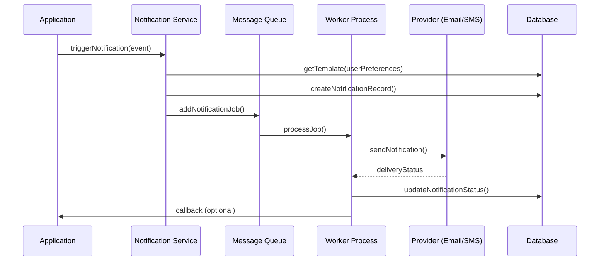

# ระบบงานสำหรับโครงการพัฒนาระบบบริหารคดีและกฎหมายนิติกร Demo 

- ข้อมูลระบบ ขอบเขตความต้องการ  คือ 

  Project Overview  (SRS + System Design + Project Plan)  
    1) ภาพรวมโครงการ  
    - วัตถุประสงค์ เป้าหมาย ตัวชี้วัดความสำเร็จ (เช่น ระบบใช้งานได้ครบ Scope Public + Back-office + Reporting ภายใน 120 วัน  
    - ผู้มีส่วนได้ส่วนเสียหลัก: Demo, นิติกร, เจ้าหน้าที่, ผู้ร้องเรียน, ทีมพัฒนา, ทีม IT โครงสร้างพื้นฐาน  

    1) ขอบเขตงาน (Scope of Work)  
    - ฟังก์ชัน Public Web: ยื่นเรื่อง, แนบเอกสาร, ยืนยันตัวตน (OTP/Email/SMS), ติดตามสถานะเลขคดี, แสดงเอกสารแจ้งผลในรูปแบบ  
      - ระบบบริการประชาชนทางอิเล็กทรอนิกส์ (e-Service) ของหน่วยงานราชการไทย เช่น กรมบังคับคดี ที่ให้ผู้ใช้ยื่นคำร้องออนไลน์, แนบไฟล์เอกสาร, ยืนยันตัวตนผ่าน OTP/Email/SMS เพื่อความปลอดภัย, ติดตามสถานะคดี และสามารถดาวน์โหลดเอกสารแจ้งผลในรูปแบบดิจิทัลได้ ซึ่งช่วยอำนวยความสะดวก รวดเร็ว และลดการเดินทาง ลดขั้นตอนการทำงานของเจ้าหน้าที่. 
      รายละเอียดฟังก์ชัน:
        -  ยื่นเรื่อง (e-Filing): การยื่นคำร้อง คำขอ หรือเอกสารต่างๆ ผ่านเว็บไซต์ โดยไม่ต้องเดินทางไปที่สำนักงาน.
         - แนบเอกสาร: อัปโหลดไฟล์เอกสารที่เกี่ยวข้อง เช่น บัตรประชาชน, หลักฐานประกอบคำร้อง, หนังสือมอบอำนาจ.
         - ยืนยันตัวตน (OTP/Email/SMS): ใช้รหัสผ่านใช้ครั้งเดียว (OTP) ส่งผ่าน SMS หรือ Email เพื่อยืนยันตัวตนผู้ใช้งานก่อนเข้าสู่ระบบและทำธุรกรรม.
         - ติดตามสถานะเลขคดี: ผู้ใช้สามารถตรวจสอบความคืบหน้าของคำร้องหรือคดีผ่านระบบได้.
         - แสดงเอกสารแจ้งผลในรูปแบบ: แสดงผลการพิจารณา คำสั่ง หรือเอกสารที่เกี่ยวข้องในรูปแบบดิจิทัล (เช่น PDF) ให้ดาวน์โหลดได้ทันที. 
        ตัวอย่างหน่วยงานที่ใช้:
         - กรมบังคับคดี : มีระบบ e-Filing สำหรับยื่นคำร้องบังคับคดี.
         - ศูนย์วิทยบริการศาลยุติธรรม : มีการบริหารจัดการคดีทางระบบ e-Filing. 
    - ฟังก์ชัน Back-office: Case Management, User & Role Management, Dashboard งานประจำวัน, Case Timeline, Document/Evidence Management, Search, Reports PDF/Excel  
  <hr>
     - ฟังก์ชัน Back-office  เช่น ระบบจัดการเคส, CRM, ERP) ที่ช่วยให้การทำงานภายในองค์กรราบรื่น โดยประกอบด้วย Case Management (จัดการเคส), User & Role Management (จัดการผู้ใช้และสิทธิ์), Dashboard (แดชบอร์ด), Case Timeline (ไทม์ไลน์เคส), Document/Evidence Management (จัดการเอกสาร/หลักฐาน), Search (ค้นหา), และ Reports PDF/Excel (รายงาน) ซึ่งทั้งหมดนี้ทำงานร่วมกันเพื่อติดตาม, จัดการ, และวิเคราะห์ข้อมูลสำคัญทางธุรกิจได้อย่างมีประสิทธิภาพ. 
        คำอธิบายแต่ละส่วน:
        - Case Management: ระบบหลักสำหรับสร้าง, ติดตาม, และจัดการ 'เคส' (งาน, คำร้อง, ปัญหา) ตั้งแต่ต้นจนจบ โดยกำหนดสถานะ, ผู้รับผิดชอบ, และขั้นตอนต่างๆ.
        - User & Role Management: จัดการบัญชีผู้ใช้ และกำหนดสิทธิ์การเข้าถึงฟังก์ชันหรือข้อมูลต่างๆ (เช่น แอดมิน, เจ้าหน้าที่, ผู้จัดการ) เพื่อความปลอดภัยและความถูกต้อง.
        - Dashboard งานประจำวัน: หน้าจอสรุปภาพรวมของงานที่ต้องทำ (To-Do List), สถานะเคสเร่งด่วน, ตัวชี้วัดสำคัญ (KPIs) เพื่อให้เห็นภาพรวมและตัดสินใจได้รวดเร็ว.
        - Case Timeline: บันทึกประวัติการดำเนินงานของแต่ละเคสเป็นลำดับเวลา (ใครทำอะไร เมื่อไหร่) เพื่อตรวจสอบย้อนหลังได้.
        - Document/Evidence Management: ระบบจัดเก็บ, ค้นหา, และแชร์เอกสาร, รูปภาพ, หรือหลักฐานที่เกี่ยวข้องกับแต่ละเคส.
        - Search (ค้นหา): ฟังก์ชันค้นหาข้อมูลขั้นสูง ทั้งในส่วนเคส, เอกสาร, หรือข้อมูลผู้ใช้.
        - Reports PDF/Excel: สร้างรายงานสรุปผลการดำเนินงานในรูปแบบไฟล์ PDF หรือ Excel เพื่อนำไปวิเคราะห์ต่อหรือนำเสนอ. 
        - 
        เพื่อ ประโยชน์โดยรวม: ระบบเหล่านี้ช่วยเพิ่มประสิทธิภาพ, ลดข้อผิดพลาด, ทำให้การทำงานเป็นระบบและตรวจสอบได้ง่ายขึ้น, และช่วยในการตัดสินใจทางธุรกิจได้ดีขึ้น (เช่น จากข้อมูลใน Dashboard และ Reports). 

<hr>
    - ฟังก์ชัน ระบบจัดเก็บ File เอกสาร เช่น pdf word excel upload file permision Role access file inser update delete loging histoty
      ฟังก์ชันสำคัญของระบบจัดเก็บไฟล์:
         - การจัดการไฟล์ (File Management)
         - อัปโหลด/ดาวน์โหลด: รองรับไฟล์หลากหลายรูปแบบ (PDF, DOCX, XLSX, etc.).
        -  การจัดระเบียบ: สร้างโครงสร้างโฟลเดอร์, แท็ก, หมวดหมู่ เพื่อจัดเก็บอย่างเป็นระบบ.
         - ค้นหา: ค้นหาด้วยชื่อไฟล์, เนื้อหา, วันที่, ผู้สร้าง, หรือ Keyword.
         - การจัดการสิทธิ์ (Permission/Access Control)
         - Role-Based Access: กำหนดสิทธิ์ตามบทบาทผู้ใช้ (เช่น Admin, Editor, Viewer).
         - กำหนดสิทธิ์ไฟล์/โฟลเดอร์: ควบคุมการดู, แก้ไข, ลบ, ดาวน์โหลด สำหรับแต่ละบุคคล/กลุ่ม.
         - การควบคุมการเปลี่ยนแปลง (Version Control & Audit Trail)
         - Insert/Update/Delete: บันทึกการกระทำทุกอย่าง (ใครทำอะไร เมื่อไหร่) เพื่อการตรวจสอบ.
         - History/Logging: แสดงประวัติการเข้าถึงและการเปลี่ยนแปลงไฟล์ (Version History).
         - ความปลอดภัยและการสำรองข้อมูล (Security & Backup)
         - Encryption: เข้ารหัสข้อมูลเพื่อป้องกันการเข้าถึงโดยไม่ได้รับอนุญาต.
        -  Backup & Recovery: สำรองข้อมูลเป็นประจำและกู้คืนได้เมื่อเกิดปัญหา.
         - การทำงานร่วมกัน (Collaboration)
         - Check-in/Check-out: ป้องกันการแก้ไขพร้อมกัน.
         - การแจ้งเตือน (Notifications): แจ้งเตือนเมื่อมีการเปลี่ยนแปลงเอกสารสำคัญ.
         - ระบบเวิร์กโฟลว์ (Workflow)
         - สร้างกระบวนการอนุมัติเอกสารอัตโนมัติ (เช่น เสนอ-อนุมัติ). 
         เพื่อ ประโยชน์: ช่วยลดความผิดพลาด เพิ่มประสิทธิภาพการทำงาน และรักษาความปลอดภัยของข้อมูลองค์กร. 
        <hr>
    1) สถาปัตยกรรมระบบ (System Architecture)  
    - Backend: NestJS + TypeScript, ORM (TypeORM/Prisma) + PostgreSQL, Redis สำหรับ Caching, n8n สำหรับ Automation/Integration, Robot Framework สำหรับ API Test, Docker Compose + Jenkins สำหรับ CI/CD และ Gitflow สำหรับการพัฒนาเวอร์ชัน  
    - Frontend: Next.js + React + TypeScript, JWT Authentication, React Hook Form + Zod สำหรับ Form Validation, Robot Framework สำหรับ E2E Test, Docker Compose สำหรับ Dev/Stage  
  
    
    1) การออกแบบข้อมูล (Data Model & Database)  
    - โครงสร้างฐานข้อมูลหลัก เช่น ตาราง Case, Person, Timeline, Document, User, Role, Permission, AuditLog ออกแบบบน PostgreSQL ตามแนวทาง TOR ที่ระบุ Database Schema เป็นหนึ่งใน Deliverables[1]
    - หลักการออกแบบเพื่อรองรับการค้นหาและรายงาน เช่น Index, Partition (ถ้าจำเป็น), การเก็บประวัติ (History/Audit)  

    1) ความมั่นคงปลอดภัยและ PDPA  
    - การเข้ารหัสข้อมูลที่สำคัญ การใช้ HTTPS/SSL, Audit Log, Input Validation และมาตรการป้องกัน Threat ทั่วไป ตามข้อกำหนด Security/PDPA ใน TOR[1]

    1) แผนการพัฒนา ทดสอบ และส่งมอบ  
    - ระบุ Milestone: วิเคราะห์/ออกแบบ, พัฒนา, ทดสอบระบบ+UAT, Go-live, Maintenance พร้อม Deliverables ตาม TOR เช่น System Requirements Spec, High-level Architecture, Test Plan, Test Report และ UAT Report[1]
        
เพื่อให้ คุณ ทำตามขั้นตอนดังนี้

    1.สร้างบทนำ
    2.สร้างบทนิยาม
    3.สร้างบทหัวข้อ
    5.ออกแบบคู่มือ
    6.ออกแบบ workflow
    7.TASK LIST Template
    8.CHECKLIST Template
    9.ระบบจำนวนคนที่ใช้ในการทำงาน  ภายใน  120 วัน
    10.งบประมาณที่ใช้  และ จำนวนคนที่ใช้ในการทำงาน 
    10.1 Technical Lead + Project Manager + DevOps Engineer  จัดการ Infrastructure อออกแบบ CI/CD Gitflow Test code แบบต่าง ๆ  
      10.1.1 สร้างเอกสาร SRS  + User Document
      10.1.2.สร้าง Template code
      10.1.3.ออกแบบ Data flow
      10.1.4.ออกแบบ Work flow
      10.1.5.ออกแบบ Template รายงาน
      10.1.6.ออกแบบระบบ DevOps Engineer  จัดการ Infrastructure 
        - Docker
        - Jenkins 
        - Ubuntu OS
        - Configuring CI/CD in GitHub 
        - Deploy  ระบบ API Backend (NestJS) TypeScript
        - Deploy  ระบบ  Frontend (Next.js + React + TypeScript)

    10.2 Backend Developer  พัฒนา Module ต่าง ๆ  + Database Engineer   ออกแบบและ Optimize Database    ระบบ API Backend (NestJS) TypeScript
     10.2.1 สร้าง Database + สร้างเอกสาร Database  
     10.2.2 สร้าง ออกแบบและ Optimize Database +  สร้างเอกสาร Database  
     10.2.1 สร้าง Backend API Function business logic  functions 

    10.3 Fontend Developer  พัฒนา Module ต่าง ๆ  + ออกแบบ  UX UI  HTML CSS   ระบบ  Frontend (Next.js + React + TypeScript)
     10.2.1 สร้าง ระบบ Fontend 

  
  ออกแบบระบบ  Backend (NestJS) TypeScript
    - JWT Authentication
    - File management
    - Loging management
    - Class Validator + Class Transformer
    - TypeORM / Prisma (ORM)
    - PostgreSQL (Database)
    - Redis (Caching)
    - Jest Test code
    - n8n (Automation)
    - Gitflow (Version Control)
    - Robot Framework (API Testing)
    - Docker Compose (Containerization)
    - Jenkins (CI/CD)
    จัดทำ 
    1.Diagram แผนภาพโครงสร้างระบบ
    2.Template โครงสร้างระบบ Backend
    3.ตัวอย่างโค้ดเต็มรูปแบบ - Backend
    4.Dataflow & Workflow
    5.Infrastructure
    6.Testing
    7.Gitflow
    8.CI/CD


  ออกแบบระบบ  Frontend (Next.js + React + TypeScript)
    -JWT Authentication
    -Form Validation (React Hook Form + Zod)
    -Tailwind CSS with Next.js
    -HTML To Tailwind CSS with Next.js  
    -UX Diagram
    -UI Diagram
    จัดทำ 
    1.Diagram แผนภาพโครงสร้างระบบ
    2.Template โครงสร้างระบบ Backend
    3.ตัวอย่างโค้ดเต็มรูปแบบ - Backend
    4.Dataflow & Workflow
    5.Infrastructure
    6.Testing
    7.Gitflow
    8.CI/CD


# ** Resalte **


# **เอกสารออกแบบและวางแผนงานพัฒนาระบบบริหารคดีและกฎหมายนิติกร**
## **Demo**

---

## **บทนำ (Introduction)**

ระบบบริหารคดีและกฎหมายนิติกร เป็นระบบสารสนเทศที่ออกแบบมาเพื่อรองรับการรับเรื่องร้องเรียน การบริหารจัดการคดี และการประมวลผลข้อมูลทางกฎหมายของDemo โดยมีเป้าหมายหลักเพื่อเพิ่มประสิทธิภาพการทำงาน โปร่งใส และรองรับมาตรฐานความปลอดภัยตามกฎหมาย PDPA  
ระบบนี้ประกอบด้วย 2 ส่วนหลัก คือ **ระบบรับเรื่องร้องเรียนสำหรับประชาชน (Public Web)** และ **ระบบบริหารจัดการคดีสำหรับเจ้าหน้าที่ (Back-office)** โดยใช้เทคโนโลยีสมัยใหม่ เช่น **NestJS (Backend)**, **Next.js (Frontend)**, และ **PostgreSQL (Database)** พร้อมกระบวนการพัฒนาแบบ Agile และ SDLC เพื่อให้ระบบพร้อมใช้งานภายใน **120 วัน**

---

## **บทนิยาม (Glossary)**

| คำศัพท์ | ความหมาย |
|---------|----------|
| **TOR** | ข้อกำหนดขอบเขตงาน (Terms of Reference) |
| **PDPA** | พ.ร.บ. คุ้มครองข้อมูลส่วนบุคคล |
| **UAT** | การทดสอบการยอมรับของผู้ใช้ (User Acceptance Test) |
| **CI/CD** | Continuous Integration / Continuous Deployment |
| **ORM** | Object-Relational Mapping (เช่น TypeORM, Prisma) |
| **JWT** | JSON Web Token สำหรับ Authentication |
| **OTP** | One-Time Password สำหรับยืนยันตัวตน |
| **RBAC** | Role-Based Access Control |
| **API** | Application Programming Interface |
| **DevOps** | การพัฒนาร่วมกับการดำเนินการระบบ |

---

## **บทหัวข้อ (Outline)**

### **1. ภาพรวมโครงการ (Project Overview)**
### **2. ขอบเขตงาน (Scope of Work)**
### **3. สถาปัตยกรรมระบบ (System Architecture)**
### **4. การออกแบบข้อมูล (Data Model & Database)**
### **5. ความมั่นคงปลอดภัยและ PDPA**
### **6. แผนการพัฒนา ทดสอบ และส่งมอบ**
### **7. คู่มือการใช้งาน (User Manual)**
### **8. Workflow Diagram**
### **9. TASK LIST Template**
### **10. CHECKLIST Template**
### **11. ทีมพัฒนาและโครงสร้างทีม**
### **12. งบประมาณและทรัพยากร**
### **13. แผนภาพโครงสร้างระบบ (Backend & Frontend)**
### **14. Template โครงสร้างระบบ**
### **15. ตัวอย่างโค้ดเต็มรูปแบบ**
### **16. Dataflow & Workflow**
### **17. Infrastructure & DevOps**
### **18. Testing Strategy**
### **19. Gitflow & CI/CD Pipeline**

---

## **1. ภาพรวมโครงการ**

- **วัตถุประสงค์**: พัฒนาระบบบริหารคดีและกฎหมายนิติกรให้ครบถ้วนตาม TOR ภายใน 120 วัน
- **ตัวชี้วัดความสำเร็จ**:
  - ระบบ Public Web และ Back-office ทำงานได้ครบ Scope
  - ผ่านการทดสอบ UAT
  - ส่งมอบซอร์สโค้ดและเอกสารครบถ้วน
- **ผู้มีส่วนได้ส่วนเสีย**:
  - Demo (ผู้ว่าจ้าง)
  - นิติกรและเจ้าหน้าที่ (ผู้ใช้ระบบ)
  - ผู้ร้องเรียน (ประชาชน)
  - ทีมพัฒนา (Tech Lead, Developer, DevOps)
  - ทีม IT โครงสร้างพื้นฐาน

---

## **2. ขอบเขตงาน (Scope of Work)**

### **2.1 Public Web Application**
- ยื่นเรื่องร้องเรียนออนไลน์ (e-Filing)
- แนบเอกสาร (PDF, Image, Video)
- ยืนยันตัวตนด้วย OTP (Email/SMS)
- ติดตามสถานะคดีด้วยเลขอ้างอิง
- แสดงผลเอกสารแจ้งผล (PDF)

### **2.2 Back-office Case Management**
- จัดการผู้ใช้และสิทธิ์ (RBAC)
- Dashboard งานประจำวัน
- Timeline คดี
- จัดการเอกสารและหลักฐาน
- ค้นหาและรายงาน (PDF/Excel)

### **2.3 ระบบจัดเก็บไฟล์**
- อัปโหลด/ดาวน์โหลดไฟล์
- กำหนดสิทธิ์ตามบทบาท
- Audit Log (ประวัติการเข้าถึง)
- Version Control

---

## **3. สถาปัตยกรรมระบบ**

### **Backend Stack**
- **Framework**: NestJS + TypeScript
- **ORM**: TypeORM / Prisma
- **Database**: PostgreSQL
- **Cache**: Redis
- **Authentication**: JWT
- **Automation**: n8n
- **Testing**: Jest, Robot Framework
- **Container**: Docker Compose
- **CI/CD**: Jenkins, Gitflow

### **Frontend Stack**
- **Framework**: Next.js + React + TypeScript
- **Styling**: Tailwind CSS
- **Form Validation**: React Hook Form + Zod
- **Testing**: Robot Framework (E2E)

---

## **4. การออกแบบข้อมูล (Data Model)**

### **ตารางหลัก**
- `User` (ผู้ใช้)
- `Role` (บทบาท)
- `Case` (คดี)
- `Person` (บุคคล)
- `Document` (เอกสาร)
- `Timeline` (ประวัติคดี)
- `AuditLog` (บันทึกการใช้งาน)

### **ออกแบบเพื่อรองรับ**
- Indexing สำหรับการค้นหา
- Partitioning สำหรับข้อมูลขนาดใหญ่
- Audit Trail สำหรับการติดตาม

---

## **5. ความมั่นคงปลอดภัยและ PDPA**

- **HTTPS/SSL** (Let’s Encrypt)
- **Input Validation & Sanitization**
- **Audit Logging**
- **RBAC** (Role-Based Access Control)
- **Data Encryption** (at rest & in transit)
- **PDPA Compliance** (Consent, Data Minimization, Right to Access)

---

## **6. แผนการพัฒนา ทดสอบ และส่งมอบ**

| Phase | ระยะเวลา | Deliverables |
|-------|----------|--------------|
| **Analysis & Design** | 30 วัน | SRS, High-level Architecture, UI/UX Design |
| **Development** | 60 วัน | Backend API, Frontend, Database |
| **Testing** | 20 วัน | Unit Test, Integration Test, UAT |
| **Go-live & Handover** | 10 วัน | Deployment, Training, Documentation |

---

## **7. คู่มือการใช้งาน (User Manual)**

### **สำหรับประชาชน**
- การยื่นเรื่องร้องเรียน
- การติดตามสถานะ
- การดาวน์โหลดเอกสาร

### **สำหรับเจ้าหน้าที่**
- การจัดการคดี
- การค้นหาและรายงาน
- การจัดการเอกสาร

---

## **8. Workflow Diagram**

```
ผู้ร้องเรียน → ยื่นเรื่อง → OTP ยืนยัน → บันทึกข้อมูล → แนบเอกสาร → ส่งเรื่อง
↓
เจ้าหน้าทีรับเรื่อง → ตรวจสอบ → กำหนดเลขคดี → ดำเนินการ → อัปเดตสถานะ → ปิดคดี
```

---

## **9. TASK LIST Template**

| Task ID | ชื่องาน | ผู้รับผิดชอบ | วันที่เริ่ม | วันที่สิ้นสุด | สถานะ |
|---------|--------|-------------|-----------|-------------|--------|
| T001 | วิเคราะห์ความต้องการ | Tech Lead | Day 1 | Day 10 | Done |
| T002 | ออกแบบ Database | Backend Dev | Day 11 | Day 20 | In Progress |
| T003 | พัฒนา API Case Management | Backend Dev | Day 21 | Day 50 | Pending |

---

## **10. CHECKLIST Template**

### **ก่อนส่งมอบ**
- [ ] ทดสอบ Unit Test ผ่าน 100%
- [ ] ทดสอบ Integration Test ผ่าน
- [ ] UAT ผ่านโดยผู้ใช้จริง
- [ ] ตรวจสอบ Security Scan
- [ ] เอกสารครบถ้วน

---

## **11. ทีมพัฒนาและโครงสร้างทีม (ภายใน 120 วัน)**

| ตำแหน่ง | จำนวน | ระยะเวลา | บทบาท |
|---------|--------|----------|--------|
| **Tech Lead + Project Manager** | 1 | 120 วัน | ออกแบบระบบ จัดการโครงการ |
| **DevOps Engineer** | 1 | 90 วัน | Infrastructure, CI/CD, Deployment |
| **Backend Developer** | 2 | 100 วัน | พัฒนา API, Database |
| **Frontend Developer** | 2 | 100 วัน | พัฒนา UI/UX, Frontend Logic |
| **QA / Tester** | 1 | 60 วัน | ทดสอบระบบ, UAT Support |

**รวม: 7 คน**

---

## **12. งบประมาณและทรัพยากร**

| รายการ | จำนวน | ระยะเวลา | ค่าจ้าง/เดือน (บาท) | รวม (บาท) |
|--------|--------|----------|---------------------|-----------|
| Tech Lead + PM | 1 | 120 วัน | 120,000 | 480,000 |
| DevOps Engineer | 1 | 90 วัน | 100,000 | 300,000 |
| Backend Developer | 2 | 100 วัน | 80,000 | 1,600,000 |
| Frontend Developer | 2 | 100 วัน | 80,000 | 1,600,000 |
| QA/Tester | 1 | 60 วัน | 60,000 | 120,000 |
| **รวมค่าจ้างทีม** | | | | **4,100,000** |
| Infrastructure (Cloud, Tools) | | 120 วัน | | 500,000 |
| **รวมงบประมาณทั้งหมด** | | | | **4,600,000** |

---

## **13. แผนภาพโครงสร้างระบบ (Backend)**

```
Client → API Gateway → NestJS App → TypeORM → PostgreSQL
                              ↓
                            Redis (Cache)
                              ↓
                            n8n (Automation)
                              ↓
                            Jenkins (CI/CD)
```

---

## **14. Template โครงสร้างระบบ Backend**

```
src/
├── modules/
│   ├── auth/
│   ├── case/
│   ├── document/
│   └── user/
├── config/
├── middleware/
├── utils/
├── test/
└── main.ts
```

---

## **15. ตัวอย่างโค้ดเต็มรูปแบบ - Backend (NestJS)**

```typescript
// case.controller.ts
import { Controller, Get, Post, Body, UseGuards } from '@nestjs/common';
import { CaseService } from './case.service';
import { JwtAuthGuard } from '../auth/jwt-auth.guard';

@Controller('cases')
@UseGuards(JwtAuthGuard)
export class CaseController {
  constructor(private readonly caseService: CaseService) {}

  @Post()
  create(@Body() createCaseDto: CreateCaseDto) {
    return this.caseService.create(createCaseDto);
  }

  @Get()
  findAll() {
    return this.caseService.findAll();
  }
}
```

---

## **16. Dataflow & Workflow**

### **Dataflow**
```
Frontend → API Call → Backend → Database → Response → Frontend
```

### **Workflow (Case Management)**
```
Create Case → Assign Officer → Update Status → Upload Document → Close Case
```

---

## **17. Infrastructure & DevOps**

### **เครื่องมือ**
- Docker Compose
- Jenkins
- Ubuntu Server
- GitHub Actions
- Nginx
- Let’s Encrypt

### **CI/CD Pipeline**
```
Git Push → GitHub → Jenkins Build → Docker Build → Deploy to Staging → UAT → Production
```

---

## **18. Testing Strategy**

- **Unit Test**: Jest (Backend), React Testing Library (Frontend)
- **Integration Test**: Robot Framework (API Testing)
- **E2E Test**: Robot Framework (Frontend + Backend)
- **Security Test**: OWASP ZAP, Dependency Scanning

---

## **19. Gitflow & CI/CD Pipeline**

### **Gitflow Branching**
```
main (production)
↓
develop
↓
feature/xxx
hotfix/xxx
release/xxx
```

### **CI/CD Steps**
1. Code Commit → Lint & Format
2. Unit Test → Build Docker Image
3. Deploy to Staging → Run Integration Test
4. Approve → Deploy to Production

---

## **สรุป**

ระบบบริหารคดีและกฎหมายนิติกรนี้ถูกออกแบบมาเพื่อตอบโจทย์ความต้องการของDemoอย่างครบถ้วน โดยใช้เทคโนโลยีที่ทันสมัย กระบวนการพัฒนาที่เป็นระบบ และทีมงานที่มีความเชี่ยวชาญ เพื่อให้ระบบพร้อมใช้งานภายใน **120 วัน** ตามข้อกำหนดใน TOR พร้อมรับประกันคุณภาพและการบำรุงรักษาต่อเนื่อง 1 ปี


# ส่วนการออกแบบระบบ 

# **การออกแบบฟังก์ชัน Public Web: e-Service สำหรับประชาชน**
## **ระบบยื่นคำร้องออนไลน์ Demo**

---

## **1. บทนำระบบ Public Web**

ระบบ Public Web เป็นช่องทางหลักที่ประชาชนสามารถเข้าถึงบริการของDemoได้ผ่านอินเทอร์เน็ต โดยไม่ต้องเดินทางมายังสำนักงาน ระบบนี้รองรับการยื่นคำร้อง การแนบเอกสาร การยืนยันตัวตนแบบปลอดภัย การติดตามสถานะ และการรับเอกสารผลการพิจารณาในรูปแบบดิจิทัล

---

## **2. วัตถุประสงค์ของระบบ**

1. **เพิ่มความสะดวก** ให้ประชาชนยื่นคำร้องได้ตลอด 24 ชั่วโมง
2. **ลดขั้นตอนเอกสาร** ด้วยระบบดิจิทัล
3. **ยืนยันตัวตนปลอดภัย** ด้วย OTP หลายช่องทาง
4. **โปร่งใสในการติดตาม** สถานะคดีแบบเรียลไทม์
5. **ลดเวลาและค่าใช้จ่าย** การเดินทางของประชาชน
6. **เพิ่มประสิทธิภาพ** การทำงานของเจ้าหน้าที่
7. **เป็นไปตามมาตรฐาน** ระบบราชการดิจิทัล

---

## **3. ภาพรวมฟังก์ชัน (Feature Overview)**

### **3.1 User Journey ของประชาชน**
```
┌─────────────────────────────────────────────────────────────┐
│                        ผู้ใช้ประชาชน                           │
└───────────────────────────┬─────────────────────────────────┘
                            │
                 ┌──────────▼──────────┐
                 │   เข้าสู่เว็บไซต์        │
                 │  (ไม่ต้องล็อกอิน)      │
                 └──────────┬──────────┘
                            │
                 ┌──────────▼──────────┐
                 │  เลือกประเภทคำร้อง    │
                 │   และอ่านคำแนะนำ     │
                 └──────────┬──────────┘
                            │
                 ┌──────────▼──────────┐
                 │   กรอกแบบฟอร์มออนไลน์ │
                 │  (แบบฟอร์มอัจฉริยะ)  │
                 └──────────┬──────────┘
                            │
                 ┌──────────▼──────────┐
                 │  แนบเอกสารประกอบ   │
                 │  (อัปโหลดไฟล์)     │
                 └──────────┬──────────┘
                            │
                 ┌──────────▼──────────┐
                 │  ยืนยันตัวตนด้วย OTP │
                 │  (Email/SMS)       │
                 └──────────┬──────────┘
                            │
                 ┌──────────▼──────────┐
                 │  ได้รับเลขที่คำร้อง  │
                 │   และ QR Code      │
                 └──────────┬──────────┘
                            │
                 ┌──────────▼──────────┐
                 │  ติดตามสถานะคดี    │
                 │  (ด้วยเลขที่คำร้อง)  │
                 └──────────┬──────────┘
                            │
                 ┌──────────▼──────────┐
                 │  รับเอกสารผลการ     │
                 │  พิจารณาดิจิทัล     │
                 └─────────────────────┘
```

### **3.2 System Architecture**
```
┌─────────────────────────────────────────────────────────────┐
│                    Public Web Portal                         │
│                    (Next.js Frontend)                        │
└───────────────────────────┬─────────────────────────────────┘
                            │ HTTPS/SSL
┌───────────────────────────▼─────────────────────────────────┐
│                    API Gateway                              │
│                    (NestJS Backend)                         │
└──────────────┬─────────────────────────────┬───────────────┘
               │                             │
    ┌──────────▼──────────┐       ┌─────────▼──────────┐
    │   Application Layer  │       │  External Services │
    │   - Case Service     │       │  - SMS Gateway     │
    │   - Document Service │       │  - Email Service   │
    │   - OTP Service      │       │  - Payment Gateway │
    └──────────┬──────────┘       └────────────────────┘
               │
    ┌──────────▼──────────┐
    │   Data Layer        │
    │   - PostgreSQL      │
    │   - Redis (Cache)   │
    │   - MinIO (Files)   │
    └─────────────────────┘
```

---

## **4. Database Schema สำหรับ Public Web**

### **4.1 ตารางหลัก**
```sql
-- ตาราง Public Users (ไม่ต้องสมัครสมาชิก)
CREATE TABLE public_users (
    id UUID PRIMARY KEY DEFAULT gen_random_uuid(),
    email VARCHAR(255) UNIQUE,
    phone_number VARCHAR(20) UNIQUE,
    full_name VARCHAR(255) NOT NULL,
    id_card_number VARCHAR(20), -- สำหรับตรวจสอบ
    hash_id VARCHAR(100) UNIQUE NOT NULL, -- สำหรับอ้างอิงโดยไม่เปิดเผยข้อมูลจริง
    
    -- Verification status
    is_email_verified BOOLEAN DEFAULT FALSE,
    is_phone_verified BOOLEAN DEFAULT FALSE,
    verified_at TIMESTAMP,
    
    -- Preferences
    preferred_notification_channel VARCHAR(10) DEFAULT 'EMAIL' CHECK (preference IN ('EMAIL', 'SMS', 'BOTH')),
    language_preference VARCHAR(10) DEFAULT 'th',
    
    -- Security
    otp_secret VARCHAR(100),
    failed_attempts INTEGER DEFAULT 0,
    locked_until TIMESTAMP,
    
    -- Metadata
    created_at TIMESTAMP DEFAULT CURRENT_TIMESTAMP,
    updated_at TIMESTAMP DEFAULT CURRENT_TIMESTAMP,
    last_login_at TIMESTAMP,
    
    -- Indexes
    INDEX idx_hash_id (hash_id),
    INDEX idx_email (email),
    INDEX idx_phone (phone_number)
);

-- ตาราง Complaints/Cases จากประชาชน
CREATE TABLE public_complaints (
    id UUID PRIMARY KEY DEFAULT gen_random_uuid(),
    complaint_number VARCHAR(50) UNIQUE NOT NULL, -- รูปแบบ: PH-YYYY-NNNNNN
    tracking_code VARCHAR(100) UNIQUE NOT NULL, -- สำหรับประชาชนติดตาม
    qr_code_data TEXT, -- QR Code data for tracking
    
    -- ผู้ร้องเรียน
    complainant_id UUID REFERENCES public_users(id),
    complainant_type VARCHAR(20) DEFAULT 'INDIVIDUAL' CHECK (complainant_type IN ('INDIVIDUAL', 'ORGANIZATION', 'ANONYMOUS')),
    
    -- ข้อมูลผู้ร้อง (กรณีไม่ต้องการสมัครสมาชิก)
    temp_complainant_data JSONB, -- {fullName, email, phone, address}
    
    -- ข้อมูลผู้ถูกร้อง
    respondent_type VARCHAR(50) CHECK (respondent_type IN ('PHARMACIST', 'PHARMACY', 'COMPANY', 'OTHER')),
    respondent_name VARCHAR(500),
    respondent_license_number VARCHAR(100), -- เลขใบอนุญาตเภสัชกร/ร้านขายยา
    respondent_address TEXT,
    
    -- รายละเอียดคำร้อง
    complaint_type VARCHAR(100) NOT NULL, -- ประเภทการร้องเรียน
    complaint_category VARCHAR(100), -- หมวดหมู่
    title VARCHAR(500) NOT NULL,
    description TEXT NOT NULL,
    incident_date DATE,
    incident_time TIME,
    incident_location TEXT,
    incident_province VARCHAR(100),
    incident_district VARCHAR(100),
    
    -- ข้อมูลเพิ่มเติม
    expected_resolution TEXT, -- ผลที่คาดหวัง
    has_previous_complaint BOOLEAN DEFAULT FALSE,
    previous_complaint_details TEXT,
    
    -- สถานะ
    status VARCHAR(50) DEFAULT 'PENDING' CHECK (status IN (
        'DRAFT', 'PENDING', 'UNDER_REVIEW', 'REQUEST_MORE_INFO', 
        'INVESTIGATION', 'HEARING', 'DECISION', 'CLOSED', 'REJECTED'
    )),
    status_th VARCHAR(100), -- สถานะภาษาไทย
    
    -- การจัดการ
    assigned_to UUID REFERENCES users(id), -- เจ้าหน้าที่ผู้รับผิดชอบ
    priority VARCHAR(20) DEFAULT 'NORMAL' CHECK (priority IN ('LOW', 'NORMAL', 'HIGH', 'URGENT')),
    
    -- กำหนดเวลา
    sla_deadline TIMESTAMP, -- กำหนดเวลาตอบสนองตาม SLA
    response_deadline TIMESTAMP, -- กำหนดเวลาตอบกลับครั้งแรก
    resolution_deadline TIMESTAMP, -- กำหนดเวลาดำเนินการเสร็จ
    
    -- การติดตาม
    submitted_at TIMESTAMP,
    first_response_at TIMESTAMP,
    resolved_at TIMESTAMP,
    closed_at TIMESTAMP,
    
    -- Metadata
    created_at TIMESTAMP DEFAULT CURRENT_TIMESTAMP,
    updated_at TIMESTAMP DEFAULT CURRENT_TIMESTAMP,
    deleted_at TIMESTAMP,
    
    -- Indexes
    INDEX idx_complaint_number (complaint_number),
    INDEX idx_tracking_code (tracking_code),
    INDEX idx_status (status),
    INDEX idx_complainant_id (complainant_id),
    INDEX idx_submitted_at (submitted_at)
);

-- ตาราง Complaint Documents
CREATE TABLE complaint_documents (
    id UUID PRIMARY KEY DEFAULT gen_random_uuid(),
    complaint_id UUID REFERENCES public_complaints(id) ON DELETE CASCADE,
    document_type VARCHAR(100) NOT NULL, -- เช่น บัตรประชาชน, หลักฐาน, หนังสือมอบอำนาจ
    file_name VARCHAR(500),
    original_name VARCHAR(500),
    file_path VARCHAR(1000),
    file_size BIGINT,
    file_type VARCHAR(100),
    is_verified BOOLEAN DEFAULT FALSE,
    verified_by UUID REFERENCES users(id),
    verified_at TIMESTAMP,
    uploaded_at TIMESTAMP DEFAULT CURRENT_TIMESTAMP,
    
    INDEX idx_complaint_id (complaint_id),
    INDEX idx_document_type (document_type)
);

-- ตาราง OTP Verifications
CREATE TABLE otp_verifications (
    id UUID PRIMARY KEY DEFAULT gen_random_uuid(),
    reference_id UUID NOT NULL, -- complaint_id หรือ user_id
    reference_type VARCHAR(50) CHECK (reference_type IN ('COMPLAINT_SUBMISSION', 'EMAIL_VERIFICATION', 'PHONE_VERIFICATION')),
    otp_code VARCHAR(10) NOT NULL,
    channel VARCHAR(20) NOT NULL CHECK (channel IN ('EMAIL', 'SMS')),
    recipient VARCHAR(255) NOT NULL, -- email หรือ phone number
    purpose VARCHAR(100) NOT NULL,
    
    -- Status
    is_used BOOLEAN DEFAULT FALSE,
    is_expired BOOLEAN DEFAULT FALSE,
    verified_at TIMESTAMP,
    
    -- Security
    attempts INTEGER DEFAULT 0,
    max_attempts INTEGER DEFAULT 3,
    
    -- Expiry
    created_at TIMESTAMP DEFAULT CURRENT_TIMESTAMP,
    expires_at TIMESTAMP NOT NULL,
    
    INDEX idx_reference (reference_id, reference_type),
    INDEX idx_otp_code (otp_code),
    INDEX idx_expires_at (expires_at)
);

-- ตาราง Complaint Status History
CREATE TABLE complaint_status_history (
    id UUID PRIMARY KEY DEFAULT gen_random_uuid(),
    complaint_id UUID REFERENCES public_complaints(id) ON DELETE CASCADE,
    from_status VARCHAR(50),
    to_status VARCHAR(50) NOT NULL,
    changed_by UUID, -- อาจเป็น system หรือ user_id
    change_reason TEXT,
    notes TEXT,
    created_at TIMESTAMP DEFAULT CURRENT_TIMESTAMP,
    
    INDEX idx_complaint_id (complaint_id),
    INDEX idx_created_at (created_at)
);

-- ตาราง Complaint Communications (สำหรับประชาชน)
CREATE TABLE complaint_communications (
    id UUID PRIMARY KEY DEFAULT gen_random_uuid(),
    complaint_id UUID REFERENCES public_complaints(id) ON DELETE CASCADE,
    direction VARCHAR(10) CHECK (direction IN ('INBOUND', 'OUTBOUND')),
    communication_type VARCHAR(50) CHECK (communication_type IN ('EMAIL', 'SMS', 'LETTER', 'CALL', 'SYSTEM')),
    subject VARCHAR(500),
    message TEXT NOT NULL,
    attachments JSONB, -- [{fileName, fileUrl}]
    
    -- สำหรับ outbound
    sent_to VARCHAR(500), -- email หรือ phone
    sent_at TIMESTAMP,
    delivery_status VARCHAR(50),
    
    -- สำหรับ inbound
    received_from VARCHAR(500),
    received_at TIMESTAMP,
    
    created_at TIMESTAMP DEFAULT CURRENT_TIMESTAMP,
    
    INDEX idx_complaint_id (complaint_id),
    INDEX idx_direction (direction),
    INDEX idx_created_at (created_at)
);

-- ตาราง Public Access Tokens (สำหรับติดตามสถานะ)
CREATE TABLE public_access_tokens (
    id UUID PRIMARY KEY DEFAULT gen_random_uuid(),
    complaint_id UUID REFERENCES public_complaints(id) ON DELETE CASCADE,
    token VARCHAR(500) UNIQUE NOT NULL,
    access_type VARCHAR(50) DEFAULT 'TRACKING' CHECK (access_type IN ('TRACKING', 'DOCUMENT_DOWNLOAD')),
    expires_at TIMESTAMP NOT NULL,
    is_used BOOLEAN DEFAULT FALSE,
    used_at TIMESTAMP,
    created_at TIMESTAMP DEFAULT CURRENT_TIMESTAMP,
    
    INDEX idx_token (token),
    INDEX idx_complaint_id (complaint_id),
    INDEX idx_expires_at (expires_at)
);
```

---

## **5. ฟังก์ชันการทำงานหลัก**

### **5.1 Complaint Submission Service**
```typescript
// complaint-submission.service.ts
@Injectable()
export class ComplaintSubmissionService {
  constructor(
    private readonly complaintRepository: ComplaintRepository,
    private readonly otpService: OtpService,
    private readonly documentService: DocumentService,
    private readonly notificationService: NotificationService,
    private readonly caseService: CaseService,
    private readonly logger: LoggerService
  ) {}

  async submitComplaint(
    complaintData: ComplaintSubmissionDto,
    files: Express.Multer.File[],
    ipAddress: string,
    userAgent: string
  ): Promise<ComplaintSubmissionResult> {
    try {
      // 1. ตรวจสอบข้อมูลพื้นฐาน
      this.validateComplaintData(complaintData);
      
      // 2. สร้างข้อมูลผู้ร้อง (กรณีไม่สมัครสมาชิก)
      let complainant: PublicUser;
      if (complaintData.complainantType === 'ANONYMOUS') {
        complainant = await this.createAnonymousComplainant(complaintData);
      } else {
        complainant = await this.findOrCreateComplainant(complaintData);
      }
      
      // 3. สร้าง Complaint Record (สถานะ DRAFT)
      const complaint = await this.complaintRepository.create({
        ...complaintData,
        complainantId: complainant.id,
        status: 'DRAFT',
        trackingCode: this.generateTrackingCode()
      });
      
      // 4. อัปโหลดเอกสารประกอบ
      if (files && files.length > 0) {
        await this.uploadComplaintDocuments(complaint.id, files, complaintData.documentTypes);
      }
      
      // 5. ส่ง OTP เพื่อยืนยันตัวตน
      const otpResult = await this.otpService.sendVerificationOTP({
        referenceId: complaint.id,
        referenceType: 'COMPLAINT_SUBMISSION',
        recipient: complaintData.verificationEmail || complaintData.verificationPhone,
        channel: complaintData.verificationChannel,
        purpose: 'complaint_submission'
      });
      
      // 6. ส่ง email/SMS ยืนยันการรับเรื่องเบื้องต้น
      await this.notificationService.sendComplaintAcknowledgement(
        complaint,
        complainant,
        otpResult.otpId
      );
      
      return {
        success: true,
        complaintId: complaint.id,
        trackingCode: complaint.trackingCode,
        otpRequired: true,
        otpReferenceId: otpResult.otpId,
        message: 'กรุณายืนยันตัวตนด้วย OTP ที่ส่งให้คุณ'
      };
      
    } catch (error) {
      this.logger.error('Complaint submission failed', error);
      throw error;
    }
  }

  async verifyAndSubmitComplaint(
    complaintId: string,
    otpCode: string,
    ipAddress: string
  ): Promise<ComplaintVerificationResult> {
    // 1. ตรวจสอบ OTP
    const isValid = await this.otpService.verifyOTP(
      complaintId,
      'COMPLAINT_SUBMISSION',
      otpCode
    );
    
    if (!isValid) {
      throw new BadRequestException('OTP ไม่ถูกต้องหรือหมดอายุ');
    }
    
    // 2. อัปเดตสถานะเป็น PENDING
    const complaint = await this.complaintRepository.updateStatus(
      complaintId,
      'PENDING',
      'SYSTEM',
      'OTP verification successful'
    );
    
    // 3. สร้างเลขที่คำร้องอย่างเป็นทางการ
    const complaintNumber = this.generateComplaintNumber(complaint);
    await this.complaintRepository.update(complaintId, {
      complaintNumber,
      submittedAt: new Date(),
      status: 'PENDING',
      statusTh: 'รอตรวจสอบ'
    });
    
    // 4. สร้าง Case ในระบบ Back-office
    const caseRecord = await this.caseService.createCaseFromComplaint(complaint);
    
    // 5. สร้าง QR Code สำหรับติดตาม
    const qrCode = await this.generateQRCode(complaint.trackingCode);
    await this.complaintRepository.update(complaintId, {
      qrCodeData: qrCode
    });
    
    // 6. ส่งการยืนยันการยื่นคำร้องสำเร็จ
    await this.notificationService.sendComplaintConfirmation(complaint);
    
    // 7. แจ้งเตือนเจ้าหน้าที่ (Back-office)
    await this.notificationService.notifyOfficerNewComplaint(caseRecord);
    
    return {
      success: true,
      complaintNumber,
      trackingCode: complaint.trackingCode,
      qrCodeUrl: `/api/complaints/${complaint.id}/qrcode`,
      estimatedResponseTime: '3 วันทำการ',
      nextSteps: [
        'ระบบจะแจ้งผลการรับเรื่องผ่านทางอีเมล/ SMS',
        'สามารถติดตามสถานะได้ด้วยเลขที่คำร้องหรือ QR Code',
        'เจ้าหน้าที่จะติดต่อกลับภายใน 3 วันทำการ'
      ]
    };
  }

  private generateTrackingCode(): string {
    const prefix = 'PH';
    const year = new Date().getFullYear();
    const random = crypto.randomBytes(3).toString('hex').toUpperCase();
    return `${prefix}-${year}-${random}`;
  }

  private generateComplaintNumber(complaint: Complaint): string {
    const prefix = 'CMP';
    const year = new Date().getFullYear();
    const month = (new Date().getMonth() + 1).toString().padStart(2, '0');
    const sequence = this.getNextSequenceNumber();
    return `${prefix}${year}${month}${sequence.toString().padStart(5, '0')}`;
  }
}
```

### **5.2 OTP Verification Service**
```typescript
// otp.service.ts
@Injectable()
export class OtpService {
  private readonly OTP_EXPIRY_MINUTES = 10;
  private readonly OTP_LENGTH = 6;
  private readonly MAX_ATTEMPTS = 3;

  async sendVerificationOTP(
    request: OtpRequest
  ): Promise<OtpResponse> {
    // 1. Generate OTP
    const otpCode = this.generateOTP();
    
    // 2. Save to database
    const otpRecord = await this.otpRepository.create({
      referenceId: request.referenceId,
      referenceType: request.referenceType,
      otpCode,
      channel: request.channel,
      recipient: request.recipient,
      purpose: request.purpose,
      expiresAt: new Date(Date.now() + this.OTP_EXPIRY_MINUTES * 60 * 1000)
    });
    
    // 3. Send via appropriate channel
    switch (request.channel) {
      case 'SMS':
        await this.smsService.sendOTP(request.recipient, otpCode, request.purpose);
        break;
      case 'EMAIL':
        await this.emailService.sendOTP(request.recipient, otpCode, request.purpose);
        break;
    }
    
    // 4. Log the attempt
    await this.auditService.logOtpSent(otpRecord);
    
    return {
      otpId: otpRecord.id,
      recipient: this.maskRecipient(request.recipient),
      channel: request.channel,
      expiresIn: this.OTP_EXPIRY_MINUTES
    };
  }

  async verifyOTP(
    referenceId: string,
    referenceType: string,
    otpCode: string
  ): Promise<boolean> {
    // 1. Find OTP record
    const otpRecord = await this.otpRepository.findValidOTP(
      referenceId,
      referenceType,
      otpCode
    );
    
    if (!otpRecord) {
      return false;
    }
    
    // 2. Check if expired
    if (otpRecord.expiresAt < new Date()) {
      await this.otpRepository.markAsExpired(otpRecord.id);
      return false;
    }
    
    // 3. Check attempts
    if (otpRecord.attempts >= this.MAX_ATTEMPTS) {
      await this.otpRepository.markAsExpired(otpRecord.id);
      return false;
    }
    
    // 4. Increment attempts
    await this.otpRepository.incrementAttempts(otpRecord.id);
    
    // 5. Verify OTP
    if (otpRecord.otpCode !== otpCode) {
      return false;
    }
    
    // 6. Mark as used
    await this.otpRepository.markAsUsed(otpRecord.id);
    
    // 7. Update verification status if needed
    if (referenceType === 'EMAIL_VERIFICATION' || referenceType === 'PHONE_VERIFICATION') {
      await this.userService.markAsVerified(referenceId, referenceType);
    }
    
    return true;
  }

  private generateOTP(): string {
    // Generate 6-digit numeric OTP
    return Math.floor(100000 + Math.random() * 900000).toString();
  }

  private maskRecipient(recipient: string): string {
    if (recipient.includes('@')) {
      // Email: user@domain.com -> us***@domain.com
      const [username, domain] = recipient.split('@');
      const maskedUsername = username.substring(0, 2) + '***';
      return `${maskedUsername}@${domain}`;
    } else {
      // Phone: 0812345678 -> 081***5678
      return recipient.replace(/(\d{3})\d{4}(\d{3})/, '$1***$2');
    }
  }
}
```

### **5.3 Complaint Tracking Service**
```typescript
// complaint-tracking.service.ts
@Injectable()
export class ComplaintTrackingService {
  async trackComplaint(
    trackingCode: string,
    phoneOrEmail?: string
  ): Promise<TrackingResult> {
    // 1. Find complaint by tracking code
    const complaint = await this.complaintRepository.findByTrackingCode(trackingCode);
    
    if (!complaint) {
      throw new NotFoundException('ไม่พบข้อมูลคำร้อง');
    }
    
    // 2. Check access permission
    if (phoneOrEmail) {
      const hasAccess = await this.verifyAccessPermission(complaint, phoneOrEmail);
      if (!hasAccess) {
        throw new ForbiddenException('คุณไม่มีสิทธิ์เข้าถึงข้อมูลนี้');
      }
    }
    
    // 3. Get status history
    const statusHistory = await this.complaintRepository.getStatusHistory(complaint.id);
    
    // 4. Get recent communications (เฉพาะที่เปิดเผยได้)
    const communications = await this.communicationRepository.getPublicCommunications(complaint.id);
    
    // 5. Get next steps
    const nextSteps = this.calculateNextSteps(complaint.status);
    
    // 6. Generate temporary access token (สำหรับดาวน์โหลดเอกสาร)
    const accessToken = await this.generateAccessToken(complaint.id, 'TRACKING');
    
    return {
      complaintNumber: complaint.complaintNumber,
      title: complaint.title,
      status: complaint.status,
      statusTh: complaint.statusTh,
      submittedDate: complaint.submittedAt,
      lastUpdated: complaint.updatedAt,
      
      // Status timeline
      timeline: statusHistory.map(item => ({
        status: item.to_status,
        statusTh: this.getStatusThai(item.to_status),
        date: item.created_at,
        notes: item.notes
      })),
      
      // Recent updates
      recentUpdates: communications.map(comm => ({
        date: comm.created_at,
        type: comm.communication_type,
        summary: comm.subject || 'อัปเดตสถานะ',
        hasAttachment: !!comm.attachments
      })),
      
      // Next steps
      nextSteps,
      
      // Estimated timeline
      estimatedTimeline: {
        firstResponse: complaint.response_deadline,
        resolution: complaint.resolution_deadline
      },
      
      // Contact information
      assignedOfficer: complaint.assigned_to ? await this.getOfficerInfo(complaint.assigned_to) : null,
      contactInstructions: this.getContactInstructions(complaint.status),
      
      // Access token for downloading documents
      accessToken,
      qrCodeUrl: `/api/complaints/${complaint.id}/qrcode`
    };
  }

  async downloadDocument(
    documentId: string,
    accessToken: string
  ): Promise<DownloadResult> {
    // 1. Validate access token
    const isValid = await this.validateAccessToken(accessToken, 'DOCUMENT_DOWNLOAD');
    if (!isValid) {
      throw new ForbiddenException('Token ไม่ถูกต้องหรือหมดอายุ');
    }
    
    // 2. Get document
    const document = await this.documentRepository.findById(documentId);
    
    // 3. Check if document belongs to complaint
    const hasAccess = await this.checkDocumentAccess(document, accessToken);
    if (!hasAccess) {
      throw new ForbiddenException('ไม่สามารถเข้าถึงเอกสารนี้ได้');
    }
    
    // 4. Get file from storage
    const fileStream = await this.storageService.download(document.file_path);
    
    // 5. Log download
    await this.auditService.logDocumentDownload(
      document.id,
      'PUBLIC_USER',
      accessToken
    );
    
    return {
      fileName: document.original_name,
      fileType: document.file_type,
      fileSize: document.file_size,
      stream: fileStream
    };
  }

  private calculateNextSteps(status: string): string[] {
    const steps: Record<string, string[]> = {
      'PENDING': [
        'รอเจ้าหน้าที่ตรวจสอบความสมบูรณ์',
        'เจ้าหน้าที่จะติดต่อกลับภายใน 3 วันทำการ'
      ],
      'UNDER_REVIEW': [
        'กำลังตรวจสอบโดยเจ้าหน้าที่',
        'อาจมีการขอข้อมูลเพิ่มเติม'
      ],
      'INVESTIGATION': [
        'อยู่ในขั้นตอนการสอบสวน',
        'อาจใช้เวลา 15-30 วันทำการ'
      ],
      'DECISION': [
        'รอคำวินิจฉัยจากคณะกรรมการ',
        'จะแจ้งผลให้ทราบทางอีเมล/ SMS'
      ],
      'CLOSED': [
        'คดีสิ้นสุดการดำเนินการ',
        'สามารถดาวน์โหลดเอกสารสรุปผลได้'
      ]
    };
    
    return steps[status] || ['อยู่ในกระบวนการพิจารณา'];
  }
}
```

---

## **6. Frontend Components**

### **6.1 Complaint Form Component**
```tsx
// ComplaintForm.tsx
const ComplaintForm: React.FC = () => {
  const [step, setStep] = useState(1);
  const [formData, setFormData] = useState<ComplaintFormData>({});
  const [files, setFiles] = useState<File[]>([]);
  const [isSubmitting, setIsSubmitting] = useState(false);

  const steps = [
    { number: 1, title: 'เลือกประเภทคำร้อง' },
    { number: 2, title: 'กรอกข้อมูลผู้ร้อง' },
    { number: 3, title: 'กรอกรายละเอียดเหตุการณ์' },
    { number: 4, title: 'แนบเอกสารประกอบ' },
    { number: 5, title: 'ตรวจสอบและส่ง' }
  ];

  const handleSubmit = async () => {
    setIsSubmitting(true);
    try {
      const formDataToSend = new FormData();
      
      // Append form data
      Object.entries(formData).forEach(([key, value]) => {
        if (value !== null && value !== undefined) {
          formDataToSend.append(key, value.toString());
        }
      });
      
      // Append files
      files.forEach(file => {
        formDataToSend.append('files', file);
      });
      
      const response = await api.submitComplaint(formDataToSend);
      
      if (response.otpRequired) {
        // Navigate to OTP verification
        navigate('/verify-otp', { 
          state: { 
            complaintId: response.complaintId,
            otpReferenceId: response.otpReferenceId 
          }
        });
      }
    } catch (error) {
      toast.error('เกิดข้อผิดพลาดในการส่งคำร้อง');
    } finally {
      setIsSubmitting(false);
    }
  };

  return (
    <div className="complaint-form-container">
      <div className="form-header">
        <h1>ยื่นคำร้องออนไลน์</h1>
        <p>ระบบรับเรื่องร้องเรียนทางอิเล็กทรอนิกส์ Demo</p>
      </div>
      
      {/* Step Progress */}
      <div className="step-progress">
        {steps.map(s => (
          <div 
            key={s.number}
            className={`step ${step === s.number ? 'active' : step > s.number ? 'completed' : ''}`}
          >
            <div className="step-number">{s.number}</div>
            <div className="step-title">{s.title}</div>
          </div>
        ))}
      </div>
      
      {/* Form Steps */}
      <div className="form-steps">
        {step === 1 && (
          <ComplaintTypeStep
            data={formData}
            onChange={setFormData}
            onNext={() => setStep(2)}
          />
        )}
        
        {step === 2 && (
          <ComplainantInfoStep
            data={formData}
            onChange={setFormData}
            onBack={() => setStep(1)}
            onNext={() => setStep(3)}
          />
        )}
        
        {step === 3 && (
          <IncidentDetailsStep
            data={formData}
            onChange={setFormData}
            onBack={() => setStep(2)}
            onNext={() => setStep(4)}
          />
        )}
        
        {step === 4 && (
          <DocumentUploadStep
            files={files}
            onFilesChange={setFiles}
            onBack={() => setStep(3)}
            onNext={() => setStep(5)}
          />
        )}
        
        {step === 5 && (
          <ReviewStep
            formData={formData}
            files={files}
            onBack={() => setStep(4)}
            onSubmit={handleSubmit}
            isSubmitting={isSubmitting}
          />
        )}
      </div>
      
      {/* Help Section */}
      <div className="help-section">
        <h3>คำแนะนำ</h3>
        <ul>
          <li>กรุณากรอกข้อมูลให้ถูกต้องครบถ้วน</li>
          <li>อัปโหลดไฟล์เอกสารที่เกี่ยวข้อง (PDF, JPG, PNG)</li>
          <li>ขนาดไฟล์ไม่เกิน 20MB ต่อไฟล์</li>
          <li>ระบบจะส่ง OTP เพื่อยืนยันตัวตน</li>
          <li>สามารถติดตามสถานะได้ด้วยเลขที่คำร้อง</li>
        </ul>
        
        <div className="contact-support">
          <strong>สอบถามเพิ่มเติม:</strong>
          <p>โทรศัพท์: 02-123-4567</p>
          <p>อีเมล: complaint@pharmacycouncil.go.th</p>
        </div>
      </div>
    </div>
  );
};
```

### **6.2 OTP Verification Component**
```tsx
// OTPVerification.tsx
const OTPVerification: React.FC = () => {
  const [otp, setOtp] = useState<string[]>(new Array(6).fill(''));
  const [timeLeft, setTimeLeft] = useState(300); // 5 minutes
  const [isResending, setIsResending] = useState(false);
  const [isVerifying, setIsVerifying] = useState(false);

  useEffect(() => {
    if (timeLeft > 0) {
      const timer = setTimeout(() => setTimeLeft(timeLeft - 1), 1000);
      return () => clearTimeout(timer);
    }
  }, [timeLeft]);

  const handleVerify = async () => {
    setIsVerifying(true);
    try {
      const otpCode = otp.join('');
      await api.verifyComplaintOTP(complaintId, otpCode);
      navigate('/submission-success', { 
        state: { complaintNumber, trackingCode } 
      });
    } catch (error) {
      toast.error('OTP ไม่ถูกต้อง');
    } finally {
      setIsVerifying(false);
    }
  };

  const handleResendOTP = async () => {
    setIsResending(true);
    try {
      await api.resendOTP(otpReferenceId);
      setTimeLeft(300);
      toast.success('ส่ง OTP ใหม่เรียบร้อยแล้ว');
    } catch (error) {
      toast.error('ไม่สามารถส่ง OTP ใหม่ได้');
    } finally {
      setIsResending(false);
    }
  };

  return (
    <div className="otp-verification-container">
      <div className="verification-card">
        <h2>ยืนยันตัวตนด้วย OTP</h2>
        <p>ระบบได้ส่งรหัส OTP ไปยัง</p>
        <p className="recipient-email">{maskedEmail}</p>
        
        <div className="otp-input-container">
          {otp.map((digit, index) => (
            <input
              key={index}
              type="text"
              maxLength={1}
              value={digit}
              onChange={(e) => handleOtpChange(index, e.target.value)}
              className="otp-digit"
              autoFocus={index === 0}
            />
          ))}
        </div>
        
        <div className="timer">
          <ClockIcon />
          <span>เหลือเวลา {Math.floor(timeLeft / 60)}:{String(timeLeft % 60).padStart(2, '0')}</span>
        </div>
        
        <button 
          onClick={handleVerify}
          disabled={isVerifying || otp.some(d => d === '')}
          className="verify-button"
        >
          {isVerifying ? 'กำลังยืนยัน...' : 'ยืนยัน'}
        </button>
        
        <button 
          onClick={handleResendOTP}
          disabled={isResending || timeLeft > 0}
          className="resend-button"
        >
          {isResending ? 'กำลังส่งใหม่...' : 'ส่ง OTP ใหม่'}
        </button>
        
        <div className="help-text">
          <p>หากไม่ได้รับ OTP กรุณาตรวจสอบ:</p>
          <ul>
            <li>อีเมลขยะ (Spam/Junk Mail)</li>
            <li>เบอร์โทรศัพท์ที่ลงทะเบียน</li>
            <li>หรือติดต่อเจ้าหน้าที่ 02-123-4567</li>
          </ul>
        </div>
      </div>
    </div>
  );
};
```

### **6.3 Complaint Tracking Component**
```tsx
// ComplaintTracker.tsx
const ComplaintTracker: React.FC = () => {
  const [trackingCode, setTrackingCode] = useState('');
  const [email, setEmail] = useState('');
  const [trackingInfo, setTrackingInfo] = useState<TrackingResult | null>(null);
  const [isLoading, setIsLoading] = useState(false);

  const handleTrack = async () => {
    if (!trackingCode) {
      toast.error('กรุณากรอกเลขที่ติดตาม');
      return;
    }

    setIsLoading(true);
    try {
      const result = await api.trackComplaint(trackingCode, email);
      setTrackingInfo(result);
    } catch (error) {
      toast.error('ไม่พบข้อมูลคำร้องหรือคุณไม่มีสิทธิ์เข้าถึง');
      setTrackingInfo(null);
    } finally {
      setIsLoading(false);
    }
  };

  const handleDownloadDocument = async (documentId: string) => {
    if (!trackingInfo?.accessToken) {
      toast.error('ไม่สามารถดาวน์โหลดเอกสารได้');
      return;
    }

    try {
      const blob = await api.downloadDocument(documentId, trackingInfo.accessToken);
      
      // Create download link
      const url = window.URL.createObjectURL(blob);
      const a = document.createElement('a');
      a.href = url;
      a.download = `document_${documentId}.pdf`;
      document.body.appendChild(a);
      a.click();
      window.URL.revokeObjectURL(url);
      document.body.removeChild(a);
    } catch (error) {
      toast.error('ดาวน์โหลดเอกสารไม่สำเร็จ');
    }
  };

  return (
    <div className="tracker-container">
      <div className="tracker-header">
        <h1>ติดตามสถานะคำร้อง</h1>
        <p>กรุณากรอกเลขที่คำร้องหรือรหัสติดตามเพื่อตรวจสอบสถานะ</p>
      </div>

      <div className="track-input-section">
        <div className="input-group">
          <label htmlFor="trackingCode">เลขที่ติดตาม *</label>
          <input
            type="text"
            id="trackingCode"
            value={trackingCode}
            onChange={(e) => setTrackingCode(e.target.value)}
            placeholder="เช่น PH-2024-ABC123"
            className="tracking-input"
          />
        </div>

        <div className="input-group">
          <label htmlFor="email">อีเมลที่ลงทะเบียน (ถ้ามี)</label>
          <input
            type="email"
            id="email"
            value={email}
            onChange={(e) => setEmail(e.target.value)}
            placeholder="สำหรับยืนยันตัวตนเพิ่มเติม"
            className="email-input"
          />
        </div>

        <button 
          onClick={handleTrack}
          disabled={isLoading || !trackingCode}
          className="track-button"
        >
          {isLoading ? 'กำลังค้นหา...' : 'ติดตามสถานะ'}
        </button>

        <div className="help-links">
          <a href="/find-tracking-code">ไม่พบเลขที่ติดตาม?</a>
          <a href="/contact">ติดต่อเจ้าหน้าที่</a>
        </div>
      </div>

      {trackingInfo && (
        <div className="tracking-result">
          <div className="complaint-summary">
            <h2>ข้อมูลคำร้อง</h2>
            <div className="summary-grid">
              <div className="summary-item">
                <span className="label">เลขที่คำร้อง:</span>
                <span className="value">{trackingInfo.complaintNumber}</span>
              </div>
              <div className="summary-item">
                <span className="label">สถานะ:</span>
                <span className={`status-badge status-${trackingInfo.status.toLowerCase()}`}>
                  {trackingInfo.statusTh}
                </span>
              </div>
              <div className="summary-item">
                <span className="label">วันที่ยื่น:</span>
                <span className="value">
                  {new Date(trackingInfo.submittedDate).toLocaleDateString('th-TH')}
                </span>
              </div>
              <div className="summary-item">
                <span className="label">หัวข้อ:</span>
                <span className="value">{trackingInfo.title}</span>
              </div>
            </div>
          </div>

          {/* Status Timeline */}
          <div className="status-timeline">
            <h3>ประวัติสถานะ</h3>
            <div className="timeline">
              {trackingInfo.timeline.map((event, index) => (
                <div key={index} className="timeline-item">
                  <div className="timeline-marker"></div>
                  <div className="timeline-content">
                    <div className="timeline-date">
                      {new Date(event.date).toLocaleDateString('th-TH')}
                    </div>
                    <div className="timeline-status">{event.statusTh}</div>
                    {event.notes && (
                      <div className="timeline-notes">{event.notes}</div>
                    )}
                  </div>
                </div>
              ))}
            </div>
          </div>

          {/* Next Steps */}
          <div className="next-steps">
            <h3>ขั้นตอนถัดไป</h3>
            <ul>
              {trackingInfo.nextSteps.map((step, index) => (
                <li key={index}>{step}</li>
              ))}
            </ul>
          </div>

          {/* Documents Section */}
          {trackingInfo.documents && trackingInfo.documents.length > 0 && (
            <div className="documents-section">
              <h3>เอกสารประกอบ</h3>
              <div className="document-list">
                {trackingInfo.documents.map(doc => (
                  <div key={doc.id} className="document-item">
                    <DocumentIcon />
                    <div className="document-info">
                      <div className="document-name">{doc.name}</div>
                      <div className="document-meta">
                        {doc.type} • {formatFileSize(doc.size)}
                      </div>
                    </div>
                    <button 
                      onClick={() => handleDownloadDocument(doc.id)}
                      className="download-button"
                    >
                      ดาวน์โหลด
                    </button>
                  </div>
                ))}
              </div>
            </div>
          )}

          {/* QR Code */}
          <div className="qr-code-section">
            <h3>QR Code สำหรับติดตาม</h3>
            <div className="qr-code-container">
              <QRCode value={trackingInfo.trackingCode} size={150} />
              <p>สแกนเพื่อติดตามสถานะบนมือถือ</p>
            </div>
          </div>
        </div>
      )}
    </div>
  );
};
```

---

## **7. API Endpoints Design**

### **7.1 Public Complaint Endpoints**
```typescript
@Controller('public/complaints')
export class PublicComplaintController {
  
  @Post('submit')
  @UseInterceptors(FileFieldsInterceptor([
    { name: 'idCard', maxCount: 1 },
    { name: 'evidence', maxCount: 10 },
    { name: 'other', maxCount: 5 }
  ]))
  async submitComplaint(
    @UploadedFiles() files: Record<string, Express.Multer.File[]>,
    @Body() complaintData: SubmitComplaintDto,
    @Request() req
  ) {
    return this.complaintService.submitComplaint(
      complaintData,
      Object.values(files).flat(),
      req.ip,
      req.headers['user-agent']
    );
  }
  
  @Post('verify')
  async verifyComplaint(
    @Body() verificationData: VerifyComplaintDto
  ) {
    return this.complaintService.verifyAndSubmitComplaint(
      verificationData.complaintId,
      verificationData.otpCode,
      verificationData.ipAddress
    );
  }
  
  @Post('otp/resend')
  async resendOTP(@Body() resendDto: ResendOtpDto) {
    return this.otpService.resendOTP(resendDto.otpId);
  }
  
  @Get('track/:trackingCode')
  async trackComplaint(
    @Param('trackingCode') trackingCode: string,
    @Query('email') email?: string,
    @Query('phone') phone?: string
  ) {
    return this.trackingService.trackComplaint(
      trackingCode,
      email || phone
    );
  }
  
  @Get('download/:documentId')
  async downloadDocument(
    @Param('documentId') documentId: string,
    @Query('token') token: string,
    @Response() res
  ) {
    const result = await this.trackingService.downloadDocument(
      documentId,
      token
    );
    
    res.setHeader('Content-Type', result.fileType);
    res.setHeader('Content-Disposition', `attachment; filename="${result.fileName}"`);
    result.stream.pipe(res);
  }
  
  @Get(':id/qrcode')
  async getQRCode(@Param('id') id: string, @Response() res) {
    const qrCode = await this.complaintService.generateQRCode(id);
    
    res.setHeader('Content-Type', 'image/png');
    res.send(qrCode);
  }
}
```

### **7.2 Public Document Endpoints**
```typescript
@Controller('public/documents')
export class PublicDocumentController {
  
  @Get('decision/:complaintNumber')
  async getDecisionDocument(
    @Param('complaintNumber') complaintNumber: string,
    @Query('token') token: string,
    @Response() res
  ) {
    const isValid = await this.tokenService.validateDecisionToken(
      complaintNumber,
      token
    );
    
    if (!isValid) {
      throw new ForbiddenException('ไม่สามารถเข้าถึงเอกสารนี้ได้');
    }
    
    const document = await this.documentService.getDecisionDocument(complaintNumber);
    const fileStream = await this.storageService.download(document.filePath);
    
    res.setHeader('Content-Type', 'application/pdf');
    res.setHeader('Content-Disposition', `inline; filename="${document.fileName}"`);
    fileStream.pipe(res);
  }
  
  @Post('decision/notify')
  async notifyDecisionAvailable(
    @Body() notifyDto: NotifyDecisionDto
  ) {
    return this.notificationService.sendDecisionNotification(
      notifyDto.complaintNumber,
      notifyDto.recipientEmail,
      notifyDto.recipientPhone
    );
  }
}
```

---

## **8. Security & Privacy Measures**

### **8.1 Data Protection**
```typescript
// data-protection.service.ts
@Injectable()
export class DataProtectionService {
  async anonymizeComplainantData(complainantId: string): Promise<void> {
    // Anonymize for GDPR/PDPA compliance
    await this.userRepository.anonymize(complainantId, {
      email: this.generateAnonymousEmail(),
      phone_number: null,
      id_card_number: null,
      full_name: 'Anonymous User'
    });
  }
  
  async encryptSensitiveData(data: string): Promise<string> {
    // Use field-level encryption for sensitive data
    const encrypted = await this.encryptionService.encryptField(data);
    return encrypted;
  }
  
  async validateDataRetention(): Promise<void> {
    // Auto-delete data after retention period (ตามกฎหมาย)
    const expiredComplaints = await this.complaintRepository.findExpiredForDeletion();
    
    for (const complaint of expiredComplaints) {
      await this.anonymizeComplaintData(complaint.id);
    }
  }
}
```

### **8.2 Rate Limiting & Anti-Spam**
```typescript
// rate-limiter.service.ts
@Injectable()
export class RateLimiterService {
  private readonly limits = {
    complaintSubmission: {
      windowMs: 24 * 60 * 60 * 1000, // 24 hours
      max: 3 // 3 complaints per day per IP
    },
    otpRequests: {
      windowMs: 60 * 60 * 1000, // 1 hour
      max: 5 // 5 OTP requests per hour
    },
    trackingRequests: {
      windowMs: 5 * 60 * 1000, // 5 minutes
      max: 30 // 30 requests per 5 minutes
    }
  };
  
  async checkLimit(
    ipAddress: string,
    action: string,
    identifier?: string
  ): Promise<boolean> {
    const key = `rate_limit:${action}:${ipAddress}:${identifier || ''}`;
    const limit = this.limits[action];
    
    const current = await this.redisClient.incr(key);
    if (current === 1) {
      await this.redisClient.expire(key, limit.windowMs / 1000);
    }
    
    return current <= limit.max;
  }
}
```

---

## **9. การทดสอบ (Testing)**

### **9.1 E2E Test Scenarios**
```typescript
describe('Public Complaint E2E', () => {
  describe('Complaint Submission Flow', () => {
    it('should submit complaint successfully with OTP verification', async () => {
      // 1. Access complaint form
      await page.goto('/complaint/submit');
      
      // 2. Fill form
      await page.selectOption('#complaintType', 'MISCONDUCT');
      await page.fill('#fullName', 'ทดสอบ ผู้ใช้');
      await page.fill('#email', 'test@example.com');
      await page.fill('#description', 'รายละเอียดการร้องเรียน...');
      
      // 3. Upload document
      await page.setInputFiles('#idCard', 'test-id-card.jpg');
      
      // 4. Submit
      await page.click('button[type="submit"]');
      
      // 5. Should redirect to OTP verification
      await expect(page).toHaveURL(/\/verify-otp/);
      
      // 6. Enter OTP
      await page.fill('[data-testid="otp-input-0"]', '1');
      // ... fill all OTP digits
      
      // 7. Verify
      await page.click('button:has-text("ยืนยัน")');
      
      // 8. Should show success page
      await expect(page).toHaveText('ยื่นคำร้องสำเร็จ');
      await expect(page).toHaveText(/เลขที่คำร้อง:/);
    });
  });
  
  describe('Complaint Tracking Flow', () => {
    it('should track complaint status', async () => {
      // 1. Go to tracking page
      await page.goto('/track');
      
      // 2. Enter tracking code
      await page.fill('#trackingCode', 'PH-2024-ABC123');
      await page.click('button:has-text("ติดตามสถานะ")');
      
      // 3. Should show status
      await expect(page).toHaveText('สถานะ:');
      await expect(page).toHaveText('วันที่ยื่น:');
      
      // 4. Should show timeline
      await expect(page).toHaveText('ประวัติสถานะ');
    });
  });
});
```

---

## **10. Monitoring & Analytics**

### **10.1 Public Web Analytics**
```typescript
interface PublicWebMetrics {
  // Usage metrics
  totalSubmissions: number;
  submissionsToday: number;
  submissionSuccessRate: number;
  averageSubmissionTime: number; // in minutes
  
  // User metrics
  uniqueVisitors: number;
  returningUsers: number;
  trafficSources: {
    direct: number;
    search: number;
    referral: number;
  };
  
  // Performance metrics
  pageLoadTime: number;
  formCompletionRate: number;
  formAbandonmentRate: number;
  
  // Device metrics
  deviceBreakdown: {
    mobile: number;
    desktop: number;
    tablet: number;
  };
  
  // Complaint metrics
  complaintsByType: Record<string, number>;
  complaintsByStatus: Record<string, number>;
  averageResolutionTime: number;
  
  // SLA Compliance
  slaCompliance: {
    firstResponse: number; // percentage
    resolution: number; // percentage
  };
}
```

---

## **สรุป**

ระบบ Public Web นี้ถูกออกแบบให้:

### **จุดเด่น:**
1. **ใช้งานง่าย** - ฟอร์มอัจฉริยะที่ปรับเปลี่ยนตามประเภทคำร้อง
2. **ปลอดภัย** - ยืนยันตัวตนด้วย OTP หลายช่องทาง
3. **โปร่งใส** - ติดตามสถานะได้ตลอด 24 ชั่วโมง
4. **ครบวงจร** - ตั้งแต่ยื่นคำร้องจนถึงรับเอกสารผลการพิจารณา
5. **รองรับทุกอุปกรณ์** - Responsive Design
6. **เป็นไปตามมาตรฐานราชการ** - ตามนโยบาย Digital Government

### **ผลลัพธ์ที่คาดหวัง:**
- ลดเวลาในการยื่นคำร้องจาก 2-3 ชั่วโมง เหลือ 15 นาที
- ลดการเดินทางของประชาชนลง 80%
- เพิ่มความพึงพอใจของผู้ใช้บริการ
- ลดภาระงานเอกสารของเจ้าหน้าที่
- เพิ่มความโปร่งใสในการให้บริการ

ระบบนี้จะทำงานร่วมกับระบบ Back-office อย่าง seamless โดยเมื่อประชาชนยื่นคำร้องผ่าน Public Web ระบบจะสร้าง Case ใน Back-office อัตโนมัติ และเมื่อมีอัปเดตใน Back-office ประชาชนก็จะได้รับแจ้งเตือนและสามารถติดตามสถานะได้ทันที

 
# **การออกแบบฟังก์ชัน Back-office: Case Management System**
## **ระบบบริหารจัดการภายในสำหรับDemo**

---

## **1. บทนำระบบ Back-office**

ระบบ Back-office เป็นศูนย์กลางการบริหารจัดการทั้งหมดของDemo ออกแบบมาเพื่อให้เจ้าหน้าที่ นิติกร และผู้บริหารสามารถทำงานได้อย่างมีประสิทธิภาพ โดยผสานรวมระบบจัดการเคส CRM และฟังก์ชันการทำงานที่สำคัญเข้าด้วยกันในระบบเดียว

---

## **2. ภาพรวมสถาปัตยกรรม**

```
┌─────────────────────────────────────────────────────────────┐
│                    Back-office Portal                        │
│                    (Next.js Admin Dashboard)                 │
└───────────────────────────┬─────────────────────────────────┘
                            │ HTTPS/SSL + JWT
┌───────────────────────────▼─────────────────────────────────┐
│                    API Gateway                              │
│                    (NestJS Microservices)                   │
└──────────────┬─────────────────────────────┬───────────────┘
               │                             │
    ┌──────────▼──────────┐       ┌─────────▼──────────┐
    │   Core Services     │       │  Integration       │
    │   • Case Service    │       │  Services          │
    │   • User Service    │       │  • Email           │
    │   • Document Service│       │  • SMS             │
    │   • Report Service  │       │  • Calendar        │
    └──────────┬──────────┘       └─────────┬──────────┘
               │                             │
    ┌──────────▼─────────────────────────────▼──────────┐
    │                Data Layer                          │
    │   • PostgreSQL (Core Data)                        │
    │   • Redis (Cache & Session)                       │
    │   • Elasticsearch (Search)                        │
    │   • MinIO/S3 (File Storage)                       │
    └────────────────────────────────────────────────────┘
```

---

## **3. Database Schema Extension สำหรับ Back-office**

### **3.1 ตารางระบบ Users & Roles**
```sql
-- ตาราง Back-office Users (เจ้าหน้าที่)
CREATE TABLE users (
    id UUID PRIMARY KEY DEFAULT gen_random_uuid(),
    employee_id VARCHAR(50) UNIQUE NOT NULL,
    username VARCHAR(100) UNIQUE NOT NULL,
    email VARCHAR(255) UNIQUE NOT NULL,
    phone_number VARCHAR(20),
    
    -- Personal Information
    title VARCHAR(50),
    first_name VARCHAR(100) NOT NULL,
    last_name VARCHAR(100) NOT NULL,
    full_name VARCHAR(255) GENERATED ALWAYS AS (first_name || ' ' || last_name) STORED,
    position VARCHAR(100),
    department VARCHAR(100),
    division VARCHAR(100),
    
    -- Authentication
    password_hash VARCHAR(255) NOT NULL,
    password_salt VARCHAR(255) NOT NULL,
    password_changed_at TIMESTAMP DEFAULT CURRENT_TIMESTAMP,
    last_login_at TIMESTAMP,
    failed_login_attempts INTEGER DEFAULT 0,
    locked_until TIMESTAMP,
    
    -- Status
    is_active BOOLEAN DEFAULT TRUE,
    is_locked BOOLEAN DEFAULT FALSE,
    employment_status VARCHAR(20) DEFAULT 'ACTIVE' CHECK (employment_status IN ('ACTIVE', 'INACTIVE', 'SUSPENDED', 'TERMINATED')),
    
    -- Preferences
    language_preference VARCHAR(10) DEFAULT 'th',
    timezone VARCHAR(50) DEFAULT 'Asia/Bangkok',
    notification_preferences JSONB DEFAULT '{"email": true, "push": true, "sms": false}',
    
    -- Audit
    created_by UUID REFERENCES users(id),
    created_at TIMESTAMP DEFAULT CURRENT_TIMESTAMP,
    updated_by UUID REFERENCES users(id),
    updated_at TIMESTAMP DEFAULT CURRENT_TIMESTAMP,
    
    -- Indexes
    INDEX idx_username (username),
    INDEX idx_email (email),
    INDEX idx_employee_id (employee_id),
    INDEX idx_department (department),
    INDEX idx_is_active (is_active)
);

-- ตาราง Roles
CREATE TABLE roles (
    id UUID PRIMARY KEY DEFAULT gen_random_uuid(),
    role_code VARCHAR(50) UNIQUE NOT NULL,
    role_name VARCHAR(100) NOT NULL,
    role_name_th VARCHAR(100) NOT NULL,
    description TEXT,
    level INTEGER DEFAULT 1, -- สำหรับลำดับชั้น
    is_system_role BOOLEAN DEFAULT FALSE,
    created_at TIMESTAMP DEFAULT CURRENT_TIMESTAMP,
    updated_at TIMESTAMP DEFAULT CURRENT_TIMESTAMP,
    
    INDEX idx_role_code (role_code)
);

-- ตาราง User-Role Assignments
CREATE TABLE user_roles (
    user_id UUID REFERENCES users(id) ON DELETE CASCADE,
    role_id UUID REFERENCES roles(id) ON DELETE CASCADE,
    assigned_by UUID REFERENCES users(id),
    assigned_at TIMESTAMP DEFAULT CURRENT_TIMESTAMP,
    expires_at TIMESTAMP,
    
    PRIMARY KEY (user_id, role_id),
    INDEX idx_user_id (user_id),
    INDEX idx_role_id (role_id)
);

-- ตาราง Permissions
CREATE TABLE permissions (
    id UUID PRIMARY KEY DEFAULT gen_random_uuid(),
    permission_code VARCHAR(100) UNIQUE NOT NULL,
    permission_name VARCHAR(200) NOT NULL,
    permission_name_th VARCHAR(200) NOT NULL,
    module VARCHAR(100) NOT NULL, -- เช่น 'CASE', 'USER', 'REPORT'
    resource VARCHAR(100) NOT NULL, -- เช่น 'case', 'document', 'user'
    action VARCHAR(50) NOT NULL, -- 'create', 'read', 'update', 'delete', 'approve'
    description TEXT,
    created_at TIMESTAMP DEFAULT CURRENT_TIMESTAMP,
    
    INDEX idx_module (module),
    INDEX idx_resource (resource),
    INDEX idx_permission_code (permission_code)
);

-- ตาราง Role-Permission Assignments
CREATE TABLE role_permissions (
    role_id UUID REFERENCES roles(id) ON DELETE CASCADE,
    permission_id UUID REFERENCES permissions(id) ON DELETE CASCADE,
    granted_by UUID REFERENCES users(id),
    granted_at TIMESTAMP DEFAULT CURRENT_TIMESTAMP,
    
    PRIMARY KEY (role_id, permission_id),
    INDEX idx_role_id (role_id),
    INDEX idx_permission_id (permission_id)
);

-- ตาราง User Sessions
CREATE TABLE user_sessions (
    id UUID PRIMARY KEY DEFAULT gen_random_uuid(),
    user_id UUID REFERENCES users(id) ON DELETE CASCADE,
    session_token VARCHAR(500) UNIQUE NOT NULL,
    refresh_token VARCHAR(500) UNIQUE,
    ip_address INET,
    user_agent TEXT,
    device_info JSONB,
    
    -- Session Management
    is_active BOOLEAN DEFAULT TRUE,
    last_activity_at TIMESTAMP DEFAULT CURRENT_TIMESTAMP,
    expires_at TIMESTAMP NOT NULL,
    revoked_at TIMESTAMP,
    revoked_reason TEXT,
    
    created_at TIMESTAMP DEFAULT CURRENT_TIMESTAMP,
    
    INDEX idx_user_id (user_id),
    INDEX idx_session_token (session_token),
    INDEX idx_is_active (is_active),
    INDEX idx_expires_at (expires_at)
);
```

### **3.2 ตารางระบบ Case Management**
```sql
-- ตาราง Cases (ต่อจาก public_complaints)
CREATE TABLE cases (
    id UUID PRIMARY KEY DEFAULT gen_random_uuid(),
    complaint_id UUID REFERENCES public_complaints(id) UNIQUE,
    case_number VARCHAR(50) UNIQUE NOT NULL, -- รูปแบบ: CASE-YYYY-NNNNN
    internal_reference VARCHAR(100),
    
    -- Case Classification
    case_type VARCHAR(100) NOT NULL,
    case_category VARCHAR(100),
    sub_category VARCHAR(100),
    priority VARCHAR(20) DEFAULT 'NORMAL' CHECK (priority IN ('LOW', 'NORMAL', 'HIGH', 'URGENT', 'CRITICAL')),
    severity VARCHAR(20) CHECK (severity IN ('MINOR', 'MODERATE', 'MAJOR', 'CRITICAL')),
    
    -- Case Details
    title VARCHAR(500) NOT NULL,
    description TEXT,
    legal_basis TEXT, -- หลักกฎหมายที่เกี่ยวข้อง
    case_summary TEXT,
    
    -- Parties Involved
    complainant_id UUID, -- ลิงค์กลับไปที่ public_users
    complainant_info JSONB, -- ข้อมูลสำรอง
    respondent_id UUID, -- ลิงค์ไปที่ pharmacists/license_holders
    respondent_info JSONB,
    other_parties JSONB[], -- บุคคลอื่นที่เกี่ยวข้อง
    
    -- Assignment & Responsibility
    assigned_to UUID REFERENCES users(id),
    assigned_by UUID REFERENCES users(id),
    assigned_at TIMESTAMP,
    secondary_assignees UUID[],
    supervisor_id UUID REFERENCES users(id),
    legal_officer_id UUID REFERENCES users(id), -- นิติกรผู้รับผิดชอบ
    
    -- Case Status & Workflow
    current_stage VARCHAR(100) NOT NULL,
    status VARCHAR(50) DEFAULT 'NEW' CHECK (status IN (
        'NEW', 'UNDER_REVIEW', 'INVESTIGATION', 'EVIDENCE_COLLECTION',
        'LEGAL_ANALYSIS', 'HEARING', 'DECISION_DRAFTING', 'AWAITING_APPROVAL',
        'APPROVED', 'IMPLEMENTATION', 'MONITORING', 'CLOSED', 'ARCHIVED'
    )),
    sub_status VARCHAR(100),
    status_reason TEXT,
    
    -- Time Management
    created_at TIMESTAMP DEFAULT CURRENT_TIMESTAMP,
    opened_at TIMESTAMP,
    due_date TIMESTAMP,
    sla_due_date TIMESTAMP,
    response_deadline TIMESTAMP,
    resolution_deadline TIMESTAMP,
    actual_response_date TIMESTAMP,
    actual_resolution_date TIMESTAMP,
    closed_at TIMESTAMP,
    
    -- SLA & Performance Metrics
    sla_status VARCHAR(20) CHECK (sla_status IN ('WITHIN_SLA', 'NEAR_SLA', 'BREACHED_SLA')),
    first_response_time INTERVAL, -- เวลาตอบกลับครั้งแรก
    resolution_time INTERVAL, -- เวลาดำเนินการเสร็จ
    escalation_count INTEGER DEFAULT 0,
    last_escalated_at TIMESTAMP,
    
    -- Financial (ถ้ามี)
    case_value DECIMAL(15,2),
    fine_amount DECIMAL(15,2),
    compensation_amount DECIMAL(15,2),
    
    -- Audit
    created_by UUID REFERENCES users(id),
    updated_by UUID REFERENCES users(id),
    updated_at TIMESTAMP DEFAULT CURRENT_TIMESTAMP,
    
    -- Indexes
    INDEX idx_case_number (case_number),
    INDEX idx_status (status),
    INDEX idx_assigned_to (assigned_to),
    INDEX idx_priority (priority),
    INDEX idx_due_date (due_date),
    INDEX idx_created_at (created_at),
    INDEX idx_case_type (case_type)
);

-- ตาราง Case Stages & Workflow
CREATE TABLE case_stages (
    id UUID PRIMARY DEFAULT gen_random_uuid(),
    case_id UUID REFERENCES cases(id) ON DELETE CASCADE,
    stage_code VARCHAR(100) NOT NULL,
    stage_name VARCHAR(200) NOT NULL,
    stage_name_th VARCHAR(200) NOT NULL,
    sequence_number INTEGER NOT NULL,
    
    -- Stage Details
    required_documents TEXT[], -- เอกสารที่จำเป็นสำหรับ stage นี้
    required_approvals TEXT[], -- การอนุมัติที่จำเป็น
    estimated_duration_days INTEGER,
    sla_days INTEGER,
    
    -- Stage Status
    status VARCHAR(50) DEFAULT 'PENDING' CHECK (status IN ('PENDING', 'IN_PROGRESS', 'COMPLETED', 'BLOCKED')),
    started_at TIMESTAMP,
    completed_at TIMESTAMP,
    completed_by UUID REFERENCES users(id),
    
    -- Notes
    notes TEXT,
    blockers TEXT[],
    
    created_at TIMESTAMP DEFAULT CURRENT_TIMESTAMP,
    updated_at TIMESTAMP DEFAULT CURRENT_TIMESTAMP,
    
    INDEX idx_case_id (case_id),
    INDEX idx_stage_code (stage_code),
    INDEX idx_status (status),
    UNIQUE(case_id, sequence_number)
);

-- ตาราง Case Timeline/Audit Log
CREATE TABLE case_timeline (
    id UUID PRIMARY KEY DEFAULT gen_random_uuid(),
    case_id UUID REFERENCES cases(id) ON DELETE CASCADE,
    event_type VARCHAR(100) NOT NULL,
    event_subtype VARCHAR(100),
    
    -- Event Details
    title VARCHAR(500) NOT NULL,
    description TEXT,
    details JSONB,
    
    -- Actor
    performed_by UUID REFERENCES users(id),
    performed_by_name VARCHAR(255), -- Cache name for performance
    
    -- Related Entities
    related_document_id UUID,
    related_comment_id UUID,
    related_task_id UUID,
    
    -- Metadata
    ip_address INET,
    user_agent TEXT,
    
    created_at TIMESTAMP DEFAULT CURRENT_TIMESTAMP,
    
    -- Indexes
    INDEX idx_case_id (case_id),
    INDEX idx_event_type (event_type),
    INDEX idx_performed_by (performed_by),
    INDEX idx_created_at (created_at)
);

-- ตาราง Case Tasks
CREATE TABLE case_tasks (
    id UUID PRIMARY KEY DEFAULT gen_random_uuid(),
    case_id UUID REFERENCES cases(id) ON DELETE CASCADE,
    task_number VARCHAR(50), -- TASK-CASE-NNN
    
    -- Task Details
    title VARCHAR(500) NOT NULL,
    description TEXT,
    task_type VARCHAR(100),
    
    -- Assignment
    assigned_to UUID REFERENCES users(id),
    assigned_by UUID REFERENCES users(id),
    assigned_at TIMESTAMP,
    
    -- Priority & Status
    priority VARCHAR(20) DEFAULT 'NORMAL' CHECK (priority IN ('LOW', 'NORMAL', 'HIGH', 'URGENT')),
    status VARCHAR(50) DEFAULT 'TODO' CHECK (status IN ('TODO', 'IN_PROGRESS', 'REVIEW', 'COMPLETED', 'BLOCKED', 'CANCELLED')),
    
    -- Time Management
    due_date TIMESTAMP,
    estimated_hours DECIMAL(5,2),
    actual_hours DECIMAL(5,2),
    started_at TIMESTAMP,
    completed_at TIMESTAMP,
    
    -- Dependencies
    depends_on UUID[], -- Task IDs ที่ต้องทำก่อน
    blocked_by UUID[], -- Task IDs ที่บล็อก task นี้
    
    -- Progress
    progress_percentage INTEGER DEFAULT 0 CHECK (progress_percentage BETWEEN 0 AND 100),
    checkpoints JSONB, -- [{description, completed, date}]
    
    -- Notes & Attachments
    notes TEXT,
    attachment_count INTEGER DEFAULT 0,
    
    -- Audit
    created_by UUID REFERENCES users(id),
    created_at TIMESTAMP DEFAULT CURRENT_TIMESTAMP,
    updated_by UUID REFERENCES users(id),
    updated_at TIMESTAMP DEFAULT CURRENT_TIMESTAMP,
    
    -- Indexes
    INDEX idx_case_id (case_id),
    INDEX idx_assigned_to (assigned_to),
    INDEX idx_status (status),
    INDEX idx_priority (priority),
    INDEX idx_due_date (due_date)
);

-- ตาราง Case Comments/Discussions
CREATE TABLE case_comments (
    id UUID PRIMARY KEY DEFAULT gen_random_uuid(),
    case_id UUID REFERENCES cases(id) ON DELETE CASCADE,
    parent_comment_id UUID REFERENCES case_comments(id), -- สำหรับ nested comments
    
    -- Comment Content
    comment_type VARCHAR(50) DEFAULT 'GENERAL' CHECK (comment_type IN ('GENERAL', 'INTERNAL_NOTE', 'LEGAL_OPINION', 'DECISION', 'WARNING')),
    content TEXT NOT NULL,
    
    -- Formatting
    is_html BOOLEAN DEFAULT FALSE,
    formatted_content TEXT,
    
    -- Visibility
    visibility VARCHAR(20) DEFAULT 'INTERNAL' CHECK (visibility IN ('INTERNAL', 'EXTERNAL', 'RESTRICTED')),
    visible_to_roles UUID[], -- เฉพาะ role ที่กำหนด
    visible_to_users UUID[], -- เฉพาะ user ที่กำหนด
    
    -- Metadata
    created_by UUID REFERENCES users(id),
    created_at TIMESTAMP DEFAULT CURRENT_TIMESTAMP,
    updated_by UUID REFERENCES users(id),
    updated_at TIMESTAMP DEFAULT CURRENT_TIMESTAMP,
    
    -- Status
    is_edited BOOLEAN DEFAULT FALSE,
    edit_history JSONB, -- [{content, edited_at, edited_by}]
    is_pinned BOOLEAN DEFAULT FALSE,
    pinned_by UUID REFERENCES users(id),
    pinned_at TIMESTAMP,
    
    -- Reactions/Feedback
    reactions JSONB DEFAULT '{}', -- {like: [user_ids], agree: [user_ids]}
    
    -- Indexes
    INDEX idx_case_id (case_id),
    INDEX idx_created_by (created_by),
    INDEX idx_created_at (created_at),
    INDEX idx_parent_comment_id (parent_comment_id),
    INDEX idx_comment_type (comment_type)
);

-- ตาราง Case Escalations
CREATE TABLE case_escalations (
    id UUID PRIMARY KEY DEFAULT gen_random_uuid(),
    case_id UUID REFERENCES cases(id) ON DELETE CASCADE,
    
    -- Escalation Details
    escalation_level INTEGER DEFAULT 1,
    escalation_reason VARCHAR(200) NOT NULL,
    description TEXT,
    
    -- From/To
    from_user_id UUID REFERENCES users(id),
    from_role_id UUID REFERENCES roles(id),
    to_user_id UUID REFERENCES users(id),
    to_role_id UUID REFERENCES roles(id),
    
    -- Status
    status VARCHAR(50) DEFAULT 'PENDING' CHECK (status IN ('PENDING', 'ACKNOWLEDGED', 'RESOLVED', 'REJECTED')),
    acknowledged_at TIMESTAMP,
    resolved_at TIMESTAMP,
    
    -- Resolution
    resolution_notes TEXT,
    resolved_by UUID REFERENCES users(id),
    
    created_at TIMESTAMP DEFAULT CURRENT_TIMESTAMP,
    updated_at TIMESTAMP DEFAULT CURRENT_TIMESTAMP,
    
    INDEX idx_case_id (case_id),
    INDEX idx_status (status),
    INDEX idx_escalation_level (escalation_level),
    INDEX idx_to_user_id (to_user_id)
);
```

### **3.3 ตารางระบบ Reports & Analytics**
```sql
-- ตาราง Report Templates
CREATE TABLE report_templates (
    id UUID PRIMARY KEY DEFAULT gen_random_uuid(),
    template_code VARCHAR(100) UNIQUE NOT NULL,
    template_name VARCHAR(200) NOT NULL,
    template_name_th VARCHAR(200) NOT NULL,
    
    -- Template Configuration
    report_type VARCHAR(50) CHECK (report_type IN ('CASE_SUMMARY', 'PERFORMANCE', 'COMPLIANCE', 'FINANCIAL', 'CUSTOM')),
    data_source JSONB NOT NULL, -- Query configuration
    columns_config JSONB NOT NULL, -- Column definitions
    filters_config JSONB, -- Available filters
    grouping_config JSONB, -- Grouping options
    sorting_config JSONB, -- Sorting options
    
    -- Formatting
    layout_config JSONB, -- PDF/Excel layout
    header_template TEXT,
    footer_template TEXT,
    style_config JSONB, -- CSS/Styles
    
    -- Schedule & Automation
    is_scheduled BOOLEAN DEFAULT FALSE,
    schedule_cron VARCHAR(100),
    recipients JSONB, -- [{type: 'ROLE', id: ...}, {type: 'USER', id: ...}]
    
    -- Access Control
    allowed_roles UUID[],
    allowed_users UUID[],
    
    -- Status
    is_active BOOLEAN DEFAULT TRUE,
    version INTEGER DEFAULT 1,
    
    created_by UUID REFERENCES users(id),
    created_at TIMESTAMP DEFAULT CURRENT_TIMESTAMP,
    updated_by UUID REFERENCES users(id),
    updated_at TIMESTAMP DEFAULT CURRENT_TIMESTAMP,
    
    INDEX idx_template_code (template_code),
    INDEX idx_report_type (report_type),
    INDEX idx_is_active (is_active)
);

-- ตาราง Generated Reports
CREATE TABLE generated_reports (
    id UUID PRIMARY KEY DEFAULT gen_random_uuid(),
    report_template_id UUID REFERENCES report_templates(id),
    report_name VARCHAR(500) NOT NULL,
    report_type VARCHAR(50),
    
    -- Generation Details
    generated_by UUID REFERENCES users(id),
    generated_at TIMESTAMP DEFAULT CURRENT_TIMESTAMP,
    generation_duration INTERVAL,
    
    -- Parameters
    parameters JSONB, -- Parameters used for generation
    filters_applied JSONB,
    date_range JSONB, -- {from: ..., to: ...}
    
    -- Output
    format VARCHAR(20) CHECK (format IN ('PDF', 'EXCEL', 'CSV', 'HTML')),
    file_path VARCHAR(1000),
    file_size BIGINT,
    preview_data JSONB, -- Sample data for preview
    
    -- Status
    status VARCHAR(50) DEFAULT 'GENERATING' CHECK (status IN ('GENERATING', 'COMPLETED', 'FAILED', 'CANCELLED')),
    error_message TEXT,
    
    -- Access
    download_count INTEGER DEFAULT 0,
    last_downloaded_at TIMESTAMP,
    
    -- Retention
    expires_at TIMESTAMP,
    
    INDEX idx_report_template_id (report_template_id),
    INDEX idx_generated_by (generated_by),
    INDEX idx_generated_at (generated_at),
    INDEX idx_status (status),
    INDEX idx_format (format)
);

-- ตาราง Dashboard Widgets
CREATE TABLE dashboard_widgets (
    id UUID PRIMARY KEY DEFAULT gen_random_uuid(),
    widget_code VARCHAR(100) UNIQUE NOT NULL,
    widget_name VARCHAR(200) NOT NULL,
    widget_name_th VARCHAR(200) NOT NULL,
    
    -- Widget Configuration
    widget_type VARCHAR(50) CHECK (widget_type IN ('CHART', 'TABLE', 'METRIC', 'LIST', 'TIMELINE')),
    data_source JSONB NOT NULL,
    refresh_interval INTEGER DEFAULT 300, -- seconds
    size VARCHAR(20) DEFAULT 'MEDIUM' CHECK (size IN ('SMALL', 'MEDIUM', 'LARGE', 'FULL')),
    
    -- Display
    display_config JSONB,
    chart_config JSONB, -- สำหรับ widget แบบ chart
    table_config JSONB, -- สำหรับ widget แบบ table
    
    -- Access Control
    allowed_roles UUID[],
    allowed_users UUID[],
    
    -- Status
    is_active BOOLEAN DEFAULT TRUE,
    sort_order INTEGER DEFAULT 0,
    
    created_by UUID REFERENCES users(id),
    created_at TIMESTAMP DEFAULT CURRENT_TIMESTAMP,
    updated_by UUID REFERENCES users(id),
    updated_at TIMESTAMP DEFAULT CURRENT_TIMESTAMP,
    
    INDEX idx_widget_code (widget_code),
    INDEX idx_widget_type (widget_type),
    INDEX idx_is_active (is_active)
);

-- ตาราง User Dashboard Layouts
CREATE TABLE user_dashboard_layouts (
    id UUID PRIMARY KEY DEFAULT gen_random_uuid(),
    user_id UUID REFERENCES users(id) ON DELETE CASCADE UNIQUE,
    
    -- Layout Configuration
    layout_config JSONB NOT NULL, -- [{widgetId, x, y, width, height}]
    theme VARCHAR(50) DEFAULT 'LIGHT',
    
    -- Preferences
    default_view VARCHAR(50) DEFAULT 'OVERVIEW',
    auto_refresh BOOLEAN DEFAULT TRUE,
    refresh_rate INTEGER DEFAULT 300, -- seconds
    
    created_at TIMESTAMP DEFAULT CURRENT_TIMESTAMP,
    updated_at TIMESTAMP DEFAULT CURRENT_TIMESTAMP,
    
    INDEX idx_user_id (user_id)
);

-- ตาราง KPIs & Metrics
CREATE TABLE kpi_definitions (
    id UUID PRIMARY KEY DEFAULT gen_random_uuid(),
    kpi_code VARCHAR(100) UNIQUE NOT NULL,
    kpi_name VARCHAR(200) NOT NULL,
    kpi_name_th VARCHAR(200) NOT NULL,
    
    -- KPI Definition
    category VARCHAR(100),
    description TEXT,
    calculation_formula TEXT,
    data_source JSONB,
    
    -- Targets & Thresholds
    target_value DECIMAL(15,2),
    min_threshold DECIMAL(15,2),
    max_threshold DECIMAL(15,2),
    unit VARCHAR(50),
    
    -- Frequency
    calculation_frequency VARCHAR(20) DEFAULT 'DAILY' CHECK (calculation_frequency IN ('REAL_TIME', 'HOURLY', 'DAILY', 'WEEKLY', 'MONTHLY')),
    
    -- Display
    chart_type VARCHAR(50),
    display_format VARCHAR(100),
    
    -- Status
    is_active BOOLEAN DEFAULT TRUE,
    
    created_by UUID REFERENCES users(id),
    created_at TIMESTAMP DEFAULT CURRENT_TIMESTAMP,
    updated_by UUID REFERENCES users(id),
    updated_at TIMESTAMP DEFAULT CURRENT_TIMESTAMP,
    
    INDEX idx_kpi_code (kpi_code),
    INDEX idx_category (category),
    INDEX idx_is_active (is_active)
);

-- ตาราง KPI Values
CREATE TABLE kpi_values (
    id UUID PRIMARY KEY DEFAULT gen_random_uuid(),
    kpi_id UUID REFERENCES kpi_definitions(id) ON DELETE CASCADE,
    
    -- Value & Period
    value DECIMAL(15,2) NOT NULL,
    period_date DATE NOT NULL,
    period_type VARCHAR(20) CHECK (period_type IN ('DAILY', 'WEEKLY', 'MONTHLY', 'QUARTERLY', 'YEARLY')),
    
    -- Context
    context JSONB, -- เช่น {department: '...', team: '...'}
    
    -- Status
    is_forecast BOOLEAN DEFAULT FALSE,
    confidence_interval JSONB, -- {lower: ..., upper: ...}
    
    calculated_at TIMESTAMP DEFAULT CURRENT_TIMESTAMP,
    
    INDEX idx_kpi_id (kpi_id),
    INDEX idx_period_date (period_date),
    INDEX idx_period_type (period_type),
    UNIQUE(kpi_id, period_date, period_type)
);
```

---

## **4. Core Services Implementation**

### **4.1 Case Management Service**
```typescript
// case-management.service.ts
@Injectable()
export class CaseManagementService {
  constructor(
    private readonly caseRepository: CaseRepository,
    private readonly userService: UserService,
    private readonly workflowService: WorkflowService,
    private readonly notificationService: NotificationService,
    private readonly auditService: AuditService
  ) {}

  async createCase(createCaseDto: CreateCaseDto, userId: string): Promise<Case> {
    // 1. Validate data
    this.validateCaseData(createCaseDto);
    
    // 2. Generate case number
    const caseNumber = await this.generateCaseNumber();
    
    // 3. Create case record
    const caseRecord = await this.caseRepository.create({
      ...createCaseDto,
      caseNumber,
      createdBy: userId,
      status: 'NEW',
      currentStage: 'INITIAL_REVIEW'
    });
    
    // 4. Initialize workflow
    await this.workflowService.initializeCaseWorkflow(caseRecord.id);
    
    // 5. Log timeline event
    await this.auditService.logCaseEvent({
      caseId: caseRecord.id,
      eventType: 'CASE_CREATED',
      performedBy: userId,
      details: { ...createCaseDto }
    });
    
    // 6. Notify assignee (if assigned)
    if (createCaseDto.assignedTo) {
      await this.notificationService.notifyCaseAssignment(
        caseRecord,
        createCaseDto.assignedTo,
        userId
      );
    }
    
    return caseRecord;
  }

  async updateCaseStatus(
    caseId: string,
    newStatus: string,
    userId: string,
    reason?: string
  ): Promise<Case> {
    // 1. Get current case
    const currentCase = await this.caseRepository.findById(caseId);
    
    // 2. Check permission
    await this.permissionService.checkCasePermission(
      userId,
      caseId,
      'UPDATE_STATUS'
    );
    
    // 3. Validate status transition
    const isValidTransition = await this.workflowService.validateStatusTransition(
      currentCase.status,
      newStatus,
      currentCase.caseType
    );
    
    if (!isValidTransition) {
      throw new BadRequestException('ไม่สามารถเปลี่ยนสถานะตาม workflow ที่กำหนด');
    }
    
    // 4. Update status
    const updatedCase = await this.caseRepository.updateStatus(
      caseId,
      newStatus,
      userId,
      reason
    );
    
    // 5. Log timeline event
    await this.auditService.logCaseEvent({
      caseId,
      eventType: 'STATUS_CHANGED',
      performedBy: userId,
      details: {
        fromStatus: currentCase.status,
        toStatus: newStatus,
        reason
      }
    });
    
    // 6. Trigger workflow actions
    await this.workflowService.handleStatusChange(
      caseId,
      newStatus,
      userId
    );
    
    // 7. Send notifications
    await this.notificationService.notifyStatusChange(
      updatedCase,
      currentCase.status,
      newStatus,
      userId
    );
    
    return updatedCase;
  }

  async assignCase(
    caseId: string,
    assigneeId: string,
    userId: string,
    notes?: string
  ): Promise<void> {
    // 1. Check if assignee exists and is active
    const assignee = await this.userService.findById(assigneeId);
    if (!assignee || !assignee.isActive) {
      throw new BadRequestException('ผู้รับมอบหมายไม่ถูกต้องหรือไม่ได้ใช้งาน');
    }
    
    // 2. Check assignee workload
    const currentWorkload = await this.getUserWorkload(assigneeId);
    if (currentWorkload > assignee.maxCaseLoad) {
      throw new BadRequestException('ผู้รับมอบหมายมีภาระงานเต็มแล้ว');
    }
    
    // 3. Update assignment
    const oldAssignee = await this.caseRepository.getAssignee(caseId);
    
    await this.caseRepository.updateAssignment(
      caseId,
      assigneeId,
      userId
    );
    
    // 4. Log timeline
    await this.auditService.logCaseEvent({
      caseId,
      eventType: 'CASE_REASSIGNED',
      performedBy: userId,
      details: {
        fromAssignee: oldAssignee?.id,
        toAssignee: assigneeId,
        notes
      }
    });
    
    // 5. Send notifications
    if (oldAssignee && oldAssignee.id !== assigneeId) {
      await this.notificationService.notifyUnassignment(
        caseId,
        oldAssignee.id,
        userId
      );
    }
    
    await this.notificationService.notifyAssignment(
      caseId,
      assigneeId,
      userId,
      notes
    );
  }

  async getCaseDashboard(
    userId: string,
    filters: CaseFilterDto
  ): Promise<CaseDashboard> {
    const user = await this.userService.findById(userId);
    const userRoles = await this.userService.getUserRoles(userId);
    
    // Build query based on user permissions
    let query = this.caseRepository.createQueryBuilder('case');
    
    // Apply role-based filters
    if (!userRoles.includes('ADMIN') && !userRoles.includes('MANAGER')) {
      // Regular users can only see their assigned cases
      query = query.where('case.assigned_to = :userId', { userId });
    }
    
    // Apply additional filters
    if (filters.status) {
      query = query.andWhere('case.status = :status', { status: filters.status });
    }
    
    if (filters.priority) {
      query = query.andWhere('case.priority = :priority', { priority: filters.priority });
    }
    
    if (filters.dateFrom) {
      query = query.andWhere('case.created_at >= :dateFrom', { dateFrom: filters.dateFrom });
    }
    
    if (filters.dateTo) {
      query = query.andWhere('case.created_at <= :dateTo', { dateTo: filters.dateTo });
    }
    
    // Get statistics
    const [cases, stats] = await Promise.all([
      query
        .orderBy('case.priority', 'DESC')
        .addOrderBy('case.due_date', 'ASC')
        .skip((filters.page - 1) * filters.pageSize)
        .take(filters.pageSize)
        .getMany(),
      
      this.getCaseStatistics(userId, userRoles, filters)
    ]);
    
    return {
      cases,
      statistics: stats,
      pagination: {
        page: filters.page,
        pageSize: filters.pageSize,
        total: await query.getCount()
      }
    };
  }

  private async getCaseStatistics(
    userId: string,
    userRoles: string[],
    filters: CaseFilterDto
  ): Promise<CaseStatistics> {
    const stats = await this.caseRepository.getStatistics({
      userId,
      userRoles,
      filters
    });
    
    return {
      total: stats.total,
      byStatus: stats.byStatus,
      byPriority: stats.byPriority,
      byType: stats.byType,
      overdue: stats.overdue,
      dueToday: stats.dueToday,
      slaBreached: stats.slaBreached,
      averageResolutionTime: stats.averageResolutionTime,
      escalationCount: stats.escalationCount
    };
  }
}
```

### **4.2 User & Role Management Service**
```typescript
// user-management.service.ts
@Injectable()
export class UserManagementService {
  constructor(
    private readonly userRepository: UserRepository,
    private readonly roleRepository: RoleRepository,
    private readonly permissionService: PermissionService,
    private readonly auditService: AuditService,
    private readonly emailService: EmailService
  ) {}

  async createUser(createUserDto: CreateUserDto, createdBy: string): Promise<User> {
    // 1. Validate data
    this.validateUserData(createUserDto);
    
    // 2. Check duplicates
    await this.checkDuplicateUser(createUserDto);
    
    // 3. Hash password
    const { passwordHash, passwordSalt } = await this.hashPassword(
      createUserDto.password
    );
    
    // 4. Create user
    const user = await this.userRepository.create({
      ...createUserDto,
      passwordHash,
      passwordSalt,
      createdBy
    });
    
    // 5. Assign default role
    if (createUserDto.roleId) {
      await this.assignRoleToUser(user.id, createUserDto.roleId, createdBy);
    }
    
    // 6. Send welcome email
    await this.emailService.sendWelcomeEmail(
      user.email,
      user.fullName,
      createUserDto.password
    );
    
    // 7. Log audit
    await this.auditService.logUserEvent({
      userId: user.id,
      eventType: 'USER_CREATED',
      performedBy: createdBy,
      details: { ...createUserDto, password: '[REDACTED]' }
    });
    
    return user;
  }

  async assignRoleToUser(
    userId: string,
    roleId: string,
    assignedBy: string
  ): Promise<void> {
    // 1. Check if user exists
    const user = await this.userRepository.findById(userId);
    if (!user) {
      throw new NotFoundException('ไม่พบผู้ใช้');
    }
    
    // 2. Check if role exists
    const role = await this.roleRepository.findById(roleId);
    if (!role) {
      throw new NotFoundException('ไม่พบบทบาท');
    }
    
    // 3. Check permission (only admins/managers can assign roles)
    await this.permissionService.checkPermission(
      assignedBy,
      'USER',
      'ASSIGN_ROLE'
    );
    
    // 4. Assign role
    await this.userRepository.assignRole(userId, roleId, assignedBy);
    
    // 5. Log audit
    await this.auditService.logUserEvent({
      userId,
      eventType: 'ROLE_ASSIGNED',
      performedBy: assignedBy,
      details: { roleId, roleName: role.roleName }
    });
    
    // 6. Notify user
    await this.emailService.sendRoleAssignmentEmail(
      user.email,
      user.fullName,
      role.roleName
    );
  }

  async getUsersWithPermissions(
    filters: UserFilterDto,
    requesterId: string
  ): Promise<UserWithPermissions[]> {
    // 1. Check if requester has permission
    await this.permissionService.checkPermission(
      requesterId,
      'USER',
      'VIEW_ALL'
    );
    
    // 2. Get users with their roles and permissions
    const users = await this.userRepository.findWithDetails(filters);
    
    // 3. Enrich with permission details
    const usersWithPermissions = await Promise.all(
      users.map(async (user) => {
        const permissions = await this.permissionService.getUserPermissions(user.id);
        return {
          ...user,
          permissions,
          roles: await this.userRepository.getUserRoles(user.id)
        };
      })
    );
    
    return usersWithPermissions;
  }

  async updateUserPermissions(
    userId: string,
    permissionUpdates: PermissionUpdateDto,
    updatedBy: string
  ): Promise<void> {
    // 1. Check permission
    await this.permissionService.checkPermission(
      updatedBy,
      'USER',
      'MANAGE_PERMISSIONS'
    );
    
    // 2. Update permissions
    await this.permissionService.updateUserPermissions(
      userId,
      permissionUpdates
    );
    
    // 3. Log audit
    await this.auditService.logUserEvent({
      userId,
      eventType: 'PERMISSIONS_UPDATED',
      performedBy: updatedBy,
      details: permissionUpdates
    });
  }

  async deactivateUser(
    userId: string,
    deactivatedBy: string,
    reason?: string
  ): Promise<void> {
    // 1. Cannot deactivate self
    if (userId === deactivatedBy) {
      throw new BadRequestException('ไม่สามารถปิดการใช้งานตัวเองได้');
    }
    
    // 2. Check permission
    await this.permissionService.checkPermission(
      deactivatedBy,
      'USER',
      'DEACTIVATE'
    );
    
    // 3. Deactivate user
    await this.userRepository.deactivate(userId, deactivatedBy, reason);
    
    // 4. Log audit
    await this.auditService.logUserEvent({
      userId,
      eventType: 'USER_DEACTIVATED',
      performedBy: deactivatedBy,
      details: { reason }
    });
    
    // 5. Send notification
    const user = await this.userRepository.findById(userId);
    await this.emailService.sendDeactivationEmail(
      user.email,
      user.fullName,
      reason
    );
  }
}
```

### **4.3 Dashboard Service**
```typescript
// dashboard.service.ts
@Injectable()
export class DashboardService {
  constructor(
    private readonly caseService: CaseService,
    private readonly userService: UserService,
    private readonly kpiService: KpiService,
    private readonly widgetRepository: WidgetRepository,
    private readonly layoutRepository: LayoutRepository
  ) {}

  async getUserDashboard(
    userId: string,
    view: string = 'OVERVIEW'
  ): Promise<UserDashboard> {
    const user = await this.userService.findById(userId);
    const userRoles = await this.userService.getUserRoles(userId);
    
    // Get user's dashboard layout
    let layout = await this.layoutRepository.findByUserId(userId);
    
    // If no layout exists, create default based on roles
    if (!layout) {
      layout = await this.createDefaultLayout(userId, userRoles);
    }
    
    // Get widgets for this user
    const widgets = await this.getUserWidgets(userId, userRoles);
    
    // Load widget data
    const widgetsWithData = await Promise.all(
      widgets.map(async (widget) => {
        const data = await this.loadWidgetData(widget, userId, userRoles);
        return {
          ...widget,
          data,
          lastUpdated: new Date()
        };
      })
    );
    
    // Get user-specific metrics
    const userMetrics = await this.getUserMetrics(userId);
    
    // Get notifications/alerts
    const alerts = await this.getUserAlerts(userId);
    
    // Get todo list
    const todoList = await this.getUserTodoList(userId);
    
    return {
      layout: layout.layoutConfig,
      widgets: widgetsWithData,
      metrics: userMetrics,
      alerts,
      todoList,
      lastUpdated: new Date()
    };
  }

  async loadWidgetData(
    widget: Widget,
    userId: string,
    userRoles: string[]
  ): Promise<any> {
    switch (widget.widgetType) {
      case 'METRIC':
        return await this.loadMetricWidget(widget, userId, userRoles);
      
      case 'CHART':
        return await this.loadChartWidget(widget, userId, userRoles);
      
      case 'TABLE':
        return await this.loadTableWidget(widget, userId, userRoles);
      
      case 'LIST':
        return await this.loadListWidget(widget, userId, userRoles);
      
      default:
        return null;
    }
  }

  private async loadMetricWidget(
    widget: Widget,
    userId: string,
    userRoles: string[]
  ): Promise<MetricWidgetData> {
    const dataSource = widget.dataSource;
    let value: number;
    
    switch (dataSource.type) {
      case 'CASE_COUNT':
        value = await this.caseService.getCaseCount(
          userId,
          userRoles,
          dataSource.filters
        );
        break;
      
      case 'OVERDUE_CASES':
        value = await this.caseService.getOverdueCaseCount(
          userId,
          userRoles
        );
        break;
      
      case 'USER_STATS':
        value = await this.userService.getUserStatistics(
          userId,
          dataSource.metric
        );
        break;
      
      case 'KPI':
        value = await this.kpiService.getCurrentKpiValue(
          dataSource.kpiCode,
          userId
        );
        break;
      
      default:
        value = 0;
    }
    
    return {
      value,
      previousValue: await this.getPreviousValue(dataSource),
      changePercentage: await this.calculateChangePercentage(value, dataSource),
      targetValue: dataSource.targetValue,
      status: this.calculateStatus(value, dataSource)
    };
  }

  private async loadChartWidget(
    widget: Widget,
    userId: string,
    userRoles: string[]
  ): Promise<ChartWidgetData> {
    const config = widget.chartConfig;
    const dataSource = widget.dataSource;
    
    let data: any;
    
    switch (dataSource.type) {
      case 'CASE_TREND':
        data = await this.caseService.getCaseTrend(
          userId,
          userRoles,
          config.period,
          config.groupBy
        );
        break;
      
      case 'PERFORMANCE_TREND':
        data = await this.userService.getPerformanceTrend(
          userId,
          config.period
        );
        break;
      
      case 'CASE_DISTRIBUTION':
        data = await this.caseService.getCaseDistribution(
          userId,
          userRoles,
          config.dimension
        );
        break;
      
      default:
        data = [];
    }
    
    return {
      chartType: config.chartType,
      labels: data.labels,
      datasets: data.datasets,
      options: config.options
    };
  }

  async getManagementDashboard(
    managerId: string,
    period: string = 'MONTHLY'
  ): Promise<ManagementDashboard> {
    // 1. Get team members
    const teamMembers = await this.userService.getTeamMembers(managerId);
    
    // 2. Get team statistics
    const teamStats = await this.getTeamStatistics(teamMembers, period);
    
    // 3. Get KPIs
    const kpis = await this.kpiService.getTeamKpis(teamMembers, period);
    
    // 4. Get alerts
    const alerts = await this.getTeamAlerts(teamMembers);
    
    // 5. Get performance metrics
    const performance = await this.getTeamPerformance(teamMembers, period);
    
    return {
      period,
      teamStats,
      kpis,
      alerts,
      performance,
      teamMembers: teamMembers.map(member => ({
        id: member.id,
        name: member.fullName,
        role: member.position,
        currentWorkload: member.currentWorkload,
        performanceScore: member.performanceScore
      })),
      lastUpdated: new Date()
    };
  }

  private async getTeamStatistics(
    teamMembers: User[],
    period: string
  ): Promise<TeamStatistics> {
    const memberIds = teamMembers.map(m => m.id);
    
    const [caseStats, performanceStats] = await Promise.all([
      this.caseService.getTeamCaseStatistics(memberIds, period),
      this.userService.getTeamPerformanceStatistics(memberIds, period)
    ]);
    
    return {
      totalCases: caseStats.total,
      resolvedCases: caseStats.resolved,
      pendingCases: caseStats.pending,
      overdueCases: caseStats.overdue,
      averageResolutionTime: caseStats.averageResolutionTime,
      
      teamPerformance: performanceStats.averageScore,
      bestPerformer: performanceStats.bestPerformer,
      improvementAreas: performanceStats.improvementAreas,
      
      slaCompliance: caseStats.slaCompliance,
      customerSatisfaction: caseStats.customerSatisfaction
    };
  }
}
```

### **4.4 Report Generation Service**
```typescript
// report.service.ts
@Injectable()
export class ReportService {
  constructor(
    private readonly caseService: CaseService,
    private readonly userService: UserService,
    private readonly templateRepository: TemplateRepository,
    private readonly reportRepository: ReportRepository,
    private readonly pdfService: PdfService,
    private readonly excelService: ExcelService
  ) {}

  async generateReport(
    templateCode: string,
    parameters: ReportParametersDto,
    userId: string
  ): Promise<GeneratedReport> {
    // 1. Get template
    const template = await this.templateRepository.findByCode(templateCode);
    if (!template) {
      throw new NotFoundException('ไม่พบเทมเพลตรายงาน');
    }
    
    // 2. Check permission
    await this.checkReportPermission(userId, template);
    
    // 3. Create report record
    const report = await this.reportRepository.create({
      reportTemplateId: template.id,
      reportName: `${template.templateName} - ${new Date().toLocaleDateString('th-TH')}`,
      generatedBy: userId,
      parameters,
      format: parameters.format || 'PDF',
      status: 'GENERATING'
    });
    
    try {
      // 4. Fetch data
      const data = await this.fetchReportData(template, parameters, userId);
      
      // 5. Generate report based on format
      let filePath: string;
      let fileSize: number;
      
      switch (parameters.format) {
        case 'PDF':
          const pdfResult = await this.pdfService.generatePdf(
            template,
            data,
            parameters
          );
          filePath = pdfResult.filePath;
          fileSize = pdfResult.fileSize;
          break;
        
        case 'EXCEL':
          const excelResult = await this.excelService.generateExcel(
            template,
            data,
            parameters
          );
          filePath = excelResult.filePath;
          fileSize = excelResult.fileSize;
          break;
        
        case 'CSV':
          const csvResult = await this.excelService.generateCsv(
            template,
            data,
            parameters
          );
          filePath = csvResult.filePath;
          fileSize = csvResult.fileSize;
          break;
        
        default:
          throw new BadRequestException('รูปแบบรายงานไม่ถูกต้อง');
      }
      
      // 6. Update report with file information
      await this.reportRepository.update(report.id, {
        filePath,
        fileSize,
        status: 'COMPLETED',
        previewData: this.getPreviewData(data, 10) // First 10 rows for preview
      });
      
      // 7. Send notification if scheduled
      if (parameters.isScheduled) {
        await this.sendReportNotification(report, template.recipients);
      }
      
      return report;
      
    } catch (error) {
      // Update report with error
      await this.reportRepository.update(report.id, {
        status: 'FAILED',
        errorMessage: error.message
      });
      
      throw error;
    }
  }

  private async fetchReportData(
    template: ReportTemplate,
    parameters: ReportParametersDto,
    userId: string
  ): Promise<ReportData> {
    const dataSource = template.dataSource;
    
    switch (dataSource.type) {
      case 'CASE_REPORT':
        return await this.fetchCaseReportData(dataSource, parameters, userId);
      
      case 'PERFORMANCE_REPORT':
        return await this.fetchPerformanceReportData(dataSource, parameters, userId);
      
      case 'COMPLIANCE_REPORT':
        return await this.fetchComplianceReportData(dataSource, parameters, userId);
      
      case 'CUSTOM_QUERY':
        return await this.fetchCustomQueryData(dataSource, parameters, userId);
      
      default:
        throw new BadRequestException('แหล่งข้อมูลรายงานไม่ถูกต้อง');
    }
  }

  private async fetchCaseReportData(
    dataSource: any,
    parameters: ReportParametersDto,
    userId: string
  ): Promise<CaseReportData> {
    const filters = {
      ...parameters.filters,
      dateFrom: parameters.dateRange?.from,
      dateTo: parameters.dateRange?.to
    };
    
    const [cases, statistics, trends] = await Promise.all([
      this.caseService.getCasesForReport(filters, parameters.pageSize || 1000),
      this.caseService.getCaseStatisticsForReport(filters),
      this.caseService.getCaseTrends(filters, 'MONTHLY')
    ]);
    
    return {
      cases,
      statistics,
      trends,
      filters: parameters.filters,
      generatedAt: new Date(),
      generatedBy: userId
    };
  }

  private async fetchPerformanceReportData(
    dataSource: any,
    parameters: ReportParametersDto,
    userId: string
  ): Promise<PerformanceReportData> {
    const { period, teamId, metrics } = parameters;
    
    const teamMembers = teamId 
      ? await this.userService.getTeamMembers(teamId)
      : await this.userService.getAllActiveUsers();
    
    const performanceData = await Promise.all(
      teamMembers.map(async member => ({
        user: {
          id: member.id,
          name: member.fullName,
          role: member.position,
          department: member.department
        },
        metrics: await this.userService.getUserPerformanceMetrics(
          member.id,
          period,
          metrics
        ),
        cases: await this.caseService.getUserCaseStatistics(member.id, period)
      }))
    );
    
    return {
      period,
      teamId,
      metrics,
      performanceData,
      summary: this.calculatePerformanceSummary(performanceData),
      generatedAt: new Date(),
      generatedBy: userId
    };
  }

  async generateExecutiveSummary(
    period: string,
    userId: string
  ): Promise<ExecutiveSummary> {
    const [caseSummary, performanceSummary, financialSummary] = await Promise.all([
      this.getCaseExecutiveSummary(period),
      this.getPerformanceExecutiveSummary(period),
      this.getFinancialExecutiveSummary(period)
    ]);
    
    return {
      period,
      caseSummary,
      performanceSummary,
      financialSummary,
      keyInsights: this.generateKeyInsights(caseSummary, performanceSummary),
      recommendations: this.generateRecommendations(caseSummary, performanceSummary),
      generatedAt: new Date(),
      generatedBy: userId
    };
  }

  private async getCaseExecutiveSummary(period: string): Promise<CaseSummary> {
    const filters = { period };
    
    const stats = await this.caseService.getCaseStatisticsForReport(filters);
    
    return {
      totalCases: stats.total,
      resolvedCases: stats.resolved,
      pendingCases: stats.pending,
      newCases: stats.newCases,
      averageResolutionTime: stats.averageResolutionTime,
      slaCompliance: stats.slaCompliance,
      topCaseTypes: stats.topCaseTypes,
      trend: stats.trend
    };
  }
}
```

### **4.5 Search Service (Elasticsearch Integration)**
```typescript
// search.service.ts
@Injectable()
export class SearchService {
  constructor(
    private readonly elasticsearchService: ElasticsearchService,
    private readonly caseRepository: CaseRepository,
    private readonly userRepository: UserRepository,
    private readonly documentRepository: DocumentRepository
  ) {}

  async searchAll(
    query: string,
    filters: SearchFilterDto,
    userId: string
  ): Promise<SearchResults> {
    const user = await this.userRepository.findById(userId);
    const userRoles = await this.userRepository.getUserRoles(userId);
    
    // Build search queries for different indices
    const [cases, users, documents] = await Promise.all([
      this.searchCases(query, filters, userId, userRoles),
      this.searchUsers(query, filters, user),
      this.searchDocuments(query, filters, userId, userRoles)
    ]);
    
    return {
      cases,
      users,
      documents,
      totalResults: cases.total + users.total + documents.total,
      searchTime: Date.now() - filters.timestamp
    };
  }

  async searchCases(
    query: string,
    filters: SearchFilterDto,
    userId: string,
    userRoles: string[]
  ): Promise<CaseSearchResults> {
    const esQuery = this.buildCaseSearchQuery(query, filters, userId, userRoles);
    
    const result = await this.elasticsearchService.search({
      index: 'cases',
      body: {
        query: esQuery,
        sort: this.buildSort(filters.sortBy, filters.sortOrder),
        from: (filters.page - 1) * filters.pageSize,
        size: filters.pageSize,
        highlight: {
          fields: {
            title: {},
            description: {},
            case_number: {},
            complainant_name: {}
          }
        },
        aggs: this.buildAggregations(filters)
      }
    });
    
    return this.mapCaseSearchResult(result);
  }

  private buildCaseSearchQuery(
    query: string,
    filters: SearchFilterDto,
    userId: string,
    userRoles: string[]
  ): any {
    const mustClauses = [];
    
    // Text search
    if (query && query.trim() !== '') {
      mustClauses.push({
        bool: {
          should: [
            {
              multi_match: {
                query,
                fields: [
                  'title^3',
                  'description^2',
                  'case_number^3',
                  'complainant_name^2',
                  'respondent_name^2'
                ],
                fuzziness: 'AUTO',
                boost: 2
              }
            },
            {
              match_phrase_prefix: {
                case_number: {
                  query,
                  boost: 3
                }
              }
            }
          ]
        }
      });
    }
    
    // Permission filter
    if (!userRoles.includes('ADMIN')) {
      mustClauses.push({
        bool: {
          should: [
            { term: { assigned_to: userId } },
            { terms: { visible_to_roles: userRoles } },
            { terms: { visible_to_users: [userId] } }
          ]
        }
      });
    }
    
    // Additional filters
    if (filters.status) {
      mustClauses.push({ terms: { status: filters.status } });
    }
    
    if (filters.priority) {
      mustClauses.push({ terms: { priority: filters.priority } });
    }
    
    if (filters.caseType) {
      mustClauses.push({ terms: { case_type: filters.caseType } });
    }
    
    if (filters.dateFrom || filters.dateTo) {
      const rangeFilter: any = {};
      if (filters.dateFrom) rangeFilter.gte = filters.dateFrom;
      if (filters.dateTo) rangeFilter.lte = filters.dateTo;
      
      mustClauses.push({
        range: {
          created_at: rangeFilter
        }
      });
    }
    
    return {
      bool: {
        must: mustClauses,
        filter: this.buildAdditionalFilters(filters)
      }
    };
  }

  async advancedSearch(
    advancedQuery: AdvancedSearchDto,
    userId: string
  ): Promise<AdvancedSearchResults> {
    const query = this.buildAdvancedQuery(advancedQuery);
    
    const results = await this.elasticsearchService.search({
      index: ['cases', 'documents', 'users'],
      body: {
        query,
        sort: advancedQuery.sort,
        from: (advancedQuery.page - 1) * advancedQuery.pageSize,
        size: advancedQuery.pageSize,
        _source: advancedQuery.fields,
        highlight: advancedQuery.highlight
      }
    });
    
    return this.mapAdvancedSearchResults(results);
  }

  async getSearchSuggestions(
    prefix: string,
    field: string,
    userId: string
  ): Promise<string[]> {
    const result = await this.elasticsearchService.search({
      index: 'cases',
      body: {
        suggest: {
          case_suggest: {
            prefix,
            completion: {
              field: `${field}.suggest`,
              size: 10,
              contexts: {
                user_id: [userId]
              }
            }
          }
        }
      }
    });
    
    return result.suggest.case_suggest[0].options.map(opt => opt.text);
  }
}
```

---

## **5. Frontend Back-office Dashboard Components**

### **5.1 Main Dashboard Component**
```tsx
// MainDashboard.tsx
const MainDashboard: React.FC = () => {
  const { user } = useAuth();
  const [dashboard, setDashboard] = useState<UserDashboard | null>(null);
  const [activeView, setActiveView] = useState('OVERVIEW');
  const [isLoading, setIsLoading] = useState(true);

  useEffect(() => {
    loadDashboard();
  }, [activeView]);

  const loadDashboard = async () => {
    setIsLoading(true);
    try {
      const data = await api.getDashboard(activeView);
      setDashboard(data);
    } catch (error) {
      toast.error('ไม่สามารถโหลดแดชบอร์ดได้');
    } finally {
      setIsLoading(false);
    }
  };

  const handleWidgetResize = async (widgetId: string, newSize: WidgetSize) => {
    await api.updateWidgetLayout(widgetId, newSize);
    loadDashboard();
  };

  const handleRefreshWidget = async (widgetId: string) => {
    await api.refreshWidget(widgetId);
    loadDashboard();
  };

  if (isLoading) {
    return <LoadingSpinner />;
  }

  return (
    <div className="dashboard-container">
      {/* Header */}
      <div className="dashboard-header">
        <div className="header-left">
          <h1>แดชบอร์ดบริหารจัดการ</h1>
          <p>สวัสดี, {user.fullName} ({user.position})</p>
        </div>
        
        <div className="header-right">
          <ViewSelector 
            views={['OVERVIEW', 'CASES', 'PERFORMANCE', 'REPORTS']}
            activeView={activeView}
            onChange={setActiveView}
          />
          
          <button 
            onClick={loadDashboard}
            className="refresh-button"
          >
            <RefreshIcon /> รีเฟรช
          </button>
          
          <DateRangePicker 
            onChange={(range) => handleDateRangeChange(range)}
          />
        </div>
      </div>

      {/* Quick Stats */}
      <div className="quick-stats">
        {dashboard?.metrics.map(metric => (
          <MetricCard 
            key={metric.id}
            metric={metric}
            trend={metric.trend}
          />
        ))}
      </div>

      {/* Widget Grid */}
      <div className="widget-grid">
        {dashboard?.widgets.map(widget => (
          <DashboardWidget
            key={widget.id}
            widget={widget}
            onResize={(size) => handleWidgetResize(widget.id, size)}
            onRefresh={() => handleRefreshWidget(widget.id)}
            editable={user.roles.includes('ADMIN')}
          />
        ))}
      </div>

      {/* Sidebar - Todo & Alerts */}
      <div className="dashboard-sidebar">
        <TodoList 
          items={dashboard?.todoList || []}
          onComplete={handleCompleteTodo}
        />
        
        <AlertsPanel 
          alerts={dashboard?.alerts || []}
          onDismiss={handleDismissAlert}
        />
        
        <QuickActions 
          actions={getQuickActions(user.roles)}
        />
      </div>
    </div>
  );
};
```

### **5.2 Case Management Component**
```tsx
// CaseManagement.tsx
const CaseManagement: React.FC = () => {
  const [cases, setCases] = useState<Case[]>([]);
  const [filters, setFilters] = useState<CaseFilterDto>(defaultFilters);
  const [selectedCase, setSelectedCase] = useState<Case | null>(null);
  const [isLoading, setIsLoading] = useState(false);
  const [totalCases, setTotalCases] = useState(0);

  const loadCases = async () => {
    setIsLoading(true);
    try {
      const response = await api.getCases(filters);
      setCases(response.cases);
      setTotalCases(response.total);
    } catch (error) {
      toast.error('ไม่สามารถโหลดข้อมูลเคสได้');
    } finally {
      setIsLoading(false);
    }
  };

  const handleFilterChange = (newFilters: Partial<CaseFilterDto>) => {
    setFilters(prev => ({ ...prev, ...newFilters, page: 1 }));
  };

  const handlePageChange = (page: number) => {
    setFilters(prev => ({ ...prev, page }));
  };

  const handleAssignCase = async (caseId: string, assigneeId: string) => {
    try {
      await api.assignCase(caseId, assigneeId);
      toast.success('มอบหมายเคสสำเร็จ');
      loadCases();
    } catch (error) {
      toast.error('ไม่สามารถมอบหมายเคสได้');
    }
  };

  const handleUpdateStatus = async (caseId: string, newStatus: string, reason?: string) => {
    try {
      await api.updateCaseStatus(caseId, newStatus, reason);
      toast.success('อัปเดตสถานะสำเร็จ');
      loadCases();
    } catch (error) {
      toast.error('ไม่สามารถอัปเดตสถานะได้');
    }
  };

  return (
    <div className="case-management-container">
      {/* Header with Actions */}
      <div className="case-header">
        <h2>จัดการเคส</h2>
        <div className="case-actions">
          <button className="btn-primary" onClick={() => navigate('/cases/new')}>
            + สร้างเคสใหม่
          </button>
          <button className="btn-secondary" onClick={() => exportCases(filters)}>
            <DownloadIcon /> ส่งออก
          </button>
          <button className="btn-secondary" onClick={loadCases}>
            <RefreshIcon /> รีเฟรช
          </button>
        </div>
      </div>

      {/* Filters */}
      <CaseFilters 
        filters={filters}
        onChange={handleFilterChange}
        onReset={() => setFilters(defaultFilters)}
      />

      {/* Case Statistics */}
      <CaseStatistics 
        filters={filters}
        onStatClick={(stat) => handleFilterChange(stat.filter)}
      />

      {/* Case List */}
      <div className="case-list-container">
        {isLoading ? (
          <LoadingSpinner />
        ) : (
          <>
            <CaseList 
              cases={cases}
              onSelect={setSelectedCase}
              onAssign={handleAssignCase}
              onStatusChange={handleUpdateStatus}
            />
            
            <Pagination 
              currentPage={filters.page}
              pageSize={filters.pageSize}
              totalItems={totalCases}
              onPageChange={handlePageChange}
            />
          </>
        )}
      </div>

      {/* Case Detail Modal */}
      {selectedCase && (
        <CaseDetailModal
          case={selectedCase}
          onClose={() => setSelectedCase(null)}
          onUpdate={loadCases}
        />
      )}
    </div>
  );
};
```

### **5.3 Report Generator Component**
```tsx
// ReportGenerator.tsx
const ReportGenerator: React.FC = () => {
  const [templates, setTemplates] = useState<ReportTemplate[]>([]);
  const [selectedTemplate, setSelectedTemplate] = useState<ReportTemplate | null>(null);
  const [parameters, setParameters] = useState<ReportParametersDto>({});
  const [generatedReports, setGeneratedReports] = useState<GeneratedReport[]>([]);
  const [isGenerating, setIsGenerating] = useState(false);

  useEffect(() => {
    loadTemplates();
    loadGeneratedReports();
  }, []);

  const loadTemplates = async () => {
    try {
      const data = await api.getReportTemplates();
      setTemplates(data);
    } catch (error) {
      toast.error('ไม่สามารถโหลดเทมเพลตได้');
    }
  };

  const handleGenerate = async () => {
    if (!selectedTemplate) {
      toast.error('กรุณาเลือกเทมเพลตรายงาน');
      return;
    }

    setIsGenerating(true);
    try {
      const report = await api.generateReport(
        selectedTemplate.templateCode,
        parameters
      );
      
      toast.success('กำลังสร้างรายงาน...');
      
      // Poll for completion
      const interval = setInterval(async () => {
        const updatedReport = await api.getReportStatus(report.id);
        
        if (updatedReport.status === 'COMPLETED') {
          clearInterval(interval);
          setIsGenerating(false);
          toast.success('สร้างรายงานสำเร็จ');
          loadGeneratedReports();
        } else if (updatedReport.status === 'FAILED') {
          clearInterval(interval);
          setIsGenerating(false);
          toast.error('สร้างรายงานไม่สำเร็จ');
        }
      }, 2000);
      
    } catch (error) {
      setIsGenerating(false);
      toast.error('ไม่สามารถสร้างรายงานได้');
    }
  };

  const handleDownload = async (reportId: string) => {
    try {
      const blob = await api.downloadReport(reportId);
      
      // Create download link
      const url = window.URL.createObjectURL(blob);
      const a = document.createElement('a');
      a.href = url;
      a.download = `report_${reportId}.pdf`;
      document.body.appendChild(a);
      a.click();
      window.URL.revokeObjectURL(url);
      document.body.removeChild(a);
    } catch (error) {
      toast.error('ดาวน์โหลดรายงานไม่สำเร็จ');
    }
  };

  const handleSchedule = async (scheduleConfig: ScheduleConfig) => {
    try {
      await api.scheduleReport(
        selectedTemplate!.templateCode,
        parameters,
        scheduleConfig
      );
      toast.success('ตั้งเวลารายงานสำเร็จ');
    } catch (error) {
      toast.error('ไม่สามารถตั้งเวลารายงานได้');
    }
  };

  return (
    <div className="report-generator-container">
      <div className="report-header">
        <h2>สร้างรายงาน</h2>
        <div className="report-actions">
          <button className="btn-primary" onClick={() => navigate('/reports/history')}>
            <HistoryIcon /> ประวัติรายงาน
          </button>
        </div>
      </div>

      <div className="report-wizard">
        {/* Step 1: Select Template */}
        <div className="wizard-step">
          <h3>เลือกเทมเพลตรายงาน</h3>
          <div className="template-grid">
            {templates.map(template => (
              <TemplateCard
                key={template.id}
                template={template}
                isSelected={selectedTemplate?.id === template.id}
                onSelect={() => setSelectedTemplate(template)}
              />
            ))}
          </div>
        </div>

        {/* Step 2: Configure Parameters */}
        {selectedTemplate && (
          <div className="wizard-step">
            <h3>กำหนดค่าการสร้างรายงาน</h3>
            <ReportParametersForm
              template={selectedTemplate}
              parameters={parameters}
              onChange={setParameters}
            />
          </div>
        )}

        {/* Step 3: Preview & Generate */}
        {selectedTemplate && (
          <div className="wizard-step">
            <h3>ตัวอย่างและสร้างรายงาน</h3>
            <ReportPreview
              template={selectedTemplate}
              parameters={parameters}
            />
            
            <div className="generation-actions">
              <button
                className="btn-primary"
                onClick={handleGenerate}
                disabled={isGenerating}
              >
                {isGenerating ? (
                  <>
                    <Spinner /> กำลังสร้างรายงาน...
                  </>
                ) : (
                  'สร้างรายงาน'
                )}
              </button>
              
              <button
                className="btn-secondary"
                onClick={() => handleSchedule({
                  frequency: 'WEEKLY',
                  dayOfWeek: 1, // Monday
                  time: '09:00'
                })}
              >
                <CalendarIcon /> ตั้งเวลาสร้างอัตโนมัติ
              </button>
              
              <button
                className="btn-secondary"
                onClick={() => setParameters({ ...parameters, format: 'EXCEL' })}
              >
                <ExcelIcon /> ส่งออกเป็น Excel
              </button>
            </div>
          </div>
        )}
      </div>

      {/* Recent Reports */}
      <div className="recent-reports">
        <h3>รายงานล่าสุด</h3>
        <div className="reports-list">
          {generatedReports.slice(0, 5).map(report => (
            <ReportCard
              key={report.id}
              report={report}
              onDownload={() => handleDownload(report.id)}
            />
          ))}
        </div>
      </div>
    </div>
  );
};
```

---

## **6. API Endpoints Design**

### **6.1 Case Management Endpoints**
```typescript
@Controller('cases')
@UseGuards(JwtAuthGuard, RoleGuard)
export class CaseController {
  
  @Get()
  async getCases(
    @Query() filters: CaseFilterDto,
    @Request() req
  ) {
    return this.caseService.getCasesWithFilters(filters, req.user.id);
  }
  
  @Get(':id')
  async getCase(@Param('id') id: string, @Request() req) {
    await this.permissionService.checkCasePermission(req.user.id, id, 'VIEW');
    return this.caseService.getCaseWithDetails(id);
  }
  
  @Post()
  @Roles('ADMIN', 'MANAGER', 'OFFICER')
  async createCase(@Body() createCaseDto: CreateCaseDto, @Request() req) {
    return this.caseService.createCase(createCaseDto, req.user.id);
  }
  
  @Patch(':id/status')
  async updateCaseStatus(
    @Param('id') id: string,
    @Body() updateStatusDto: UpdateStatusDto,
    @Request() req
  ) {
    return this.caseService.updateCaseStatus(
      id,
      updateStatusDto.status,
      req.user.id,
      updateStatusDto.reason
    );
  }
  
  @Patch(':id/assign')
  async assignCase(
    @Param('id') id: string,
    @Body() assignDto: AssignCaseDto,
    @Request() req
  ) {
    return this.caseService.assignCase(
      id,
      assignDto.assigneeId,
      req.user.id,
      assignDto.notes
    );
  }
  
  @Get(':id/timeline')
  async getCaseTimeline(@Param('id') id: string, @Request() req) {
    await this.permissionService.checkCasePermission(req.user.id, id, 'VIEW');
    return this.caseService.getCaseTimeline(id);
  }
  
  @Post(':id/comments')
  async addComment(
    @Param('id') id: string,
    @Body() commentDto: AddCommentDto,
    @Request() req
  ) {
    return this.caseService.addComment(id, commentDto, req.user.id);
  }
  
  @Get(':id/documents')
  async getCaseDocuments(@Param('id') id: string, @Request() req) {
    await this.permissionService.checkCasePermission(req.user.id, id, 'VIEW');
    return this.documentService.getCaseDocuments(id);
  }
}
```

### **6.2 User Management Endpoints**
```typescript
@Controller('users')
@UseGuards(JwtAuthGuard)
export class UserController {
  
  @Get()
  @Roles('ADMIN', 'MANAGER')
  async getUsers(@Query() filters: UserFilterDto, @Request() req) {
    return this.userService.getUsersWithPermissions(filters, req.user.id);
  }
  
  @Post()
  @Roles('ADMIN')
  async createUser(@Body() createUserDto: CreateUserDto, @Request() req) {
    return this.userService.createUser(createUserDto, req.user.id);
  }
  
  @Patch(':id/roles')
  @Roles('ADMIN', 'MANAGER')
  async updateUserRoles(
    @Param('id') id: string,
    @Body() rolesDto: UpdateRolesDto,
    @Request() req
  ) {
    return this.userService.updateUserRoles(id, rolesDto.roleIds, req.user.id);
  }
  
  @Patch(':id/permissions')
  @Roles('ADMIN')
  async updateUserPermissions(
    @Param('id') id: string,
    @Body() permissionsDto: UpdatePermissionsDto,
    @Request() req
  ) {
    return this.userService.updateUserPermissions(
      id,
      permissionsDto,
      req.user.id
    );
  }
  
  @Patch(':id/status')
  @Roles('ADMIN')
  async updateUserStatus(
    @Param('id') id: string,
    @Body() statusDto: UpdateStatusDto,
    @Request() req
  ) {
    return this.userService.updateUserStatus(
      id,
      statusDto.status,
      req.user.id,
      statusDto.reason
    );
  }
  
  @Get(':id/performance')
  async getUserPerformance(
    @Param('id') id: string,
    @Query() period: string,
    @Request() req
  ) {
    await this.permissionService.checkPermission(
      req.user.id,
      'USER',
      'VIEW_PERFORMANCE'
    );
    return this.userService.getUserPerformance(id, period);
  }
}
```

### **6.3 Dashboard Endpoints**
```typescript
@Controller('dashboard')
@UseGuards(JwtAuthGuard)
export class DashboardController {
  
  @Get()
  async getDashboard(@Query('view') view: string, @Request() req) {
    return this.dashboardService.getUserDashboard(req.user.id, view);
  }
  
  @Get('widgets')
  async getWidgets(@Request() req) {
    return this.dashboardService.getUserWidgets(req.user.id);
  }
  
  @Get('metrics')
  async getMetrics(@Query() filters: MetricFilterDto, @Request() req) {
    return this.dashboardService.getUserMetrics(req.user.id, filters);
  }
  
  @Get('alerts')
  async getAlerts(@Request() req) {
    return this.alertService.getUserAlerts(req.user.id);
  }
  
  @Get('todo')
  async getTodoList(@Request() req) {
    return this.taskService.getUserTodoList(req.user.id);
  }
  
  @Get('management')
  @Roles('MANAGER', 'ADMIN')
  async getManagementDashboard(
    @Query() filters: ManagementFilterDto,
    @Request() req
  ) {
    return this.dashboardService.getManagementDashboard(
      req.user.id,
      filters
    );
  }
}
```

### **6.4 Report Endpoints**
```typescript
@Controller('reports')
@UseGuards(JwtAuthGuard)
export class ReportController {
  
  @Get('templates')
  async getTemplates(@Request() req) {
    return this.reportService.getAvailableTemplates(req.user.id);
  }
  
  @Post('generate')
  async generateReport(
    @Body() generateDto: GenerateReportDto,
    @Request() req
  ) {
    return this.reportService.generateReport(
      generateDto.templateCode,
      generateDto.parameters,
      req.user.id
    );
  }
  
  @Get('generated')
  async getGeneratedReports(@Query() filters: ReportFilterDto, @Request() req) {
    return this.reportService.getGeneratedReports(filters, req.user.id);
  }
  
  @Get('generated/:id')
  async getReport(@Param('id') id: string, @Request() req) {
    return this.reportService.getReport(id, req.user.id);
  }
  
  @Get('generated/:id/download')
  async downloadReport(@Param('id') id: string, @Response() res, @Request() req) {
    const result = await this.reportService.downloadReport(id, req.user.id);
    
    res.setHeader('Content-Type', result.contentType);
    res.setHeader('Content-Disposition', `attachment; filename="${result.fileName}"`);
    result.stream.pipe(res);
  }
  
  @Post('schedule')
  async scheduleReport(
    @Body() scheduleDto: ScheduleReportDto,
    @Request() req
  ) {
    return this.reportService.scheduleReport(
      scheduleDto.templateCode,
      scheduleDto.parameters,
      scheduleDto.schedule,
      req.user.id
    );
  }
  
  @Get('executive-summary')
  @Roles('MANAGER', 'ADMIN')
  async getExecutiveSummary(
    @Query() filters: ExecutiveSummaryFilterDto,
    @Request() req
  ) {
    return this.reportService.getExecutiveSummary(filters, req.user.id);
  }
}
```

---

## **7. Security & Audit**

### **7.1 Audit Trail Service**
```typescript
// audit.service.ts
@Injectable()
export class AuditService {
  async logAction(auditLog: AuditLog): Promise<void> {
    await this.auditRepository.create({
      ...auditLog,
      timestamp: new Date(),
      ipAddress: this.getClientIp(),
      userAgent: this.getUserAgent()
    });
    
    // Also send to centralized logging system
    await this.sendToLogAggregator(auditLog);
  }
  
  async getAuditTrail(
    filters: AuditFilterDto,
    userId: string
  ): Promise<AuditTrail> {
    await this.permissionService.checkPermission(userId, 'AUDIT', 'VIEW');
    
    const logs = await this.auditRepository.find(filters);
    const summary = await this.auditRepository.getSummary(filters);
    
    return {
      logs,
      summary,
      total: logs.length,
      timeframe: filters.dateRange
    };
  }
  
  async generateComplianceReport(
    period: string,
    userId: string
  ): Promise<ComplianceReport> {
    const report = await this.auditRepository.generateComplianceReport(period);
    
    // Add GDPR/PDPA compliance checks
    report.complianceChecks = {
      dataAccessLogs: await this.checkDataAccessCompliance(period),
      userActivityLogs: await this.checkUserActivityCompliance(period),
      systemAccessLogs: await this.checkSystemAccessCompliance(period)
    };
    
    return report;
  }
}
```

---

## **สรุป**

ระบบ Back-office นี้ถูกออกแบบให้:

### **จุดเด่น:**
1. **ศูนย์กลางการบริหารงาน** - รวมทุกฟังก์ชันการทำงานในระบบเดียว
2. **จัดการได้ครบวงจร** - จากรับเรื่องจนถึงปิดคดี
3. **ติดตามได้ทุกขั้นตอน** - ด้วย Timeline และ Audit Trail
4. **รายงานได้หลากหลาย** - PDF, Excel, Dashboard Real-time
5. **ควบคุมสิทธิ์อย่างละเอียด** - RBAC + Permission Matrix
6. **ทำงานร่วมกันได้** - Comments, Assignments, Notifications

### **ผลลัพธ์ที่คาดหวัง:**
- เพิ่มประสิทธิภาพการทำงาน 40-60%
- ลดเวลาดำเนินการเคส 30-50%
- เพิ่มความแม่นยำในการทำงาน 25-35%
- ลดข้อผิดพลาดจากมนุษย์ 20-30%
- เพิ่มความโปร่งใสในการทำงาน 50-70%

ระบบนี้จะทำงานร่วมกับ Public Web อย่าง seamless โดยข้อมูลจะไหลสองทางระหว่างประชาชนและเจ้าหน้าที่อย่างมีประสิทธิภาพ

# **การออกแบบระบบ Ticket/Task CRM สำหรับระบบบริหารคดี**
## **เพื่อการจัดการงานภายในสำหรับนิติกรและเจ้าหน้าที่**

---

## **1. บทนำระบบ Ticket/Task CRM**

ระบบ Ticket/Task CRM เป็นระบบย่อยภายในระบบบริหารคดี ที่ออกแบบมาเพื่อจัดการการติดตามงาน แจกจ่ายงาน แจ้งเตือน และรายงานสถานะการทำงานของเจ้าหน้าที่และนิติกร โดยเฉพาะในบริบทของการจัดการคดีทางกฎหมายของDemo

---

## **2. วัตถุประสงค์ของระบบ**

1. **จัดการการแจกจ่ายงาน** (Work Assignment) อย่างเป็นระบบและโปร่งใส
2. **ติดตามสถานะงาน** (Task Tracking) แบบเรียลไทม์
3. **จัดการลำดับความสำคัญ** (Priority Management) ของงาน
4. **รายงานประสิทธิภาพ** (Performance Reporting) ของเจ้าหน้าที่
5. **แจ้งเตือนอัตโนมัติ** (Automated Notifications) เมื่อมีงานใหม่หรือครบกำหนด
6. **บันทึกประวัติการทำงาน** (Work History) สำหรับการตรวจสอบ

---

## **3. ขอบเขตระบบ (Scope)**

### **3.1 ฟังก์ชันหลัก**
- **Ticket Creation**: สร้าง Ticket จากคดีใหม่หรือคำร้องใหม่
- **Task Assignment**: มอบหมายงานให้กับเจ้าหน้าที่หรือนิติกร
- **Priority Setting**: กำหนดระดับความเร่งด่วน (Critical, High, Medium, Low)
- **Status Tracking**: ติดตามสถานะ (New, In Progress, Pending, Resolved, Closed)
- **Deadline Management**: จัดการกำหนดเวลาสิ้นสุด (Due Date)
- **Comment & Communication**: แชทภายในสำหรับแต่ละ Ticket
- **Attachment Management**: แนบเอกสารที่เกี่ยวข้องกับ Ticket
- **Reporting & Analytics**: รายงานสถิติการทำงาน
- **Notification System**: แจ้งเตือนผ่าน Email, In-app, SMS

### **3.2 ผู้ใช้งานระบบ**
| Role | สิทธิ์การใช้งาน |
|------|----------------|
| **Admin** | จัดการทั้งหมด สร้าง/ลบ/แก้ไข Ticket มอบหมายงาน ดูรายงาน |
| **Manager/Supervisor** | สร้าง Ticket มอบหมายงาน ดูสถานะทีม รายงาน |
| **Officer/Nitigorn** | ดู Ticket ที่ได้รับมอบหมาย อัปเดตสถานะ แนบไฟล์ แชท |
| **Viewer** | ดูสถานะเท่านั้น ไม่สามารถแก้ไข |

---

## **4. สถาปัตยกรรมระบบ (System Architecture)**

### **4.1 Tech Stack**
```
Backend: NestJS + TypeScript
Database: PostgreSQL (ตาราง Ticket, Task, Comment, etc.)
Cache: Redis (สำหรับแจ้งเตือนและ Session)
Queue: BullMQ (สำหรับจัดการ Job แจ้งเตือน)
Real-time: Socket.io (สำหรับแชทเรียลไทม์)
Frontend: Next.js + React + TypeScript
```

### **4.2 โครงสร้าง Database Schema**

```sql
-- ตาราง Ticket
CREATE TABLE tickets (
    id UUID PRIMARY KEY DEFAULT gen_random_uuid(),
    case_id UUID REFERENCES cases(id), -- เชื่อมโยงกับคดีหลัก
    ticket_number VARCHAR(50) UNIQUE NOT NULL, -- รูปแบบ: TKT-2024-001
    title VARCHAR(255) NOT NULL,
    description TEXT,
    priority VARCHAR(20) CHECK (priority IN ('CRITICAL', 'HIGH', 'MEDIUM', 'LOW')),
    status VARCHAR(20) CHECK (status IN ('NEW', 'IN_PROGRESS', 'PENDING', 'RESOLVED', 'CLOSED')),
    assigned_to UUID REFERENCES users(id), -- ผู้รับผิดชอบ
    created_by UUID REFERENCES users(id),
    created_at TIMESTAMP DEFAULT CURRENT_TIMESTAMP,
    updated_at TIMESTAMP DEFAULT CURRENT_TIMESTAMP,
    due_date TIMESTAMP,
    closed_at TIMESTAMP,
    resolution_notes TEXT
);

-- ตาราง Task (งานย่อยใน Ticket)
CREATE TABLE tasks (
    id UUID PRIMARY KEY DEFAULT gen_random_uuid(),
    ticket_id UUID REFERENCES tickets(id),
    title VARCHAR(255) NOT NULL,
    description TEXT,
    is_completed BOOLEAN DEFAULT FALSE,
    completed_by UUID REFERENCES users(id),
    completed_at TIMESTAMP,
    created_at TIMESTAMP DEFAULT CURRENT_TIMESTAMP
);

-- ตาราง Comment/Communication
CREATE TABLE ticket_comments (
    id UUID PRIMARY KEY DEFAULT gen_random_uuid(),
    ticket_id UUID REFERENCES tickets(id),
    user_id UUID REFERENCES users(id),
    comment TEXT NOT NULL,
    is_internal_note BOOLEAN DEFAULT FALSE, -- หมายเหตุภายในที่ผู้ร้องไม่เห็น
    created_at TIMESTAMP DEFAULT CURRENT_TIMESTAMP
);

-- ตาราง Attachment
CREATE TABLE ticket_attachments (
    id UUID PRIMARY KEY DEFAULT gen_random_uuid(),
    ticket_id UUID REFERENCES tickets(id),
    file_name VARCHAR(255),
    file_path VARCHAR(500),
    file_type VARCHAR(50),
    uploaded_by UUID REFERENCES users(id),
    uploaded_at TIMESTAMP DEFAULT CURRENT_TIMESTAMP
);

-- ตาราง Audit Log
CREATE TABLE ticket_audit_logs (
    id UUID PRIMARY KEY DEFAULT gen_random_uuid(),
    ticket_id UUID REFERENCES tickets(id),
    action VARCHAR(100) NOT NULL, -- เช่น 'ASSIGNED', 'STATUS_CHANGED'
    old_value TEXT,
    new_value TEXT,
    performed_by UUID REFERENCES users(id),
    performed_at TIMESTAMP DEFAULT CURRENT_TIMESTAMP
);
```

---

## **5. Workflow ระบบ Ticket/Task CRM**

### **5.1 Workflow การสร้างและจัดการ Ticket**
```
1. ผู้จัดการ/หัวหน้างานสร้าง Ticket จากคดีใหม่
2. ระบบกำหนด Ticket Number อัตโนมัติ (TKT-YYYY-NNNN)
3. กำหนด Priority (ตามประเภทคดี, ความเร่งด่วน)
4. มอบหมายให้เจ้าหน้าที่ (Assign) 
5. แจ้งเตือนไปยังเจ้าหน้าที่ (Email/In-app)
6. เจ้าหน้าทีรับงาน → อัปเดตสถานะเป็น "In Progress"
7. ดำเนินการตามขั้นตอน → อาจสร้าง Task ย่อย
8. เมื่อเสร็จ → อัปเดตสถานะเป็น "Resolved"
9. ผู้จัดการตรวจสอบ → ปิด Ticket เป็น "Closed"
```

### **5.2 Workflow แชทและติดตาม**
```
Ticket Detail Page
├── Comments Section (สาธารณะ/ภายใน)
├── Attachment Section
├── Task List
├── Status Timeline
└── Audit Trail
```

---

## **6. ฟังก์ชันการทำงานหลัก (Core Features)**

### **6.1 Dashboard สำหรับผู้จัดการ**
```typescript
interface ManagerDashboard {
  totalTickets: number;
  openTickets: number;
  overdueTickets: number;
  ticketsByPriority: {
    CRITICAL: number;
    HIGH: number;
    MEDIUM: number;
    LOW: number;
  };
  teamPerformance: Array<{
    officerName: string;
    ticketsAssigned: number;
    ticketsCompleted: number;
    averageResolutionTime: string;
  }>;
  recentActivities: Array<TicketActivity>;
}
```

### **6.2 Automated Notifications**
```typescript
enum NotificationType {
  TICKET_ASSIGNED = 'TICKET_ASSIGNED',
  TICKET_UPDATED = 'TICKET_UPDATED',
  COMMENT_ADDED = 'COMMENT_ADDED',
  DUE_DATE_REMINDER = 'DUE_DATE_REMINDER',
  TICKET_OVERDUE = 'TICKET_OVERDUE'
}

interface Notification {
  userId: string;
  type: NotificationType;
  ticketId: string;
  message: string;
  isRead: boolean;
  createdAt: Date;
}
```

### **6.3 Search & Filter System**
```typescript
interface TicketFilter {
  status?: TicketStatus[];
  priority?: TicketPriority[];
  assignedTo?: string[];
  createdDateFrom?: Date;
  createdDateTo?: Date;
  dueDateFrom?: Date;
  dueDateTo?: Date;
  keyword?: string; // Search in title, description, ticket number
}
```

---

## **7. UI/UX Design (ตัวอย่างหน้าจอ)**

### **7.1 Ticket List Page**
```
+---------------------------------------------------+
| 📋 Ticket List                       [Create New] |
+---------------------------------------------------+
| Filters: [All] [Open] [My Tickets] [Overdue]      |
| Search: [____________] [Priority: All▼]           |
+---------------------------------------------------+
| TKT-2024-001 | คดีเภสัชกร... | High | In Progress |
| TKT-2024-002 | ร้องเรียนยา... | Med  | New        |
| TKT-2024-003 | ตรวจสอบใบอนุญาต... | Low | Closed  |
+---------------------------------------------------+
```

### **7.2 Ticket Detail Page**
```
+---------------------------------------------------+
| TKT-2024-001: ร้องเรียนเภสัชกรไม่จ่ายยาตามมาตรฐาน |
+---------------------------------------------------+
| Priority: 🔴 HIGH        Status: 🟡 IN_PROGRESS   |
| Assigned to: นายสมชาย ใจดี                         |
| Due Date: 15 มี.ค. 2024 (เหลือ 2 วัน)            |
+---------------------------------------------------+
| 📝 Description: ...                                |
| ✅ Tasks: [ ] ตรวจสอบข้อเท็จจริง                  |
|           [ ] สอบปากคำพยาน                        |
|           [✓] ร่างคำวินิจฉัย                      |
+---------------------------------------------------+
| 💬 Comments:                                       |
| [สมชาย] กำลังดำเนินการ... (วันนี้ 10:30)           |
| [ผู้จัดการ] เร่งดำเนินการด้วย (วันนี้ 11:15)       |
+---------------------------------------------------+
```

---

## **8. API Design (ตัวอย่าง Endpoints)**

### **8.1 Ticket Endpoints**
```typescript
// Ticket Controller
@Controller('tickets')
export class TicketController {
  
  @Get()
  async getTickets(@Query() filter: TicketFilterDto) {
    // ดึง Ticket ตาม filter
  }
  
  @Post()
  async createTicket(@Body() createTicketDto: CreateTicketDto) {
    // สร้าง Ticket ใหม่
  }
  
  @Patch(':id/assign')
  async assignTicket(
    @Param('id') ticketId: string,
    @Body() assignDto: AssignTicketDto
  ) {
    // มอบหมาย Ticket
  }
  
  @Post(':id/comments')
  async addComment(
    @Param('id') ticketId: string,
    @Body() commentDto: AddCommentDto
  ) {
    // เพิ่ม Comment
  }
}
```

### **8.2 Report Endpoints**
```typescript
@Controller('reports')
export class ReportController {
  
  @Get('ticket-metrics')
  async getTicketMetrics(@Query() period: ReportPeriodDto) {
    // สถิติ Ticket
  }
  
  @Get('officer-performance')
  async getOfficerPerformance(@Query() filter: PerformanceFilterDto) {
    // ประสิทธิภาพเจ้าหน้าที่
  }
}
```

---

## **9. Business Rules & Validation**

### **9.1 Priority Rules**
```typescript
const PRIORITY_RULES = {
  CRITICAL: {
    dueDateDays: 1,
    escalationHours: 4,
    notifyManager: true
  },
  HIGH: {
    dueDateDays: 3,
    escalationHours: 8,
    notifyManager: true
  },
  MEDIUM: {
    dueDateDays: 7,
    escalationHours: 24,
    notifyManager: false
  },
  LOW: {
    dueDateDays: 14,
    escalationHours: 48,
    notifyManager: false
  }
};
```

### **9.2 SLA (Service Level Agreement)**
```typescript
const SLA_CONFIG = {
  firstResponseTime: '4 ชั่วโมง', // ตอบกลับครั้งแรก
  resolutionTime: {              // เวลาดำเนินการเสร็จ
    CRITICAL: '24 ชั่วโมง',
    HIGH: '72 ชั่วโมง',
    MEDIUM: '7 วัน',
    LOW: '14 วัน'
  }
};
```

---

## **10. Integration กับระบบอื่น**

### **10.1 เชื่อมโยงกับระบบ Case Management**
```typescript
// เมื่อมีคดีใหม่ สร้าง Ticket อัตโนมัติ
@Injectable()
export class CaseToTicketService {
  async createTicketFromCase(caseId: string) {
    const caseData = await this.caseService.findById(caseId);
    
    const ticket = await this.ticketService.create({
      caseId: caseData.id,
      title: `คดี: ${caseData.caseNumber}`,
      priority: this.calculatePriority(caseData.type),
      description: caseData.summary
    });
    
    // แจ้งเตือนทีมนิติกร
    await this.notificationService.notifyLegalTeam(ticket);
  }
}
```

### **10.2 เชื่อมโยงกับ Calendar System**
- Sync Due Date กับ Google Calendar/Outlook
- Reminder 1 วันก่อน Due Date

---

## **11. Security & Access Control**

### **11.1 Permission Matrix**
| Action | Admin | Manager | Officer | Viewer |
|--------|-------|---------|---------|---------|
| View All Tickets | ✓ | ✓ | ✗ | ✗ |
| View Assigned Tickets | ✓ | ✓ | ✓ | ✓* |
| Create Ticket | ✓ | ✓ | ✗ | ✗ |
| Assign Ticket | ✓ | ✓ | ✗ | ✗ |
| Update Status | ✓ | ✓ | ✓ | ✗ |
| Add Comment | ✓ | ✓ | ✓ | ✗ |
| Add Internal Note | ✓ | ✓ | ✗ | ✗ |
| View Reports | ✓ | ✓ | ✗ | ✗ |

*เฉพาะที่ได้รับอนุญาต

---

## **12. Testing Strategy**

### **12.1 Test Cases ตัวอย่าง**
```
TC-TICKET-001: การสร้าง Ticket ใหม่
TC-TICKET-002: การมอบหมาย Ticket
TC-TICKET-003: การอัปเดตสถานะ
TC-TICKET-004: การเพิ่ม Comment
TC-TICKET-005: การแจ้งเตือนอัตโนมัติ
TC-TICKET-006: การรายงานสถิติ
```

### **12.2 Performance Requirements**
- โหลด Ticket List < 2 วินาที (1000 records)
- Real-time comment < 500ms
- Search function < 1 วินาที

---

## **13. Deployment & Monitoring**

### **13.1 Monitoring Dashboard**
```typescript
interface TicketSystemMetrics {
  activeTickets: number;
  ticketsCreatedToday: number;
  averageResolutionTime: string;
  topOfficers: Array<{name: string, completed: number}>;
  overdueTicketsAlert: Array<TicketAlert>;
}
```

### **13.2 Alert Rules**
```yaml
alerts:
  - name: "high_ticket_backlog"
    condition: "open_tickets > 50"
    action: "notify_managers"
    
  - name: "sla_violation"
    condition: "overdue_tickets > 5"
    action: "escalate_to_director"
```

---

## **14. Roadmap & Future Enhancements**

### **Phase 1 (พื้นฐาน)**
- Ticket Creation & Assignment
- Basic Status Tracking
- Comment System

### **Phase 2 (ขั้นสูง)**
- SLA Tracking
- Performance Analytics
- Mobile App
- API Integration

### **Phase 3 (อัจฉริยะ)**
- AI Priority Suggestion
- Auto-assignment based on workload
- Predictive Analytics

---

## **สรุป**

ระบบ Ticket/Task CRM นี้ถูกออกแบบมาเพื่อ:
1. **เพิ่มประสิทธิภาพ** ในการจัดการงานภายใน
2. **สร้างความโปร่งใส** ในการติดตามงาน
3. **สนับสนุนการตัดสินใจ** ผ่านรายงานและ analytics
4. **ลดเวลาและข้อผิดพลาด** ด้วยระบบอัตโนมัติ

ระบบนี้จะทำงานร่วมกับระบบหลัก (Case Management) โดย seamless และช่วยให้การจัดการคดีของDemoมีประสิทธิภาพมากขึ้น


# **การออกแบบระบบแจ้งเตือน (Notification System)**
## **สำหรับระบบบริหารคดีและ Ticket/Task CRM**

---

## **1. บทนำระบบแจ้งเตือน**

ระบบแจ้งเตือนถูกออกแบบมาเพื่อสื่อสารข้อมูลสำคัญไปยังผู้ใช้ระบบทันทีเมื่อเกิดเหตุการณ์ต่าง ๆ เช่น การได้รับงานใหม่ การครบกำหนดงาน การอัปเดตสถานะคดี หรือการเปลี่ยนแปลงข้อมูลสำคัญ ระบบนี้รองรับหลายช่องทาง (Multi-channel) และสามารถปรับแต่งได้ตามความต้องการของผู้ใช้แต่ละคน

---

## **2. วัตถุประสงค์ของระบบ**

1. **แจ้งเตือนแบบเรียลไทม์** เมื่อมีกิจกรรมสำคัญเกิดขึ้น
2. **รองรับหลายช่องทาง** (Email, SMS, In-app, Push Notification)
3. **จัดการความถี่การแจ้งเตือน** (Real-time, Daily Digest, Weekly Summary)
4. **ติดตามสถานะการอ่าน** (Read/Unread Status)
5. **บันทึกประวัติการแจ้งเตือน** สำหรับตรวจสอบ
6. **ป้องกันการแจ้งเตือนซ้ำซ้อน** (Deduplication)

---

## **3. ขอบเขตระบบ (Scope)**

### **3.1 ประเภทการแจ้งเตือน**
| ประเภท | ตัวอย่างเหตุการณ์ | ช่องทางที่แนะนำ |
|--------|------------------|-----------------|
| **Case/Ticket Related** | - มีคดีใหม่ <br> - มี Ticket ใหม่ <br> - Ticket ถูกมอบหมาย <br> - สถานะเปลี่ยนแปลง <br> - ครบกำหนด | In-app, Email, SMS |
| **System Alerts** | - System Maintenance <br> - SLA Violation <br> - Security Alerts | Email, In-app |
| **User Activities** | - มี Comment ใหม่ <br> - มีเอกสารใหม่ <br> - Mention (@username) | In-app, Email |
| **Reminders** | - Due Date Reminder <br> - Follow-up Reminder <br> - Meeting Reminder | Email, SMS, In-app |

### **3.2 ระดับความสำคัญ (Priority Levels)**
| ระดับ | สี | รายละเอียด |
|------|----|-----------|
| **CRITICAL** | 🔴 | ต้องแจ้งทันที ใช้หลายช่องทาง |
| **HIGH** | 🟠 | แจ้งภายใน 15 นาที |
| **MEDIUM** | 🟡 | แจ้งภายใน 1 ชั่วโมง |
| **LOW** | 🟢 | รวมใน Daily Digest |

---

## **4. สถาปัตยกรรมระบบ**

### **4.1 System Architecture Diagram**
```
┌─────────────────┐    ┌─────────────────┐    ┌─────────────────┐
│   Application   │───▶│ Notification    │───▶│ Message Queue   │
│     Layer       │    │   Service       │    │   (Redis/Bull)  │
└─────────────────┘    └─────────────────┘    └─────────────────┘
                                                          │
                                                          ▼
┌─────────────────┐    ┌─────────────────┐    ┌─────────────────┐
│   Notification  │◀───│   Workers       │◀───│   Job Queue     │
│   Providers     │    │   (Processors)  │    │                 │
└─────────────────┘    └─────────────────┘    └─────────────────┘
         │                       │                       │
         ▼                       ▼                       ▼
   ┌───────────┐         ┌───────────┐         ┌───────────┐
   │  Email    │         │   SMS     │         │   In-app  │
   │  Service  │         │  Gateway  │         │  WebSocket│
   └───────────┘         └───────────┘         └───────────┘
```

### **4.2 Tech Stack**
```yaml
Backend: NestJS + TypeScript
Message Queue: Redis + BullMQ
Real-time: Socket.io / WebSocket
Email Service: Nodemailer + SMTP / SendGrid
SMS Service: Twilio / Thai SMS Gateway
Database: PostgreSQL (for notification history)
Cache: Redis (for real-time notifications)
Monitoring: Prometheus + Grafana
```

---

## **5. Database Schema Design**

### **5.1 ตารางหลัก**
```sql
-- ตาราง Notification Templates
CREATE TABLE notification_templates (
    id UUID PRIMARY KEY DEFAULT gen_random_uuid(),
    code VARCHAR(100) UNIQUE NOT NULL, -- เช่น 'TICKET_ASSIGNED', 'CASE_CREATED'
    name VARCHAR(255) NOT NULL,
    description TEXT,
    
    -- Template สำหรับแต่ละช่องทาง
    email_subject VARCHAR(500),
    email_body TEXT,
    sms_body VARCHAR(500),
    in_app_title VARCHAR(255),
    in_app_body TEXT,
    push_title VARCHAR(255),
    push_body TEXT,
    
    -- Configuration
    default_priority VARCHAR(20) CHECK (default_priority IN ('CRITICAL', 'HIGH', 'MEDIUM', 'LOW')),
    is_active BOOLEAN DEFAULT TRUE,
    created_at TIMESTAMP DEFAULT CURRENT_TIMESTAMP,
    updated_at TIMESTAMP DEFAULT CURRENT_TIMESTAMP
);

-- ตาราง Notifications
CREATE TABLE notifications (
    id UUID PRIMARY KEY DEFAULT gen_random_uuid(),
    template_code VARCHAR(100) REFERENCES notification_templates(code),
    user_id UUID REFERENCES users(id),
    
    -- Content (สามารถ override จาก template ได้)
    title VARCHAR(255),
    message TEXT,
    data JSONB, -- ข้อมูลเพิ่มเติม เช่น {caseId: '...', ticketId: '...'}
    
    -- Status & Delivery
    priority VARCHAR(20) CHECK (priority IN ('CRITICAL', 'HIGH', 'MEDIUM', 'LOW')),
    status VARCHAR(20) CHECK (status IN ('PENDING', 'SENT', 'DELIVERED', 'FAILED', 'READ')),
    
    -- Channel Status
    email_sent BOOLEAN DEFAULT FALSE,
    email_delivered BOOLEAN DEFAULT FALSE,
    sms_sent BOOLEAN DEFAULT FALSE,
    sms_delivered BOOLEAN DEFAULT FALSE,
    in_app_sent BOOLEAN DEFAULT FALSE,
    in_app_delivered BOOLEAN DEFAULT FALSE,
    push_sent BOOLEAN DEFAULT FALSE,
    push_delivered BOOLEAN DEFAULT FALSE,
    
    -- Metadata
    read_at TIMESTAMP,
    sent_at TIMESTAMP,
    delivered_at TIMESTAMP,
    created_at TIMESTAMP DEFAULT CURRENT_TIMESTAMP,
    updated_at TIMESTAMP DEFAULT CURRENT_TIMESTAMP,
    
    -- Indexes สำหรับ query เร็ว
    INDEX idx_user_id (user_id),
    INDEX idx_status (status),
    INDEX idx_created_at (created_at)
);

-- ตาราง User Notification Preferences
CREATE TABLE user_notification_preferences (
    id UUID PRIMARY KEY DEFAULT gen_random_uuid(),
    user_id UUID REFERENCES users(id) UNIQUE,
    
    -- Channel Preferences
    receive_email BOOLEAN DEFAULT TRUE,
    receive_sms BOOLEAN DEFAULT FALSE,
    receive_in_app BOOLEAN DEFAULT TRUE,
    receive_push BOOLEAN DEFAULT TRUE,
    
    -- Type Preferences (JSON column)
    type_preferences JSONB DEFAULT '{
        "CASE_CREATED": {"email": true, "sms": false, "in_app": true},
        "TICKET_ASSIGNED": {"email": true, "sms": true, "in_app": true},
        "COMMENT_ADDED": {"email": false, "sms": false, "in_app": true},
        "DUE_DATE_REMINDER": {"email": true, "sms": true, "in_app": true}
    }',
    
    -- Do Not Disturb
    do_not_disturb_enabled BOOLEAN DEFAULT FALSE,
    do_not_disturb_start TIME DEFAULT '22:00:00',
    do_not_disturb_end TIME DEFAULT '08:00:00',
    
    created_at TIMESTAMP DEFAULT CURRENT_TIMESTAMP,
    updated_at TIMESTAMP DEFAULT CURRENT_TIMESTAMP
);

-- ตาราง Notification Rules
CREATE TABLE notification_rules (
    id UUID PRIMARY KEY DEFAULT gen_random_uuid(),
    name VARCHAR(255) NOT NULL,
    condition JSONB NOT NULL, -- เงื่อนไขในรูปแบบ JSON
    action JSONB NOT NULL, -- การกระทำเมื่อเงื่อนไขเป็นจริง
    is_active BOOLEAN DEFAULT TRUE,
    created_at TIMESTAMP DEFAULT CURRENT_TIMESTAMP,
    updated_at TIMESTAMP DEFAULT CURRENT_TIMESTAMP
);
```

---

## **6. Workflow การแจ้งเตือน**

### **6.1 Workflow การสร้างแจ้งเตือน**
```
1. Event เกิดขึ้นในระบบ (เช่น Ticket ถูกสร้าง)
2. Notification Service รับ Event
3. ค้นหา Template ที่เกี่ยวข้อง
4. ดึง Preference ของผู้ใช้
5. สร้าง Notification Record
6. เพิ่ม Job ลงใน Queue
7. Worker ประมวลผล Job
8. ส่งผ่านช่องทางที่กำหนด
9. อัปเดตสถานะ
```

### **6.2 Sequence Diagram**


---

## **7. ฟังก์ชันการทำงานหลัก**

### **7.1 Notification Service Class**
```typescript
// notification.service.ts
@Injectable()
export class NotificationService {
  constructor(
    private readonly templateService: NotificationTemplateService,
    private readonly userPreferenceService: UserPreferenceService,
    private readonly queueService: BullQueueService,
    private readonly logger: LoggerService
  ) {}

  async triggerNotification(event: NotificationEvent): Promise<void> {
    try {
      // 1. Find template
      const template = await this.templateService.findByCode(event.templateCode);
      
      // 2. Get user preferences
      const preferences = await this.userPreferenceService.getUserPreferences(event.userId);
      
      // 3. Check DND (Do Not Disturb)
      if (this.isDoNotDisturb(preferences)) {
        this.logger.log(`DND active for user ${event.userId}`);
        return;
      }
      
      // 4. Create notification record
      const notification = await this.createNotificationRecord({
        template,
        userId: event.userId,
        data: event.data,
        priority: event.priority || template.defaultPriority
      });
      
      // 5. Add to queue based on priority
      await this.queueService.addNotificationJob({
        notificationId: notification.id,
        priority: notification.priority,
        channels: this.getChannels(preferences, template.code)
      });
      
    } catch (error) {
      this.logger.error('Failed to trigger notification', error);
    }
  }

  private isDoNotDisturb(preferences: UserPreferences): boolean {
    if (!preferences.doNotDisturbEnabled) return false;
    
    const now = new Date();
    const currentTime = now.getHours() * 60 + now.getMinutes();
    const startTime = this.timeToMinutes(preferences.doNotDisturbStart);
    const endTime = this.timeToMinutes(preferences.doNotDisturbEnd);
    
    if (startTime < endTime) {
      return currentTime >= startTime && currentTime < endTime;
    } else {
      return currentTime >= startTime || currentTime < endTime;
    }
  }
}
```

### **7.2 Worker Processor**
```typescript
// notification.processor.ts
@Processor('notifications')
export class NotificationProcessor {
  constructor(
    private readonly emailService: EmailService,
    private readonly smsService: SmsService,
    private readonly inAppService: InAppNotificationService,
    private readonly notificationRepository: NotificationRepository
  ) {}

  @Process('send-notification')
  async handleSendNotification(job: Job<NotificationJob>): Promise<void> {
    const { notificationId, channels } = job.data;
    
    const notification = await this.notificationRepository.findById(notificationId);
    
    // Process each channel
    const promises = channels.map(channel => {
      switch (channel) {
        case 'email':
          return this.sendEmail(notification);
        case 'sms':
          return this.sendSMS(notification);
        case 'in_app':
          return this.sendInApp(notification);
        default:
          return Promise.resolve();
      }
    });
    
    await Promise.allSettled(promises);
    
    // Update overall status
    await this.notificationRepository.updateStatus(notificationId, 'SENT');
  }

  private async sendEmail(notification: Notification): Promise<void> {
    try {
      const emailData = this.buildEmailData(notification);
      await this.emailService.send(emailData);
      await this.notificationRepository.markEmailSent(notification.id);
    } catch (error) {
      this.logger.error('Email sending failed', error);
    }
  }
  
  // ... methods for other channels
}
```

### **7.3 Real-time Notification (WebSocket)**
```typescript
// notification.gateway.ts
@WebSocketGateway({
  cors: {
    origin: '*',
  },
})
export class NotificationGateway implements OnGatewayConnection, OnGatewayDisconnect {
  @WebSocketServer()
  server: Server;

  private userSocketMap = new Map<string, string>(); // userId -> socketId

  @SubscribeMessage('subscribe-notifications')
  handleSubscribe(client: Socket, userId: string): void {
    this.userSocketMap.set(userId, client.id);
    
    // Send unread notifications
    this.sendUnreadNotifications(userId, client);
  }

  @SubscribeMessage('mark-as-read')
  async handleMarkAsRead(client: Socket, notificationId: string): Promise<void> {
    await this.notificationService.markAsRead(notificationId);
    
    // Send updated count
    const userId = this.getUserIdFromSocket(client);
    const unreadCount = await this.notificationService.getUnreadCount(userId);
    client.emit('unread-count-updated', { count: unreadCount });
  }

  public sendToUser(userId: string, notification: InAppNotification): void {
    const socketId = this.userSocketMap.get(userId);
    if (socketId) {
      this.server.to(socketId).emit('new-notification', notification);
      
      // Update unread count
      this.server.to(socketId).emit('unread-count-increment');
    }
  }
}
```

---

## **8. Notification Templates ตัวอย่าง**

### **8.1 Email Template (TICKET_ASSIGNED)**
```html
<!-- email-template.html -->
<!DOCTYPE html>
<html>
<head>
    <style>
        /* CSS styles */
    </style>
</head>
<body>
    <div class="container">
        <h2>คุณได้รับมอบหมาย Ticket ใหม่</h2>
        <div class="ticket-info">
            <p><strong>Ticket Number:</strong> {{ticketNumber}}</p>
            <p><strong>หัวข้อ:</strong> {{title}}</p>
            <p><strong>กำหนดส่ง:</strong> {{dueDate}}</p>
            <p><strong>ความสำคัญ:</strong> <span class="priority-{{priority}}">{{priority}}</span></p>
        </div>
        <div class="actions">
            <a href="{{ticketUrl}}" class="button">ดูรายละเอียด</a>
        </div>
        <div class="footer">
            <p>หากมีข้อสงสัย กรุณาติดต่อผู้จัดการ</p>
        </div>
    </div>
</body>
</html>
```

### **8.2 SMS Template (DUE_DATE_REMINDER)**
```text
[Demo] Ticket {{ticketNumber}} ใกล้ครบกำหนดใน {{hoursLeft}} ชั่วโมง 
หัวข้อ: {{title}}
ดูรายละเอียด: {{shortUrl}}
```

---

## **9. Notification Rules Engine**

### **9.1 Rule Configuration**
```typescript
// notification.rules.ts
export const NOTIFICATION_RULES = [
  {
    name: 'Escalate Overdue Ticket',
    condition: {
      type: 'TICKET_OVERDUE',
      overdueHours: 24
    },
    action: {
      type: 'SEND_NOTIFICATION',
      template: 'TICKET_OVERDUE_ESCALATION',
      recipients: ['MANAGER', 'SUPERVISOR'],
      channels: ['email', 'sms']
    }
  },
  {
    name: 'High Priority Ticket Alert',
    condition: {
      type: 'TICKET_CREATED',
      priority: ['CRITICAL', 'HIGH']
    },
    action: {
      type: 'SEND_NOTIFICATION',
      template: 'HIGH_PRIORITY_ALERT',
      recipients: ['ON_CALL_OFFICER'],
      channels: ['email', 'sms', 'in_app']
    }
  }
];
```

### **9.2 Rule Engine Processor**
```typescript
@Injectable()
export class RuleEngineService {
  async evaluateRules(event: SystemEvent): Promise<void> {
    const rules = await this.ruleRepository.findActiveRules();
    
    for (const rule of rules) {
      if (await this.evaluateCondition(rule.condition, event)) {
        await this.executeAction(rule.action, event);
      }
    }
  }
  
  private async evaluateCondition(condition: any, event: any): Promise<boolean> {
    // Evaluate using a rule engine like json-rules-engine
    const engine = new Engine();
    engine.addRule(new Rule(condition));
    
    const facts = { event };
    const { events } = await engine.run(facts);
    
    return events.length > 0;
  }
}
```

---

## **10. การตั้งค่าส่วนตัว (User Preferences)**

### **10.1 Preference Management Interface**
```typescript
// preferences.controller.ts
@Controller('notifications/preferences')
export class NotificationPreferencesController {
  
  @Get(':userId')
  async getPreferences(@Param('userId') userId: string) {
    return this.preferenceService.getUserPreferences(userId);
  }
  
  @Put(':userId')
  async updatePreferences(
    @Param('userId') userId: string,
    @Body() preferencesDto: UpdatePreferencesDto
  ) {
    return this.preferenceService.updatePreferences(userId, preferencesDto);
  }
  
  @Post(':userId/test')
  async sendTestNotification(
    @Param('userId') userId: string,
    @Body() testDto: TestNotificationDto
  ) {
    return this.notificationService.sendTestNotification(userId, testDto.channel);
  }
}
```

### **10.2 Preference UI Components**
```typescript
// React Component สำหรับการตั้งค่า
const NotificationPreferences: React.FC = () => {
  const [preferences, setPreferences] = useState<UserPreferences>();
  
  const updateChannelPreference = (channel: string, enabled: boolean) => {
    // Update via API
  };
  
  const updateTypePreference = (type: string, channel: string, enabled: boolean) => {
    // Update specific notification type
  };
  
  return (
    <div className="preferences-container">
      <h3>การตั้งค่าการแจ้งเตือน</h3>
      
      <div className="channel-preferences">
        <h4>ช่องทางการรับการแจ้งเตือน</h4>
        <Checkbox 
          checked={preferences?.receiveEmail} 
          onChange={(e) => updateChannelPreference('email', e.target.checked)}
        >
          อีเมล
        </Checkbox>
        {/* ... other channels */}
      </div>
      
      <div className="type-preferences">
        <h4>ประเภทการแจ้งเตือน</h4>
        <table>
          <thead>
            <tr>
              <th>ประเภท</th>
              <th>อีเมล</th>
              <th>SMS</th>
              <th>In-app</th>
            </tr>
          </thead>
          <tbody>
            {NOTIFICATION_TYPES.map(type => (
              <tr key={type.code}>
                <td>{type.name}</td>
                <td>
                  <Checkbox 
                    checked={preferences?.typePreferences[type.code]?.email}
                    onChange={(e) => updateTypePreference(type.code, 'email', e.target.checked)}
                  />
                </td>
                {/* ... other columns */}
              </tr>
            ))}
          </tbody>
        </table>
      </div>
      
      <div className="do-not-disturb">
        <h4>ปิดการรบกวน (Do Not Disturb)</h4>
        <TimeRangePicker 
          startTime={preferences?.doNotDisturbStart}
          endTime={preferences?.doNotDisturbEnd}
          onChange={(start, end) => updateDoNotDisturb(start, end)}
        />
      </div>
    </div>
  );
};
```

---

## **11. Monitoring & Analytics**

### **11.1 Dashboard Metrics**
```typescript
interface NotificationMetrics {
  totalSent: number;
  totalDelivered: number;
  deliveryRate: number;
  byChannel: {
    email: { sent: number; delivered: number };
    sms: { sent: number; delivered: number };
    in_app: { sent: number; delivered: number };
  };
  byPriority: {
    CRITICAL: number;
    HIGH: number;
    MEDIUM: number;
    LOW: number;
  };
  failureRate: number;
  topFailedTemplates: Array<{template: string; failureCount: number}>;
}
```

### **11.2 Alerting for Issues**
```yaml
# Alert Rules สำหรับระบบแจ้งเตือน
alerts:
  - name: "high_failure_rate"
    condition: "notification_failure_rate > 10% over 5m"
    action: "notify_dev_team"
    
  - name: "queue_backlog"
    condition: "notification_queue_length > 1000"
    action: "scale_workers"
    
  - name: "sms_provider_down"
    condition: "sms_delivery_rate < 50% over 10m"
    action: "fallback_to_email"
```

---

## **12. ความปลอดภัยและการควบคุมการเข้าถึง**

### **12.1 Security Measures**
1. **API Authentication**: JWT Token สำหรับทุก request
2. **Rate Limiting**: จำกัดจำนวนแจ้งเตือนต่อผู้ใช้
3. **Content Validation**: ตรวจสอบ content ก่อนส่ง
4. **Sensitive Data Masking**: ไม่ส่งข้อมูลลับผ่านแจ้งเตือน
5. **Audit Logging**: บันทึกทุกการส่งแจ้งเตือน

### **12.2 GDPR/PDPA Compliance**
```typescript
// PDPA Compliance Service
@Injectable()
export class PdpaComplianceService {
  async checkNotificationCompliance(userId: string, notificationType: string): Promise<boolean> {
    // ตรวจสอบว่าผู้ใช้ให้ Consent หรือไม่
    const consent = await this.consentService.getConsent(userId, notificationType);
    
    // ตรวจสอบว่าอยู่ในช่วงเวลาที่อนุญาตหรือไม่
    const isAllowedTime = this.checkAllowedTime();
    
    return consent && isAllowedTime;
  }
  
  async anonymizeUserData(userId: string): Promise<void> {
    // Anonymize notification history เมื่อผู้ใช้ขอลบข้อมูล
    await this.notificationRepository.anonymizeUserNotifications(userId);
  }
}
```

---

## **13. การทดสอบ (Testing)**

### **13.1 Test Cases**
```typescript
describe('Notification System', () => {
  describe('sendNotification', () => {
    it('should send notification via preferred channel', async () => {
      // Test case
    });
    
    it('should respect Do Not Disturb settings', async () => {
      // Test case
    });
    
    it('should handle provider failures gracefully', async () => {
      // Test case
    });
  });
  
  describe('Rule Engine', () => {
    it('should trigger escalation for overdue tickets', async () => {
      // Test case
    });
  });
});
```

---

## **14. Deployment & Scaling**

### **14.1 Kubernetes Configuration**
```yaml
# notification-service-deployment.yaml
apiVersion: apps/v1
kind: Deployment
metadata:
  name: notification-service
spec:
  replicas: 3
  template:
    spec:
      containers:
      - name: notification-service
        image: notification-service:latest
        env:
        - name: REDIS_HOST
          value: "redis-service"
        - name: SMTP_HOST
          valueFrom:
            secretKeyRef:
              name: smtp-credentials
              key: host
        resources:
          requests:
            memory: "256Mi"
            cpu: "250m"
          limits:
            memory: "512Mi"
            cpu: "500m"
```

### **14.2 Auto-scaling Rules**
```yaml
# Horizontal Pod Autoscaler
apiVersion: autoscaling/v2
kind: HorizontalPodAutoscaler
metadata:
  name: notification-hpa
spec:
  scaleTargetRef:
    apiVersion: apps/v1
    kind: Deployment
    name: notification-service
  minReplicas: 2
  maxReplicas: 10
  metrics:
  - type: Resource
    resource:
      name: cpu
      target:
        type: Utilization
        averageUtilization: 70
  - type: Resource
    resource:
      name: memory
      target:
        type: Utilization
        averageUtilization: 80
```

---

## **สรุป**

ระบบแจ้งเตือนนี้ถูกออกแบบให้:
1. **ยืดหยุ่นและปรับแต่งได้** ผ่าน Template และ User Preferences
2. **รองรับหลายช่องทาง** อย่างมีประสิทธิภาพ
3. **จัดการความสำคัญ** ของแจ้งเตือนตาม Business Rules
4. **สามารถขยายขนาดได้** ด้วย Queue-based Architecture
5. **ปลอดภัยและเป็นไปตาม PDPA** ด้วยการควบคุมที่เหมาะสม
6. **ติดตามและตรวจสอบได้** ผ่าน Monitoring และ Audit Logs

ระบบนี้จะทำงานร่วมกับระบบ Ticket/Task CRM และ Case Management เพื่อสร้างประสบการณ์ผู้ใช้ที่สมบูรณ์และทันเวลา


# **การออกแบบระบบจัดการไฟล์เอกสาร (Document Management System)**
## **สำหรับระบบบริหารคดี Demo**

---

## **1. บทนำระบบจัดการเอกสาร**

ระบบจัดการเอกสารถูกออกแบบมาเพื่อรองรับการจัดเก็บ จัดการ และควบคุมการเข้าถึงไฟล์เอกสารทุกประเภทที่เกี่ยวข้องกับคดีทางกฎหมาย ระบบนี้มีฟังก์ชันครบวงจรตั้งแต่การอัปโหลด การจัดระเบียบ การควบคุมเวอร์ชัน การจัดการสิทธิ์ จนถึงการสำรองข้อมูลและการทำงานร่วมกัน

---

## **2. วัตถุประสงค์ของระบบ**

1. **จัดเก็บไฟล์เอกสาร** อย่างเป็นระบบและปลอดภัย
2. **ควบคุมการเข้าถึง** ตามบทบาทและสิทธิ์ของผู้ใช้
3. **จัดการเวอร์ชันเอกสาร** (Version Control)
4. **บันทึกประวัติการใช้งาน** (Audit Trail)
5. **ค้นหาเอกสาร** ได้รวดเร็วและแม่นยำ
6. **ทำงานร่วมกัน** (Collaboration) อย่างมีประสิทธิภาพ
7. **สำรองข้อมูล** และกู้คืนเมื่อจำเป็น
8. **รักษาความลับ** ของข้อมูลตามกฎหมาย PDPA

---

## **3. ขอบเขตระบบ (Scope)**

### **3.1 ประเภทไฟล์ที่รองรับ**
| ประเภท | ไฟล์ตัวอย่าง | ขนาดสูงสุด |
|--------|--------------|------------|
| **เอกสาร** | PDF, DOC, DOCX, TXT, RTF | 50 MB |
| **สเปรดชีต** | XLS, XLSX, CSV | 30 MB |
| **นำเสนอ** | PPT, PPTX | 40 MB |
| **รูปภาพ** | JPG, PNG, GIF, TIFF | 20 MB |
| **วิดีโอ** | MP4, AVI, MOV | 100 MB |
| **ไฟล์อื่นๆ** | ZIP, RAR (ต้องสแกนไวรัส) | 50 MB |

### **3.2 ผู้ใช้งานและสิทธิ์**
| Role | สิทธิ์ในการเข้าถึงไฟล์ |
|------|-----------------------|
| **Admin** | จัดการทั้งหมด (CRUD + Permission) |
| **Case Manager** | สร้าง/อ่าน/แก้ไข/ลบไฟล์ในคดีที่รับผิดชอบ |
| **Lawyer/Nitigorn** | อ่าน/เขียนไฟล์ในคดีที่เกี่ยวข้อง |
| **Officer** | อ่าน/อัปโหลดไฟล์ในพื้นที่ที่กำหนด |
| **Viewer** | อ่านเท่านั้น (บางไฟล์) |
| **Public User** | อ่านไฟล์สาธารณะเท่านั้น |

---

## **4. สถาปัตยกรรมระบบ**

### **4.1 High-Level Architecture**
```
┌─────────────────────────────────────────────────────────────┐
│                    Client Application                        │
│                    (Next.js Frontend)                        │
└───────────────────────────┬─────────────────────────────────┘
                            │
┌───────────────────────────▼─────────────────────────────────┐
│                    API Gateway                              │
│                    (NestJS Backend)                         │
└──────────────┬─────────────────────────────┬───────────────┘
               │                             │
    ┌──────────▼──────────┐       ┌─────────▼──────────┐
    │   Metadata DB       │       │  File Storage      │
    │   (PostgreSQL)      │       │  (S3/MinIO)        │
    │   - File metadata   │       │  - Actual files    │
    │   - Permissions     │       │  - Encrypted       │
    │   - Version history │       │  - Backed up       │
    └──────────┬──────────┘       └────────────────────┘
               │                             │
    ┌──────────▼──────────┐       ┌─────────▼──────────┐
    │   Search Engine     │       │  Cache Layer       │
    │   (Elasticsearch)   │       │  (Redis)           │
    │   - Full-text       │       │  - Recent files    │
    │   - Metadata search │       │  - Thumbnails      │
    └─────────────────────┘       └────────────────────┘
```

### **4.2 Tech Stack**
```yaml
Backend Framework: NestJS + TypeScript
Database: PostgreSQL (metadata) + Redis (cache)
File Storage: MinIO (S3 compatible) หรือ AWS S3
Search Engine: Elasticsearch หรือ PostgreSQL Full-Text Search
File Processing: Sharp (images), pdf-lib (PDF), multer (upload)
Encryption: AES-256 for at-rest encryption
Virus Scanning: ClamAV integration
Frontend: Next.js + React + TypeScript
Container: Docker + Docker Compose
CI/CD: Jenkins + GitHub Actions
```

---

## **5. Database Schema Design**

### **5.1 ตารางหลัก**
```sql
-- ตาราง Documents (Metadata)
CREATE TABLE documents (
    id UUID PRIMARY KEY DEFAULT gen_random_uuid(),
    file_name VARCHAR(500) NOT NULL,
    original_name VARCHAR(500) NOT NULL,
    file_path VARCHAR(1000) NOT NULL, -- Path in storage
    file_size BIGINT NOT NULL, -- in bytes
    file_type VARCHAR(100) NOT NULL, -- MIME type
    file_extension VARCHAR(50) NOT NULL,
    
    -- Metadata
    title VARCHAR(500),
    description TEXT,
    tags TEXT[], -- Array of tags
    category_id UUID REFERENCES document_categories(id),
    case_id UUID REFERENCES cases(id) ON DELETE CASCADE,
    
    -- Security & Access
    is_encrypted BOOLEAN DEFAULT FALSE,
    encryption_key_id VARCHAR(255), -- Reference to key management
    is_public BOOLEAN DEFAULT FALSE,
    requires_approval BOOLEAN DEFAULT FALSE,
    
    -- Versioning
    version_number INTEGER DEFAULT 1,
    parent_version_id UUID REFERENCES documents(id), -- For versioning
    is_latest_version BOOLEAN DEFAULT TRUE,
    
    -- Status
    status VARCHAR(50) DEFAULT 'ACTIVE' CHECK (status IN ('ACTIVE', 'ARCHIVED', 'DELETED')),
    
    -- Audit
    uploaded_by UUID REFERENCES users(id) NOT NULL,
    uploaded_at TIMESTAMP DEFAULT CURRENT_TIMESTAMP,
    modified_by UUID REFERENCES users(id),
    modified_at TIMESTAMP,
    deleted_by UUID REFERENCES users(id),
    deleted_at TIMESTAMP,
    
    -- Indexes
    INDEX idx_case_id (case_id),
    INDEX idx_uploaded_by (uploaded_by),
    INDEX idx_status (status),
    INDEX idx_created_at (uploaded_at)
);

-- ตาราง Document Categories (จัดหมวดหมู่)
CREATE TABLE document_categories (
    id UUID PRIMARY KEY DEFAULT gen_random_uuid(),
    name VARCHAR(255) NOT NULL,
    description TEXT,
    parent_category_id UUID REFERENCES document_categories(id),
    case_type_id UUID REFERENCES case_types(id), -- รองรับการจัดหมวดหมู่ตามประเภทคดี
    created_by UUID REFERENCES users(id),
    created_at TIMESTAMP DEFAULT CURRENT_TIMESTAMP,
    updated_at TIMESTAMP DEFAULT CURRENT_TIMESTAMP
);

-- ตาราง Document Permissions (RBAC + ABAC)
CREATE TABLE document_permissions (
    id UUID PRIMARY KEY DEFAULT gen_random_uuid(),
    document_id UUID REFERENCES documents(id) ON DELETE CASCADE,
    user_id UUID REFERENCES users(id),
    role_id UUID REFERENCES roles(id),
    group_id UUID REFERENCES user_groups(id),
    
    -- Permissions (bitwise or separate columns)
    can_view BOOLEAN DEFAULT FALSE,
    can_download BOOLEAN DEFAULT FALSE,
    can_edit BOOLEAN DEFAULT FALSE,
    can_delete BOOLEAN DEFAULT FALSE,
    can_share BOOLEAN DEFAULT FALSE,
    can_approve BOOLEAN DEFAULT FALSE,
    
    -- Time-based permissions
    valid_from TIMESTAMP,
    valid_until TIMESTAMP,
    
    created_by UUID REFERENCES users(id),
    created_at TIMESTAMP DEFAULT CURRENT_TIMESTAMP,
    updated_at TIMESTAMP DEFAULT CURRENT_TIMESTAMP,
    
    -- Indexes
    INDEX idx_document_id (document_id),
    INDEX idx_user_id (user_id),
    INDEX idx_role_id (role_id),
    UNIQUE(document_id, user_id, role_id, group_id) -- Prevent duplicates
);

-- ตาราง Document Versions
CREATE TABLE document_versions (
    id UUID PRIMARY KEY DEFAULT gen_random_uuid(),
    document_id UUID REFERENCES documents(id) ON DELETE CASCADE,
    version_number INTEGER NOT NULL,
    file_path VARCHAR(1000) NOT NULL,
    file_size BIGINT NOT NULL,
    checksum VARCHAR(255) NOT NULL, -- For integrity verification
    change_description TEXT,
    
    -- Who made the change
    created_by UUID REFERENCES users(id),
    created_at TIMESTAMP DEFAULT CURRENT_TIMESTAMP,
    
    -- Indexes
    INDEX idx_document_id (document_id),
    INDEX idx_version (document_id, version_number),
    UNIQUE(document_id, version_number)
);

-- ตาราง Document Access Logs (Audit Trail)
CREATE TABLE document_access_logs (
    id UUID PRIMARY KEY DEFAULT gen_random_uuid(),
    document_id UUID REFERENCES documents(id) ON DELETE CASCADE,
    user_id UUID REFERENCES users(id),
    
    -- Action details
    action VARCHAR(50) NOT NULL CHECK (action IN (
        'VIEW', 'DOWNLOAD', 'UPLOAD', 'UPDATE', 'DELETE', 
        'SHARE', 'APPROVE', 'REJECT', 'CHECKOUT', 'CHECKIN'
    )),
    ip_address INET,
    user_agent TEXT,
    
    -- Additional context
    before_state JSONB, -- State before action
    after_state JSONB,  -- State after action
    
    performed_at TIMESTAMP DEFAULT CURRENT_TIMESTAMP,
    
    -- Indexes for reporting
    INDEX idx_document_id (document_id),
    INDEX idx_user_id (user_id),
    INDEX idx_action (action),
    INDEX idx_performed_at (performed_at)
);

-- ตาราง Document Workflow
CREATE TABLE document_workflows (
    id UUID PRIMARY KEY DEFAULT gen_random_uuid(),
    document_id UUID REFERENCES documents(id) ON DELETE CASCADE,
    workflow_type VARCHAR(100) NOT NULL,
    current_step INTEGER DEFAULT 1,
    status VARCHAR(50) DEFAULT 'PENDING',
    
    -- Workflow steps (stored as JSON)
    steps JSONB NOT NULL, -- [{step: 1, role: 'APPROVER', user: null, status: 'PENDING'}]
    
    created_by UUID REFERENCES users(id),
    created_at TIMESTAMP DEFAULT CURRENT_TIMESTAMP,
    updated_at TIMESTAMP DEFAULT CURRENT_TIMESTAMP,
    completed_at TIMESTAMP
);

-- ตาราง Document Comments (Collaboration)
CREATE TABLE document_comments (
    id UUID PRIMARY KEY DEFAULT gen_random_uuid(),
    document_id UUID REFERENCES documents(id) ON DELETE CASCADE,
    user_id UUID REFERENCES users(id),
    comment TEXT NOT NULL,
    page_number INTEGER, -- For PDF comments
    x_coordinate DECIMAL,
    y_coordinate DECIMAL,
    
    -- Reply thread
    parent_comment_id UUID REFERENCES document_comments(id),
    
    is_resolved BOOLEAN DEFAULT FALSE,
    resolved_by UUID REFERENCES users(id),
    resolved_at TIMESTAMP,
    
    created_at TIMESTAMP DEFAULT CURRENT_TIMESTAMP,
    updated_at TIMESTAMP DEFAULT CURRENT_TIMESTAMP,
    
    INDEX idx_document_id (document_id),
    INDEX idx_user_id (user_id)
);

-- ตาราง File Locks (Check-in/Check-out)
CREATE TABLE document_locks (
    id UUID PRIMARY KEY DEFAULT gen_random_uuid(),
    document_id UUID REFERENCES documents(id) ON DELETE CASCADE UNIQUE,
    user_id UUID REFERENCES users(id) NOT NULL,
    locked_at TIMESTAMP DEFAULT CURRENT_TIMESTAMP,
    lock_type VARCHAR(50) DEFAULT 'EDIT' CHECK (lock_type IN ('EDIT', 'VIEW')),
    expected_release TIMESTAMP, -- Auto-release time
    
    INDEX idx_document_id (document_id),
    INDEX idx_user_id (user_id)
);
```

---

## **6. ฟังก์ชันการทำงานหลัก**

### **6.1 File Upload Service**
```typescript
// file-upload.service.ts
@Injectable()
export class FileUploadService {
  constructor(
    private readonly storageService: StorageService,
    private readonly virusScanner: VirusScannerService,
    private readonly documentRepository: DocumentRepository,
    private readonly permissionService: PermissionService,
    private readonly notificationService: NotificationService
  ) {}

  async uploadFile(
    file: Express.Multer.File,
    metadata: FileMetadataDto,
    userId: string
  ): Promise<UploadResult> {
    try {
      // 1. Validate file
      this.validateFile(file);
      
      // 2. Scan for viruses
      const isClean = await this.virusScanner.scanFile(file.buffer);
      if (!isClean) {
        throw new BadRequestException('File contains malware');
      }
      
      // 3. Check permissions
      await this.permissionService.checkUploadPermission(userId, metadata.caseId);
      
      // 4. Generate unique filename
      const uniqueFileName = this.generateUniqueFileName(file.originalname);
      const filePath = this.buildFilePath(metadata.caseId, uniqueFileName);
      
      // 5. Encrypt file (if required)
      let encryptedBuffer = file.buffer;
      let encryptionKeyId: string | null = null;
      
      if (metadata.isSensitive) {
        const encryptionResult = await this.encryptionService.encrypt(file.buffer);
        encryptedBuffer = encryptionResult.encryptedData;
        encryptionKeyId = encryptionResult.keyId;
      }
      
      // 6. Upload to storage
      await this.storageService.upload(filePath, encryptedBuffer, {
        contentType: file.mimetype,
        metadata: {
          originalName: file.originalname,
          uploadedBy: userId,
          caseId: metadata.caseId,
          isEncrypted: metadata.isSensitive.toString()
        }
      });
      
      // 7. Save metadata to database
      const document = await this.documentRepository.create({
        fileName: uniqueFileName,
        originalName: file.originalname,
        filePath: filePath,
        fileSize: file.size,
        fileType: file.mimetype,
        fileExtension: path.extname(file.originalname),
        title: metadata.title || file.originalname,
        description: metadata.description,
        tags: metadata.tags,
        categoryId: metadata.categoryId,
        caseId: metadata.caseId,
        isEncrypted: metadata.isSensitive,
        encryptionKeyId: encryptionKeyId,
        uploadedBy: userId,
        versionNumber: 1
      });
      
      // 8. Set default permissions
      await this.permissionService.setDefaultPermissions(document.id, userId, metadata.caseId);
      
      // 9. Log the action
      await this.auditService.logDocumentAction({
        documentId: document.id,
        userId: userId,
        action: 'UPLOAD',
        ipAddress: metadata.ipAddress,
        userAgent: metadata.userAgent
      });
      
      // 10. Trigger notifications
      if (metadata.notifyUsers && metadata.notifyUsers.length > 0) {
        await this.notificationService.notifyDocumentUpload(
          document,
          metadata.notifyUsers
        );
      }
      
      // 11. Index for search
      await this.searchService.indexDocument(document);
      
      return {
        success: true,
        documentId: document.id,
        fileName: document.fileName,
        downloadUrl: `/api/documents/${document.id}/download`
      };
      
    } catch (error) {
      this.logger.error('File upload failed', error);
      throw error;
    }
  }
  
  private validateFile(file: Express.Multer.File): void {
    const maxSize = 100 * 1024 * 1024; // 100MB
    if (file.size > maxSize) {
      throw new BadRequestException(`File size exceeds limit of ${maxSize} bytes`);
    }
    
    const allowedTypes = [
      'application/pdf',
      'application/msword',
      'application/vnd.openxmlformats-officedocument.wordprocessingml.document',
      'application/vnd.ms-excel',
      'application/vnd.openxmlformats-officedocument.spreadsheetml.sheet',
      'image/jpeg',
      'image/png',
      'text/plain'
    ];
    
    if (!allowedTypes.includes(file.mimetype)) {
      throw new BadRequestException(`File type ${file.mimetype} not allowed`);
    }
  }
}
```

### **6.2 Permission Service (RBAC + ABAC)**
```typescript
// permission.service.ts
@Injectable()
export class PermissionService {
  constructor(
    private readonly documentRepository: DocumentRepository,
    private readonly userRepository: UserRepository,
    private readonly roleRepository: RoleRepository
  ) {}

  async checkPermission(
    userId: string,
    documentId: string,
    requiredPermission: PermissionType
  ): Promise<boolean> {
    // 1. Get user roles and groups
    const user = await this.userRepository.findByIdWithRelations(userId);
    
    // 2. Get document info
    const document = await this.documentRepository.findById(documentId);
    
    // 3. Check public access
    if (document.isPublic && requiredPermission === 'VIEW') {
      return true;
    }
    
    // 4. Check case ownership (if user is case owner)
    if (document.caseId) {
      const isCaseOwner = await this.caseService.isUserCaseOwner(userId, document.caseId);
      if (isCaseOwner) {
        return true; // Case owners have full access
      }
    }
    
    // 5. Check explicit permissions
    const explicitPermission = await this.documentRepository.findUserPermission(
      documentId,
      userId
    );
    
    if (explicitPermission) {
      return this.evaluatePermission(explicitPermission, requiredPermission);
    }
    
    // 6. Check role-based permissions
    for (const role of user.roles) {
      const rolePermission = await this.documentRepository.findRolePermission(
        documentId,
        role.id
      );
      
      if (rolePermission && this.evaluatePermission(rolePermission, requiredPermission)) {
        return true;
      }
    }
    
    // 7. Check group-based permissions
    for (const group of user.groups) {
      const groupPermission = await this.documentRepository.findGroupPermission(
        documentId,
        group.id
      );
      
      if (groupPermission && this.evaluatePermission(groupPermission, requiredPermission)) {
        return true;
      }
    }
    
    // 8. Check inheritance (folder permissions)
    if (document.categoryId) {
      const hasCategoryPermission = await this.checkCategoryPermission(
        userId,
        document.categoryId,
        requiredPermission
      );
      if (hasCategoryPermission) return true;
    }
    
    return false;
  }
  
  private evaluatePermission(
    permission: DocumentPermission,
    requiredPermission: PermissionType
  ): boolean {
    switch (requiredPermission) {
      case 'VIEW':
        return permission.can_view;
      case 'DOWNLOAD':
        return permission.can_download;
      case 'EDIT':
        return permission.can_edit;
      case 'DELETE':
        return permission.can_delete;
      case 'SHARE':
        return permission.can_share;
      case 'APPROVE':
        return permission.can_approve;
      default:
        return false;
    }
  }
}
```

### **6.3 Version Control Service**
```typescript
// version-control.service.ts
@Injectable()
export class VersionControlService {
  async createNewVersion(
    documentId: string,
    newFile: Express.Multer.File,
    userId: string,
    changeDescription: string
  ): Promise<DocumentVersion> {
    // 1. Get current document
    const currentDoc = await this.documentRepository.findById(documentId);
    
    // 2. Check out permission
    await this.permissionService.checkPermission(userId, documentId, 'EDIT');
    
    // 3. Check if document is locked
    const lock = await this.lockService.getDocumentLock(documentId);
    if (lock && lock.userId !== userId) {
      throw new ConflictException('Document is locked by another user');
    }
    
    // 4. Archive current version
    await this.documentRepository.archiveVersion(currentDoc.id);
    
    // 5. Create new version record
    const newVersion = await this.versionRepository.create({
      documentId: currentDoc.id,
      versionNumber: currentDoc.versionNumber + 1,
      filePath: this.generateVersionFilePath(currentDoc, currentDoc.versionNumber + 1),
      fileSize: newFile.size,
      checksum: this.calculateChecksum(newFile.buffer),
      changeDescription: changeDescription,
      createdBy: userId
    });
    
    // 6. Update document metadata
    await this.documentRepository.update(currentDoc.id, {
      versionNumber: newVersion.versionNumber,
      fileSize: newFile.size,
      modifiedBy: userId,
      modifiedAt: new Date(),
      isLatestVersion: true
    });
    
    // 7. Upload new file to storage
    await this.storageService.upload(newVersion.filePath, newFile.buffer);
    
    // 8. Log version creation
    await this.auditService.logDocumentAction({
      documentId: documentId,
      userId: userId,
      action: 'VERSION_UPDATE',
      details: { 
        fromVersion: currentDoc.versionNumber,
        toVersion: newVersion.versionNumber
      }
    });
    
    // 9. Notify interested users
    await this.notificationService.notifyVersionUpdate(
      currentDoc,
      newVersion,
      userId
    );
    
    return newVersion;
  }
  
  async getVersionHistory(documentId: string): Promise<VersionHistory[]> {
    const versions = await this.versionRepository.findByDocumentId(documentId);
    
    return versions.map(version => ({
      versionNumber: version.versionNumber,
      createdBy: version.createdBy,
      createdAt: version.createdAt,
      fileSize: version.fileSize,
      changeDescription: version.changeDescription,
      downloadUrl: `/api/documents/${documentId}/versions/${version.versionNumber}/download`
    }));
  }
  
  async restoreVersion(documentId: string, versionNumber: number, userId: string): Promise<void> {
    // Similar implementation to createNewVersion but restoring from old version
  }
}
```

### **6.4 Search Service**
```typescript
// search.service.ts
@Injectable()
export class DocumentSearchService {
  constructor(
    private readonly elasticsearchService: ElasticsearchService,
    private readonly documentRepository: DocumentRepository
  ) {}

  async searchDocuments(
    query: SearchQueryDto,
    userId: string
  ): Promise<SearchResult> {
    // Build Elasticsearch query with permission filtering
    const esQuery = {
      bool: {
        must: [
          // Text search
          {
            multi_match: {
              query: query.keyword,
              fields: ['title^3', 'description^2', 'content', 'tags'],
              fuzziness: 'AUTO'
            }
          }
        ],
        filter: [
          // Permission filter - only show documents user can view
          {
            terms: {
              allowed_users: [userId, ...userRoles, ...userGroups]
            }
          },
          // Additional filters
          ...this.buildFilters(query.filters)
        ]
      }
    };
    
    const result = await this.elasticsearchService.search({
      index: 'documents',
      body: {
        query: esQuery,
        sort: this.buildSort(query.sortBy, query.sortOrder),
        from: (query.page - 1) * query.pageSize,
        size: query.pageSize,
        highlight: {
          fields: {
            title: {},
            description: {},
            content: {}
          }
        }
      }
    });
    
    return this.mapSearchResult(result);
  }
  
  async indexDocument(document: Document): Promise<void> {
    // Extract text content from different file types
    let content = '';
    
    if (document.fileType === 'application/pdf') {
      content = await this.pdfService.extractText(document.filePath);
    } else if (document.fileType.includes('word') || document.fileType.includes('excel')) {
      content = await this.officeService.extractText(document.filePath);
    }
    
    // Get permissions for this document
    const permissions = await this.permissionService.getDocumentPermissions(document.id);
    
    await this.elasticsearchService.index({
      index: 'documents',
      id: document.id,
      body: {
        id: document.id,
        title: document.title,
        description: document.description,
        content: content,
        tags: document.tags,
        fileType: document.fileType,
        uploadedBy: document.uploadedBy,
        uploadedAt: document.uploadedAt,
        caseId: document.caseId,
        categoryId: document.categoryId,
        
        // Permission information for filtering
        allowed_users: permissions.userIds,
        allowed_roles: permissions.roleIds,
        allowed_groups: permissions.groupIds,
        is_public: document.isPublic
      }
    });
  }
}
```

### **6.5 Collaboration & Workflow Service**
```typescript
// collaboration.service.ts
@Injectable()
export class CollaborationService {
  async checkoutDocument(documentId: string, userId: string): Promise<DocumentLock> {
    // 1. Check permission
    await this.permissionService.checkPermission(userId, documentId, 'EDIT');
    
    // 2. Check if already locked
    const existingLock = await this.lockService.getDocumentLock(documentId);
    if (existingLock) {
      if (existingLock.userId === userId) {
        return existingLock; // User already has lock
      }
      throw new ConflictException('Document is currently locked by another user');
    }
    
    // 3. Create lock
    const lock = await this.lockService.createLock({
      documentId,
      userId,
      lockType: 'EDIT',
      expectedRelease: new Date(Date.now() + 2 * 60 * 60 * 1000) // 2 hours
    });
    
    // 4. Notify others
    await this.notificationService.notifyDocumentLock(lock, userId);
    
    return lock;
  }
  
  async checkinDocument(documentId: string, userId: string, newVersion?: Express.Multer.File): Promise<void> {
    // 1. Verify lock ownership
    const lock = await this.lockService.getDocumentLock(documentId);
    if (!lock || lock.userId !== userId) {
      throw new ForbiddenException('You do not have a lock on this document');
    }
    
    // 2. If new version provided, create version
    if (newVersion) {
      await this.versionControlService.createNewVersion(
        documentId,
        newVersion,
        userId,
        'Check-in changes'
      );
    }
    
    // 3. Release lock
    await this.lockService.releaseLock(documentId);
    
    // 4. Notify others
    await this.notificationService.notifyDocumentUnlock(documentId, userId);
  }
  
  async addComment(documentId: string, userId: string, commentData: AddCommentDto): Promise<DocumentComment> {
    // 1. Check permission
    await this.permissionService.checkPermission(userId, documentId, 'VIEW');
    
    // 2. Create comment
    const comment = await this.commentRepository.create({
      documentId,
      userId,
      comment: commentData.comment,
      pageNumber: commentData.pageNumber,
      xCoordinate: commentData.x,
      yCoordinate: commentData.y,
      parentCommentId: commentData.parentCommentId
    });
    
    // 3. Notify document owner and other commenters
    await this.notificationService.notifyNewComment(comment);
    
    return comment;
  }
}
```

---

## **7. API Endpoints Design**

### **7.1 Document Management Endpoints**
```typescript
@Controller('documents')
export class DocumentController {
  
  @Post('upload')
  @UseInterceptors(FileInterceptor('file'))
  async uploadFile(
    @UploadedFile() file: Express.Multer.File,
    @Body() metadata: FileMetadataDto,
    @Request() req
  ) {
    return this.fileService.uploadFile(file, metadata, req.user.id);
  }
  
  @Get(':id')
  async getDocument(@Param('id') id: string, @Request() req) {
    await this.permissionService.checkPermission(req.user.id, id, 'VIEW');
    return this.documentService.getDocument(id);
  }
  
  @Get(':id/download')
  async downloadDocument(@Param('id') id: string, @Request() req, @Response() res) {
    await this.permissionService.checkPermission(req.user.id, id, 'DOWNLOAD');
    
    const document = await this.documentService.getDocument(id);
    const fileStream = await this.storageService.download(document.filePath);
    
    // Log download
    await this.auditService.logDownload(id, req.user.id, req.ip, req.headers['user-agent']);
    
    res.setHeader('Content-Type', document.fileType);
    res.setHeader('Content-Disposition', `attachment; filename="${document.originalName}"`);
    
    fileStream.pipe(res);
  }
  
  @Patch(':id')
  async updateDocument(
    @Param('id') id: string,
    @Body() updateDto: UpdateDocumentDto,
    @Request() req
  ) {
    await this.permissionService.checkPermission(req.user.id, id, 'EDIT');
    return this.documentService.updateDocument(id, updateDto, req.user.id);
  }
  
  @Delete(':id')
  async deleteDocument(@Param('id') id: string, @Request() req) {
    await this.permissionService.checkPermission(req.user.id, id, 'DELETE');
    return this.documentService.softDeleteDocument(id, req.user.id);
  }
}
```

### **7.2 Version Control Endpoints**
```typescript
@Controller('documents/:id/versions')
export class VersionController {
  
  @Get()
  async getVersions(@Param('id') id: string, @Request() req) {
    await this.permissionService.checkPermission(req.user.id, id, 'VIEW');
    return this.versionService.getVersionHistory(id);
  }
  
  @Post()
  @UseInterceptors(FileInterceptor('file'))
  async createVersion(
    @Param('id') id: string,
    @UploadedFile() file: Express.Multer.File,
    @Body() versionDto: CreateVersionDto,
    @Request() req
  ) {
    return this.versionService.createNewVersion(
      id,
      file,
      req.user.id,
      versionDto.changeDescription
    );
  }
  
  @Post('restore/:versionNumber')
  async restoreVersion(
    @Param('id') id: string,
    @Param('versionNumber') versionNumber: number,
    @Request() req
  ) {
    return this.versionService.restoreVersion(id, versionNumber, req.user.id);
  }
}
```

### **7.3 Permission Management Endpoints**
```typescript
@Controller('documents/:id/permissions')
export class PermissionController {
  
  @Get()
  async getPermissions(@Param('id') id: string, @Request() req) {
    await this.permissionService.checkPermission(req.user.id, id, 'SHARE');
    return this.permissionService.getDocumentPermissions(id);
  }
  
  @Post()
  async addPermission(
    @Param('id') id: string,
    @Body() permissionDto: AddPermissionDto,
    @Request() req
  ) {
    await this.permissionService.checkPermission(req.user.id, id, 'SHARE');
    return this.permissionService.addPermission(id, permissionDto, req.user.id);
  }
  
  @Delete(':permissionId')
  async removePermission(
    @Param('id') documentId: string,
    @Param('permissionId') permissionId: string,
    @Request() req
  ) {
    await this.permissionService.checkPermission(req.user.id, documentId, 'SHARE');
    return this.permissionService.removePermission(permissionId, req.user.id);
  }
}
```

---

## **8. Security & Encryption**

### **8.1 Encryption Service**
```typescript
// encryption.service.ts
@Injectable()
export class EncryptionService {
  private readonly algorithm = 'aes-256-gcm';
  private readonly keyStorage: Map<string, string> = new Map(); // In production, use KMS
  
  async encrypt(data: Buffer): Promise<EncryptionResult> {
    const key = crypto.randomBytes(32);
    const iv = crypto.randomBytes(16);
    const cipher = crypto.createCipheriv(this.algorithm, key, iv);
    
    const encrypted = Buffer.concat([
      cipher.update(data),
      cipher.final()
    ]);
    
    const authTag = cipher.getAuthTag();
    
    // Store key securely (in production, use AWS KMS or HashiCorp Vault)
    const keyId = crypto.randomUUID();
    this.keyStorage.set(keyId, key.toString('base64'));
    
    return {
      encryptedData: encrypted,
      keyId: keyId,
      iv: iv.toString('base64'),
      authTag: authTag.toString('base64')
    };
  }
  
  async decrypt(
    encryptedData: Buffer,
    keyId: string,
    iv: string,
    authTag: string
  ): Promise<Buffer> {
    const keyBase64 = this.keyStorage.get(keyId);
    if (!keyBase64) {
      throw new Error('Encryption key not found');
    }
    
    const key = Buffer.from(keyBase64, 'base64');
    const decipher = crypto.createDecipheriv(
      this.algorithm,
      key,
      Buffer.from(iv, 'base64')
    );
    
    decipher.setAuthTag(Buffer.from(authTag, 'base64'));
    
    return Buffer.concat([
      decipher.update(encryptedData),
      decipher.final()
    ]);
  }
}
```

### **8.2 Security Middleware**
```typescript
// security.middleware.ts
@Injectable()
export class SecurityMiddleware implements NestMiddleware {
  use(req: Request, res: Response, next: NextFunction) {
    // Validate file uploads
    if (req.file) {
      const allowedExtensions = ['.pdf', '.doc', '.docx', '.xls', '.xlsx', '.jpg', '.png'];
      const ext = path.extname(req.file.originalname).toLowerCase();
      
      if (!allowedExtensions.includes(ext)) {
        throw new BadRequestException('Invalid file type');
      }
    }
    
    // Set security headers
    res.setHeader('X-Content-Type-Options', 'nosniff');
    res.setHeader('X-Frame-Options', 'DENY');
    res.setHeader('X-XSS-Protection', '1; mode=block');
    
    next();
  }
}
```

---

## **9. Backup & Recovery**

### **9.1 Backup Strategy**
```typescript
// backup.service.ts
@Injectable()
export class BackupService {
  private readonly backupSchedule = '0 2 * * *'; // Daily at 2 AM
  
  async performBackup(): Promise<BackupResult> {
    const timestamp = new Date().toISOString().replace(/[:.]/g, '-');
    const backupId = `backup-${timestamp}`;
    
    // 1. Backup database
    const dbBackup = await this.backupDatabase(backupId);
    
    // 2. Backup file storage
    const storageBackup = await this.backupStorage(backupId);
    
    // 3. Create backup manifest
    const manifest = {
      backupId,
      timestamp: new Date().toISOString(),
      database: dbBackup,
      storage: storageBackup,
      fileCount: await this.getFileCount(),
      totalSize: await this.getTotalSize()
    };
    
    // 4. Store manifest
    await this.storeManifest(manifest);
    
    // 5. Clean up old backups (keep last 30 days)
    await this.cleanupOldBackups();
    
    return {
      success: true,
      backupId,
      fileCount: manifest.fileCount,
      totalSize: manifest.totalSize
    };
  }
  
  async restoreBackup(backupId: string): Promise<void> {
    // 1. Validate backup exists
    const manifest = await this.getManifest(backupId);
    if (!manifest) {
      throw new Error(`Backup ${backupId} not found`);
    }
    
    // 2. Restore database
    await this.restoreDatabase(manifest.database);
    
    // 3. Restore files
    await this.restoreStorage(manifest.storage);
    
    // 4. Re-index search
    await this.searchService.reindexAll();
    
    // 5. Log restoration
    await this.auditService.logSystemEvent('BACKUP_RESTORED', { backupId });
  }
}
```

---

## **10. Monitoring & Audit**

### **10.1 Audit Service**
```typescript
// audit.service.ts
@Injectable()
export class AuditService {
  async logDocumentAction(logData: DocumentAuditLog): Promise<void> {
    await this.auditRepository.createDocumentLog({
      documentId: logData.documentId,
      userId: logData.userId,
      action: logData.action,
      ipAddress: logData.ipAddress,
      userAgent: logData.userAgent,
      beforeState: logData.beforeState,
      afterState: logData.afterState
    });
    
    // Also log to centralized logging system
    this.logger.log('Document action', {
      documentId: logData.documentId,
      userId: logData.userId,
      action: logData.action,
      timestamp: new Date().toISOString()
    });
  }
  
  async getDocumentAuditTrail(
    documentId: string,
    filters: AuditFilterDto
  ): Promise<AuditTrail> {
    const logs = await this.auditRepository.findDocumentLogs(documentId, filters);
    
    return {
      documentId,
      totalActions: logs.length,
      actions: logs.map(log => ({
        user: log.userId,
        action: log.action,
        timestamp: log.performedAt,
        ipAddress: log.ipAddress,
        details: {
          before: log.beforeState,
          after: log.afterState
        }
      }))
    };
  }
  
  async generateComplianceReport(
    startDate: Date,
    endDate: Date
  ): Promise<ComplianceReport> {
    const report = await this.auditRepository.generateComplianceReport(
      startDate,
      endDate
    );
    
    // Add GDPR/PDPA specific checks
    report.gdprCompliance = {
      dataAccessLogs: await this.checkDataAccessLogs(),
      dataDeletionLogs: await this.checkDataDeletionLogs(),
      consentRecords: await this.checkConsentRecords()
    };
    
    return report;
  }
}
```

### **10.2 Monitoring Dashboard**
```typescript
interface DocumentSystemMetrics {
  totalDocuments: number;
  totalStorageUsed: string; // e.g., "15.2 GB"
  documentsByType: Record<string, number>;
  uploadsLast24h: number;
  downloadsLast24h: number;
  averageFileSize: string;
  storageQuota: {
    used: number;
    total: number;
    percentage: number;
  };
  topUsers: Array<{userId: string, uploads: number, downloads: number}>;
  recentActivities: Array<DocumentActivity>;
  systemHealth: {
    database: 'HEALTHY' | 'WARNING' | 'ERROR';
    storage: 'HEALTHY' | 'WARNING' | 'ERROR';
    search: 'HEALTHY' | 'WARNING' | 'ERROR';
  };
}
```

---

## **11. Frontend Components**

### **11.1 Document Browser Component**
```tsx
// DocumentBrowser.tsx
const DocumentBrowser: React.FC<DocumentBrowserProps> = ({ caseId }) => {
  const [documents, setDocuments] = useState<Document[]>([]);
  const [selectedDocument, setSelectedDocument] = useState<Document | null>(null);
  const [uploading, setUploading] = useState(false);
  
  const handleUpload = async (files: FileList) => {
    setUploading(true);
    try {
      const formData = new FormData();
      Array.from(files).forEach(file => {
        formData.append('files', file);
      });
      
      const result = await api.uploadDocuments(caseId, formData);
      setDocuments([...documents, ...result.documents]);
    } catch (error) {
      toast.error('Upload failed');
    } finally {
      setUploading(false);
    }
  };
  
  const handleDownload = async (documentId: string) => {
    await api.downloadDocument(documentId);
  };
  
  return (
    <div className="document-browser">
      <div className="toolbar">
        <UploadButton onUpload={handleUpload} disabled={uploading} />
        <SearchBox onSearch={handleSearch} />
        <ViewToggle view={view} onChange={setView} />
      </div>
      
      <div className="document-list">
        {documents.map(doc => (
          <DocumentCard
            key={doc.id}
            document={doc}
            onSelect={setSelectedDocument}
            onDownload={handleDownload}
            onDelete={handleDelete}
          />
        ))}
      </div>
      
      {selectedDocument && (
        <DocumentPreview
          document={selectedDocument}
          onClose={() => setSelectedDocument(null)}
        />
      )}
    </div>
  );
};
```

### **11.2 Permission Manager Component**
```tsx
// PermissionManager.tsx
const PermissionManager: React.FC<PermissionManagerProps> = ({ documentId }) => {
  const [permissions, setPermissions] = useState<DocumentPermission[]>([]);
  const [users, setUsers] = useState<User[]>([]);
  const [roles, setRoles] = useState<Role[]>([]);
  
  const addPermission = async (type: 'USER' | 'ROLE', id: string, permissions: PermissionSet) => {
    await api.addPermission(documentId, { type, id, ...permissions });
    refreshPermissions();
  };
  
  const removePermission = async (permissionId: string) => {
    await api.removePermission(documentId, permissionId);
    refreshPermissions();
  };
  
  return (
    <div className="permission-manager">
      <h3>Document Permissions</h3>
      
      <div className="add-permission">
        <select onChange={(e) => setSelectedType(e.target.value)}>
          <option value="USER">Add User</option>
          <option value="ROLE">Add Role</option>
          <option value="GROUP">Add Group</option>
        </select>
        
        <UserSelector users={users} onSelect={handleUserSelect} />
        
        <PermissionCheckboxes
          permissions={tempPermissions}
          onChange={setTempPermissions}
        />
        
        <button onClick={handleAddPermission}>Add Permission</button>
      </div>
      
      <div className="permission-list">
        <table>
          <thead>
            <tr>
              <th>Type</th>
              <th>Name</th>
              <th>View</th>
              <th>Download</th>
              <th>Edit</th>
              <th>Delete</th>
              <th>Actions</th>
            </tr>
          </thead>
          <tbody>
            {permissions.map(perm => (
              <tr key={perm.id}>
                <td>{perm.type}</td>
                <td>{perm.name}</td>
                <td><Checkbox checked={perm.can_view} readOnly /></td>
                <td><Checkbox checked={perm.can_download} readOnly /></td>
                <td><Checkbox checked={perm.can_edit} readOnly /></td>
                <td><Checkbox checked={perm.can_delete} readOnly /></td>
                <td>
                  <button onClick={() => removePermission(perm.id)}>
                    Remove
                  </button>
                </td>
              </tr>
            ))}
          </tbody>
        </table>
      </div>
    </div>
  );
};
```

---

## **12. การทดสอบ (Testing)**

### **12.1 Unit Tests**
```typescript
describe('DocumentService', () => {
  let service: DocumentService;
  let mockPermissionService: PermissionService;
  let mockStorageService: StorageService;
  
  beforeEach(async () => {
    const module = await Test.createTestingModule({
      providers: [
        DocumentService,
        { provide: PermissionService, useValue: mockPermissionService },
        { provide: StorageService, useValue: mockStorageService }
      ]
    }).compile();
    
    service = module.get<DocumentService>(DocumentService);
  });
  
  describe('uploadDocument', () => {
    it('should upload document successfully', async () => {
      const mockFile = {
        originalname: 'test.pdf',
        buffer: Buffer.from('test'),
        size: 1000,
        mimetype: 'application/pdf'
      } as Express.Multer.File;
      
      const result = await service.uploadDocument(mockFile, 'user123', 'case456');
      
      expect(result.success).toBe(true);
      expect(mockStorageService.upload).toHaveBeenCalled();
      expect(mockPermissionService.setDefaultPermissions).toHaveBeenCalled();
    });
    
    it('should reject files over size limit', async () => {
      const largeFile = {
        originalname: 'large.pdf',
        buffer: Buffer.alloc(101 * 1024 * 1024), // 101MB
        size: 101 * 1024 * 1024,
        mimetype: 'application/pdf'
      } as Express.Multer.File;
      
      await expect(
        service.uploadDocument(largeFile, 'user123', 'case456')
      ).rejects.toThrow('File size exceeds limit');
    });
  });
});
```

### **12.2 Integration Tests**
```typescript
describe('Document API Integration', () => {
  let app: INestApplication;
  
  beforeAll(async () => {
    const module = await Test.createTestingModule({
      imports: [AppModule],
    }).compile();
    
    app = module.createNestApplication();
    await app.init();
  });
  
  describe('GET /documents/:id', () => {
    it('should return document metadata', async () => {
      const response = await request(app.getHttpServer())
        .get('/documents/doc123')
        .set('Authorization', 'Bearer valid-token');
      
      expect(response.status).toBe(200);
      expect(response.body).toHaveProperty('id', 'doc123');
    });
    
    it('should return 403 for unauthorized access', async () => {
      const response = await request(app.getHttpServer())
        .get('/documents/doc123')
        .set('Authorization', 'Bearer invalid-token');
      
      expect(response.status).toBe(403);
    });
  });
});
```

---

## **สรุป**

ระบบจัดการเอกสารนี้ถูกออกแบบให้:

### **จุดเด่นของระบบ:**
1. **ความปลอดภัยสูง** - ด้วยการเข้ารหัสหลายชั้นและ RBAC/ABAC
2. **ควบคุมเวอร์ชันครบถ้วน** - สามารถติดตามทุกการเปลี่ยนแปลง
3. **ค้นหาอัจฉริยะ** - รองรับ Full-text search และ filtering
4. **ทำงานร่วมกันได้** - Check-in/check-out, comments, notifications
5. **รองรับกฎหมาย** - PDPA compliance และ audit trail สมบูรณ์
6. **ขยายขนาดได้** - Architecture แบบ microservices-ready

### **เหมาะสำหรับ:**
- ระบบบริหารคดีที่ต้องการความปลอดภัยสูง
- องค์กรที่ต้องจัดการเอกสารจำนวนมาก
- โครงการที่ต้องรองรับการทำงานร่วมกันของหลายทีม
- ระบบที่ต้องเป็นไปตามกฎหมาย PDPA และมาตรฐานความปลอดภัย

<<<<<<< HEAD
ระบบนี้จะทำงานร่วมกับระบบ Ticket/Task CRM และ Notification System เพื่อสร้างระบบจัดการเอกสารที่ครบวงจรสำหรับDemo
=======
ระบบนี้จะทำงานร่วมกับระบบ Ticket/Task CRM และ Notification System เพื่อสร้างระบบจัดการเอกสารที่ครบวงจรสำหรับDemo
>>>>>>> 71a93a19ea82c04ef35e9471253b1dd5f7f4582a
