# 📊 IoT Notification System Architecture - ระบบแจ้งเตือนอัจฉริยะ

## 🎯 1. บทนำ
ระบบ **IoT Notification System** เป็นระบบแจ้งเตือนอัจฉริยะที่พัฒนาด้วย **NestJS Framework** โดยมีวัตถุประสงค์หลักในการจัดการและแจ้งเตือนข้อมูลจากเซ็นเซอร์ IoT ต่างๆ

### 🎯 วัตถุประสงค์หลัก
- ✅ **จัดการข้อมูลเซ็นเซอร์ IoT** ผ่าน MQTT Protocol
- ✅ **ตรวจสอบเงื่อนไขอัตโนมัติ** ตามระดับความสำคัญ
- ✅ **รองรับช่องทางการแจ้งเตือนหลากหลาย**
- ✅ **บันทึกประวัติและสร้างรายงาน**
- ✅ **ทำงานแบบ Real-time**

---

## 📚 2. บทนิยาม

### 2.1 คำศัพท์สำคัญ
| คำศัพท์ | ความหมาย |
|---------|----------|
| **IoT Device** | อุปกรณ์ IoT ที่เชื่อมต่อกับระบบ |
| **Sensor** | เซ็นเซอร์วัดค่าต่างๆ (อุณหภูมิ, ความชื้น) |
| **Notification Channel** | ช่องทางการแจ้งเตือน |
| **Alarm Status** | สถานะการแจ้งเตือน |
| **Cooldown** | เวลาหน่วงระหว่างการแจ้งเตือนซ้ำ |
| **Recovery** | สถานะเมื่อค่ากลับสู่ภาวะปกติ |

### 2.2 สถานะการแจ้งเตือน
| สถานะ | รหัส | คำอธิบาย |
|-------|------|-----------|
| **Warning** | 1 | เตือนเบื้องต้น |
| **Alarm** | 2 | แจ้งเตือนฉุกเฉิน |
| **Recovery Warning** | 3 | ฟื้นตัวจาก Warning |
| **Recovery Alarm** | 4 | ฟื้นตัวจาก Alarm |
| **Normal** | 5 | สภาวะปกติ |

---

## 🔄 3. Workflow หลักของระบบ

### 3.1 แผนภาพการทำงาน

```mermaid
graph TD
    A[รับข้อมูล MQTT จากเซ็นเซอร์] --> B[ตรวจสอบเงื่อนไขกับค่าที่ตั้งไว้]
    B --> C{เงื่อนไขเป็นจริง?}
    C -->|ใช่| D[อัปเดตสถานะ Alarm]
    C -->|ไม่ใช่| E[สถานะ Normal]
    
    D --> F[ตรวจสอบ Cooldown]
    F --> G{ผ่าน Cooldown?}
    G -->|ใช่| H[สร้างการแจ้งเตือน]
    G -->|ไม่ใช่| I[ข้ามการแจ้งเตือน]
    
    H --> J[ส่งแจ้งเตือนผ่านช่องทางต่างๆ]
    J --> K[บันทึกผลการส่ง]
    K --> L[แจ้งเตือน Real-time ผ่าน WebSocket]
    
    E --> M[อัปเดตสถานะเป็น Normal]
    M --> N[หยุดการแจ้งเตือน]
    
    I --> O[รอ Cooldown ครบกำหนด]
```


### 3.2 ขั้นตอนการทำงานละเอียด

#### **ขั้นตอนที่ 1: รับข้อมูลจากเซ็นเซอร์**
```typescript
// ตัวอย่างการรับข้อมูล MQTT
@Subscribe('sensor/data')
async handleSensorData(payload: SensorDataDto) {
  const { deviceId, sensorType, value, timestamp } = payload;
  await this.processSensorData(deviceId, sensorType, value);
}
```

#### **ขั้นตอนที่ 2: ตรวจสอบเงื่อนไข**
```typescript
async checkAlarmConditions(deviceId: number, sensorValue: number) {
  const deviceConfig = await this.getDeviceConfig(deviceId);
  
  if (sensorValue >= deviceConfig.statusAlert) {
    return { status: 2, level: 'ALARM' };
  } else if (sensorValue >= deviceConfig.statusWarning) {
    return { status: 1, level: 'WARNING' };
  } else if (sensorValue <= deviceConfig.recoveryWarning) {
    return { status: 3, level: 'RECOVERY_WARNING' };
  } else if (sensorValue <= deviceConfig.recoveryAlert) {
    return { status: 4, level: 'RECOVERY_ALARM' };
  } else {
    return { status: 5, level: 'NORMAL' };
  }
}
```

#### **ขั้นตอนที่ 3: ตรวจสอบ Cooldown**
```typescript
async checkCooldown(deviceId: number, notificationTypeId: number): Promise<boolean> {
  const key = `cooldown:${deviceId}:${notificationTypeId}`;
  const exists = await redisHelper.exists(key);
  
  if (exists) {
    const ttl = await redisHelper.ttl(key);
    console.log(`Cooldown active, remaining: ${ttl} seconds`);
    return false;
  }
  
  // ตั้งค่า Cooldown 10 นาที
  await redisHelper.set(key, true, 600);
  return true;
}
```

---

## 📊 4. โครงสร้าง Database Design

### 4.1 ตารางหลัก
```sql
-- ตารางประเภทการแจ้งเตือน
CREATE TABLE sd_notification_type (
  id SERIAL PRIMARY KEY,
  name VARCHAR(50) NOT NULL,
  description TEXT,
  cooldown_minutes INTEGER DEFAULT 10,
  is_active BOOLEAN DEFAULT true,
  icon VARCHAR(100),
  color VARCHAR(20),
  created_at TIMESTAMP DEFAULT NOW(),
  updated_at TIMESTAMP DEFAULT NOW()
);

-- ตารางช่องทางการแจ้งเตือน
CREATE TABLE sd_notification_channel (
  id SERIAL PRIMARY KEY,
  name VARCHAR(100) NOT NULL,
  description TEXT,
  icon VARCHAR(100),
  is_active BOOLEAN DEFAULT true,
  created_at TIMESTAMP DEFAULT NOW(),
  handler_class VARCHAR(200)
);

-- ตารางเงื่อนไขการแจ้งเตือน
CREATE TABLE sd_notification_condition (
  id SERIAL PRIMARY KEY,
  device_id INTEGER NOT NULL REFERENCES sd_iot_device(device_id),
  notification_type_id INTEGER NOT NULL REFERENCES sd_notification_type(id),
  condition_operator VARCHAR(10) DEFAULT 'between',
  priority INTEGER DEFAULT 1,
  is_active BOOLEAN DEFAULT true,
  created_at TIMESTAMP DEFAULT NOW(),
  minValue NUMERIC(10,2),
  maxValue NUMERIC(10,2)
);

-- ตาราง Log การแจ้งเตือน
CREATE TABLE sd_notification_log (
  id UUID DEFAULT uuid_generate_v4() PRIMARY KEY,
  device_id INTEGER REFERENCES sd_iot_device(device_id),
  notification_type_id INTEGER REFERENCES sd_notification_type(id),
  notification_channel_id INTEGER REFERENCES sd_notification_channel(id),
  message TEXT NOT NULL,
  status VARCHAR NOT NULL,
  channel VARCHAR,
  recipient VARCHAR(255),
  payload JSONB,
  response JSONB,
  sent_at TIMESTAMP,
  created_at TIMESTAMP DEFAULT NOW(),
  retry_count INTEGER DEFAULT 0,
  error_message TEXT
);
```

### 4.2 การเชื่อมโยงตาราง
```sql
-- ตัวอย่างข้อมูลเริ่มต้น
INSERT INTO sd_notification_type VALUES 
  (1, 'Normal', 'สถานะปกติ', 10, true, 'circle-check', 'green', NOW(), NOW()),
  (2, 'Warning', 'แจ้งเตือนเบื้องต้น', 10, true, 'alert-triangle', 'orange', NOW(), NOW()),
  (3, 'Alarm', 'แจ้งเตือนฉุกเฉิน', 5, true, 'alert-circle', 'red', NOW(), NOW());

INSERT INTO sd_notification_channel VALUES
  (1, 'Line', 'Line Notification', 'brand-line', true, NOW(), 'LineNotificationHandler'),
  (2, 'Discord', 'Discord Webhook', 'brand-discord', true, NOW(), 'DiscordNotificationHandler'),
  (3, 'Telegram', 'Telegram Bot', 'brand-telegram', true, NOW(), 'TelegramNotificationHandler'),
  (4, 'SMS', 'SMS Gateway', 'device-mobile', true, NOW(), 'SmsNotificationHandler'),
  (5, 'Web Dashboard', 'Web Interface', 'device-desktop', true, NOW(), 'WebNotificationHandler'),
  (6, 'Device Control', 'Control IoT Devices', 'device-iot', true, NOW(), 'DeviceControlHandler'),
  (7, 'AI Chat Bot', 'AI Python FastAPI', 'robot', true, NOW(), 'AiChatBotHandler');
```

---

## 🚀 5. Implementation Steps

### **Step 1: สร้างโครงสร้างพื้นฐาน**
```bash
# สร้างโครงสร้างโปรเจค
nest generate module notification
nest generate service notification
nest generate controller notification

# สร้าง Entities
nest generate class entities/notification-type.entity --flat
nest generate class entities/notification-channel.entity --flat
nest generate class entities/notification-condition.entity --flat
nest generate class entities/notification-log.entity --flat
```

### **Step 2: สร้าง Service หลัก**
```typescript
// notification.service.ts
@Injectable()
export class NotificationService {
  constructor(
    @InjectRepository(NotificationLog)
    private notificationLogRepo: Repository<NotificationLog>,
    private redisHelper: RedisHelper,
    private mqttService: MqttService,
    private webSocketGateway: WebSocketGateway
  ) {}

  async processNotification(
    deviceId: number, 
    sensorValue: number, 
    alarmStatus: number
  ) {
    // 1. ตรวจสอบเงื่อนไข
    const conditions = await this.getNotificationConditions(deviceId, alarmStatus);
    
    // 2. ตรวจสอบ Cooldown
    const shouldNotify = await this.checkCooldown(deviceId, alarmStatus);
    
    if (!shouldNotify) {
      return { skipped: true, reason: 'cooldown_active' };
    }
    
    // 3. สร้างการแจ้งเตือน
    const notifications = await this.createNotifications(conditions, {
      deviceId,
      sensorValue,
      alarmStatus,
      timestamp: new Date()
    });
    
    // 4. ส่งผ่านช่องทางต่างๆ
    const results = await this.sendNotifications(notifications);
    
    // 5. บันทึก Log
    await this.saveNotificationLogs(results);
    
    return results;
  }
}
```

### **Step 3: สร้าง Handlers สำหรับแต่ละช่องทาง**
```typescript
// handlers/line-notification.handler.ts
@Injectable()
export class LineNotificationHandler implements NotificationHandler {
  async send(notification: NotificationDto): Promise<NotificationResult> {
    try {
      const message = this.formatMessage(notification);
      const response = await axios.post(
        process.env.LINE_WEBHOOK_URL,
        { message },
        {
          headers: {
            'Authorization': `Bearer ${process.env.LINE_ACCESS_TOKEN}`,
            'Content-Type': 'application/json'
          }
        }
      );
      
      return {
        success: true,
        channel: 'line',
        messageId: response.data.messageId,
        timestamp: new Date()
      };
    } catch (error) {
      return {
        success: false,
        channel: 'line',
        error: error.message,
        timestamp: new Date()
      };
    }
  }
  
  private formatMessage(notification: NotificationDto): string {
    const statusMap = {
      1: '⚠️ WARNING',
      2: '🚨 ALARM',
      3: '🔄 RECOVERY WARNING',
      4: '✅ RECOVERY ALARM',
      5: '✅ NORMAL'
    };
    
    return `
📊 IoT Notification
────────────────────
Device: ${notification.deviceName}
Value: ${notification.sensorValue} ${notification.unit}
Status: ${statusMap[notification.alarmStatus]}
Time: ${formatDate(notification.timestamp)}
────────────────────
Action Required: ${notification.actionRequired ? 'YES' : 'NO'}
    `;
  }
}
```

### **Step 4: ระบบจัดการ Cooldown**
```typescript
// cooldown.service.ts
@Injectable()
export class CooldownService {
  constructor(private redisHelper: RedisHelper) {}
  
  async setCooldown(
    deviceId: number, 
    notificationTypeId: number, 
    minutes: number = 10
  ): Promise<void> {
    const key = this.generateKey(deviceId, notificationTypeId);
    await this.redisHelper.set(key, true, minutes * 60);
  }
  
  async checkCooldown(
    deviceId: number, 
    notificationTypeId: number
  ): Promise<boolean> {
    const key = this.generateKey(deviceId, notificationTypeId);
    return !(await this.redisHelper.exists(key));
  }
  
  async clearCooldown(
    deviceId: number, 
    notificationTypeId: number
  ): Promise<void> {
    const key = this.generateKey(deviceId, notificationTypeId);
    await this.redisHelper.del(key);
  }
  
  private generateKey(deviceId: number, notificationTypeId: number): string {
    return `cooldown:${deviceId}:${notificationTypeId}`;
  }
}
```

---

## 🎨 6. Frontend Dashboard Design

### 6.1 UI Components
```html
<!-- Device Status Card -->
<div class="device-card" [class]="getStatusClass(device.status)">
  <div class="card-header">
    <i [class]="getStatusIcon(device.status)"></i>
    <h4>{{ device.name }}</h4>
    <span class="badge" [class]="getStatusBadgeClass(device.status)">
      {{ getStatusText(device.status) }}
    </span>
  </div>
  
  <div class="card-body">
    <div class="sensor-value">
      <span class="value">{{ device.value }}</span>
      <span class="unit">{{ device.unit }}</span>
    </div>
    
    <div class="sensor-meta">
      <small>
        <i class="ti ti-clock"></i>
        {{ formatTime(device.lastUpdated) }}
      </small>
    </div>
  </div>
  
  <div class="card-footer">
    <button class="btn btn-sm" (click)="showHistory(device.id)">
      <i class="ti ti-history"></i> History
    </button>
    <button class="btn btn-sm" (click)="configureDevice(device.id)">
      <i class="ti ti-settings"></i> Settings
    </button>
  </div>
</div>
```

### 6.2 Status Visualization
```css
/* Status Colors */
.status-normal {
  border-left: 4px solid #28a745;
  background: linear-gradient(90deg, rgba(40, 167, 69, 0.1) 0%, transparent 100%);
}

.status-warning {
  border-left: 4px solid #ffc107;
  background: linear-gradient(90deg, rgba(255, 193, 7, 0.1) 0%, transparent 100%);
  animation: pulse-warning 2s infinite;
}

.status-alarm {
  border-left: 4px solid #dc3545;
  background: linear-gradient(90deg, rgba(220, 53, 69, 0.1) 0%, transparent 100%);
  animation: pulse-alarm 1s infinite;
}

/* Pulsing Animations */
@keyframes pulse-warning {
  0% { box-shadow: 0 0 0 0 rgba(255, 193, 7, 0.4); }
  70% { box-shadow: 0 0 0 10px rgba(255, 193, 7, 0); }
  100% { box-shadow: 0 0 0 0 rgba(255, 193, 7, 0); }
}

@keyframes pulse-alarm {
  0%, 100% { opacity: 1; }
  50% { opacity: 0.7; }
}
```

---

## 🔧 7. Configuration Management

### 7.1 Environment Configuration
```env
# Notification Settings
NOTIFICATION_COOLDOWN_MINUTES=10
NOTIFICATION_MAX_RETRY=3

# Channel Configurations
LINE_ACCESS_TOKEN=your_line_token
DISCORD_WEBHOOK_URL=https://discord.com/api/webhooks/
TELEGRAM_BOT_TOKEN=your_telegram_bot_token
TELEGRAM_CHAT_ID=your_chat_id

# SMS Configuration
SMS_PROVIDER=twilio
TWILIO_ACCOUNT_SID=your_sid
TWILIO_AUTH_TOKEN=your_token
TWILIO_PHONE_NUMBER=+1234567890

# MQTT Configuration
MQTT_BROKER=mqtt://broker.example.com
MQTT_PORT=1883
MQTT_USERNAME=user
MQTT_PASSWORD=pass

# Redis Configuration
REDIS_HOST=localhost
REDIS_PORT=6379
REDIS_TTL=3600
```

### 7.2 Configuration Service
```typescript
// config/notification.config.ts
export const notificationConfig = () => ({
  notification: {
    cooldown: {
      normal: parseInt(process.env.NOTIFICATION_COOLDOWN_NORMAL) || 10,
      warning: parseInt(process.env.NOTIFICATION_COOLDOWN_WARNING) || 10,
      alarm: parseInt(process.env.NOTIFICATION_COOLDOWN_ALARM) || 5,
      recovery: parseInt(process.env.NOTIFICATION_COOLDOWN_RECOVERY) || 10
    },
    channels: {
      line: {
        enabled: process.env.LINE_ENABLED === 'true',
        accessToken: process.env.LINE_ACCESS_TOKEN,
      },
      discord: {
        enabled: process.env.DISCORD_ENABLED === 'true',
        webhookUrl: process.env.DISCORD_WEBHOOK_URL,
      },
      telegram: {
        enabled: process.env.TELEGRAM_ENABLED === 'true',
        botToken: process.env.TELEGRAM_BOT_TOKEN,
        chatId: process.env.TELEGRAM_CHAT_ID,
      }
    }
  }
});
```

---

## 📈 8. Monitoring & Reporting

### 8.1 Dashboard Metrics
```typescript
// dashboard.service.ts
@Injectable()
export class DashboardService {
  async getNotificationStats(): Promise<NotificationStats> {
    const today = new Date();
    const startOfDay = new Date(today.setHours(0, 0, 0, 0));
    
    return {
      totalNotifications: await this.getTotalCount(),
      todayNotifications: await this.getCountSince(startOfDay),
      byStatus: await this.getCountByStatus(),
      byChannel: await this.getCountByChannel(),
      successRate: await this.getSuccessRate(),
      averageResponseTime: await this.getAverageResponseTime()
    };
  }
  
  async getNotificationTimeline(
    deviceId?: number,
    hours: number = 24
  ): Promise<TimelineData[]> {
    const since = new Date(Date.now() - hours * 60 * 60 * 1000);
    
    const logs = await this.notificationLogRepo
      .createQueryBuilder('log')
      .where('log.created_at >= :since', { since })
      .andWhere(deviceId ? 'log.device_id = :deviceId' : '1=1', { deviceId })
      .orderBy('log.created_at', 'ASC')
      .getMany();
    
    return logs.map(log => ({
      timestamp: log.created_at,
      status: log.status,
      deviceId: log.device_id,
      channel: log.channel,
      message: log.message.substring(0, 100) + '...'
    }));
  }
}
```

### 8.2 Real-time WebSocket Updates
```typescript
// websocket.gateway.ts
@WebSocketGateway({
  cors: {
    origin: process.env.FRONTEND_URL || 'http://localhost:3000'
  }
})
export class NotificationGateway {
  @WebSocketServer()
  server: Server;
  
  constructor(private notificationService: NotificationService) {}
  
  @SubscribeMessage('subscribe-notifications')
  handleSubscribe(
    client: Socket,
    payload: { deviceId?: number; userId: number }
  ) {
    // Join room based on device or user
    if (payload.deviceId) {
      client.join(`device-${payload.deviceId}`);
    }
    client.join(`user-${payload.userId}`);
    
    return { event: 'subscribed', success: true };
  }
  
  async broadcastNotification(notification: NotificationDto) {
    // Broadcast to device room
    this.server
      .to(`device-${notification.deviceId}`)
      .emit('new-notification', notification);
    
    // Broadcast to user rooms
    const users = await this.getUsersForDevice(notification.deviceId);
    users.forEach(userId => {
      this.server
        .to(`user-${userId}`)
        .emit('new-notification', notification);
    });
    
    // Global broadcast for alarms
    if (notification.status === 2) { // ALARM
      this.server.emit('alarm-notification', notification);
    }
  }
}
```

---

## 🧪 9. Testing Strategy

### 9.1 Unit Tests
```typescript
// notification.service.spec.ts
describe('NotificationService', () => {
  let service: NotificationService;
  let redisHelper: RedisHelper;
  
  beforeEach(async () => {
    const module = await Test.createTestingModule({
      providers: [
        NotificationService,
        {
          provide: RedisHelper,
          useValue: {
            exists: jest.fn(),
            set: jest.fn(),
            del: jest.fn()
          }
        }
      ]
    }).compile();
    
    service = module.get<NotificationService>(NotificationService);
    redisHelper = module.get<RedisHelper>(RedisHelper);
  });
  
  describe('checkCooldown', () => {
    it('should return true when no cooldown exists', async () => {
      jest.spyOn(redisHelper, 'exists').mockResolvedValue(false);
      
      const result = await service.checkCooldown(1, 2);
      
      expect(result).toBe(true);
      expect(redisHelper.exists).toHaveBeenCalledWith('cooldown:1:2');
    });
    
    it('should return false when cooldown exists', async () => {
      jest.spyOn(redisHelper, 'exists').mockResolvedValue(true);
      
      const result = await service.checkCooldown(1, 2);
      
      expect(result).toBe(false);
    });
  });
});
```

### 9.2 Integration Tests
```typescript
// e2e/notification.e2e-spec.ts
describe('Notification E2E', () => {
  let app: INestApplication;
  
  beforeAll(async () => {
    const moduleFixture = await Test.createTestingModule({
      imports: [AppModule],
    }).compile();
    
    app = moduleFixture.createNestApplication();
    await app.init();
  });
  
  it('/POST notification/test should send test notification', () => {
    return request(app.getHttpServer())
      .post('/notification/test')
      .send({
        deviceId: 1,
        channel: 'line',
        message: 'Test notification'
      })
      .expect(201)
      .expect(res => {
        expect(res.body.success).toBe(true);
        expect(res.body.channel).toBe('line');
      });
  });
});
```

---

## 🚀 10. Deployment & DevOps

### 10.1 Docker Configuration
```dockerfile
# Dockerfile
FROM node:18-alpine

WORKDIR /app

# Install dependencies
COPY package*.json ./
RUN npm ci --only=production

# Copy application
COPY . .

# Create non-root user
RUN addgroup -g 1001 -S nodejs
RUN adduser -S nestjs -u 1001
USER nestjs

# Expose port
EXPOSE 3000

# Start application
CMD ["npm", "run", "start:prod"]
```

### 10.2 Docker Compose
```yaml
# docker-compose.yml
version: '3.8'

services:
  app:
    build: .
    ports:
      - "3000:3000"
    environment:
      - NODE_ENV=production
      - REDIS_HOST=redis
      - POSTGRES_HOST=postgres
    depends_on:
      - redis
      - postgres
    restart: unless-stopped
  
  redis:
    image: redis:7-alpine
    ports:
      - "6379:6379"
    volumes:
      - redis-data:/data
    command: redis-server --appendonly yes
  
  postgres:
    image: postgres:15-alpine
    ports:
      - "5432:5432"
    environment:
      - POSTGRES_DB=iot_notification
      - POSTGRES_USER=admin
      - POSTGRES_PASSWORD=secret
    volumes:
      - postgres-data:/var/lib/postgresql/data

volumes:
  redis-data:
  postgres-data:
```

### 10.3 CI/CD Pipeline
```yaml
# .github/workflows/deploy.yml
name: Deploy IoT Notification System

on:
  push:
    branches: [ main ]
  pull_request:
    branches: [ main ]

jobs:
  test:
    runs-on: ubuntu-latest
    steps:
      - uses: actions/checkout@v3
      
      - name: Setup Node.js
        uses: actions/setup-node@v3
        with:
          node-version: '18'
          
      - name: Install dependencies
        run: npm ci
        
      - name: Run tests
        run: npm test
        
      - name: Build
        run: npm run build
  
  deploy:
    needs: test
    runs-on: ubuntu-latest
    if: github.ref == 'refs/heads/main'
    
    steps:
      - uses: actions/checkout@v3
      
      - name: Deploy to Production
        uses: appleboy/ssh-action@v0.1.5
        with:
          host: ${{ secrets.SERVER_HOST }}
          username: ${{ secrets.SERVER_USER }}
          key: ${{ secrets.SSH_PRIVATE_KEY }}
          script: |
            cd /opt/iot-notification
            git pull origin main
            npm ci --only=production
            npm run build
            pm2 restart iot-notification
```

---

## 📋 11. API Documentation

### 11.1 Notification Endpoints
```typescript
// notification.controller.ts
@Controller('notification')
export class NotificationController {
  @Post('send')
  async sendNotification(@Body() dto: SendNotificationDto) {
    return this.notificationService.send(dto);
  }
  
  @Get('history')
  async getHistory(@Query() filter: NotificationFilterDto) {
    return this.notificationService.getHistory(filter);
  }
  
  @Get('stats')
  async getStats(@Query('period') period: string = 'day') {
    return this.notificationService.getStats(period);
  }
  
  @Post('test')
  async testNotification(@Body() dto: TestNotificationDto) {
    return this.notificationService.test(dto);
  }
}
```

### 11.2 WebSocket Events
```typescript
// WebSocket Event Types
export enum NotificationEvent {
  // Client to Server
  SUBSCRIBE = 'subscribe-notifications',
  UNSUBSCRIBE = 'unsubscribe-notifications',
  
  // Server to Client
  NEW_NOTIFICATION = 'new-notification',
  ALARM_NOTIFICATION = 'alarm-notification',
  STATUS_UPDATE = 'status-update',
  DEVICE_OFFLINE = 'device-offline',
  DEVICE_RECOVERED = 'device-recovered'
}
```

---

## 🔐 12. Security Considerations

### 12.1 Authentication & Authorization
```typescript
// auth.guard.ts
@Injectable()
export class NotificationGuard implements CanActivate {
  async canActivate(context: ExecutionContext): Promise<boolean> {
    const request = context.switchToHttp().getRequest();
    const token = this.extractToken(request);
    
    if (!token) {
      throw new UnauthorizedException('No token provided');
    }
    
    try {
      const payload = await this.jwtService.verifyAsync(token, {
        secret: process.env.JWT_SECRET
      });
      
      request.user = payload;
      
      // Check if user has access to device
      const deviceId = request.params.deviceId || request.body.deviceId;
      if (deviceId) {
        const hasAccess = await this.checkDeviceAccess(payload.userId, deviceId);
        if (!hasAccess) {
          throw new ForbiddenException('No access to device');
        }
      }
      
      return true;
    } catch {
      throw new UnauthorizedException('Invalid token');
    }
  }
}
```

### 12.2 Rate Limiting
```typescript
// rate-limit.interceptor.ts
@Injectable()
export class RateLimitInterceptor implements NestInterceptor {
  constructor(private redisHelper: RedisHelper) {}
  
  async intercept(context: ExecutionContext, next: CallHandler): Promise<Observable<any>> {
    const request = context.switchToHttp().getRequest();
    const ip = request.ip;
    const key = `rate-limit:${ip}`;
    
    const current = await this.redisHelper.get(key) || 0;
    
    if (current >= 100) { // 100 requests per minute
      throw new HttpException('Rate limit exceeded', 429);
    }
    
    await this.redisHelper.set(key, current + 1, 60);
    
    return next.handle();
  }
}
```

---

## 🎯 13. Best Practices

### 13.1 Code Organization
```
src/modules/notification/
├── controllers/
│   ├── notification.controller.ts
│   └── notification-config.controller.ts
├── services/
│   ├── notification.service.ts
│   ├── cooldown.service.ts
│   └── notification-queue.service.ts
├── handlers/
│   ├── line-notification.handler.ts
│   ├── discord-notification.handler.ts
│   ├── telegram-notification.handler.ts
│   └── index.ts
├── entities/
│   ├── notification-type.entity.ts
│   ├── notification-channel.entity.ts
│   ├── notification-condition.entity.ts
│   └── notification-log.entity.ts
├── dto/
│   ├── send-notification.dto.ts
│   ├── notification-filter.dto.ts
│   └── notification-response.dto.ts
├── interfaces/
│   ├── notification-handler.interface.ts
│   └── notification-result.interface.ts
└── notification.module.ts
```

### 13.2 Error Handling
```typescript
// global-exception.filter.ts
@Catch()
export class GlobalExceptionFilter implements ExceptionFilter {
  catch(exception: unknown, host: ArgumentsHost) {
    const ctx = host.switchToHttp();
    const response = ctx.getResponse();
    const request = ctx.getRequest();
    
    let status = HttpStatus.INTERNAL_SERVER_ERROR;
    let message = 'Internal server error';
    
    if (exception instanceof HttpException) {
      status = exception.getStatus();
      message = exception.message;
    }
    
    // Log error with context
    console.error({
      timestamp: new Date().toISOString(),
      path: request.url,
      method: request.method,
      error: exception,
      user: request.user?.userId
    });
    
    response.status(status).json({
      success: false,
      timestamp: new Date().toISOString(),
      path: request.url,
      message,
      ...(process.env.NODE_ENV === 'development' && {
        stack: exception['stack']
      })
    });
  }
}
```

---

## 📚 14. References & Resources

### 14.1 External Libraries
```json
{
  "dependencies": {
    "@nestjs/common": "^10.0.0",
    "@nestjs/core": "^10.0.0",
    "@nestjs/typeorm": "^10.0.0",
    "@nestjs/jwt": "^10.0.0",
    "@nestjs/websockets": "^10.0.0",
    "@nestjs/mapped-types": "^2.0.0",
    "typeorm": "^0.3.0",
    "ioredis": "^5.0.0",
    "mqtt": "^4.0.0",
    "socket.io": "^4.0.0",
    "axios": "^1.0.0",
    "class-transformer": "^0.5.0",
    "class-validator": "^0.14.0"
  },
  "devDependencies": {
    "@nestjs/testing": "^10.0.0",
    "jest": "^29.0.0",
    "@types/jest": "^29.0.0",
    "ts-jest": "^29.0.0",
    "@types/node": "^20.0.0",
    "typescript": "^5.0.0"
  }
}
```

### 14.2 Useful Links
- 📖 [NestJS Documentation](https://docs.nestjs.com/)
- 📊 [Tabler Icons](https://tabler-icons.io/)
- 🔌 [Socket.IO Documentation](https://socket.io/docs/v4/)
- 📡 [MQTT Protocol](https://mqtt.org/)
- 🗄️ [TypeORM Documentation](https://typeorm.io/)
- 🐳 [Docker Documentation](https://docs.docker.com/)

---

## 🎉 15. Conclusion

ระบบ IoT Notification System ที่ออกแบบมาอย่างครอบคลุมนี้จะช่วยให้:

1. **จัดการการแจ้งเตือนได้อย่างมีประสิทธิภาพ** ด้วยระบบ Cooldown
2. **รองรับช่องทางหลากหลาย** สำหรับการสื่อสาร
3. **ทำงานแบบ Real-time** ผ่าน WebSocket
4. **บันทึกประวัติครบถ้วน** สำหรับการวิเคราะห์
5. **ขยายขนาดได้ง่าย** ด้วยสถาปัตยกรรม Microservices
6. **ปลอดภัย** ด้วยระบบ Authentication และ Rate Limiting

ระบบนี้พร้อมสำหรับการใช้งานในสภาพแวดล้อมการผลิต และสามารถปรับปรุงขยายความสามารถได้ตามความต้องการในอนาคต 🚀